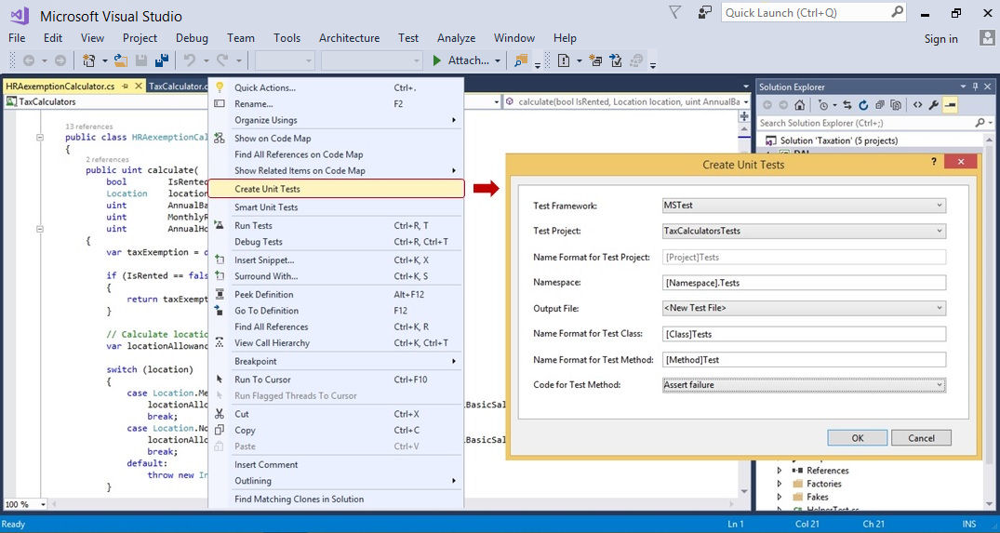
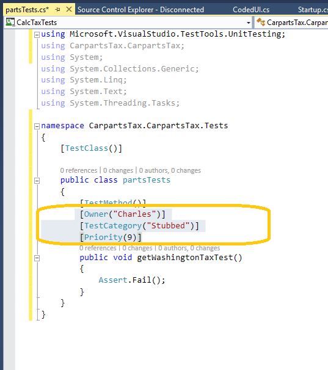

# Create unit test method stubs from code

The **Create Unit Tests** command creates unit test method stubs. This feature allows easy configuration of a test project, the test class, and the test method stub within it.

::: moniker range="vs-2017"
> [!NOTE]
> The **Create Unit Tests** menu command is only available for C# code that targets .NET Framework (but not .NET Core or .NET Standard).
::: moniker-end
::: moniker range=">=vs-2019"
> [!NOTE]
> The **Create Unit Tests** menu command is only available for C# code. To use this method with .NET Core or .NET Standard, Visual Studio 2019 or later is required.
::: moniker-end

The **Create Unit Tests** menu command is extensible and can be used to generate tests for MSTest, MSTest V2, NUnit, and xUnit.

## Get started

To get started, select a method, a type, or a namespace in the code editor in the project you want to test, right-click, and then choose **Create Unit Tests**. The **Create Unit Tests** dialog opens where you can configure how you want the tests to be created.

::: moniker range="<=vs-2019"

::: moniker-end
::: moniker range=">=vs-2022"

::: moniker-end

If you don't see test framework options for NUnit or xUnit, see [Use third-party unit test frameworks](#use-third-party-unit-test-frameworks).

## Set unit test traits

If you plan to run these tests as part of the test automation process, you might consider having the test created in another test project (the second option in the dialog above) and setting unit test traits for the unit test. This enables you to more easily include or exclude these specific tests as part of a continuous integration or continuous deployment pipeline. The traits are set by adding metadata to the unit test directly, as shown below.

::: moniker range="<=vs-2019"

::: moniker-end
::: moniker range=">=vs-2022"

::: moniker-end

## Use third-party unit test frameworks

To automatically generate unit tests for NUnit or xUnit, install one of these test framework extensions from Visual Studio Marketplace:

* [NUnit extension for test generators](https://marketplace.visualstudio.com/items?itemName=NUnitDevelopers.TestGeneratorNUnitextension-18371)
* [xUnit.net extension for test generators](https://marketplace.visualstudio.com/items?itemName=YowkoTsai.xUnitnetTestGenerator)

## When should I use this feature?

Use this feature whenever you need to create unit tests, but specifically when you are testing existing code that has little or no test coverage and no documentation. In other words, where there is limited or non-existent code specification. It effectively implements an approach similar to [Smart unit tests](https://devblogs.microsoft.com/devops/introducing-smart-unit-tests/) that characterizes the observed behavior of the code.

However, this feature is equally applicable when a developer starts by writing some code and then uses that to bootstrap unit tests. Within the flow of coding, the developer might want to quickly create a unit test method stub (with a suitable test class and a suitable test project) for a particular piece of code.

## See also

- [Creating unit test method stubs with "Create Unit Tests"](https://devblogs.microsoft.com/devops/creating-unit-test-method-stubs-with-create-unit-tests/)
- [Unit testing blog posts](https://devblogs.microsoft.com/devops/?s=unit+testing)
