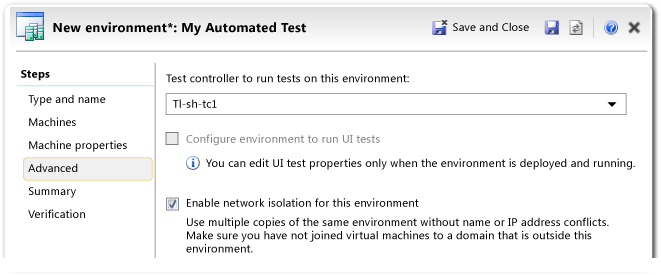

# Creating an SCVMM Environment Using Stored Virtual Machines and Templates
You can create an SCVMM environment using stored virtual machines and templates. When you create an SCVMM environment this way, Microsoft Test Manager creates copies the virtual machines and templates and adds them to your environment.  
  
 **Requirements**  
  
-   Visual Studio Enterprise, [!INCLUDE[vstsTestEssLong](../test/includes/vststestesslong_md.md)]  
  
> [!NOTE]
>  When you create an SCVMM environment, you can host your virtual machines on multiple hosts and groups of clustered hosts, unless you enable network isolation. If you add virtual machines to your environment, and those virtual machines are hosted on a cluster, you should also add at least one virtual machine that is not hosted on a cluster to your environment. In addition, you cannot use clustered hosts with a network-isolated environment.  
  
 This topic is about how to create a new SCVMM environment using stored virtual machines and templates. For information about the other ways to create and manage SCVMM environments, see [Guidance for Creating and Managing SCVMM Environments](../test/guidance-for-creating-and-managing-scvmm-environments.md). For an overview of lab environments, see [Using a Lab Environment for Your Application Lifecycle](../test/using-a-lab-environment-for-your-application-lifecycle.md).  
  
 This topic contains the following sections:  
  
1.  [Prerequisites](#prereq)  
  
2.  [Selecting the Templates or Stored Virtual Machines](#select)  
  
3.  [Selecting the Templates or Stored Virtual Machines](#newenv)  
  
4.  [Selecting the Templates or Stored Virtual Machines](#newmachine)  
  
5.  [Selecting the Templates or Stored Virtual Machines](#properties)  
  
6.  [New Environment: Advanced](#advanced)  
  
7.  [New Environment: Verification](#verify)  
  
8.  [Completing the Configuration of the Machines](#complete)  
  
9. [What’s Next](#next)  
  
##   Prerequisites  
  
> [!WARNING]
>  To create a lab environment that contains virtual machines that are running Windows XP, perform the additional steps listed in [Configuring Lab Environments that Contain Windows XP or Windows Server 2003 Machines](../test/configuring-lab-environments-that-contain-windows-xp-or-windows-server-2003-machines.md).  
  
 The following prerequisites must be complete before you create an SCVMM environment using stored virtual machines and templates:  
  
1.  Each virtual machine that you add to the environment must be managed by System Center Virtual Machine Manager (SCVMM). Before you can create an SCVMM environment, you must complete the prerequisite tasks for SCVMM environments in [Test on a lab environment](../test/test-on-a-lab-environment.md).  
  
2.  One of the following operating systems must be installed on each stored virtual machine and template that you’re going add to the environment:  
  
    -   Windows Server 2008  
  
    -   Windows Server 2012  
  
    -   Windows XP SP3  
  
    -   Windows Vista SP2  
  
    -   Windows 7 SP1  
  
    -   Windows 8  
  
3.  File sharing must be enabled on each stored virtual machine and template that you’re going to add to the environment.  
  
##   Selecting the Templates or Stored Virtual Machines  
 To create an environment, you copy virtual machines from your team project library.  
  
#### To create a new SCVMM environment  
  
1.  Open Microsoft Test Manager and choose **Lab Center** and **Lab**.  
  
     You can now see a list of the lab environments in your team project.  
  
       
  
2.  Choose the **New** button.  
  
3.  In the **New Environment** wizard, choose **SCVMM environment**.  
  
     Fill the other fields in the wizard according to the following sections.  
  
###   New Environment: Type and Name  
   
  
|Field|What to enter|  
|-----------|-------------------|  
|**Name**|The name of the environment, which must be unique within your team project.|  
|**Description**|Optional.|  
|**Tags**|Tags are optional name-value pairs that you can set according to your project’s conventions. For example, your environments could use tags that indicate the purpose of the environment and the date after which it can be deleted.|  
  
###   New Environment: Machines  
 In the **Machines** page, choose virtual machines or virtual machine templates to add to your environment.  
  
   
  
|||  
|-|-|  
|**Virtual machines available**:|This is the list of virtual machines and templates that are stored in your team project’s library. Typically, it includes machines in which different combinations of operating system, client applications, and server software have been installed.   For example, you could choose a web client and a web server.   If you cannot find an item with the features that you want, you can set up a new virtual machine and import it to the library. Choose **Import**. For more information, see [How to: Import a Virtual Machine or Template from SCVMM](../test/how-to--import-a-virtual-machine-or-template-from-scvmm.md).|  
|Template|A virtual machine template is a virtual machine that has had its identity information removed. When you add a virtual machine template in an environment, a new virtual machine is created. A new name and port ids are automatically generated.|  
|Virtual Machine|When you add a virtual machine, an exact copy of it is made in your lab environment. You must therefore be sure to change its name.   Typically a stored virtual machine is part of a workgroup.|  
|Running|Running virtual machines are created independently of any environment. They are set up by an SCVMM administrator, and form a resource pool. You can attach these machines to your environment. A running machine cannot be attached to more than one environment at a time.   When you have finished your tests, you should delete your environment so that the machine is returned to the pool.   For more information, see [SCVMM (virtual) environments](../test/scvmm--virtual--environments.md)|  
|**Selected machines**:|You can set the following properties for each machine that you add to your environment.   Notice that you can add the same virtual machine or virtual machine template more than once. You must give the machines different names.|  
|Name|This name identifies the virtual machine within this environment. It is not the same as the computer name.   Avoid using commas in the name.|  
|Role|A role identifies the function of the machine in the environment. It can be used by [!INCLUDE[TCMshort](../test/includes/tcmshort_md.md)] to determine what components to install for testing purposes, and what testing data to collect. You can either select a role from the menu, or type any role name that you choose.   **NOTE**: The role is just an indication of the intended use of the machine. Lab Management does not automatically verify that the virtual machines or the templates have the necessary software, nor install the software automatically to fulfill these roles.|  
  
###   New Environment: Machine Properties  
   
  
|Tab|Machine Properties|  
|---------|------------------------|  
|**Hardware profile**|The amount of memory to assign to the virtual machine.|  
|**OS profile (templates only)**|Operating system type, computer name, administrator password, product key, domain, and workgroup for virtual machines deployed from the template.   **NOTE**: When you import a template from SCVMM, the secured administrator password and product key in the template are removed. You must re-enter this information.   **Operating system**: Specifies the operating system installed on the template. The value must match the operating system that is installed on the template because the customization that occurs when the template is converted to a virtual machine depends on the type and version of the operating system.   **Identity information**: Specifies how the computer name is created when a virtual machine is created from the template :   To have [!INCLUDE[vstsLabShort](../test/includes/vstslabshort_md.md)] generate a unique name, set **Computer name** to **\***.   To be prompted for a computer name when the template is deployed, clear the **Computer name** text box.   **Admin password**: The password to be used for the Administrator account. You can use this to log on to the machine when it is running.   **Product key**: Specifies the Window product key that is used to authenticate the operating system of the template. Make sure that the product key that you enter is valid for the version of the operating system in the virtual machine.   **Time zone**: Specifies the time zone used by virtual machines that are created from the template.   **Domain / Workgroup**: Specifies whether a virtual machine created from the template is joined to a Workgroup or to an Active Directory domain.   To specify a workgroup machine, choose Workgroup and enter a name for the workgroup.   To specify a domain, choose **Domain (FQDN)** and then enter the fully qualified name of the domain. Then enter the account name and password of a user who has the permissions to join to the domain.   **[GUIRunOnce] Commands**: Specifies the scripts that are executed on a virtual machine that are created from the template when a user logs on to that virtual machine for the first time.|  
|**Machine tags**|User-defined custom properties. You can use them to indicate information such as:   Updates and applications installed in the virtual machine.   Language or locale of the operating system.   Features of the virtual machine such as network adapters and disks.|  
  
###   New Environment: Advanced  
   
  
|||  
|-|-|  
|**Test controller**|The name of the test controller machine for this environment.|  
|**Configure environment to run UI tests**|Select this option if your tests include Coded UI Tests. For more information, see [Use UI Automation To Test Your Code](../codequality/use-ui-automation-to-test-your-code.md).   This option can be set only when the environment is running. To set it on a new environment: Finish the wizard. Wait until the environment’s status is **Ready**. Select the environment and then choose **Open** to return to the wizard.|  
|**Enable network isolation**|Network isolation enables you to deploy the same stored environment more than once, without name or IP address conflicts. For more information about the network isolation capability, see [Creating and using a network isolated environment](../test/creating-and-using-a-network-isolated-environment.md).|  
  
###   New Environment: Verification  
 Choose **Verify** to make sure that the properties you have set are valid.  
  
 If verification fails, you must fix the problem before you can finish.  
  
 If verification succeeds, choose **Finish**.  
  
   
  
 If verification succeeds, choose **Finish**.  
  
 The new environment wizard closes, and your environment appears in the **Environments** list under **Type:SCVMM**.  
  
 Creating the environment can take some time. You can see the progress of the process in the **Environments** list. To see the progress of individual virtual machines, select the environment.  
  
 After a virtual machine has been created, you can log on to it if you want. Select the environment, and then choose **Connect** from the shortcut menu of the machine’s icon.  
  
##   Completing the Configuration of the Machines  
 **Install test agents if necessary**  
 If the status of the SCVMM environment changes to **Not Ready**, choose **Repair** on the shortcut menu.  
  
 [!INCLUDE[vstsLabShort](../test/includes/vstslabshort_md.md)] will install a test agent on each virtual machine and configure it to communicate with your test controller.  
  
> [!TIP]
>  This step is required only if the templates or virtual machines that you selected from the library do not already have test agents. To avoid having to do this, you should install a test agent when you are adding templates or virtual machines to the library.  
  
 **Join the computers to a domain if necessary**  
 If you want your machines to be members of a domain, you will usually have to join each one to the domain.  
  
 This step is necessary because virtual machines are usually joined to a workgroup before they are stored in the library. This good practice avoids domain name conflicts when more than one copy of the same virtual machine is in use at the same time.  
  
##   What’s next  
 Here are the tasks that you can perform after you create an SCVMM environment:  
  
-   Operate your environment, and manage the virtual machines in the environment. See [Managing Lab Environments and Virtual Machines](../test/managing-lab-environments-and-virtual-machines.md).  
  
-   Store a copy of your environment in your team project library. See How to: [How to: Store an SCVMM Environment](../test/how-to--store-an-scvmm-environment.md).  
  
-   Run manual and automated tests in your lab environment by using Microsoft Test Manager, the Tcm.exe command line utility, or a build-deploy-test workflow. See [Test on a lab environment](../test/test-on-a-lab-environment.md).  
  
-   Create build-deploy-test workflows to automate the process of creating a build of your application, deploying the build to your lab environment, and running tests on the deployed application. See [Automated build-deploy-test workflows](../test/automated-build-deploy-test-workflows.md).  
  
## See Also  
 [Creating Lab Environments](../test/creating-lab-environments.md)   
 [Using a Lab Environment for Your Application Lifecycle](../test/using-a-lab-environment-for-your-application-lifecycle.md)   
 [How to: Store a Virtual Machine or Template](../test/how-to--store-a-virtual-machine-or-template.md)