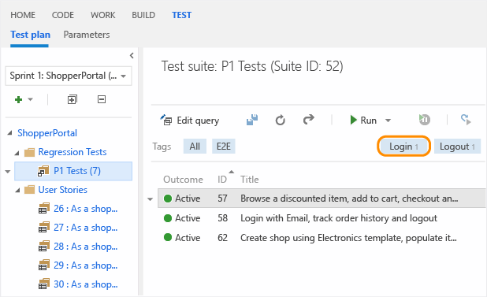
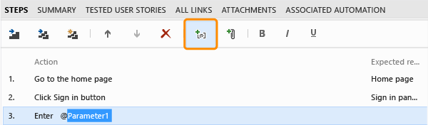

# Creating manual tests using the web portal
Create manual test cases to check that each of the deliverables meet your users' needs. You organize your test cases by adding test cases to test suites.  
  
## Create manual test cases  
  
1.  If you haven't already, [create a test plan and requirement-based test suites](../test/planning-manual-tests-using-the-web-portal.md).  
  
2.  From the Test hub in the web portal, choose a requirement-based test suite. Then create a test case for that suite.  
  
       
  
     A requirement-based test suite is created from a backlog item. If you add a test case to this type of suite, it is automatically linked to that backlog item.  
  
3.  Add test steps with actions and expected results so that any team member can run the test. You can add attachments to a step if you want.  
  
       
  
     Now you have created a test case that you can run.  
  
## Q&A  
 **Q: Can I add an extra line into a test step?**  
  
 **A:** Yes. Press Shift+Enter in the action or expected results field to add an extra line.  
  
 **Q: How do I insert a test step into a test case?**  
  
 **A:** Select a test step. Press Alt+P to insert a test step above the selected step.  
  
 **Q: Is there a way to quickly add multiple test cases at the same time?**  
  
 **A:** Yes. Use the grid view when you add test cases to the test suite.  
  
   
  
 In the grid view, use the context menu to insert, clear or delete a row.  
  
   
  
 **Q: Can I bulk edit multiple test cases?**  
  
 **A:** Yes. Switch the view from list to grid. All the test cases for the current test suite will be displayed in the grid with their test steps. This is a helpful view if you want to review your test cases with other team members jointly. When you review, you can update and add new test cases.  
  
   
  
 Or you can filter and sort the test cases. Then select only the ones that you want to bulk edit.  
  
   
  
 To return to the test suite view, switch the view from grid back to list.  
  
 **Q: Can I copy test cases and test steps from an existing Excel worksheet?**  
  
 **A:** Yes. Copy the columns from Excel that you want to use for the title, action and expected results fields. Any formatting in the columns, other than multiline, will not be copied into the worksheet. Paste these columns into the grid view, edit if necessary, and save them. (This is only supported for Internet Explorer and Chrome browsers.)  
  
   
  
 **Q: Can I copy test cases from the grid view to an Excel worksheet?**  
  
 **A:** Yes. Copy the data and paste it into your Excel worksheet. Any formatting in the test steps, other than multiline, will not be copied into the worksheet. (This is only supported for Internet Explorer and Chrome browsers.)  
  
 **Q: Can I tag test cases so that I can view only tests with specific tags?**  
  
 **A:** Yes. Tag test cases in a suite with any tag that is important to you. For example, tag all the tests related to login so that you can rerun these tests if a bug is fixed for the login page. Then you can filter on that tag from the test hub. You can add and edit tags when you edit a test case, or bulk edit tags in the grid view.  
  
   
  
 **Q: Can I share test steps between test cases?**  
  
 **A:** Yes. Choose the steps that you want to share. More details are [here](../test/share-steps-between-test-cases.md).  
  
   
  
 **Q: Can I add parameters to a test case to run multiple times with different data?**  
  
 **A:** Yes. Choose a test step and then add the parameter. Scroll down to add values for a parameter. More details are [here](../test/repeat-a-test-with-different-data.md).  
  
   
  
 **Q: Can I share the data for parameters between test cases?**  
  
 **A:** Yes. That way test cases that use the same parameters can be run with the same data for consistent results. Convert existing parameters to shared parameters.  
  
   
  
 After you have created a shared parameter set, open another test case and add the shared parameter set to that test case. More details are [here](http://msdn.microsoft.com/library/dd997832.aspx#SharedParameters).  
  
 Add, edit and rename your shared parameter sets from the parameters tab. View the test cases that reference them in the test cases pane.  
  
   
  
 Each shared parameter set is a work item. From the **Properties** tab, you can view or make changes to this work item. For example, you can assign owners and track changes.  
  
 From Microsoft Test Manager using Test Professional or Visual Studio Enterprise, you can view shared parameters for a test case but you cannot update them. To update shared parameters, you must use the web portal. There is a hyperlink in Microsoft Test Manager that takes you to the correct location to edit the shared parameters.  
  
 **Q: How do I reassign a test to another tester?**  
  
 **A:** Select the tests that you want to reassign. Then choose the tester who you want to run the tests.  
  
   
  
 **Q: How can I find out if a test case has been added to other test suites?**  
  
 **A:** Select a test case, then choose to view the test suites details. The associated test suites pane shows you any test suite for any test plan that contains this test case. This includes all team projects. Click the test suite to view it. Hover over the test suite in the pane to view the team project and the test plan for that test suite.  
  
   
  
 **Q: What happens when I delete a test case from a requirement-based test suite?**  
  
 **A:** The test case still exists in your team project, but the test case is removed from the test suite. In addition, it is no longer linked to the backlog item for that test suite.  
  
## Try this next  
 [Run your tests](../test/running-manual-tests-using-the-web-portal.md)  
  
## Or, dig deeper:  
 [Share steps between test cases](../test/share-steps-between-test-cases.md)  
  
 [Test configurations: specifying test platforms](../test/test-configurations--specifying-test-platforms.md)  
  
 [Repeat a test with different data](../test/repeat-a-test-with-different-data.md)  
  
 [Explore your app](../test/exploratory-testing-using-microsoft-test-manager.md) without planning in advance.