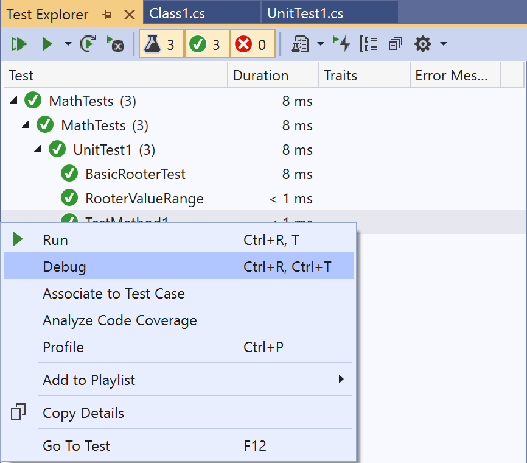

# Debug and analyze unit tests by using Test Explorer

You can use Test Explorer to start a debugging session for your tests. Stepping through your code with the Visual Studio debugger seamlessly takes you back and forth between the unit tests and the project under test.

To start debugging:

1. In the Visual Studio editor, set a breakpoint in one or more test methods that you want to debug.

    > [!NOTE]
    > Because test methods can run in any order, set breakpoints in all the test methods that you want to debug.

2. In Test Explorer, select the test methods, right-click somewhere on the pane, and then select **Debug**.

   ::: moniker range=">=vs-2022"
   
   ::: moniker-end

   ::: moniker range="vs-2019"
   
   ::: moniker-end

For more information about the debugger, see [Debug in Visual Studio](../debugger/debugger-feature-tour.md).

## Diagnose performance problems with a test method

::: moniker range=">=vs-2022"
Starting in Visual Studio 2022 version 17.8, you can use any applicable tool in the Performance Profiler to help improve your code, and not just the Instrumentation tool. You can profile small units of work in isolation, make changes, and then remeasure and validate the impact of the changes.

To diagnose why a test method is taking more time than you'd like, or using more memory than you'd like:

1. Right-click the method in Test Explorer, and then select **Profile**.
1. In the Performance Profiler, select a profiling tool to test your code.

For more information, see [this blog post](https://devblogs.microsoft.com/visualstudio/a-unit-of-profiling-makes-the-allocations-go-away/) or see [Collect profiling data on release builds](../profiling/running-profiling-tools-with-or-without-the-debugger.md#collect-profiling-data-on-release-builds).
::: moniker-end

::: moniker range="vs-2019"
To diagnose why a test method is taking too much time:

- Right-click the method in Test Explorer, and then select **Profile**.

For more information, see [Instrumentation profiling report](../profiling/understanding-instrumentation-data-values.md?view=vs-2017&preserve-view=true).

> [!NOTE]
> This feature is not currently supported for .NET Core.
::: moniker-end

::: moniker range=">=vs-2022"

## Get AI assistance to debug tests

Starting in Visual Studio 2022 version 17.12 Preview 2, you can get quick assistance from GitHub Copilot to debug tests if you have an [active Copilot subscription](../ide/visual-studio-github-copilot-chat.md#prerequisites). To get help, right-click a failed test in Test Explorer, and then select of the following commands:

- **Explain failure with Copilot**
- **Debug with Copilot**

If you debug with GitHub Copilot:

1. It provides you with a debug plan.
1. It sets appropriate breakpoints and watch variables.
1. It starts the debug session.

When the debugger hits the breakpoint, it provides GitHub Copilot with values for the watched variables. Copilot then determines your next step: either continue debugging or fix the problem code. You can continue the Copilot Chat conversation until you have a passing test.

::: moniker-end

## Related content

- [Unit test your code](../test/unit-test-your-code.md)
- [Run unit tests with Test Explorer](../test/run-unit-tests-with-test-explorer.md)
- [Test Explorer FAQ](test-explorer-faq.md)
