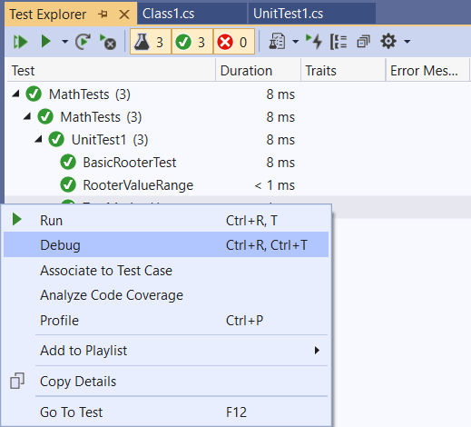

# Debug and analyze unit tests with Test Explorer

You can use Test Explorer to start a debugging session for your tests. Stepping through your code with the Visual Studio debugger seamlessly takes you back and forth between the unit tests and the project under test. To start debugging:

1. In the Visual Studio editor, set a breakpoint in one or more test methods that you want to debug.

    > [!NOTE]
    > Because test methods can run in any order, set breakpoints in all the test methods that you want to debug.

::: moniker range="vs-2017"
2. In Test Explorer, select the test method(s) and then choose **Debug Selected Tests** on the right-click menu.
::: moniker-end
::: moniker range=">=vs-2019"
2. In Test Explorer, select the test method(s) and then choose **Debug** on the right-click menu.

   
::: moniker-end

   For more information, about the debugger, see [Debug in Visual Studio](../debugger/debugger-feature-tour.md).

## Diagnose test method performance issues

::: moniker range="vs-2017"
To diagnose why a test method is taking too much time, select the method in Test Explorer and then choose **Profile Selected Test** on the right-click menu. See [Instrumentation profiling report](../profiling/understanding-instrumentation-data-values.md?view=vs-2017&preserve-view=true).
::: moniker-end

::: moniker range=">=vs-2019"
To diagnose why a test method is taking too much time, select the method in Test Explorer and then choose **Profile** on the right-click menu. See [Instrumentation profiling report](../profiling/understanding-instrumentation-data-values.md?view=vs-2017&preserve-view=true).
::: moniker-end

> [!NOTE]
> This feature is not currently supported for .NET Core.

## See also

- [Unit test your code](../test/unit-test-your-code.md)
- [Run unit tests with Test Explorer](../test/run-unit-tests-with-test-explorer.md)
- [Test Explorer FAQ](test-explorer-faq.md)
