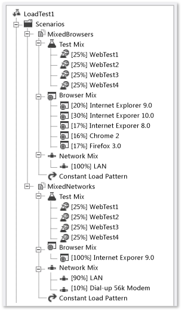

# Edit load test scenarios

A load test *scenario* specifies the load pattern, test mix, browser mix, and network mix. Scenarios are important because they enable you to configure tests to simulate complex, realistic workloads.

For example, you might be testing an e-commerce site that has an Internet front-end used by hundreds of concurrent customers coming in over many connection speeds and using different browsers. The same site might also have an administration function that is used by internal employees to update products and to view statistics. These internal users would typically access the site by using the same browser and a high-speed LAN connection. You would want to encapsulate the properties of these two different groups of users in different scenarios. Each scenario can contain a virtual user type. In this case, a load test scenario can be made to represent virtual customers and another scenario can be made to represent virtual internal users of a website.

[!INCLUDE [web-load-test-deprecated](includes/web-load-test-deprecated.md)]

## Scenario components

Any initial configuration options and settings that you specify when you create a load test, can be modified later in the **Load Test Editor**. You can also add new scenarios, run settings, and counter sets to a load test.

Scenarios contain the following components:

|Term|Definition|
|-|-|
|Browser Mix|Simulates that virtual users access a website through a variety of web browsers.|
|Load Pattern|Specifies the number of virtual users that are active during a load test, and the rate at which new users are started. For example: step, constant, and goal-based.|
|Test Mix Model|Specifies the probability of a virtual user running a given test in a load test scenario. For example: 20% chance to run TestA and 80% chance to run TestB. The test mix model should reflect the objectives of your test for a particular scenario.|
|Test Mix|The test mix is the selection of web performance and unit tests that constitute the scenario, and the distribution of those tests.|
|Network Mix|Simulates that virtual users access a website through a variety of network connections. The Network Mix offers options that include LAN, cable modem, and other options.|

A scenario has several other properties that you can edit by using the **Load Test Editor**. For more information, see [Load test scenario properties](../test/load-test-scenario-properties.md).

## Tasks

|Tasks|Associated Topics|
|-|-----------------------|
|**Add artificial human interaction pauses in your scenario:** Think times are used to simulate human behavior that causes people to wait between interactions with a website. Think times occur between requests in a web performance test and between test iterations in a load test scenario. Using think times in a load test can be useful in creating more accurate load simulations.|-   [Edit think times to simulate website human interaction delays](../test/edit-think-times-in-load-test-scenarios.md)|
|**Specify the number of virtual users for your scenario:** You can configure the load pattern properties to specify how the simulated user load is adjusted during a load test. You get three built-in load patterns: constant, step, and goal-based. You choose the load pattern and adjust the properties to appropriate levels for your load test goals.|-   [Edit load patterns to model virtual user activities](../test/edit-load-patterns-to-model-virtual-user-activities.md)|
|**Configure the probability of a virtual user running a test in the scenario:** You can use the test mix, which specifies the probability of a virtual user running a given test in a load test scenario. This lets you simulate load more realistically. Instead of having just one workflow through your applications, you can have several workflows, which is a closer approximation of how end-users interact with your applications.|-   [Edit text mix models](../test/edit-test-mix-models-to-specify-the-probability-of-a-virtual-user-running-a-test.md)|
|**Add or remove a Web performance or unit test from a load test scenario:** You can add or remove a web performance or unit test from a load test in a scenario. A load test contains one or more scenarios, each of which contains one or more web performance or unit tests.|-   [Edit the test mix](../test/edit-the-test-mix-to-specify-which-web-browsers-types-in-a-load-test-scenario.md)|
|**Configure the desired network mix for your scenario:** Using the network mix, you can simulate network load more realistically in a load test scenario. Load is generated by using a heterogeneous mix of network types instead of one single network type. You create a closer approximation of how end-users interact with your applications. The network mix model should reflect the objectives of that scenario.|-   [Specify virtual network types](../test/specify-virtual-network-types-in-a-load-test-scenario.md)|
|**Select the appropriate Web browser mix for your scenario:** Using the browser mix, you can simulate web load more realistically in a load test scenario. Load is generated by using a heterogeneous mix of browsers instead of one single browser. You create a closer approximation of the browsers that will be used with your applications.|-   [Specify web browsers types](../test/edit-the-test-mix-to-specify-which-web-browsers-types-in-a-load-test-scenario.md)|
|**Configure test iteration settings for your scenario:** You can edit a load test scenario to configure test iteration settings using the Load Test Editor and the Properties window. By default, a scenario is set up with no maximum test iterations. You can optionally configure the maximum number of iterations in the scenario and how long to pause between them.|-   [Configure test iterations for scenarios](../test/configure-test-iterations-in-a-load-test-scenario.md)|
|**Configure delay settings for your scenario:** Using the **Load Test Editor** and the **Properties** window, you can specify a delay before starting a scenario in a load test. An example of when you might want to use the **Delay Start Time** property is if you need one scenario to start producing items that another scenario consumes. You can delay the consuming scenario to enable the producing scenario to populate some data.|-   [Configureng scenario start delays](../test/configure-scenario-start-delays.md)|
|**Specify remote machines to use in a load test scenario:** After you create a load test, you can edit the properties of your load test scenario to indicate which test agents you want to include. For more information, see [Test controllers and test agents](configure-test-agents-and-controllers-for-load-tests.md).|-   [How to: Specify test agents to use](../test/how-to-specify-test-agents-to-use-in-load-test-scenarios.md)|

## See also

- [Edit load tests](../test/edit-load-tests.md)
- [Load test scenario properties](../test/load-test-scenario-properties.md)
