# Fix non-detectable dynamic parameters in a web performance test

Some websites use dynamic parameters to process some of their web requests. A dynamic parameter is a parameter whose value is regenerated every time that a user runs the application. An example of a dynamic parameter is a session ID. The session ID usually changes every 5 to 30 minutes. The web performance test recorder and playback engine automatically handles the most common types of dynamic parameters:

- Dynamic parameter values that are set in a cookie value. The web performance test engine automatically handles these during playback.

- Dynamic parameter values that are set in hidden fields on HTML pages, such as ASP.NET view state. These are automatically handled by the recorder, which adds hidden field extraction rules to the test.

- Dynamic parameter values that are set as query string or form post parameters. These are handled through dynamic parameter detection after you record a web performance test.

Some types of dynamic parameters are not detected. An undetected dynamic parameter will cause your web performance test to fail when you run it because the dynamic value will be different every time that the test is run. To handle these parameters correctly, you can add extraction rules to dynamic parameters in your web performance tests manually.

[!INCLUDE [web-load-test-deprecated](includes/web-load-test-deprecated.md)]

## Create and run a web app with dynamic parameters

To demonstrate both a detectable and a non-detectable dynamic parameter, we’ll create a simple ASP.NET web application that has three web forms with a few controls and some custom code. We’ll then learn how to isolate the dynamic parameters and how to handle them.

1. Create a new ASP.NET project named **DynamicParameterSample**.

     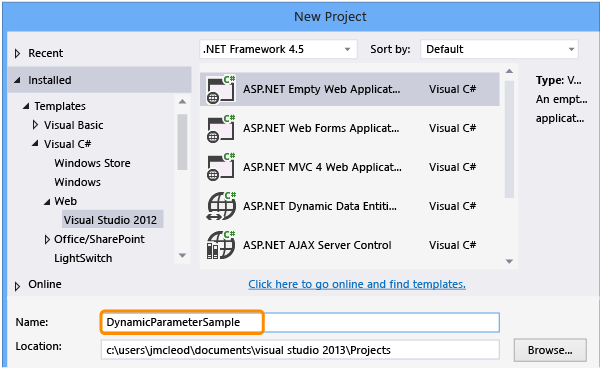

2. Add a web form named *Querystring.aspx*.

3. In design view, drag a HiddenField onto the page and in then in change the value for the (ID) property to HiddenFieldSessionID.

     

4. Change to the source view for the Querystring page, and add the following highlighted ASP.NET and JavaScript code used to generate the mock session ID dynamic parameters:

    ```html
    <head runat="server">
    <title>JavaScript dynamic property correlation sample</title><script type="text/javascript" language="javascript">    <!--        function jScriptQueryString()         {            var Hidden = document.getElementById("HiddenFieldSessionID");            var sessionId = Hidden.value;            window.location = 'JScriptQuery.aspx?CustomQueryString=jScriptQueryString___' + sessionId;         }    //--></script>
    </head>
    <body>
        <form id="form1" runat="server">
        <div>
             <a name="QuerystringHyperlink" href="ASPQuery.aspx?CustomQueryString=ASPQueryString___<%= Session.SessionID %>">Dynamic querystring generated by ASP.net</a>         <br/>         <br/>         <a href="javascript:jScriptQueryString()">Dynamic querystring generated by javascript </a>
        </div>
        <asp:HiddenField ID="HiddenFieldSessionID" runat="server" />
        </form>
    </body>
    </html>
    ```

5. Open the *Querystring.aspx.cs* file and add the following highlighted code to the Page_Load method:

    ```csharp
    public partial class Querystring : System.Web.UI.Page
    {
        protected void Page_Load(object sender, EventArgs e)
        {
            Session.Add("Key", "Value");HiddenFieldSessionID.Value = Session.SessionID;
        }
    }
    ```

6. Add a second web form named *ASPQuery.aspx*.

7. In design view, drag a **Label** onto the page and change the value for its **(ID)** property to **IndexLabel**.

     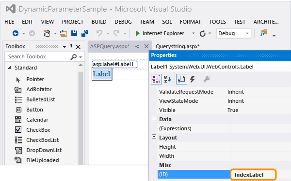

8. Drag a **HyperLink** onto the page and change the vale for its **Text** property to **Back**.

     

9. Choose **(…)** for the **NavigationURL** property.

     

     Select *Querystring.aspx*.

     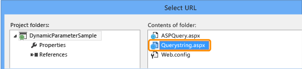

10. Open the *ASPQuery.aspx.cs* file, and add the following highlighted code to the Page_Load method:

    ```csharp
    protected void Page_Load(object sender, EventArgs e)
            {
                int index;            string qstring;            string dateportion;            string sessionidportion;            qstring = Request.QueryString["CustomQueryString"];            index = qstring.IndexOf("___");            dateportion = qstring.Substring(0, index);            index += 3;            sessionidportion = qstring.Substring(index, qstring.Length - index);            if (sessionidportion != Session.SessionID)            {                Response.StatusCode = 401;                IndexLabel.Text = "Failure!  Invalid querystring parameter found.";            }            else            {                IndexLabel.Text = "Success.  Dynamic querystring parameter was found.";            }            IndexLabel.Text += "<br>\r\n";
            }
    ```

11. Add a third web form named *JScriptQuery.aspx*.

     Just as we did for the second page, drag a **Label** onto the form, setting its **(ID)** property to **IndexLabel** and drag a **Hyperlink** onto the form, setting its **Text** property to **Back**, and its **NavigationURL** property to **Querystring.aspx**.

     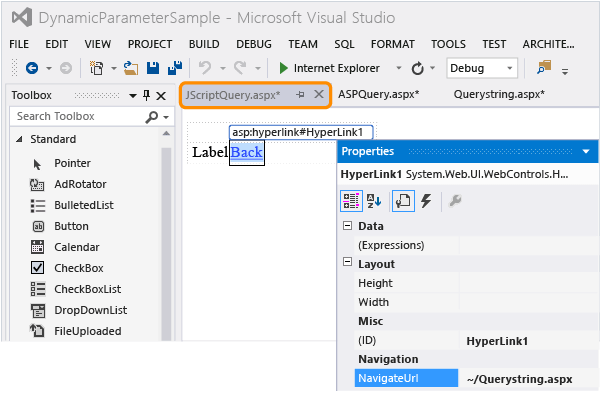

12. Open the *JScriptQuery.aspx.cs* file, and add the following highlighted code to the Page_Load method:

    ```csharp
    protected void Page_Load(object sender, EventArgs e)
            {
                int index;            string qstring;            string dateportion;            string sessionidportion;            qstring = Request.QueryString["CustomQueryString"];            index = qstring.IndexOf("___");            dateportion = qstring.Substring(0, index);            index += 3;            sessionidportion = qstring.Substring(index, qstring.Length - index);            if (sessionidportion != Session.SessionID)            {                Response.StatusCode = 401;                IndexLabel.Text = "Failure!  Invalid querystring parameter found.";            }            else            {                IndexLabel.Text = "Success.  Dynamic querystring parameter was found.";            }            IndexLabel.Text += "<br>\r\n";
            }
    ```

13. Save the project.

14. In **Solution Explorer**, set the *Querystring.aspx* as the start page.

     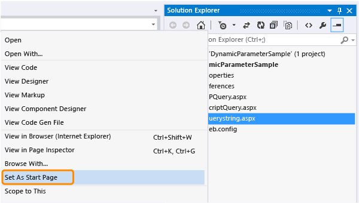

15. Press **Ctrl**+**F5** to run the web application in the browser. Copy the URL. You will need it when you record your test.

16. Try both links. They should each display the message "Success. Dynamic querystring parameter found."

     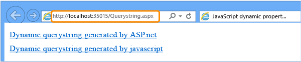

     

## Create a web performance test

1. Add a web performance and load test project to your solution.

     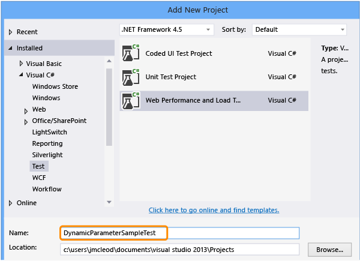

2. Rename WebTest1.webtest to DynamicParameterSampleApp.webtest.

     

3. Record the test.

     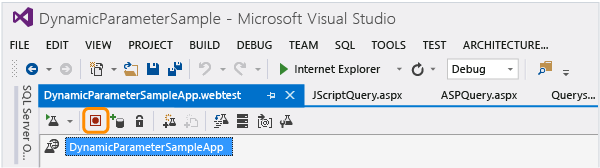

4. Copy and paste the URL from the website you're testing into the browser.

     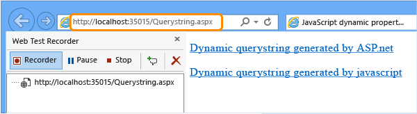

5. Browse through the web application. Choose the ASP.NET link, the Back link, and then the javascript link, followed by the back link.

     The web test recorder displays the HTTP request and response URLs as you navigate through the web app.

6. Choose the **Stop** button on the test recorder.

     The dialog box for detecting dynamic parameters displays a progress bar that shows the status of parameter detection in the HTTP responses that were received.

7. The dynamic parameter for CustomQueryString in the ASPQuery page is automatically detected. However, The dynamic parameter for CustomQueryString in the JScriptQuery page is not detected.

     Choose **OK** to add an extraction rule to *Querystring.aspx*, binding it to the ASPQuery page.

     

     The extraction rule is added to the first request for *Querystring.aspx*.

     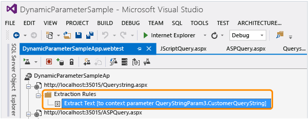

     Expand the second request in the request tree for *ASPQuery.aspx* and notice that the CustomQueryString's value has been bound to the extraction rule.

     

8. Save the test.

## Run the test to isolate the non-detected dynamic parameter

1. Run the test.

     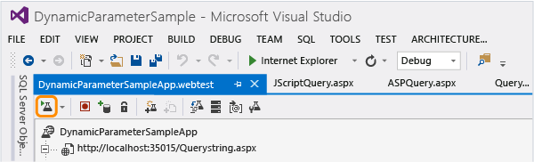

2. The fourth request for the *JScriptQuery.aspx* page fails. Go to the web test.

     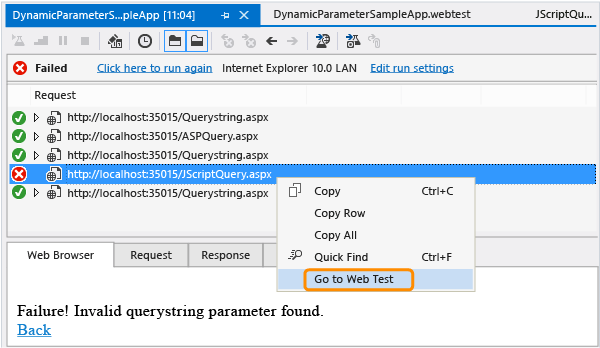

     The *JScriptQuery.aspx* request node is highlighted in the editor. Expand the node and notice that the "1v0yhyiyr0raa2w4j4pwf5zl" portion of the CustomQueryString appears to be dynamic.

     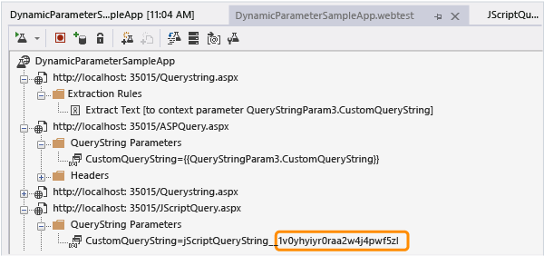

3. Return to the Web Performance Test Results Viewer and select the *JScriptQuery.aspx* page that failed. Then, choose the request tab, verify that the show raw data check box is cleared, scroll down and choose quick find on the CustomQueryString.

     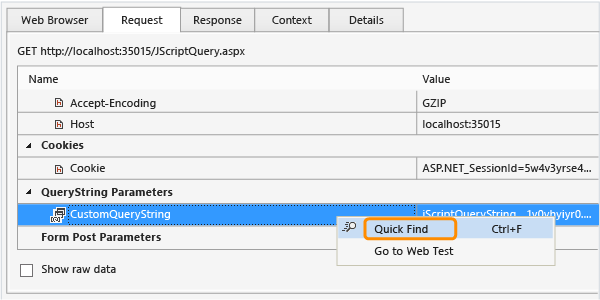

4. We know from looking at the test editor, that the *JScriptQuery.aspx* request's CustomQueryString was assigned a value of: `jScriptQueryString___1v0yhyiyr0raa2w4j4pwf5zl`, and that the suspected dynamic portion is "1v0yhyiyr0raa2w4j4pwf5zl". In the find what drop-down list, remove the suspect portion of the search string. The string should be "CustomQueryString=jScriptQueryString___".

     Dynamic parameters are assigned their values in one of the requests that precedes the request that has the error. Therefore, select the search up check box and choose find next until you see preceding request for *Querystring.aspx* highlighted in the request panel. This should occur after you choose find next three times.

     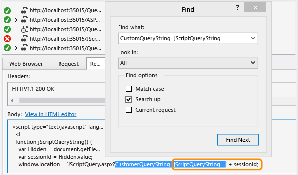

     As shown in the response tab, and in the JavaScript implemented earlier shown below, the query string parameter CustomQueryString is assigned a value of " jScriptQueryString___" and is also concatenated with the returned value from the var sessionId.

    ```javascript
    function jScriptQueryString()          {             var Hidden = document.getElementById("HiddenFieldSessionID");             var sessionId = Hidden.value;             window.location = 'JScriptQuery.aspx?CustomQueryString=jScriptQueryString___' + sessionId;          }

    ```

     Now that we know where the error is occurring, and that we need to extract the value for sessionId. However, the extraction value is only text, so we need to further isolate the error by trying to locate a string where the sessionId's actual value is displayed. By looking at the code, you can see that the var sessionId equals the value returned by HiddenFieldSessionID.

5. Use quick find on HiddenFieldSessionID, clearing the search up check box and selecting current request.

     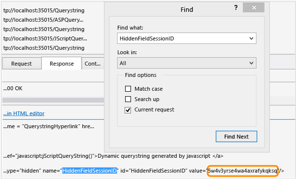

     Notice that the value returned is not the same string as in the original web performance test recording. For this test run, the value returned is "5w4v3yrse4wa4axrafykqksq" and in the original recording, the value is "1v0yhyiyr0raa2w4j4pwf5zl". Because the value does not match that of the original recording, the error is generated.

6. Because we have to fix the dynamic parameter in the original recording, choose recorded result in the toolbar.

     

7. In the recorded results, select the third request, which is the same *Querystringrequest.aspx* request that you isolated in the test run results.

     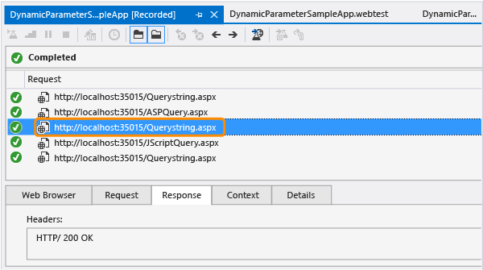

     Choose the response tab, scroll down and choose the original dynamic parameter value of "1v0yhyiyr0raa2w4j4pwf5zl" that you isolated previously and add an extraction rule.

     

     The new extraction rule is added to the *Querystring.aspx* request and is assigned a value of 'Param0'.

     If the dialog box informs us that matches were found for the extracted text to bind the parameter to, choose **Yes**.

     

8. Choose **Find Next**. The first match is the one that we need to change, which is the parameter for CustomQueryString in for the JScriptQuery page.

     

9. Choose **Replace**.

     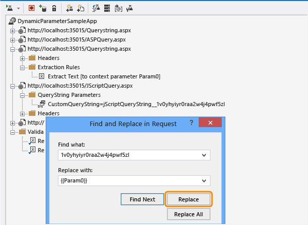

     The QueryString parameter under the *JScriptQuery.aspx* request is updated by using the new context parameter:  CustomQueryString=jScriptQueryString___{{Param0}}.

     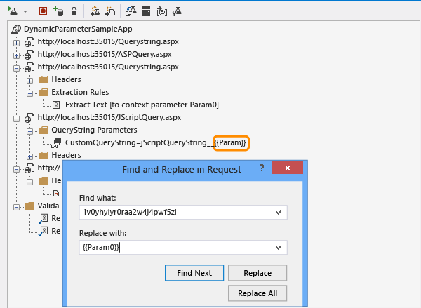

10. Close the **Find and Replace** dialog. Notice the similar structure of in the request tree between the detected dynamic parameter and the non-detected dynamic parameter that you correlated.

     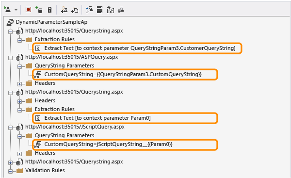

11. Run the test. It now runs without failure.

## Q&A

### Q: Can I re-run dynamic parameter detection if my web app gets modified?

**A:** Yes, use the following procedure:

1. In the toolbar, choose the **Promote Dynamic Parameters to Web Test Parameters** button.

     After the detection process completes, if any dynamic parameters are detected, the **Promote Dynamic Parameters to web test parameters** dialog box appears.

     The dynamic parameters are listed under the Dynamic Parameters column. The requests that the dynamic parameter will be extracted from and bound to are listed under the Extract Parameter from Response and Bind to Request columns.

     If you choose a dynamic parameter in the **Promote Dynamic Parameters to web test parameters** dialog box, two requests will be highlighted in the Web Performance Test Editor request tree. The first request will be the request that the extraction rule will be added to. The second request is where the extracted value will be bound.

2. Select or clear the check box next to the dynamic parameters you would like to automatically correlate. By default, all the dynamic parameters are checked.

### Q: Do I need to configure Visual Studio to detect dynamic parameters?

**A:** The default Visual Studio configuration is to detect dynamic parameters when you record a web performance test. However, if you have Visual Studio options configured not to detect dynamic parameters, or the web application being tested gets modified with additional dynamic parameters; you can still run dynamic parameter detection from the Web Performance Test Editor.