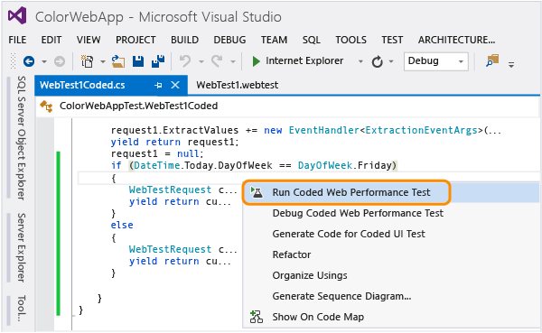
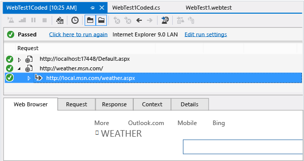

# Generate and run a coded web performance test

Web performance tests are recorded by browsing through your web app. The tests are included in load tests to measure the performance of your web application under the stress of multiple users. A web performance test can be converted to a code-based script that you can edit and customize like any other source code. For example, you can add looping and branching constructs.

[!INCLUDE [web-load-test-deprecated](includes/web-load-test-deprecated.md)]

## Generate a coded web performance test

1. If you have not created a web performance test, see [Record a web performance test](/azure/devops/test/load-test/run-performance-tests-app-before-release#create-a-web-performance-and-load-test-project).

2. Generate the coded test.

     

3. Name the test.

     

     The new coded test opens in the code editor.

     Depending on which web performance and load test project template you added to your solution, the code will be generated in either Visual Basic, or Visual C#.

     

     You can see in the code that the GetRequestEnumerator() method in C#, or the Run() method in Visual Basic, contains each validation rule and web request that was in the recoded test.

4. To demonstrate adding some simple code, scroll down to the end of the method and after the code for the last web request, and add the following code:

    ```c#
    if (DateTime.Today.DayOfWeek == DayOfWeek.Wednesday)
    {
        WebTestRequest customRequest = new WebTestRequest("http://weather.msn.com/");
        yield return customRequest;
    }
    else
    {
        WebTestRequest customRequest = new WebTestRequest("https://msdn.microsoft.com/");
        yield return customRequest;
    }
    ```

    ```vb
    If DateTime.Today.DayOfWeek = DayOfWeek.Wednesday Then
        Dim customRequest As WebTestRequest = New WebTestRequest("http://weather.msn.com/")
        MyBase.Send(customRequest)
    Else
        Dim customRequest As WebTestRequest = New WebTestRequest("https://msdn.microsoft.com/")
        MyBase.Send(customRequest)
    End If
    ```

5. Build the solution to verify that your custom code compiles.

6. Run the test.

     

     And because the day this was run happened to be a Wednesday…

     

## Q&A

### Q: Can I run more than one test at a time?
**A:** Yes, use the right-click (context) menu in **Solution Explorer**.

### Q: Should I add a data source before or after I generate a coded test?
**A:** It is easier to add a [data source](../test/add-a-data-source-to-a-web-performance-test.md) before you generate the coded test because the code will be automatically generated for you.

When you run a coded test with a data source, you might see the following error message:

**Could not run test \<Test Name> on agent \<Computer Name>: Object reference not set to an instance of an object.**

This can occur because you have a DataSourceAttribute defined for the test class, without a corresponding DataBindingAttribute. To resolve this error, add an appropriate DataBindingAttribute, delete it, or comment it out of the code.

### Q: Should I add validation and extraction rules before or after I generate a coded test?
**A:** It is easier to add validation rules and extraction rules before you generate the coded test; however, we recommend that you use [coded UI tests](../test/use-ui-automation-to-test-your-code.md) for validation purposes.
