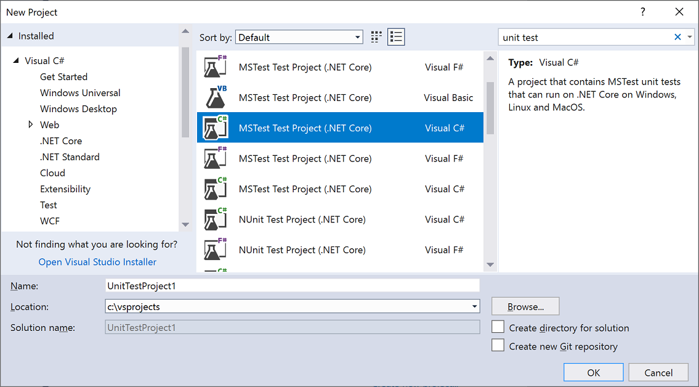
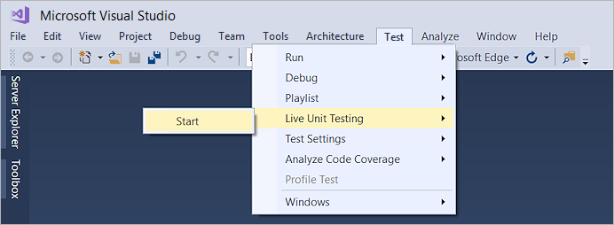
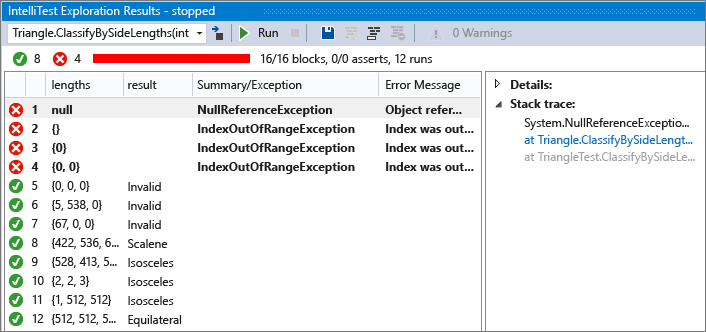

# Get started with unit testing

Use Visual Studio to define and run unit tests to maintain code health, ensure code coverage, and find errors and faults before your customers do. Run your unit tests frequently to make sure your code is working properly.

## Create unit tests

This section describes at a high level how to create a unit test project.

1. Open the project that you want to test in Visual Studio.

   For the purposes of demonstrating an example unit test, this article tests a simple "Hello World" project. The sample code for such a project is as follows:

   ```csharp
   public class Program
   {
       public static void Main()
       {
           Console.WriteLine("Hello World!");
       }
   }
   ```

1. In **Solution Explorer**, select the solution node. Then, from the top menu bar, select **File** > **Add** > **New Project**.

1. In the new project dialog box, find a unit test project template for the test framework you want to use and select it.

   ::: moniker range=">=vs-2019"

   

   Click **Next**, choose a name for the test project, and then click **Create**.

   ::: moniker-end

   ::: moniker range="vs-2017"

   

   Choose a name for the test project, and then click **OK**.

   ::: moniker-end

   The project is added to your solution.

   

1. In the unit test project, add a reference to the project you want to test by right-clicking on **References** or **Dependencies** and then choosing **Add Reference**.

1. Select the project that contains the code you'll test and click **OK**.

   

1. Add code to the unit test method.

   

> [!TIP]
> For a more detailed walkthrough of creating unit tests, see [Create and run unit tests for managed code](walkthrough-creating-and-running-unit-tests-for-managed-code.md).

## Run unit tests

1. Open [Test Explorer](../test/run-unit-tests-with-test-explorer.md) by choosing **Test** > **Windows** > **Test Explorer** from the top menu bar.

1. Run your unit tests by clicking **Run All**.

   

   After the tests have completed, a green check mark indicates that a test passed. A red "x" icon indicates that a test failed.

   

> [!TIP]
> You can use [Test Explorer](../test/run-unit-tests-with-test-explorer.md) to run unit tests from the built-in test framework (MSTest) or from third-party test frameworks. You can group tests into categories, filter the test list, and create, save, and run playlists of tests. You can also debug tests and analyze test performance and code coverage.

## View live unit test results

If you are using the MSTest, xUnit, or NUnit testing framework in Visual Studio 2017 or later, you can see live results of your unit tests.

> [!NOTE]
> Live unit testing is available in Enterprise edition only.

1. Turn live unit testing from the **Test** menu by choosing **Test** > **Live Unit Testing** > **Start**.

   ::: moniker range="vs-2017"

   

   ::: moniker-end

   ::: moniker range=">=vs-2019"

   

   ::: moniker-end

1. View the results of the tests within the code editor window as you write and edit code.

   

1. Click a test result indicator to see more information, such as the names of the tests that cover that method.

   

For more information about live unit testing, see [Live unit testing](../test/live-unit-testing-intro.md).

## Generate unit tests with IntelliTest

When you run IntelliTest, you can see which tests are failing and add any necessary code to fix them. You can select which of the generated tests to save into a test project to provide a regression suite. As you change your code, rerun IntelliTest to keep the generated tests in sync with your code changes. To learn how, see [Generate unit tests for your code with IntelliTest](../test/generate-unit-tests-for-your-code-with-intellitest.md).

> [!TIP]
> IntelliTest is only available for managed code that targets the .NET Framework.



## Analyze code coverage

To determine what proportion of your project's code is actually being tested by coded tests such as unit tests, you can use the code coverage feature of Visual Studio. To guard effectively against bugs, your tests should exercise a large proportion of your code. To learn how, see [Use code coverage to determine how much code is being tested](../test/using-code-coverage-to-determine-how-much-code-is-being-tested.md).

## Use a third-party test framework

You can run unit tests in Visual Studio by using third-party test frameworks such as Boost, Google, and NUnit. Use the **NuGet Package Manager** to install the NuGet package for the framework of your choice. Or, for the NUnit and xUnit test frameworks, Visual Studio includes preconfigured test project templates that include the necessary NuGet packages.

To create unit tests that use [NUnit](https://nunit.org/):

1. Open the solution that contains the code you want to test.

2. Right-click on the solution in **Solution Explorer** and choose **Add** > **New Project**.

3. Select the **NUnit Test Project** project template.

   ::: moniker range=">=vs-2019"

   

   Click **Next**, name the project, and then click **Create**.

   ::: moniker-end

   ::: moniker range="vs-2017"

   Name the project, and then click **OK** to create it.

   ::: moniker-end

   The project template includes NuGet references to NUnit and NUnit3TestAdapter.

   

4. Add a reference from the test project to the project that contains the code you want to test.

   Right-click on the project in **Solution Explorer**, and then select **Add** > **Reference**. (You can also add a reference from the right-click menu of the **References** or **Dependencies** node.)

5. Add code to your test method.

   

6. Run the test from **Test Explorer** or by right-clicking on the test code and choosing **Run Test(s)**.

## See also

* [Walkthrough: Create and run unit tests for managed code](walkthrough-creating-and-running-unit-tests-for-managed-code.md)
* [Create Unit Tests command](create-unit-tests-menu.md)
* [Generate tests with IntelliTest](generate-unit-tests-for-your-code-with-intellitest.md)
* [Run tests with Test Explorer](run-unit-tests-with-test-explorer.md)
* [Analyze code coverage](using-code-coverage-to-determine-how-much-code-is-being-tested.md)
