# Get started with unit testing

Use Visual Studio to define and run unit tests to maintain code health, ensure code coverage, and find errors and faults before your customers do. Run your unit tests frequently to make sure your code is working properly.

## Create unit tests

This section describes at a high level how to create a unit test project.

> [!TIP]
> The project under test, "HelloWorld", is an example project and no code for it is intended to be shown. If you want to create a "HelloWorld" project to test, see [Create your first C# console app](../ide/quickstart-csharp-console.md). For a complete walkthrough article, see [Create and run unit tests for managed code](walkthrough-creating-and-running-unit-tests-for-managed-code.md).

1. Create a unit test project.

   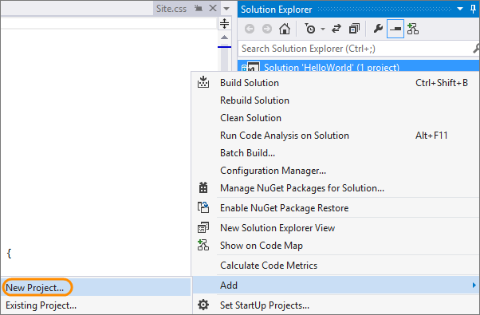

1. Name your project.

   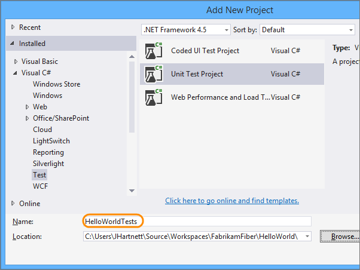

   The project is added to your solution.

   

1. In the unit test project, add a reference to the project you want to test.

   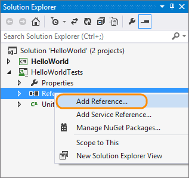

1. Select the project that contains the code you'll test.

   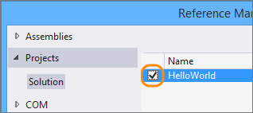

1. Code your unit test.

   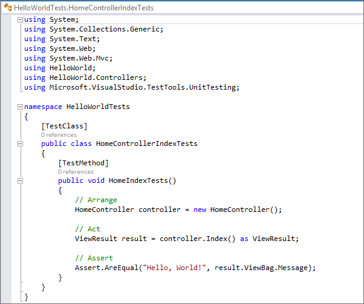

You can also create unit test method stubs with the **Create Unit Tests** [command](create-unit-tests-menu.md).

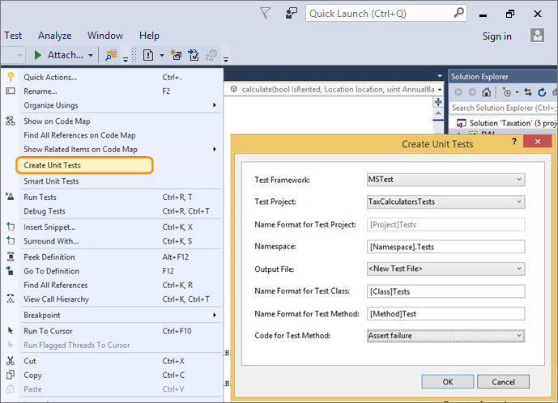

## Run unit tests

1. Open **Test Explorer**.

   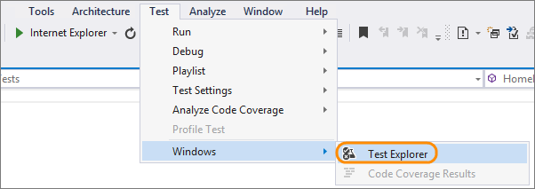

1. Run unit tests.

   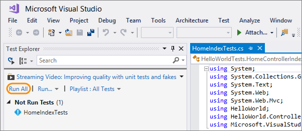

   You can see the unit tests that passed or failed in **Test Explorer**.

   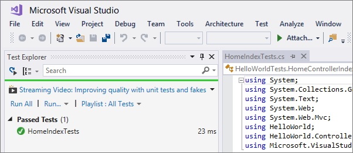

## View live unit test results

If you are using the MSTest, xUnit, or NUnit testing framework in Visual Studio 2017 or later, you can see live results of your unit tests.

> [!NOTE]
> Live unit testing is available in Visual Studio Enterprise edition only.

1. Turn on live unit testing from the **Test** menu.

   

1. View the results of the tests within the code editor window as you write and edit code.

   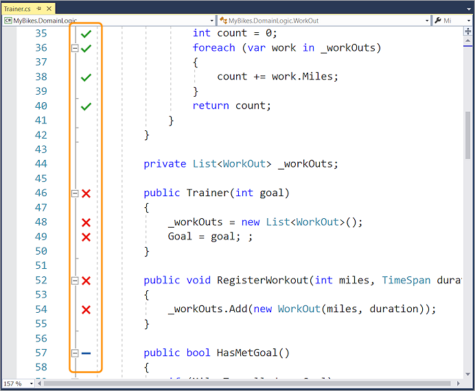

1. Choose the test result indicators to see more information.

   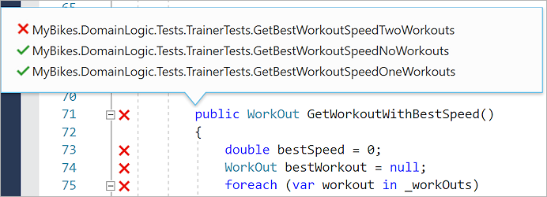

For more details, see [Live unit testing](../test/live-unit-testing-intro.md).

## Generate unit tests with IntelliTest

When you run IntelliTest, you can easily see which tests are failing and add any necessary code to fix them. You can select which of the generated tests to save into a test project to provide a regression suite. As you change your code, rerun IntelliTest to keep the generated tests in sync with your code changes. To learn how, see [Generate unit tests for your code with IntelliTest](../test/generate-unit-tests-for-your-code-with-intellitest.md).

## Run unit tests with Test Explorer

Use **Test Explorer** to run unit tests from Visual Studio or third-party unit test projects, group tests into categories, filter the test list, and create, save, and run playlists of tests. You can also debug tests and analyze test performance and code coverage. To learn how, see [Run unit tests with Test Explorer](../test/run-unit-tests-with-test-explorer.md).

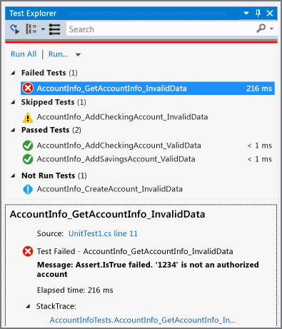

## Use code coverage to determine how much code is being tested

To determine what proportion of your project's code is actually being tested by coded tests such as unit tests, you can use the code coverage feature of Visual Studio. To guard effectively against bugs, your tests should exercise a large proportion of your code. To learn how, see [Use code coverage to determine how much code is being tested](../test/using-code-coverage-to-determine-how-much-code-is-being-tested.md).

## Use a different unit test framework

You can run unit tests in Visual Studio by using third-party test frameworks such as Boost, Google, and NUnit. Use the plug-in for the framework so that Visual Studio's test runner can work with that framework.

Following are the steps to enable third-party test frameworks:

::: moniker range="vs-2017"

1. Choose **Tools** > **Extensions and Updates** from the menu bar.

2. In the **Extensions and Updates** dialog box, expand the **Online** category and then **Visual Studio Marketplace**. Then, choose **Tools** > **Testing**.

   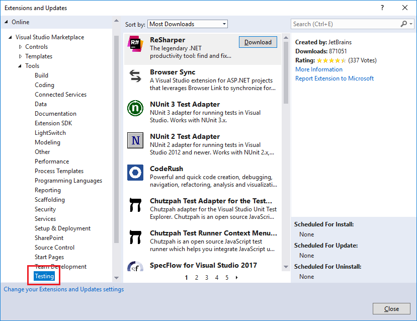

::: moniker-end

::: moniker range=">=vs-2019"

1. Choose **Extensions** > **Manage Extensions** from the menu bar.

2. In the **Manage Extensions** dialog box, expand the **Online** category and then **Visual Studio Marketplace**. Then, choose **Tools** > **Testing**.

   

::: moniker-end

3. Select the framework or adapter you want to install, and then choose **Download**.

4. Create a class library project and add it to your solution.

   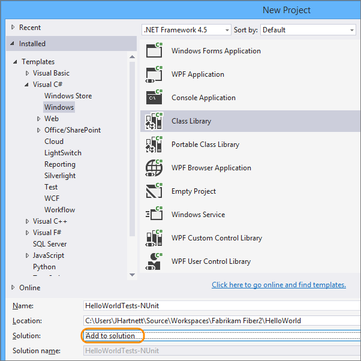

5. Install the plug-in. In **Solution Explorer**, select the class library project, and then choose **Manage NuGet Packages** from its right-click or context menu.

   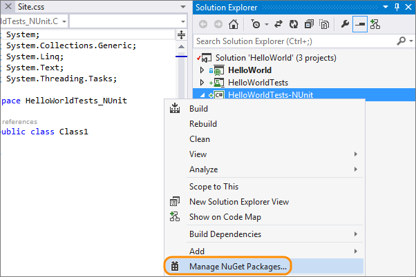

   [NuGet](https://www.nuget.org/) is an extension of Visual Studio
   that you can use to add and update libraries and tools for your projects.

6. In the **NuGet Package Manager** window, search for and select the plug-in, and then choose **Install**.

   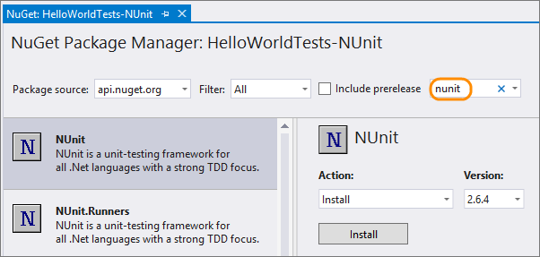

   The framework is referenced in your project.

   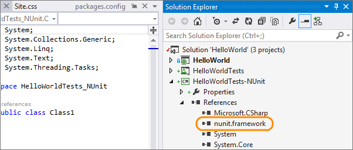

7. From the class library project's **References** node, select **Add Reference**.

   

8. In the **Reference Manager** dialog box, select the project that contains the code you'll test.

   

9. Code your unit test.

   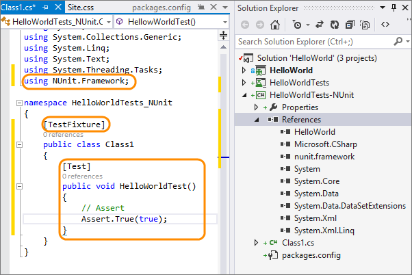

## See also

* [Walkthrough: Create and run unit tests for managed code](walkthrough-creating-and-running-unit-tests-for-managed-code.md)
* [Create Unit Tests command](create-unit-tests-menu.md)
* [Generate tests with IntelliTest](generate-unit-tests-for-your-code-with-intellitest.md)
* [Run tests with Test Explorer](run-unit-tests-with-test-explorer.md)
* [Determine code coverage](using-code-coverage-to-determine-how-much-code-is-being-tested.md)
* [Improve code quality](improve-code-quality.md)