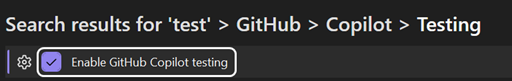

# Overview of GitHub Copilot testing for .NET

GitHub Copilot testing for .NET is a new capability in GitHub Copilot Chat that is integrated into Visual Studio. This feature automates the creation, running, and testing of C# code for entire projects, solutions, files, classes, or members. It is designed for C# developers who want to quickly bootstrap comprehensive test coverage without manually writing every test case. GitHub Copilot testing can generate tests for xUnit, NUnit, and MSTest test frameworks.

Unlike short-lived Copilot suggestions, GitHub Copilot testing for .NET provides a guided, long-running experience for generating and managing tests across your codebase.

## Prerequisites

+ Visual Studio 2026 Insiders build
+ C# project
+ [Sign in to Visual Studio using a GitHub account](../ide/work-with-github-accounts.md) with [Copilot access](https://docs.github.com/en/copilot/about-github-copilot/what-is-github-copilot#getting-access-to-copilot)

  GitHub Copilot testing works with any active GitHub Copilot subscription, including individual and enterprise plans. While some features may be available with a free Copilot license, usage limits and token throttling may apply, especially for larger solutions or extended sessions. These limits are enforced by GitHub and may impact performance or availability.

>[!TIP]
> For the best experience, we suggest using a paid Copilot subscription to avoid potential throttling and ensure consistent access.

## What GitHub Copilot testing can do

When you enable this capability, GitHub Copilot testing interacts with your solution in several ways to generate and validate tests:

- **Read:** Copilot analyzes your source code and project structure to understand context and dependencies.
- **Write:** It creates or updates test files within your solution based on its suggestions.
- **Build:** The tool triggers builds to compile your code and verify that generated tests integrate correctly.
- **Execute:** It runs tests to confirm they pass and to provide feedback on coverage and quality.

>[!IMPORTANT]
> Copilot testing does not modify production code outside of the test generation process. All changes occur within your local development environment, and you retain full control to review, accept, or discard suggestions.

## Why use GitHub Copilot testing for .NET?

GitHub Copilot testing for .NET offers a comprehensive experience compared to the more basic Copilot capabilities related to the generation of tests (such as the `/tests` command). The unit testing capability in GitHub Copilot for .NET provides the following:

- **Efficiency:** Automatically generate, build, and run C# unit tests for large or small projects or solutions.
- **Consistency:** Ensure tests follow best practices and project standards. Tests are created in a separate test project in the solution and are generated using the xUnit, NUnit, and MSTest frameworks.
- **Integration:** Works seamlessly within Visual Studio, leveraging Copilot’s AI capabilities.
- **Predictability:** Copilot is generating tests deterministically, grounded in the C# compiler and language semantics, so assertions and edge cases are predictable and type-safe.

## Key features

- **Automated test generation:** Create tests for single files, multiple files in a single project, or entire solutions.
- **Command-based interaction:** Use supported commands and parameters (listed in the `/help` message within GitHub Copilot testing).
- **Structured prompts:** Free-form prompts aren't supported at this time, ensuring predictable and reliable output.

## Security warning

When you first run GitHub Copilot testing for .NET, Copilot requests your consent to execute LLM-generated code on your machine. This may include actions such as installing or restoring NuGet packages and running tests. If you don't grant general consent, GitHub Copilot testing will prompt you for explicit approval before performing any such operation.

> [!CAUTION]
> Your consent grants Copilot the ability to silently invoke arbitrary commands within your Visual Studio session. Microsoft can't guarantee the safety of these commands. You should only enable this switch inside a sandboxed environment, and you should take steps to limit the privileges available to that environment. For example, the sandboxed environment shouldn't use a cloud-connected account to log into Windows, and the sandboxed environment shouldn't be logged into Visual Studio using a privileged GitHub account that has read access to non-public repositories or write access to production repositories.

## Troubleshooting

If you don’t see the @test command in Copilot Chat, try the following steps:

1. Verify your Visual Studio build. Make sure you are running the latest Visual Studio Insiders build, because this capability is currently available only in Insiders.
1. Toggle the setting in **Tools > Options > GitHub Copilot**. When you disable and then re-enable the GitHub Copilot testing setting, this refreshes the integration.

   

If the @test command does not appear in Chat, and the issue persists after toggling, please report the issue using **Help > Send Feedback** in Visual Studio.

## Next steps

See [Generate and run tests using GitHub Copilot testing for .NET in Visual Studio](../test/unit-testing-with-github-copilot-test-dotnet.md).