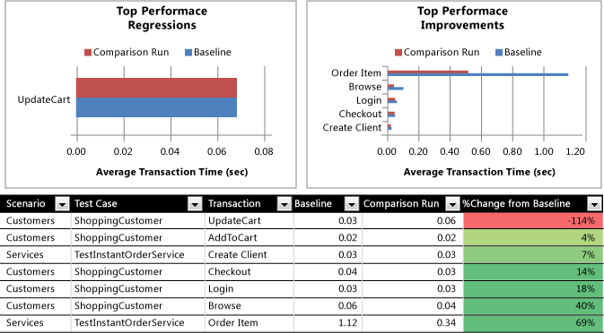

# How to: Create Load Test Performance Reports Using Microsoft Excel
You can generate Microsoft Excel load test reports that are based on two or more test results. Two types of load test reports are available:  
  
-   **Run comparison** This creates a set of reports that compares the data from two load test results using tables and bar charts.  
  
-   **Trend** You can generate trend analysis on two or more load test results. The results are displayed using line charts, but the data is available in pivot tables.  
  
 **Requirements**  
  
-   Visual Studio Enterprise  
  
-   Microsoft Excel 2010 or later  
  
> [!TIP]
>  You can also manually create Microsoft Word reports by copying and pasting data from the summary view, graphs view, and tables view. See [How to: Manually Create a Load Test Performance Report Using Microsoft Word](../test/how-to--manually-create-a-load-test-performance-report-using-microsoft-word.md).  
  
 Either report can be used to share performance data with stakeholders and convey whether the overall performance and health of the system is getting better or worse.  
  
 Report definitions are stored in the load test database. When a report is saved, the definition for the report is saved in the database and can be re-used later.  
  
 Also, the Excel workbook can be shared with stakeholders so that stakeholders do not have to connect to the database to see the report.  
  
> [!NOTE]
>  You can share the Excel workbook; however, only users who have Visual Studio Enterprise installed on their machine will be able to modify any of the spreadsheets. Other users will not see the **Load Test Report** option in the Office ribbon, but they will be able to view the workbook.  
  
> [!WARNING]
>  Visual Studio Enterprise is not compatible with Microsoft Office 2007. You must upgrade to Microsoft Office 2010 or later. After upgrading to Microsoft Office 2010 or later, the Load Test Excel plug-in might not load properly. To correct this, in Microsoft Excel 2010 or later, follow these steps:  
>   
>  1.  In the Office ribbon, choose **File**.  
> 2.  Choose **Options** and then choose **Add-Ins**.  
> 3.  In the drop-down list under **Manage**, choose **COM Add-Ins**, and then select **Go**.  
> 4.  Select the checkbox for **Load Test Report Addin**.  
  
 The following illustration is an example of a report that shows a correlation between a decline in transaction (Update Cart) speed and the degeneration of the (% Processor) counter. This points to a potential problem in the application code, instead of the database or network, and is a good candidate to diagnose by using the ASP.NET Profiler.  
  
   
  
 Excel reports can either be generated in the Load Test Analyzer, by using the **Create Excel Report** button in the toolbar, or from Excel by using the **Load Test Report** option in the **Load Test** tab of the Office ribbon.  
  
> [!NOTE]
>  If you add comments to a load test, they will appear in the Excel report. For more information, see [How to: Add Comments while Analyzing a Completed Load Test](../test/how-to--add-comments-while-analyzing-a-completed-load-test-using-the-load-test-analyzer.md) and [How to: Add a Comment to a Running Load Test Using the Load Test Analyzer](../test_notintoc/how-to--add-a-comment-to-a-running-load-test-using-the-load-test-analyzer.md).  
  
### To generate load test comparison reports using Excel  
  
1.  Before you generate a report, you must first run a load test. For more information, see [Running Load Tests](../test_notintoc/running-load-tests.md).  
  
2.  You can create Excel load test reports in two ways:  
  
    1.  After you complete a load test, in the **Load Test Results** page, choose the **Create Excel Report** button in the toolbar.  
  
        > [!NOTE]
        >  If the **Create Excel Report** button is disabled in the Web Performance Test Results Viewer toolbar, you may need to run Microsoft Excel one time before it is enabled. When Visual Studio Enterprise is installed, the Visual Studio Enterprise load test add-in is copied to your computer for Microsoft Excel; however, Microsoft Excel must be run to complete the installation process for the add-in.  
  
     Microsoft Excel opens with the **Generate a Load Test Report** wizard.  
  
     -or-  
  
    1.  Open Microsoft Excel, select the **Load Test** tab in the Office ribbon and then choose **Load Test Report**.  
  
         The **Generate a Load Test Report** wizard appears.  
  
    2.  In the **Select database which contains load tests** page, under **Server name**, type the name of the server containing the load test results.  
  
    3.  In the **Databasename** drop-down list, select the database containing the load test results.  
  
3.  In the **How do you want to generate your report** page, verify that **Create a report** is selected and choose **Next**.  
  
4.  In the **What type of report do you want to generate** page, verify that **Run comparison** is selected and choose **Next**.  
  
5.  In the **Enter load test report details** page, type a name for your report in **Report Name**.  
  
6.  Select the load test you want to generate the report for and choose **Next**.  
  
7.  In the **Select the runs for your report** page, under **Select one or more runs to add to the report**, select two load test results that you want to compare in the report and choose **Next**.  
  
    > [!NOTE]
    >  You can only generate a comparison report on two load test results. If you select either one load test result or more than two load test results, a warning message will appear.  
  
8.  In the **Select the counters for your report** page, under **Select on or more counters to add to the report** an expandable list of counters is available to customize your report. By default, the following counters are selected for the report:  
  
    -   LoadTest:Page - Avg. Page Time  
  
    -   LoadTest:Request - Requests/Sec  
  
    -   LoadTest:Scenario - User Load  
  
    -   LoadTest:Test - Avg. Test Time  
  
    -   LoadTest:Test - Total Tests  
  
    -   LoadTest:Transaction - Avg. Response Time  
  
    -   LoadTest:Transaction - Total Transactions  
  
    -   Memory - Available MBytes  
  
    -   Network Interface - Bytes Total/sec  
  
    -   PhysicalDisk - %Idle Time  
  
    -   Process - %Processor Time  
  
    -   Processor %Processor Time  
  
     Select the counters that you want to compare from the two selected test runs in the report and choose **Finish**.  
  
9. The Excel workbook report is generated with the following spreadsheet tabs:  
  
    -   **Table of Contents** - Displays the load test report name and provides a table of contents with links to the various tabs in the report.  
  
    -   **Runs -** Provides details on which two runs are being compared in the report.  
  
    -   **Test Comparison -** Provides bar graph details on performance regressions and improvements between the two runs being compared.  
  
    -   **Page Comparison -** Provides bar graph and percentage performance comparison data between the two runs on the various pages in the test runs.  
  
    -   **Machine Comparison -** Provides comparison data between the two runs based on the machines that were used.  
  
    -   **Error Comparison -** Compares the error types encountered between the two runs and the number of occurrences.  
  
    > [!TIP]
    >  For better reports several properties are available in load tests and Web performance tests that enable richer reports. The page request has two properties that are presented in the reports: Goal and Reporting Name. Page response times will be reported against goal, and the reporting name will be used instead of the URL in the reports. In a load test Run Settings, under Manage Counter Sets, the Computer Tags property is presented in the report machine names. This is very useful to describe the role of a particular machine in the report.  
  
### To generate load test trend reports using Excel  
  
1.  Before you generate a report, you must run a load test. For more information, see [Running Load Tests](../test_notintoc/running-load-tests.md).  
  
2.  You can create Excel load test reports in two ways:  
  
    1.  After you complete a load test, in the **Load Test Results** page, choose the **Create Excel Report** button in the toolbar.  
  
        > [!NOTE]
        >  If the **Create Excel Report** button is disabled in the Web Performance Test Results Viewer toolbar, you may need to run Microsoft Excel one time before it is enabled. When Visual Studio Enterprise is installed, the Visual Studio Enterprise load test add-in is copied to your computer for Microsoft Excel; however, Microsoft Excel must be run to complete the installation process for the add-in.  
  
     Microsoft Excel opens with the **Generate a Load Test Report** wizard.  
  
     -or-  
  
    1.  Open Microsoft Excel, select the **Load Test** tab in the Office ribbon and then choose **Load Test Report**.  
  
         The **Generate a Load Test Report** wizard appears.  
  
    2.  In the **Select database which contains load tests** page, under **Server name**, type the name of the server containing the load test results.  
  
    3.  In the **Databasename** drop-down list, select the database containing the load test results.  
  
3.  In the **How do you want to generate your report** page, verify that **Create a report** is selected and choose **Next**.  
  
4.  In the **What type of report do you want to generate** page, verify that **Trend** is selected and choose **Next**.  
  
5.  In the **Enter load test report details** page, type a name for your report in **Report Name**.  
  
6.  Select the load test you want to generate the report for and choose **Next**.  
  
7.  In the **Select the runs for your report** page, under **Select one or more runs to add to the report**, select the load test results that you want to compare in the report and choose **Next**.  
  
8.  In the **Select the counters for your report** page, under **Select on or more counters to add to the report**, an expandable list of counters is available to customize your report. By default, the following counters are selected for the report:  
  
    -   LoadTest:Page - Avg. Page Time  
  
    -   LoadTest:Request - Requests/Sec  
  
    -   LoadTest:Scenario - User Load  
  
    -   LoadTest:Test - Avg. Test Time  
  
    -   LoadTest:Test - Total Tests  
  
    -   LoadTest:Transaction - Avg. Response Time  
  
    -   LoadTest:Transaction - Total Transactions  
  
    -   LoadTest:Transaction - Transactions/Sec  
  
    -   Memory - Available MBytes  
  
    -   Network Interface - Bytes Total/sec  
  
    -   PhysicalDisk - %Idle Time  
  
    -   Process - %Processor Time  
  
    -   Processor %Processor Time  
  
9. From the selected test runs in the report, select the counters that you want to compare for trend analysis and choose **Finish**.  
  
10. The report is generated with a table of contents that has links to the various Excel workbook tabs generated in the report. The links are based on the counters selected for the trend report. For example, if you left the default counters selected in step 7, then the report will generate data which is presented in separate tabs in Excel for each counter listed in step 7. The data that is generated for each counter is presented in trend-style graphs.  
  
    > [!TIP]
    >  For better reports several properties are available in load tests and Web performance tests that enable richer reports. The page request has two properties that are presented in the reports: Goal and Reporting Name. Page response times will be reported against goal, and the reporting name will be used instead of the URL in the reports. In a load test Run Settings, under Manage Counter Sets, the Computer Tags property is presented in the report machine names. This is very useful to describe the role of a particular machine in the report.  
  
## .NET Framework Security  
 Load test results and reports contain potentially sensitive information that might be used to build an attack against your computer or your network. Load test results and reports contain computer names and connection strings. You should be aware of this when you share load test reports with other people.  
  
## See Also  
 [Reporting Load Tests Results for Test Comparisons or Trend Analysis](../test/reporting-load-tests-results-for-test-comparisons-or-trend-analysis.md)   
 [Load Test Analyzer Overview](../test/load-test-analyzer-overview.md)