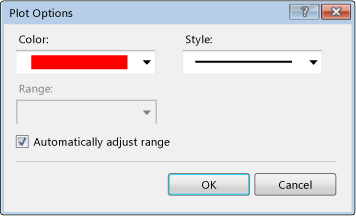

# How to: Specify Plot Options for Graphing Counters
The **Plot Options** dialog box enables you to change the color and line style of a plotted counter on a graph. You can also fix the range at a specific value or set the range to be automatically adjusted, based on the sampled data.  
  
   
Plot Options Dialog Box  
  
 For more information, see [Load Test Analyzer Overview](../test/load-test-analyzer-overview.md).  
  
 **Requirements**  
  
-   Visual Studio Enterprise  
  
### To specify plotting options for graphs  
  
1.  In the Load Test Analyzer, choose **Graphs** on the load test toolbar.  
  
     This displays load test results in graphs view.  
  
2.  In either the Legend or the graph, right-click the row or the current plotting line of the performance counter for which you want to change the plotting option and then select **Plot Options**.  
  
     The **Plot Options** dialog box displays.  
  
3.  Use the **Color** drop-down list and select the color you want to use for plotting the performance counter.  
  
4.  Use the **Style** drop-down list and select the style that you want to use for plotting the performance counter.  
  
5.  Do one of the following:  
  
     Select **Automatically adjust range** (default)  
  
     \- or -  
  
     Clear **Automatically adjust range** and use the **Range** drop-down list to specify the range that you want to use for plotting the performance counter.  
  
6.  Choose **OK**.  
  
     The performance counter that you changed the options for is displayed in the graph with the changes you specified.  
  
## See Also  
 [Analyzing Load Test Results in the Graphs View](../test/analyzing-load-test-results-in-the-graphs-view-of-the-load-test-analyzer.md)   
 [How to: Create Custom Graphs](../test/how-to--create-custom-graphs-in-load-test-results.md)   
 [Analyzing Load Test Results in the Graphs View](../test/analyzing-load-test-results-in-the-graphs-view-of-the-load-test-analyzer.md)