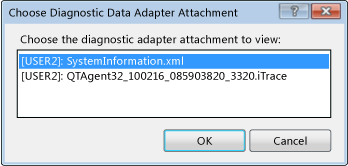
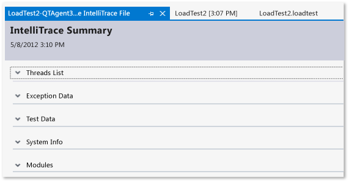

# How to: View Data and Diagnostic Attachments Using the Load Test Analyzer
Before you run a load test, you can select a test setting that specifies the diagnostic and data adapters that you want to use. After the load test is finished, you use the Load Test Analyzer to view the details for those diagnostic and data adapters while you analyze the results. See [Distributing Load Test Runs Across Multiple Test Machines Using Test Controllers and Test Agents](../test/distributing-load-test-runs-across-multiple-test-machines-using-test-controllers-and-test-agents.md).  
  
 **Requirements**  
  
-   Visual Studio Enterprise  
  
 To view the data and diagnostic adapter details, choose the **View Data and Diagnostic attachments** button on the Load Test Analyzer's toolbar. For example, if the load test had the system information adapter configured in the test setting, you can view the system information for the machine that was used when the load test was run.  
  
   
Choose Diagnostic Data Adapter dialog box  
  
 Another example is a load test that includes the IntelliTrace adapter in the test setting. The IntelliTrace adapter enables you to open the IntelliTrace Summary page.  
  
   
IntelliTrace Summary for a load test  
  
 For more information, see [Setting Up Machines and Collecting Diagnostic Information Using Test Settings](../test/setting-up-machines-and-collecting-diagnostic-information-using-test-settings.md) and [Using IntelliTrace](../debugger/intellitrace.md).  
  
### To view data and diagnostic attachments in a load test from the Load Test Analyzer  
  
1.  After a load test is completed, or after you open a load test result, in the Load Test Analyzer's toolbar, choose **View Data and Diagnostic attachments**.  
  
     The **Choose Diagnostic Data Adapter** dialog box is displayed.  
  
2.  Select the diagnostic data adapter attachment that you want to analyze and then choose **OK**.  
  
## See Also  
 [Analyzing Load Test Results](../test/analyzing-load-test-results-using-the-load-test-analyzer.md)   
 [Load Test Analyzer Overview](../test/load-test-analyzer-overview.md)