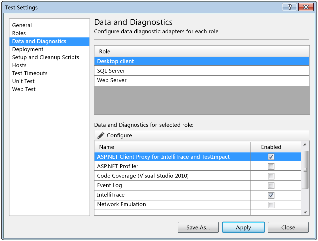

# How to: Create a test settings file for a distributed load test

Configure *test settings* for your load tests so you can distribute those tests across multiple machines using test agents and test controllers. You can also configure test settings to use *diagnostic data adapters*, which specify the kinds of data that you want to collect or how to affect the test machines when you run your load tests from Visual Studio.

[!INCLUDE [web-load-test-deprecated](includes/web-load-test-deprecated.md)]

For example, you can use the ASP.NET Profiler diagnostic data adapter to collect the performance breakdown of the code. Additionally, diagnostic data adapters can be used to simulate potential bottlenecks on the test machine or reduce the available system memory.

Test settings for Visual Studio are stored in a file. The test settings define the following information about each role:

- The set of roles that are required for your application under test

- The role to use to run your tests

- The diagnostic data adapters to use for each role

When you run your tests, you select the test settings to use as the active test settings depending on what you require for that specific test run. The test settings file is stored as part of your solution. The file name has the extension *.testsettings*.

When you add a web performance and load test project to a solution, a *Default.testsettings* file is created. The file is added automatically to the solution under the **Solution Items** folder. This file runs your tests locally without any diagnostic data adapters. You can add another *.testsettings* file, or edit a *.testsettings* file to specify diagnostic data adapters and test controllers.

The test controller will have agents that can be used for each role in your test settings. For more information about test controllers and test agents, see [Manage test controllers and test agents with Visual Studio](../test/manage-test-controllers-and-test-agents.md).

Follow these steps to create and remove test settings in your solution for load tests that you plan to run from Visual Studio.

## Create a test settings file

1. In **Solution Explorer**, right-click **Solution Items**, point to **Add**, and then choose **New Item**.

     The **Add New Item** dialog box appears.

2. In the **Installed Templates** pane, choose **Test Settings**.

3. (Optional) In the **Name** box, change the name of the test settings file.

4. Choose **Add**.

     The new test settings file appears in **Solution Explorer**, under the **Solution Items** folder.

5. The **Test Settings** dialog box is displayed. The **General** page is selected.

     You can now edit and save test settings values.

6. Under **Name**, type the name for the test settings.

7. (Optional) Under **Description**, type a description for the test setting so other team members know what it is intended for.

8. (Optional) To select the default naming scheme for your test runs, select **Default naming scheme**. To define your own naming scheme, select **User-defined scheme** and then type the text that you want in **Prefix text**. To append the date and time stamp to the test run name, select **Append date-time stamp**.

9. Choose **Roles**.

     The **Roles** page is displayed.

     

10. To run your tests remotely, or to run your tests remotely and collect data remotely, use the **Test execution method** drop-down and select **Remote execution**.

11. Use the **Controller** drop-down to select a test controller for the test agents from **Controller** that will be used to run your tests or collect data.

    > [!NOTE]
    > If this is the first time that you are adding a controller, no controllers will be listed in the drop-down list. The list is populated by previous controllers that you have specified in other test settings. You must type the name of the controller in the box (for example, **TestControllerMachine1**).

12. To add the roles that you want to use to run tests and collect data, Under **Roles**, choose **Add**.

13. Type a name for the role in the **Name** column. For example, the role might be "Web Server".

14. Repeat steps 12 and 13 to add all roles that you require.

     Each role uses a test agent that is managed by the test controller.

15. Select the role that you want to run your tests, and then choose **Set as role to run tests**.

    > [!IMPORTANT]
    > The other roles that you create and define will not run tests, but will be used only to collect data according to the data and diagnostic adapters that you specify for the roles in the **Data and Diagnostic** page.

16. To limit the agents that can be used for a role, select the role and then choose **Add** in the toolbar under **Agent attributes for selected role**.

     The **Agent Selection Rule** dialog box is displayed.

     Type the name in **Attribute Name** and the value in **Attribute Value**, and then choose **OK**. Add as many attributes as you require.

     For example, you could add an attribute that is named "RAM > 16GB" that has a value of "True" or "False" to filter on test agent machines that have more than 16GB of memory. To apply the same attribute to one or more test agents, you use the **Manage Test Controller** dialog box. For more information, see [Manage test controllers and test agents with Visual Studio](../test/manage-test-controllers-and-test-agents.md).

17. Choose **Data and Diagnostics**.

     The **Data and Diagnostics** page is displayed.

     

18. In the **Data and Diagnostic** page, you define what the role does by selecting the *diagnostic data adapters* that the role will use to collect data. Therefore, if one or more data and diagnostic adapters are enabled for the role, the test controller will select an available test agent machine to collect data for the specified data and diagnostic adapters based on the attributes that you defined for the role. To select the data and diagnostic data adapters that you want to collect for each role, select the role. For each role, select the diagnostic data adapters according to the needs of the tests. To configure each diagnostic data adapter that you have selected for each role, choose **Configure**.

     **Example of roles and diagnostic data adapters:**

     For example, you could create a client role that is named "Desktop Client" that has an attribute of "Uses SQL" set to "True" and a server role that is named "SQL Server" that has an attribute set to "RAM > 16GB". If you specify that the "Desktop Client" will run the tests by choosing **Set as role to run tests** in the **Roles** page, the test controller will select machines that have test agents that include the attribute of "Uses SQL" set to "True" on which to run the tests. The test controller will also select SQL server machines that have test agents that include the attribute "RAM > 16GB" only to collect data that is defined by the data and diagnostic adapters that are included in the role. The "Desktop Client" tests agent can also collect data for the machines on which it is run if you select data and diagnostic adapters for that role, too.

     For details about each diagnostic data adapter and how to configure it, you can view the associated topic in the following table.

     For more information about diagnostic data adapters, see [Collect diagnostic information using test settings](../test/collect-diagnostic-information-using-test-settings.md).

     **Diagnostic Data Adapters for Load Tests**

    |Diagnostic data adapter|Using in load tests|Associated topic|
    |-|-------------------------|-|
    |**ASP.NET Client Proxy for IntelliTrace and Test Impact:** This proxy lets you collect information about the http calls from a client to a web server for the IntelliTrace and Test Impact diagnostic data adapters.|   Unless you have a specific need to collect system information for the test agent machines, do not include this adapter. **Caution:**  We do not recommend the use of the IntelliTrace adapter in load tests because of problems that occur because of the large amount of data that is collected.    Test impact data is not collected by using load tests.||
    |**IntelliTrace:** You can configure specific diagnostic trace information that is stored in a log file. A log file has an extension of *.tdlog*. When you run your test and a test step fails, you can create a bug. The log file that contains the diagnostic trace is automatically attached to this bug. The data that is collected in the log file increases debugging productivity by reducing the time that is required to reproduce and diagnose an error in the code. From this log file the local session can be recreated on another computer. This reduces the risk that a bug cannot be reproduced.   For more information, see [Collect IntelliTrace data](../test/how-to-collect-intellitrace-data-to-help-debug-difficult-issues.md).|   We do not recommend the use of the IntelliTrace adapter in load tests because of problems that occur because of the large amount of data that is collected and logged. You should attempt to use the IntelliTrace adapter only in load tests that do not run long and do not use many test agents.|[How to: Collect IntelliTrace data to help debug difficult issues](../test/how-to-collect-intellitrace-data-to-help-debug-difficult-issues.md)|
    |**ASP.NET Profiler:** You can create a test setting that includes ASP.NET profiling, which collects performance data on ASP.NET web applications.|The ASP.NET profiler diagnostic data adapter profiles the Internet Information Services (IIS) process, so it will not work against a development web server. To profile the website in your load test, you have to install a test agent on the machine that the IIS is running on. The test agent will not be generating load, but it will be a collection only agent. For more information, see [Install and configure test agents](../test/lab-management/install-configure-test-agents.md).|[How to: Configure ASP.NET profiler for load tests using test settings](../test/how-to-configure-aspnet-profiler-for-load-tests-using-test-settings.md)|
    |**Event log:** You can configure a test setting to include event log collecting, which will be included in the test results.||[How to: Configure event log collection using test settings](/previous-versions/dd504816(v=vs.110))|
    |**Network Emulation:** You can specify that you want to put an artificial network load on your test by using a test setting. Network emulation affects the communication to and from the machine by emulating a particular network connection speed, such as dial-up. **Note:**  Network emulation cannot be used to increase the network connection speed.|The Network Emulation adapter is ignored by load tests. Instead, load tests use the settings that are specified in the network mix of the load test scenario.   For more information, see [Specify virtual network types](../test/specify-virtual-network-types-in-a-load-test-scenario.md).||
    |**System Information:** A test setting can be set up to include the system information about the machines on which the System Information diagnostic and data collector is run. The system information is specified in the test results by using a test setting.|   You can collect system information from both the load agents and the system under test.|No configuration is required to collect this information.|
    |**Test Impact:** You can collect information about which methods of your applications code were used when a test case was run. This can be used together with changes to the application code that are made by developers to determine which tests were affected by those development changes.|Test impact data is not collected with load tests.||
    |**Video Recorder:** You can create a video recording of your desktop session when you run an automated test. This can be useful to view the user actions for a coded UI test. The video can help other team members isolate application issues that are difficult to reproduce. **Note:**  When running tests remotely the video recorder will not work unless the agent is running in interactive process mode.| **Warning:**  We do not recommend the use of the Video Recorder adapter for load tests.|[How to: Include recordings of the screen and voice during tests using test settings](../test/how-to-include-recordings-of-the-screen-and-voice-during-tests.md)|

19. Choose **Deployment**.

     The **Deployment** page is displayed.

20. To create a separate directory for deployment every time that you run your tests, select **Enable deployment**.

    > [!NOTE]
    > If you do this, you can continue to build your application when you run your tests.

21. To add a file to the directory you are using to run your tests, choose **Add file**, and then select the file that you want to add.

    > [!NOTE]
    > When you run a load tests, plug-in assemblies, data files, and uploaded files are automatically deployed.

22. To add a directory to the directory that you are using to run your tests, choose **Add directory** and then select the directory that you want to add.

23. To run scripts before and after your tests, choose **Setup and Cleanup Scripts**.

     The **Setup and Cleanup Scripts** page is displayed.

    1. Type the location of the script file in **Setup script** or choose the ellipsis (**…**) to locate the setup script.

    2. Type the location of the script file in **Cleanup script** or choose the ellipsis (**…**) to locate the cleanup script.

24. To run your tests by using a different host, choose **Hosts**.

    1. In **Host Type**, verify that the **Default** is selected.

        > [!NOTE]
        > The **ASP.NET** in **Host type** is not supported in load tests.

    2. Use the **Run test in 32-bit or 64-bit** process drop-down to select whether you want the web performance and unit tests in your load test to run as 32-bit or 64-bit processes.

        > [!NOTE]
        > For maximum flexibility, you should compile your web performance and load test projects by using the **Any CPU** configuration. Then you can run on both 32-bit and 64-bit agents. Compiling web performance and load test projects by using the **64-bit** configuration offers no advantage.

25. (Optional) To limit the time for each test run and individual tests, choose **Test Timeouts.**

    1. To abort a test run when a time limit is exceeded, select **Abort a test run if the total time exceeds** and then type a value for this limit.

    2. To fail an individual test when a time limit is exceeded, select **Mark an individual test as failed if its execution time exceeds**, and type a value for this limit.

26. Skip **Unit Test**. Load tests do not use these settings.

27. Skip **Web Test**. Load tests do not use these settings.

28. To save the test settings, choose **Save As**. Type the name of the file that you want in **Object name**.

## Remove a test settings file from your solution

Under the **Solution Items** folder in **Solution Explorer**, right-click the test settings that you want to remove, and then choose **Remove**.

The test settings file is removed from your solution.

## See also

- [Test controllers and test agents](configure-test-agents-and-controllers-for-load-tests.md)
- [Collect diagnostic information using test settings](../test/collect-diagnostic-information-using-test-settings.md)