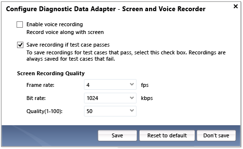

# How to: Include recordings of the screen and voice during tests using test settings

From the configuration editor in Visual Studio, you can configure the diagnostic data adapter that records the screen and voice of the user who’s running the test. This diagnostic data adapter saves a screen and voice recording of the desktop session during the test. The recording is saved with the test result or it can be attached to a bug. Other team members can use the recording to isolate application defects that are difficult to reproduce.

> [!WARNING]
> The screen and voice recordings do not support multiple monitor configurations.

The screen and voice recorder can be used with either manual or automated tests. For example, if you run a coded UI test remotely you might want to record the desktop to see the coded UI test as it runs. For more information about how to capture a screen and voice recording remotely, see [How to: Set up your test agent to run tests that interact with the desktop](../test/how-to-set-up-your-test-agent-to-run-tests-that-interact-with-the-desktop.md).

[!INCLUDE [web-load-test-deprecated](includes/web-load-test-deprecated.md)]

## To configure screen and voice recording for your test settings

1. Open the test settings that you want to configure for recording the screen and voice. For more information, see [Collect diagnostic data while testing (Azure Test Plans)](/azure/devops/test/collect-diagnostic-data?view=vsts&preserve-view=true) or [Collect diagnostic information using test settings](../test/collect-diagnostic-information-using-test-settings.md).

2. In the test settings, select the **Role** to use to record the screen and voice.

    > [!NOTE]
    > For manual tests and automated tests this would be the machine that runs the tests.

3. Select **Screen and Voice Recorder** and then choose **Configure**.

     The **Configure Diagnostic Data Adapter – Screen and Voice Recorder** dialog box is displayed.

     

4. (Optional) Select **Enable voice recording** to capture audio content in your recording.

5. (Optional) Select the check box next to **Save recording if test case passes** to specify saving screen and voice recordings for both failed and passed tests.

    > [!WARNING]
    > If you select **save recording if test case passes**, the recording is stored with the test results, which uses storage space on the server. You can use the **Test Attachment Cleaner** tool to clean up these attachments.

6. Under **Screen Recording Quality**, configure the following drop-down list options:

    1. **Frame rate:** Specify how many frames per second you want to use in the screen and voice recording. The default value is 4 frames per second. Values between 2 and 20 can be specified.

    2. **Bit rate:** Specify how many kilobytes per second to use in the screen and voice recording. The default value is 512. Values between 512 and 10,000 can be specified.

    3. **Quality(1-100):** You can specify the quality of the screen and voice recording by selecting a range between 1 and 100. The default is 50 (mid-range).

7. Choose **OK**. The diagnostic trace collector settings are now configured and saved for your test settings.

    ::: moniker range="vs-2017"
    > [!TIP]
    > To reset the configuration for this diagnostic data adapter, choose **Reset to default configuration** for Visual Studio and **Reset to default** for Microsoft Test Manager.
    ::: moniker-end
    ::: moniker range=">=vs-2019"
    > [!TIP]
    > To reset the configuration for this diagnostic data adapter, choose **Reset to default configuration** in Visual Studio.
    ::: moniker-end

## See also

- [Collect diagnostic data while testing (Azure Test Plans)](/azure/devops/test/collect-diagnostic-data?view=vsts&preserve-view=true)
- [Collect diagnostic data in manual tests (Azure Test Plans)](/azure/devops/test/mtm/collect-more-diagnostic-data-in-manual-tests?view=vsts&preserve-view=true)
- [Collect diagnostic information using test settings](../test/collect-diagnostic-information-using-test-settings.md)
- [Run manual tests (Azure Test Plans)](/azure/devops/test/run-manual-tests?view=vsts&preserve-view=true)