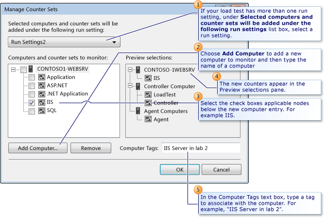

# How to: Manage counter sets using the Load Test Editor

When you create a load test with the **New Load Test Wizard**, you add an initial set of counters. These offer you a set of predefined counter sets for your load test.

> [!NOTE]
> If your load tests are distributed across remote machines, controller and agent counters are mapped to the controller and agent counter sets. For more information about how to use remote machines in your load test, see [Test controllers and test agents](configure-test-agents-and-controllers-for-load-tests.md).

Managing counter sets involves choosing the set of computers you want to collect performance data from, and assigning a set of counter sets to collect from each individual computer. You manage your counters in the **Load Test Editor**.

[!INCLUDE [web-load-test-deprecated](includes/web-load-test-deprecated.md)]

## To manage counter sets

1. Open a load test.

2. Choose the **Manage Counter Sets** button.

     – or –

     Right-click **Counter Sets** folder in the load test tree and choose **Manage Counter Sets**.

     The **Manage Counter Sets** dialog box is displayed.

3. (Optional) In the **Selected computers and counter sets will be added under the following run settings** list box, select a different run setting.

    > [!NOTE]
    > This only applies if you have more than one run setting in your load test.

4. (Optional) Choose **Add Computer** to add a new computer to monitor. You will be prompted for a name. Type the name of a computer, and you will see nodes below the new entry. For example **ASP.NET**, **IIS**, **SQL**, and others. Select the check boxes in front of the nodes you want to select. The new counters appear in the **Preview selections** pane.

5. (Optional) In the **Computer Tags** text box, type a tag to associate with the computer. For example, "TestMachine12 in lab3".

     Computer tags let you identify a computer with an easy-to-recognize name.

     The tags are displayed in the **Counter Set Mappings** node in the tree in the Load Test Editor. More important, the tags are displayed in Excel reports, which help stakeholders identify what role the computer has in the load test. For example, "Web Server1 in lab2" or "SQL Server2 in Phoenix office". For more information, see [Report load tests results for test comparisons or trend analysis](../test/compare-load-test-results.md).

6. Choose **OK**.

## See also

- [Test controllers and test agents](configure-test-agents-and-controllers-for-load-tests.md)
- [Specify the counter sets and threshold rules for computers in a load test](../test/specify-counter-sets-and-threshold-rules-for-load-testing.md)
- [Configure load test run settings](../test/configure-load-test-run-settings.md)