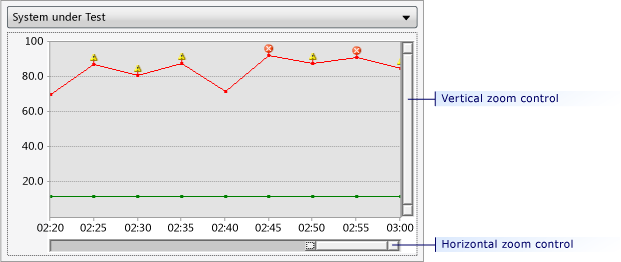

# How to: Manually create a load test performance report using Microsoft Word

You can manually create Microsoft Word load test reports by copying and pasting data from the Load Test Results summary view and graphs view. The data that is presented in the summary view and graphs view is applied in HTML format when it is copied.

[!INCLUDE [web-load-test-deprecated](includes/web-load-test-deprecated.md)]

> [!TIP]
> You can copy plain text from the tables view and screenshots from the details view to Microsoft Word, but it is not applied in HTML format and will require additional formatting and editing.

> [!TIP]
> You can also generate organized Microsoft Excel reports automatically. For more information, see [How to: Create load test performance reports using Using Microsoft Excel](../test/how-to-create-load-test-performance-reports-using-microsoft-excel.md).

## Copy summary view data

1. In the **Load Test Results**, if the summary view is not currently displayed, click **Summary** in the toolbar.

2. In the summary view, right-click and select **Select All**.

3. In the summary view, right-click and select **Copy**. This renders the summary view data as HTML format to the clipboard.

4. In Microsoft Word, paste the summary view data in the desired location.

5. You can now modify, format, and delete aspects of the copied content to meet your reporting needs.

## Copy graph view data

1. In the **Load Test Results**, if the graphs view is not currently displayed, choose **Graphs** in the toolbar.

2. (Optional) Zoom in on the specific graph that you want to copy to your Microsoft Word document, as shown in the following illustration. For more information, see [How to: Zoom in on a region of the graph](../test/how-to-zoom-in-on-a-region-of-the-graph-in-load-test-results.md).

     

3. On the graph that you want to copy to your Microsoft Word document, right-click and select **Copy**.

4. In Microsoft Word, paste the graph and associated table data in the desired location.

    > [!WARNING]
    > You cannot copy the graph from a remote desktop and paste it to another machine, because only the table information that is associated with the graph will be copied and not the graph image. The graph image is stored in the temporary directory on the machine from which it was copied, and the second machine cannot dereference that directory.

## See also

- [Report load tests results for test comparisons or trend analysis](../test/compare-load-test-results.md)
- [How to: Create load test performance reports using Microsoft Excel](../test/how-to-create-load-test-performance-reports-using-microsoft-excel.md)
