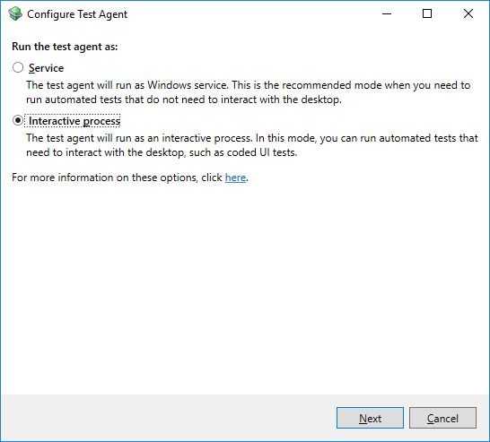

# How to: Set up your test agent to run tests that interact with the desktop

::: moniker range="vs-2017"
If you want to run automated tests that interact with the desktop, you must set up your agent to run as a process instead of a service. For example, if you want to run a coded UI test remotely using a test controller and test agent, or you want to run a test and capture a video recording when you run it, you must set up your agent to run as a process. When you assign agents to roles in your test settings using Visual Studio, or you assign agents to roles in your environment by using Microsoft Test Manager, you must change the setup for any agents assigned to roles that have to interact with the desktop.
::: moniker-end
::: moniker range=">=vs-2019"
If you want to run automated tests that interact with the desktop, you must set up your agent to run as a process instead of a service. For example, if you want to run a coded UI test remotely using a test controller and test agent, or you want to run a test and capture a video recording when you run it, you must set up your agent to run as a process. When you assign agents to roles in your test settings using Visual Studio, you must change the setup for any agents assigned to roles that have to interact with the desktop.
::: moniker-end

[!INCLUDE [web-load-test-deprecated](includes/web-load-test-deprecated.md)]

::: moniker range="vs-2017"
> [!WARNING]
> If you use Microsoft Test Manager to set up a lab environment, it installs the test agent. You can specify in the **Environment Creation Wizard** that you want to configure one of the roles to run coded UI tests.
:::moniker-end

> [!IMPORTANT]
> The computer that is running an agent on which you want to run coded UI tests cannot be locked or have an active screen saver.

If you are running coded UI tests that start a browser, the service account for the test agent is used to start that browser. This service account must be the same as the user account that is the active user on this computer. If it is not the same user account, the browser will not start.

> [!IMPORTANT]
> If you are running a coded UI test that starts a browser as part of a build definition, the service account for the build service is used to start that browser. This service account must be the same as the user account that is the active user on this computer. If it is not the same user account, the browser will not start.

Use the following procedure to set up any agents that are assigned to a role that performs a task that needs to interact with the desktop.

## To set up an agent to run as a process

1. To configure the test agent you have installed to run as a process, go to **Start** > **Test Agent Configuration Tool**.

   The **Configure Test Agent** dialog box is displayed.

   

2. Select **Interactive Process**. The test agent will be started as a process instead of a service. Choose **Next**.

3. Enter the user name and password for the user that will run the test agent process.

   > [!NOTE]
   > - The user who you add to start the process must also be added as a member of the TeamTestAgentService group on the computer for the test controller for this agent. If this user is the current user, when you add this user to the test controller computer you must log off or reboot.
   > - Null passwords are not supported for user accounts.
   > - If you want to use the IntelliTrace or the network emulation data and diagnostic adapter, the user account must be a member of the Administrators group. If the machine that is running the test agent is running an OS that has Least-Privileged User Account, you have to run it as an administrator also (elevated). If the agent user name is not in the agent service it will try to add it, which requires permissions on the test controller.
   > - The user trying to use the test controller must be in the test controller's Users account or they won't be able to run the tests against the controller.

4. To make sure that a computer that has a test agent can run tests after rebooting, you can set up the computer to sign in automatically as the test agent user. Select **Log on automatically**. This will store the user name and password in an encrypted form in the registry.

   > [!NOTE]
   > When you are connected to the lab environment using a remote desktop or guest-based connection, you might experience frequent, unexpected disconnects. One possible cause of the loss of the connection is that the machine is configured to automatically log onto the network.

5. To make sure that the screen saver is disabled because this might interfere with any automated tests that must interact with the desktop, select **Ensure screen saver is disabled**.

   > [!WARNING]
   > There are security risks if you log on automatically or disable the screen saver. By enabling automatic log on, you enable other users to start this computer and to be able to use the account that automatically logs on. If you disable the screen saver, the computer might not prompt for a user to log on to unlock the computer. This enables anyone to access the computer if they have physical access to the computer. If you enable these features on a computer, you should make sure that these computers are physically secure. For example, these computers are located in a physically secure lab. If you clear **Ensure screen saver is disabled**, this does not enable your screen saver.

   To change the agent back to run as a service, you can use this tool and select **Service**.

6. To apply your changes, choose **Apply Settings**.

   A **Configuration summary** dialog box is displayed that shows the status of each of the steps to configure your test agent.

7. To close the **Configuration summary** dialog box, choose **Close**. Then choose **Close** again to close the **Test Agent Configuration Tool**.

   > [!NOTE]
   > There is a notification area icon that runs on the computer for a test agent that is running as a process. It shows the status of the test agent. You can start, stop or restart the agent if it is running as a process using this tool. To start the test agent as a process if it is not running, choose **Start** > **Visual Studio** > **Microsoft Visual Studio Test Agent**.

   ::: moniker range="vs-2017"
   If the test controller for this test agent is registered with Team Foundation Server, the status of a test agent that is running as an interactive process is displayed in the **Controllers** view in the **Lab Center** for Microsoft Test Manager. It is listed with a preceding asterisk symbol to denote that it is running as an interactive process. To restart this test agent, you must use the tool that runs on the computer for the test agent and not the **Controllers** view.
   ::: moniker-end

## See also

- [Install and configure test agents](../test/lab-management/install-configure-test-agents.md)
