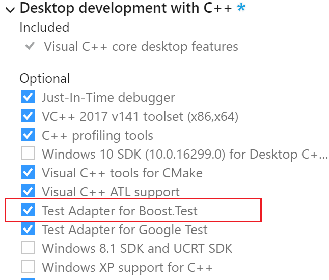
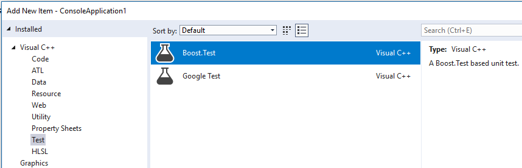
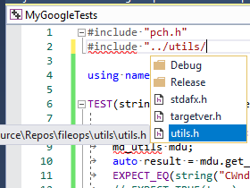

# Use Boost.Test for C++ in Visual Studio

In Visual Studio 2017 and later, the Boost.Test test adapter is integrated into the Visual Studio IDE. It's a component of the **Desktop development with C++** workload.



If you don't have the **Desktop development with C++** workload installed, open **Visual Studio Installer**. Select the **Desktop development with C++** workload, then choose the **Modify** button.

## Install Boost

Boost.Test requires [Boost](https://www.boost.org/)! If you don't have Boost installed, we recommend that you use the Vcpkg package manager.

1. Follow the instructions at [Vcpkg: a C++ package manager for Windows](/cpp/vcpkg) to install vcpkg (if you don't already have it).

1. Install the Boost.Test dynamic or static library:

    - Run `vcpkg install boost-test` to install the Boost.Test dynamic library.

       -or-

    - Run `vcpkg install boost-test:x86-windows-static` to install the Boost.Test static library.

1. Run `vcpkg integrate install` to configure Visual Studio with the library and include paths to the Boost headers and binaries.

You have a choice in how to configure your tests within your solution in Visual Studio: You can include your test code in the project under test, or you can create a separate test project for your tests. Both choices have advantages and disadvantages.

## Add tests inside your project

In Visual Studio 2017 version 15.6 and later, you can add an item template for tests into your project. Both the tests and your code live in the same project. You'll have to create a separate build configuration to generate a test build. And, you'll need to keep the tests out of your debug and release builds.

In Visual Studio 2017 version 15.5, no pre-configured test project or item templates are available for Boost.Test. Use the instructions to create and configure a separate test project.

### Create a Boost.Test item

1. To create a *.cpp* file for your tests, right-click on the project node in **Solution Explorer** and choose **Add** > **New Item**.

1. In the **Add New Item** dialog, expand **Installed** > **Visual C++** > **Test**. Select **Boost.Test**, then choose **Add** to add *Test.cpp* to your project.

   

The new *Test.cpp* file contains a sample test method. This file is where you can include your own header files and write tests for your app.

The test file also uses macros to define a new `main` routine for test configurations. If you build your project now, you'll see a LNK2005 error, such as "_main already defined in main.obj."

### Create and update build configurations

1. To create a test configuration, on the menu bar, select **Build** > **Configuration Manager**. In the **Configuration Manager** dialog, open the dropdown under **Active solution configuration** and choose **New**. In the **New Solution Configuration** dialog, enter a name such as "Debug UnitTests". Under **Copy settings from** select **Debug**, and then choose **OK**.

1. Exclude the test code from your Debug and Release configurations: In **Solution Explorer**, right-click on Test.cpp and select **Properties**. In the **Property Pages** dialog, select **All Configurations** in the **Configuration** dropdown. Select **Configuration Properties** > **General** and open the dropdown for the **Excluded From Build** property. Select **Yes**, then choose **Apply** to save your changes.

1. To include the test code in your Debug UnitTests configuration, in the **Property Pages** dialog, select **Debug UnitTests** in the **Configuration** dropdown. Select **No** in the **Excluded From Build** property, then choose **OK** to save your changes.

1. Exclude the main code from your Debug UnitTests configuration. In **Solution Explorer**, right-click on the file that contains your `main` function and select **Properties**. In the **Property Pages** dialog, select **Debug UnitTests** in the **Configuration** dropdown. Select **Configuration Properties** > **General** and open the dropdown for the **Excluded From Build** property. Select **Yes**, then choose **OK** to save your changes.

1. Set the Solution Configuration to **Debug UnitTests**, then build your project to enable **Test Explorer** to discover the method.

As long as the configuration name you create starts with the words "Debug" or "Release", the corresponding Boost.Test libraries get picked up automatically.

The item template uses the single-header variant of Boost.Test, but you can modify the #include path to use the standalone library variant. For more information, see [Add include directives](#add-include-directives).

## Create a separate test project

In many cases, it's easier to use a separate project for your tests. You won't have to create a special test configuration for your project. Or, exclude test files from Debug and Release builds.

### To create a separate test project

1. In **Solution Explorer**, right click on the solution node and choose **Add** > **New Project**.

1. In the **Add a new project** dialog, choose **C++**, **Windows**, and **Console** in the filter dropdowns. Select the **Console App** template, then choose **Next**.

1. Give the project a name and choose **Create**.

1. Delete the `main` function in the *.cpp* file.

1. If you're using the single-header or dynamic library version of Boost.Test, go to [Add include directives](#add-include-directives). If you're using the static library version, then you have to do some additional configuration:

   a. To edit the project file, first unload it. In **Solution Explorer**, right-click the project node and choose **Unload Project**. Then, right-click the project node and choose **Edit <name\>.vcxproj**.

   b. Add two lines to the **Globals** property group as shown here:

    ```xml
    <PropertyGroup Label="Globals">
    ....
        <VcpkgTriplet>x86-windows-static</VcpkgTriplet>
        <VcpkgEnabled>true</VcpkgEnabled>
    </PropertyGroup>
    ```

   c. Save and close the *\*.vcxproj* file, and then reload the project.

   d. To open the **Property Pages**, right-click on the project node and choose **Properties**.

   e. Expand **C/C++** > **Code Generation**, and then select **Runtime Library**. Select **/MTd** for debug static runtime library or **/MT** for release static runtime library.

   f. Expand **Linker** > **System**. Verify **SubSystem** is set to **Console**.

   g. Choose **OK** to close the property pages.

## Add include directives

1. In your test *.cpp* file, add any needed `#include` directives to make your program's types and functions visible to the test code. If you're using a separate test project, typically, the program is on a sibling level in the folder hierarchy. If you type `#include "../"`, an IntelliSense window appears and enables you to select the full path to the header file.

   

   You can use the standalone library with:

   ```cpp
   #include <boost/test/unit_test.hpp>
   ```

   Or, use the single-header version with:

   ```cpp
   #include <boost/test/included/unit_test.hpp>
   ```

   Then, define `BOOST_TEST_MODULE`.

The following example is sufficient for the test to be discoverable in **Test Explorer**:

```cpp
#define BOOST_TEST_MODULE MyTest
#include <boost/test/included/unit_test.hpp> //single-header
#include "../MyProgram/MyClass.h" // project being tested
#include <string>

BOOST_AUTO_TEST_CASE(my_boost_test)
{
    std::string expected_value = "Bill";

    // assume MyClass is defined in MyClass.h
    // and get_value() has public accessibility
    MyClass mc;
    BOOST_CHECK(expected_value == mc.get_value());
}
```

## Write and run tests

You're now ready to write and run Boost tests. See the [Boost test library documentation](https://www.boost.org/doc/libs/1_71_0/libs/test/doc/html/index.html) for information about the test macros. See [Run unit tests with Test Explorer](run-unit-tests-with-test-explorer.md) for information about discovering, running, and grouping your tests by using **Test Explorer**.

## Related content

- [Write unit tests for C/C++](writing-unit-tests-for-c-cpp.md)
