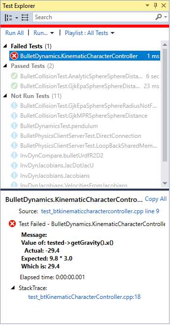

# How to use CTest for C++ in Visual Studio 2017 and later

CMake (which includes CTest) is integrated into the Visual Studio IDE by default as a component of the **Desktop Development with C++** workload. If you need to install it on your machine, open the Visual Studio Installer program, click the **Desktop Development with C++** button, then click **Modify**. Select **C++ CMake tools for Windows** under the list of workload components.

## To write tests

CMake support in Visual Studio doesn't involve the Visual Studio project system. Therefore, you write and configure CTest tests just as you would in any CMake environment. Use the `enable_testing()` command to enable testing, and the `add_test()` or `gtest_discover_tests()` command to add a new test. To learn more about CTest, see the [CMake documentation](https://gitlab.kitware.com/cmake/community/wikis/doc/ctest/Testing-With-CTest). 

For more information about using CMake in Visual Studio, see [CMake projects in Visual Studio](/cpp/build/cmake-projects-in-visual-studio).

## To run tests

CTest is fully integrated with **Test Explorer** and also supports both the Google and Boost unit testing frameworks. Those frameworks are included by default as components in the **Desktop Development with C++** workload. However, if you are upgrading a project from an older version of Visual Studio, you may need to install those frameworks by using the Visual Studio Installer program.

The following illustration shows results of a CTest run using Google Test framework:

If you are using CTest but not the Google or Boost adapters, you see results at the CTest level instead of the individual test method level. You can debug and step-through CTest-only executables, but stack traces on individual tests aren't supported.

## See also

- [Write unit tests for C/C++](writing-unit-tests-for-c-cpp.md)
