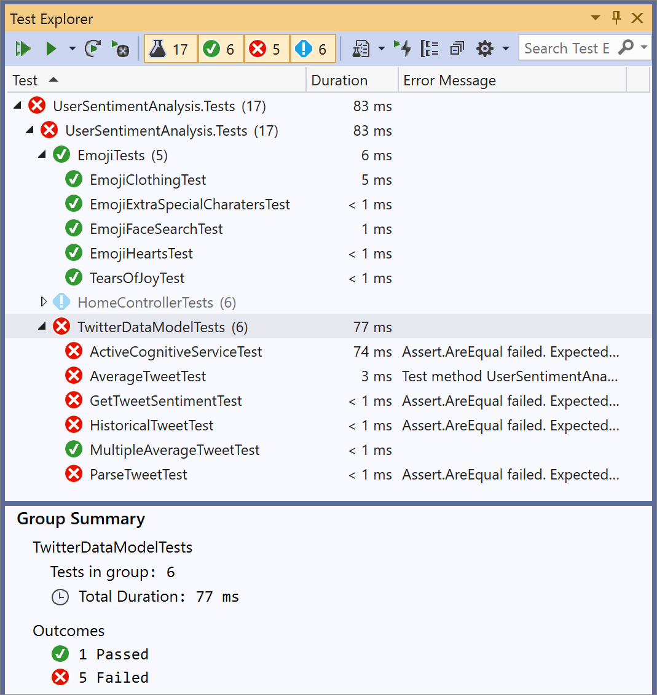
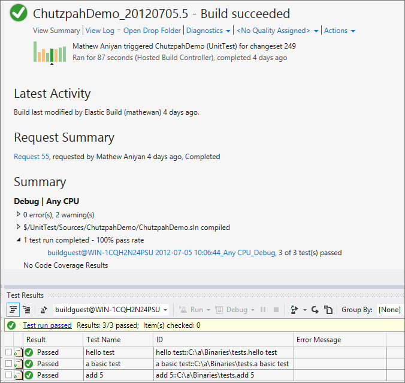
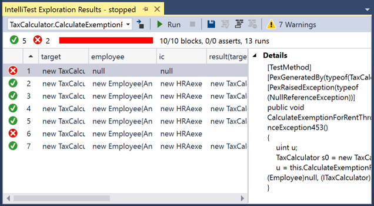

# Overview of testing tools in Visual Studio

Visual Studio testing tools can help you and your team develop and sustain high standards of code excellence.

> [!NOTE]
> Unit testing is available in all editions of Visual Studio. Other testing tools, such as Live Unit Testing and IntelliTest, are only available in Visual Studio Enterprise edition. For more information about editions see [Compare Visual Studio IDEs](https://visualstudio.microsoft.com/vs/compare/).

## Test Explorer

The **Test Explorer** window helps developers create, manage, and run unit tests. You can use the Microsoft unit test framework or one of several third-party and open source frameworks.

* [Get started with unit testing](unit-test-your-code.md)
* [Unit test basics](unit-test-basics.md)
* [Run unit tests with Test Explorer](run-unit-tests-with-test-explorer.md)
* [Test Explorer FAQ](test-explorer-faq.md)
* [Install third-party unit test frameworks](install-third-party-unit-test-frameworks.md)

Visual Studio is also extensible and opens the door for third-party unit testing adapters such as NUnit and xUnit.net. In addition, the code clone capability goes hand-in-hand with delivering high-quality software by helping you identify blocks of semantically similar code that may be candidates for common bug fixes or refactoring.

## Live Unit Testing

[Live Unit Testing](../test/live-unit-testing.md) automatically runs unit tests in the background, and graphically displays code coverage and test results in the Visual Studio code editor.

> [!NOTE]
> Live unit testing is available in Enterprise edition only and is only supported for .NET code.

## IntelliTest

IntelliTest automatically generates unit tests and test data for your managed code. IntelliTest improves coverage and dramatically reduces the effort to create and maintain unit tests for new or existing code.

> [!NOTE]
> IntelliTest is available in Enterprise edition only. It is supported for C# code that targets the .NET Framework. .NET Core and .NET Standard are not currently supported.

* [Generate unit tests for your code with IntelliTest](generate-unit-tests-for-your-code-with-intellitest.md)
* [IntelliTest – One test to rule them all](https://devblogs.microsoft.com/devops/intellitest-one-test-to-rule-them-all/)
* [IntelliTest reference manual](intellitest-manual/index.md)

## Code coverage

[Code coverage](../test/using-code-coverage-to-determine-how-much-code-is-being-tested.md) determines what proportion of your project's code is actually being tested by coded tests such as unit tests. To guard effectively against bugs, your tests should exercise or "cover" a large proportion of your code.

> [!NOTE]
> Code coverage is available in Enterprise edition only.

Code coverage analysis can be applied to both managed and unmanaged (native) code.

Code coverage is an option when you run test methods using Test Explorer. The results table shows the percentage of the code that was run in each assembly, class, and method. In addition, the source editor shows you which code has been tested.

* [Use code coverage to determine how much code is being tested](using-code-coverage-to-determine-how-much-code-is-being-tested.md)
* [Unit testing, code coverage and code clone analysis with Visual Studio (Lab)](https://azuredevopslabs.com/labs/devopsserver/liveunittesting)
* [Customize code coverage analysis](customizing-code-coverage-analysis.md)
* [Microsoft.CodeCoverage.Console tool](microsoft-code-coverage-console-tool.md)

## Microsoft Fakes

[Microsoft Fakes](../test/isolating-code-under-test-with-microsoft-fakes.md) help you isolate the code you're testing by replacing other parts of the application with stubs or shims.

> [!NOTE]
> Microsoft Fakes are available in Enterprise edition only and is supported only for .NET code.

::: moniker range=">=vs-2022"
## User interface testing with Playwright

[Playwright](https://playwright.dev/) is recommended for generic browser-based UI testing.

::: moniker-end

::: moniker range="<=vs-2019"
## User interface testing with Coded UI and Selenium

Coded UI tests provide a way to create fully automated tests to validate the functionality and behavior of your application’s user interface. They can automate UI testing across a variety of technologies, including XAML-based UWP apps, browser apps, and SharePoint apps.

> [!NOTE]
> Coded UI is a deprecated feature.

Whether you choose best-of-breed Coded UI Tests or generic browser-based UI testing with [Playwright](https://playwright.dev/), Visual Studio provides all the tools you need.

* [Use UI automation to test your code](use-ui-automation-to-test-your-code.md)
* [Get started creating, editing, and maintaining a coded UI test](walkthrough-creating-editing-and-maintaining-a-coded-ui-test.md)
* [Test UWP apps with coded UI tests](test-uwp-app-with-coded-ui-test.md)
* [Introduction to coded UI tests with Visual Studio Enterprise (Lab)](https://azuredevopslabs.com/labs/tfs/codedui)
::: moniker-end

## Related content

- [Exploratory & manual testing (Azure Test Plans)](/azure/devops/test/index?view=vsts&preserve-view=true)
- [Load testing (Azure Load Testing)](/azure/load-testing/)
- [Code analysis tools](../code-quality/code-analysis-for-managed-code-overview.md)
