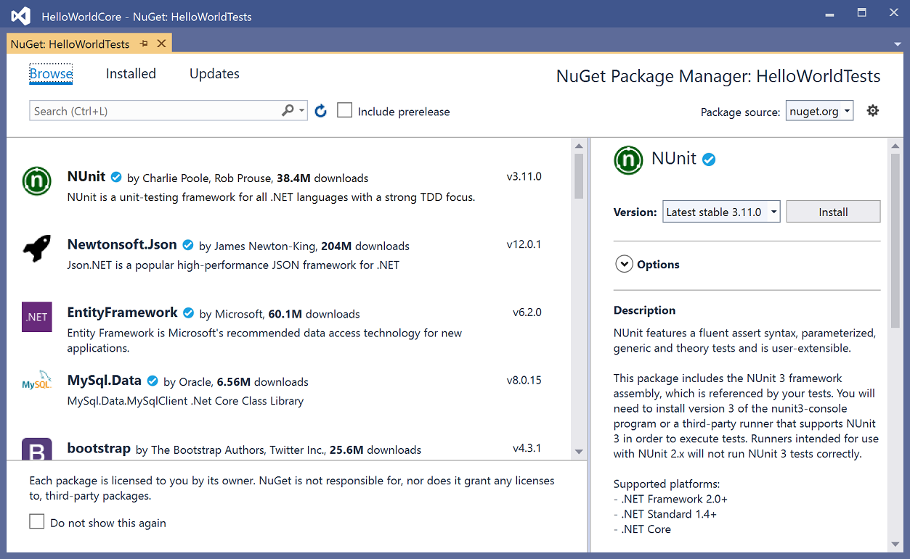

# Install unit test frameworks

Visual Studio Test Explorer can run tests from any unit test framework that has developed an adapter interface for it. Installing the framework copies the binaries and adds Visual Studio project templates for the languages it supports. When you create a project with the template, the framework is registered with Test Explorer.

A Visual Studio solution can contain unit test projects that use different frameworks and that are targeted at different languages.

[MSTest](getting-started-with-unit-testing.md) is the test framework provided by Visual Studio and is installed by default.

## Acquire frameworks

Install third-party unit test frameworks by using **NuGet Package Manager**.

1. Right-click on the project that will contain your test code and select **Manage NuGet Packages**.

2. In **NuGet Package Manager**, search for the test framework you want to install, and then click **Install**.

   

## Update to the latest test adapters

Update to the latest stable test adapter to experience better test discovery and execution. For more information about updates to MSTest, NUnit, and xUnit test adapters, see the [Visual Studio blog](https://devblogs.microsoft.com/visualstudio/test-experience-improvements/).

### To update to the latest stable test adapter version

1. Open the Nuget Package Manager for your solution by navigating to **Tools** > **NuGet Package Manager** > **Manage NuGet Packages for Solution**.

2. Click on the **Updates** tab and search for MSTest, NUnit, or xUnit test adapters that are installed.

3. Select each test adapter, and then select the latest stable version in the drop-down menu.

4. Choose the **Install** button.

   

## See also

- [Unit test your code](../test/unit-test-your-code.md)
