# Get started with Live Unit Testing

When you enable Live Unit Testing in a Visual Studio solution, it visually depicts your test coverage and the status of your tests. Live Unit Testing also dynamically executes tests whenever you modify your code and immediately notifies you when your changes cause tests to fail.

Live Unit Testing can be used to test solutions that target either .NET Framework, .NET Core, or .NET 5+. In this tutorial, you'll learn to use Live Unit Testing by creating a simple class library that targets .NET, and you'll create an MSTest project that targets .NET to test it.

The complete C# solution can be downloaded from the [MicrosoftDocs/visualstudio-docs](https://github.com/MicrosoftDocs/visualstudio-docs/tree/main/docs/test/samples/csharp/UtilityLibraries/) repo on GitHub.

## Prerequisites

This tutorial requires that you've installed Visual Studio Enterprise edition with the **.NET desktop development** workload.

## Create the solution and the class library project

Begin by creating a Visual Studio solution named UtilityLibraries that consists of a single .NET class library project, StringLibrary.

The solution is just a container for one or more projects. To create a blank solution, open Visual Studio and do the following:

1. Select **File** > **New** > **Project** from the top-level Visual Studio menu.

1. Type **solution** into the template search box, and then select the **Blank Solution** template. Name the project **UtilityLibraries**.

1. Finish creating the solution.

Now that you've created the solution, you'll create a class library named StringLibrary that contains a number of extension methods for working with strings.

1. In **Solution Explorer**, right-click on the UtilityLibraries solution and select **Add** > **New Project**.

2. Type **class library** into the template search box, and the select the **Class Library** template that targets .NET or .NET Standard. Click **Next**.

3. Name the project **StringLibrary**.

4. Click **Create** to create the project.

5. Replace all of the existing code in the code editor with the following code:

   ```csharp
   using System;

   namespace UtilityLibraries
   {
       public static class StringLibrary
       {
           public static bool StartsWithUpper(this string s)
           {
               if (String.IsNullOrWhiteSpace(s))
                   return false;

               return Char.IsUpper(s[0]);
           }

           public static bool StartsWithLower(this string s)
           {
               if (String.IsNullOrWhiteSpace(s))
                   return false;

               return Char.IsLower(s[0]);
           }

           public static bool HasEmbeddedSpaces(this string s)
           {
               foreach (var ch in s.Trim())
               {
                   if (ch == ' ')
                       return true;
               }
               return false;
           }
       }
   }
   ```

   StringLibrary has three static methods:

   - `StartsWithUpper` returns `true` if a string starts with an uppercase character; otherwise, it returns `false`.

   - `StartsWithLower` returns `true` if a string starts with a lowercase character; otherwise, it returns `false`.

   - `HasEmbeddedSpaces` returns `true` if a string contains an embedded whitespace character; otherwise, it returns `false`.

6. Select **Build** > **Build Solution** from the top-level Visual Studio menu. The build should succeed.

## Create the test project

The next step is to create the unit test project to test the StringLibrary library. Create the unit tests by performing the following steps:

1. In **Solution Explorer**, right-click on the UtilityLibraries solution and select **Add** > **New Project**.

2. Type **unit test** into the template search box, select **C#** as the language, and then select the **MSTest Unit Test Project** for .NET template. Click **Next**.

   > [!NOTE]
   > In Visual Studio 2019 version 16.9, the MSTest project template name is **Unit Test Project**.

3. Name the project **StringLibraryTests** and click **Next**.

4. Choose either the recommended target framework or .NET 8, and then choose **Create**.

   > [!NOTE]
   > This getting started tutorial uses Live Unit Testing with the MSTest test framework. You can also use the xUnit and NUnit test frameworks.

5. The unit test project can't automatically access the class library that it is testing. You give the test library access by adding a reference to the class library project. To do this, right-click the `StringLibraryTests` project and select **Add** > **Project Reference**. In the **Reference Manager** dialog, make sure the **Solution** tab is selected, and select the StringLibrary project, as shown in the following illustration.

   ::: moniker range="<=vs-2019"
   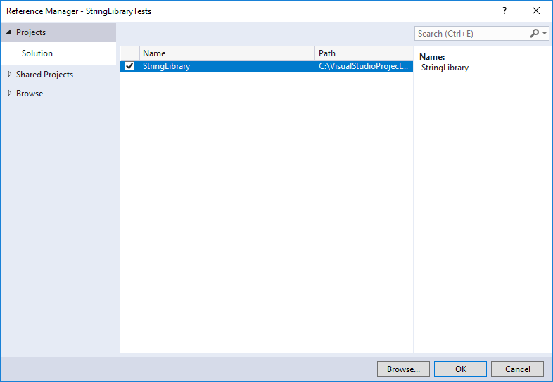
   ::: moniker-end
   ::: moniker range=">=vs-2022"
   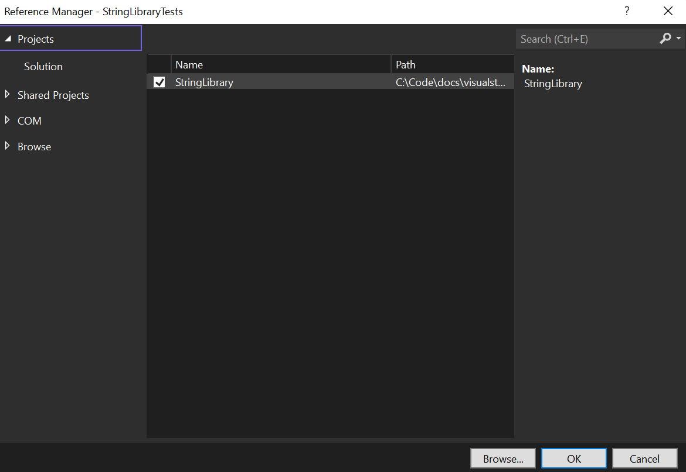
   ::: moniker-end

6. Replace the boilerplate unit test code provided by the template with the following code:

   ```csharp
   using System;
   using Microsoft.VisualStudio.TestTools.UnitTesting;
   using UtilityLibraries;

   namespace StringLibraryTest
   {
       [TestClass]
       public class UnitTest1
       {
           [TestMethod]
           public void TestStartsWithUpper()
           {
               // Tests that we expect to return true.
               string[] words = { "Alphabet", "Zebra", "ABC", "Αθήνα", "Москва" };
               foreach (var word in words)
               {
                   bool result = word.StartsWithUpper();
                   Assert.IsTrue(result,
                                 $"Expected for '{word}': true; Actual: {result}");
               }
           }

           [TestMethod]
           public void TestDoesNotStartWithUpper()
           {
               // Tests that we expect to return false.
               string[] words = { "alphabet", "zebra", "abc", "αυτοκινητοβιομηχανία", "государство",
                                  "1234", ".", ";", " " };
               foreach (var word in words)
               {
                   bool result = word.StartsWithUpper();
                   Assert.IsFalse(result,
                                  $"Expected for '{word}': false; Actual: {result}");
               }
           }

           [TestMethod]
           public void DirectCallWithNullOrEmpty()
           {
               // Tests that we expect to return false.
               string[] words = { String.Empty, null };
               foreach (var word in words)
               {
                   bool result = StringLibrary.StartsWithUpper(word);
                   Assert.IsFalse(result,
                                  $"Expected for '{(word == null ? "<null>" : word)}': " +
                                  $"false; Actual: {result}");
               }
           }
       }
   }
   ```

7. Save your project by selecting the **Save** icon on the toolbar.

   Because the unit test code includes some non-ASCII characters, you will see the following dialog to warn that some characters will be lost if you save the file in its default ASCII format.

8. Choose the **Save with Other Encoding** button.

   ::: moniker range=">=vs-2022"
   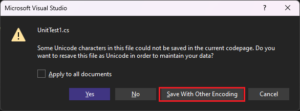
   ::: moniker-end
   ::: moniker range="vs-2019"
   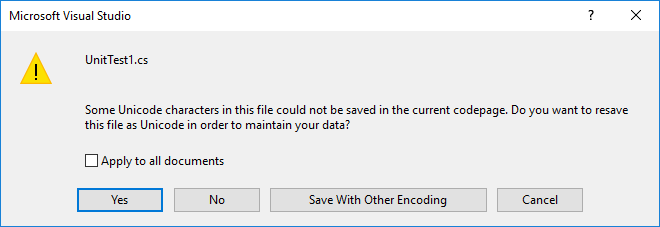
   ::: moniker-end

9. In the **Encoding** drop-down list of the **Advance Save Options** dialog, choose **Unicode (UTF-8 without signature) - Codepage 65001**, as the following illustration shows:

   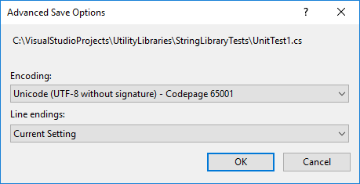

10. Compile the unit test project by selecting **Build** > **Rebuild Solution** from the top-level Visual Studio menu.

You've created a class library as well as some unit tests for it. You've now finished the preliminaries needed to use Live Unit Testing.

## Enable Live Unit Testing

So far, although you've written the tests for the StringLibrary class library, you haven't executed them. Live Unit Testing executes them automatically once you enable it. To do that, do the following:

1. Optionally, select the code editor window that contains the code for StringLibrary. This is either *Class1.cs* for a C# project or *Class1.vb* for a Visual Basic project. (This step lets you visually inspect the result of your tests and the extent of your code coverage once you enable Live Unit Testing.)

2. Select **Test** > **Live Unit Testing** > **Start** from the top-level Visual Studio menu.

3. Verify the configuration for Live Unit Testing by ensuring the Repository Root includes the path to the source files for both the utility project and the test project. Select **Next** and then **Finish**.

::: moniker range=">=vs-2022"
4. In the Live Unit Testing window, select the **include all tests** link (Alternatively, select the **Playlist** button icon, then select the **StringLibraryTest**, which selects all the tests underneath it. Then deselect the **Playlist** button to exit edit mode.)

5. Visual Studio will rebuild the project and start Live Unit Test, which automatically runs all of your tests.
::: moniker-end
::: moniker range="vs-2019"
4. Visual Studio will rebuild the project and start Live Unit Test, which automatically runs all of your tests.
::: moniker-end

When it finishes running your tests, **Live Unit Testing** displays both the overall results and the result of individual tests. In addition, the code editor window graphically displays both your test code coverage and the result for your tests. As the following illustration shows, all three tests have executed successfully. It also shows that our tests have covered all code paths in the `StartsWithUpper` method, and those tests all executed successfully (which is indicated by the green check mark, "✓"). Finally, it shows that none of the other methods in StringLibrary have code coverage (which is indicated by a blue line, "➖").

::: moniker range=">=vs-2022"
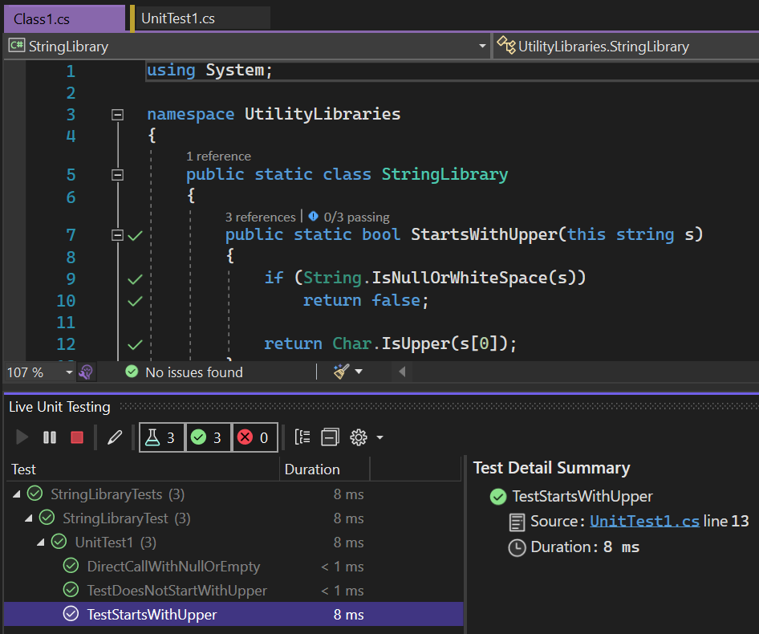
::: moniker-end
::: moniker range="vs-2019"

::: moniker-end

You can also get more detailed information about test coverage and test results by selecting a particular code coverage icon in the code editor window. To examine this detail, do the following:

1. Click on the green check mark on the line that reads `if (String.IsNullOrWhiteSpace(s))` in the `StartsWithUpper` method. As the following illustration shows, Live Unit Testing indicates that three tests cover that line of code, and that all have executed successfully.

   ::: moniker range=">=vs-2022"
   
   ::: moniker-end
   ::: moniker range="<=vs-2019"
   
   ::: moniker-end

1. Click on the green check mark on the line that reads `return Char.IsUpper(s[0])` in the `StartsWithUpper` method. As the following illustration shows, Live Unit Testing indicates that only two tests cover that line of code, and that all have executed successfully.

   ::: moniker range=">=vs-2022"
   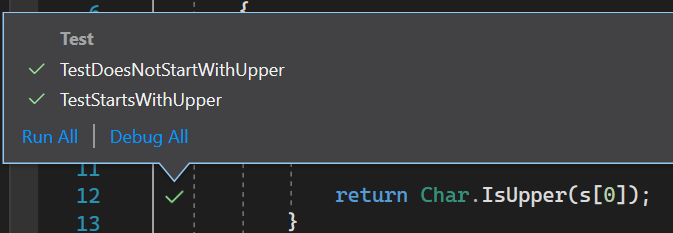
   ::: moniker-end
   ::: moniker range="<=vs-2019"
   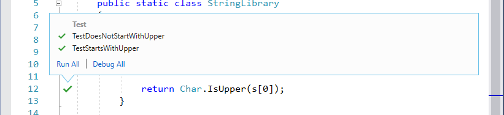
   ::: moniker-end

The major issue that Live Unit Testing identifies is incomplete code coverage. You'll address it in the next section.

## Expand test coverage

In this section, you'll extend your unit tests to the `StartsWithLower` method. While you do that, Live Unit Testing will dynamically continue to test your code.

To extend code coverage to the `StartsWithLower` method, do the following:

1. Add the following `TestStartsWithLower` and `TestDoesNotStartWithLower` methods to your project's test source code file:

   :::code language="csharp" source="../test/samples/snippets/csharp/lut-start/unittest2.cs" id="Snippet1":::

1. Modify the `DirectCallWithNullOrEmpty` method by adding the following code immediately after the call to the [`Microsoft.VisualStudio.TestTools.UnitTesting.Assert.IsFalse`](/dotnet/api/microsoft.visualstudio.testtools.unittesting.assert.isfalse) method.

   :::code language="csharp" source="../test/samples/snippets/csharp/lut-start/unittest2.cs" id="Snippet2":::

1. Live Unit Testing automatically executes new and modified tests when you modify your source code. As the following illustration shows, all of the tests, including the two you've added and the one you've modified, have succeeded.

   ::: moniker range=">=vs-2022"
   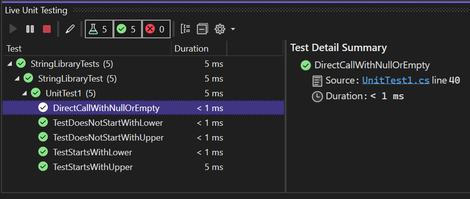
   ::: moniker-end
   ::: moniker range="vs-2019"
   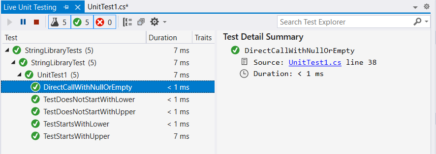
   ::: moniker-end

1. Switch to the window that contains the source code for the StringLibrary class. Live Unit Testing now shows that our code coverage is extended to the `StartsWithLower` method.

   ::: moniker range=">=vs-2022"
   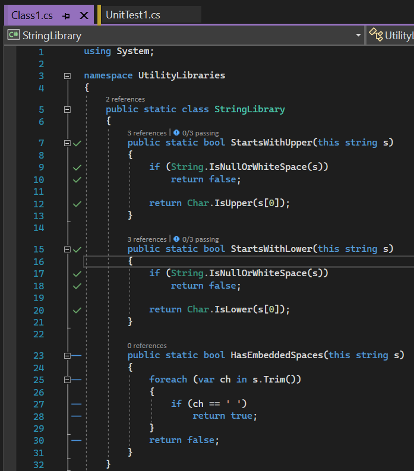
   ::: moniker-end
   ::: moniker range="<=vs-2019"
   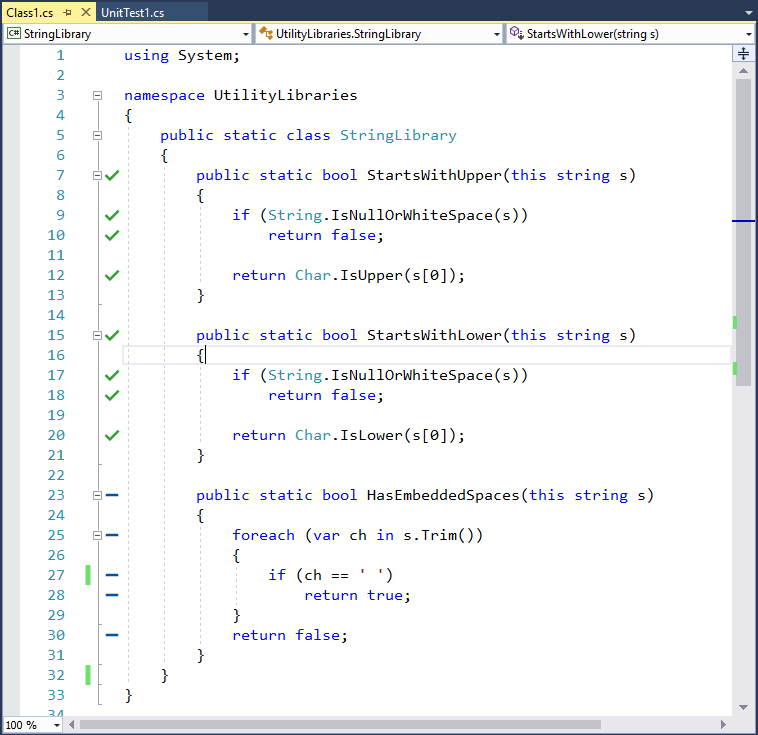
   ::: moniker-end

In some cases, successful tests in **Test Explorer** might be grayed-out. That indicates that a test is currently executing, or that the test has not run again because there have been no code changes that would impact the test since it was last executed.

So far, all of our tests have succeeded. In the next section, we'll examine how you can handle test failure.

## Handle a test failure

In this section, you'll explore how you can use Live Unit Testing to identify, troubleshoot, and address test failures. You'll do this by expanding test coverage to the `HasEmbeddedSpaces` method.

1. Add the following method to your test file:

   :::code language="csharp" source="../test/samples/snippets/csharp/lut-start/unittest2.cs" id="Snippet3":::

1. When the test executes, Live Unit Testing indicates that the `TestHasEmbeddedSpaces` method has failed, as the following illustration shows:

   ::: moniker range=">=vs-2022"
   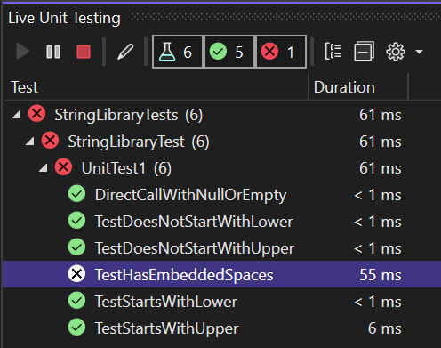
   ::: moniker-end
   ::: moniker range="vs-2019"
   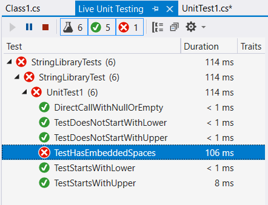
   ::: moniker-end

1. Select the window that displays the library code. Live Unit Testing has expanded code coverage to the `HasEmbeddedSpaces` method. It also reports the test failure by adding a red  "🞩" to lines covered by failing tests.

1. Hover over the line with the `HasEmbeddedSpaces` method signature. Live Unit Testing displays a tooltip that reports that the method is covered by one test, as the following illustration shows:

   ::: moniker range=">=vs-2022"
   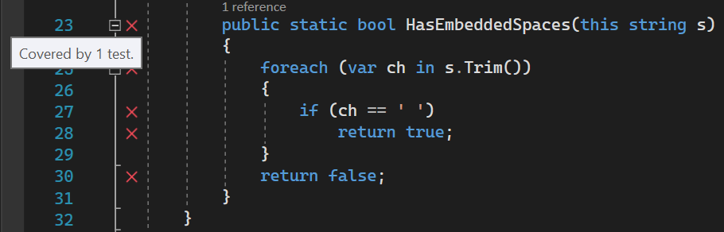
   ::: moniker-end
   ::: moniker range="<=vs-2019"
   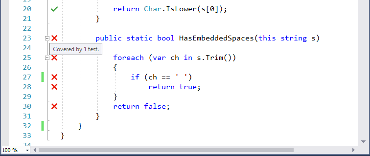
   ::: moniker-end

1. Select the failed **TestHasEmbeddedSpaces** test. Live Unit Testing gives you a few options such as running all tests and debugging all tests, as the following illustration shows:

   ::: moniker range=">=vs-2022"
   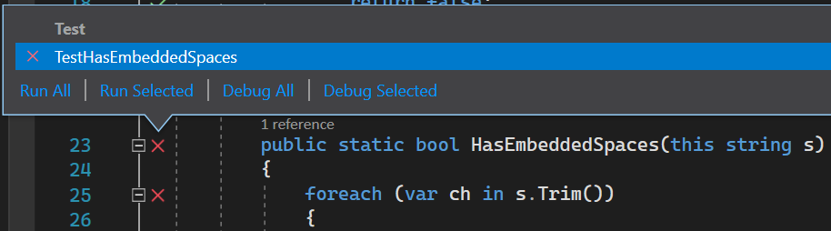
   ::: moniker-end
   ::: moniker range="vs-2019"
   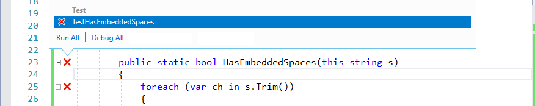
   ::: moniker-end

1. Select **Debug All** to debug the failed test.

1. Visual Studio executes the test in debug mode.

   The test assigns each string in an array to a variable named `phrase` and passes it to the `HasEmbeddedSpaces` method. Program execution pauses and invokes the debugger the first time the assert expression is `false`. The exception dialog that results from the unexpected value in the [`Microsoft.VisualStudio.TestTools.UnitTesting.Assert.IsTrue`](/dotnet/api/microsoft.visualstudio.testtools.unittesting.assert.istrue) method call is shown in the following illustration.

   ::: moniker range=">=vs-2022"
   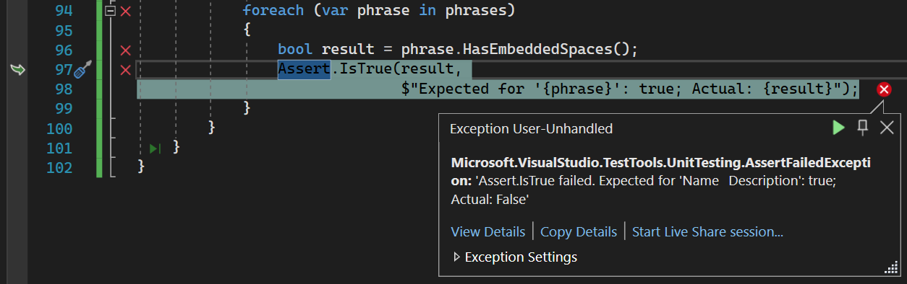
   ::: moniker-end
   ::: moniker range="<=vs-2019"
   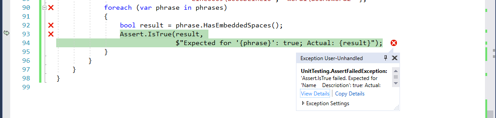
   ::: moniker-end

   In addition, all of the debugging tools that Visual Studio provides are available to help us troubleshoot our failed test, as the following illustration shows:

   ::: moniker range=">=vs-2022"
   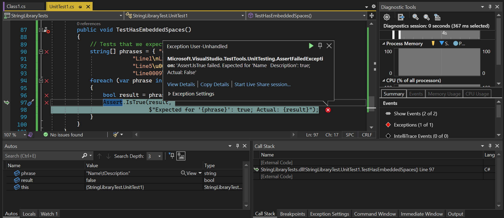
   ::: moniker-end
   ::: moniker range="<=vs-2019"
   
   ::: moniker-end

   Note in the **Autos** window that the value of the `phrase` variable is "Name\tDescription", which is the second element of the array. The test method expects `HasEmbeddedSpaces` to return `true` when it is passed this string; instead, it returns `false`. Evidently, it does not recognize "\t", the tab character, as an embedded space.

1. Select **Debug** > **Continue**, press **F5**, or click the **Continue** button on the toolbar to continue executing the test program. Because an unhandled exception occurred, the test terminates.
This provides enough information for a preliminary investigation of the bug. Either `TestHasEmbeddedSpaces` (the test routine) made an incorrect assumption, or `HasEmbeddedSpaces` does not correctly recognize all embedded spaces.

1. To diagnose and correct the problem, start with the `StringLibrary.HasEmbeddedSpaces` method. Look at the comparison in the `HasEmbeddedSpaces` method. It considers an embedded space to be U+0020. However, the Unicode Standard includes a number of other space characters. This suggests that the library code has incorrectly tested for a whitespace character.

1. Replace the equality comparison with a call to the <xref:System.Char.IsWhiteSpace%2A?displayProperty=fullName> method:

   :::code language="csharp" source="../test/samples/snippets/csharp/lut-start/program2.cs" id="Snippet1":::

1. Live Unit Testing automatically reruns the failed test method.

   Live Unit Testing shows the updated results appear, which also appear in the code editor window.

## Related content

- [Live Unit Testing in Visual Studio](live-unit-testing.md)
- [Live Unit Testing Frequently Asked Questions](live-unit-testing-faq.yml)
