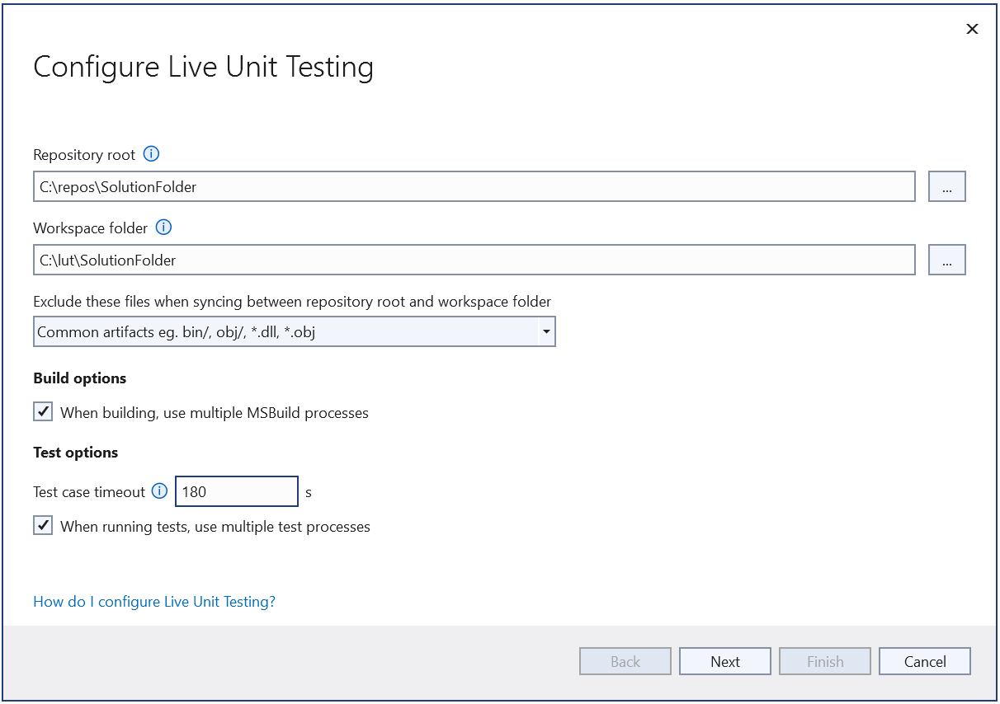
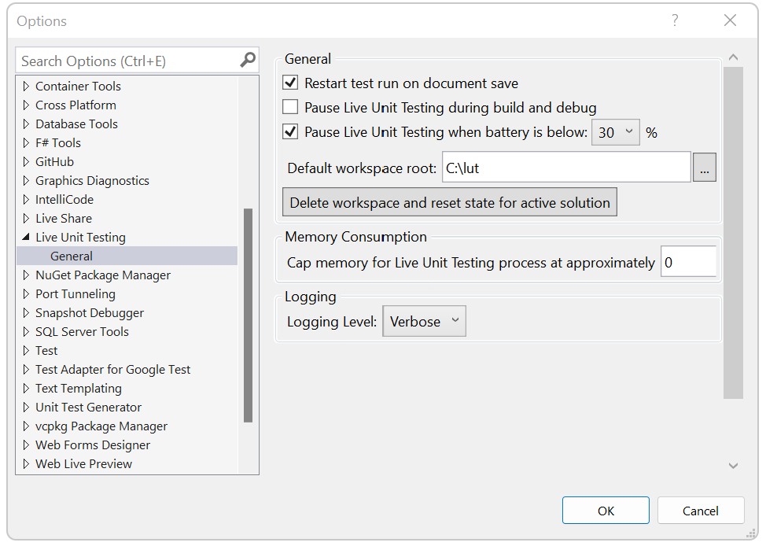
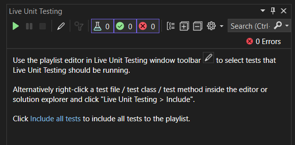
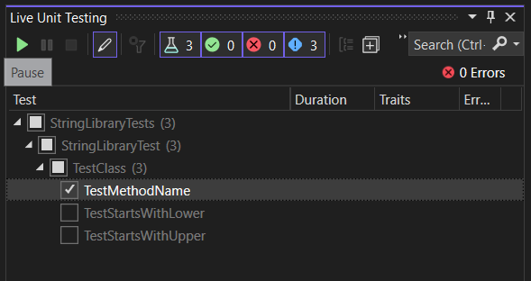
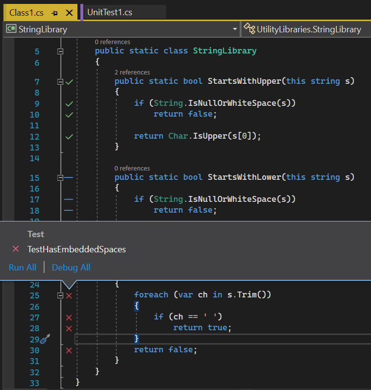
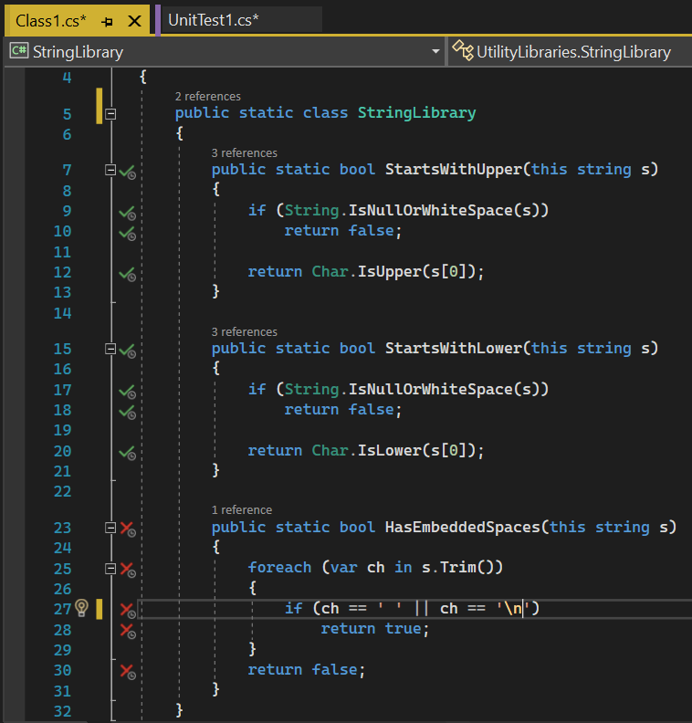
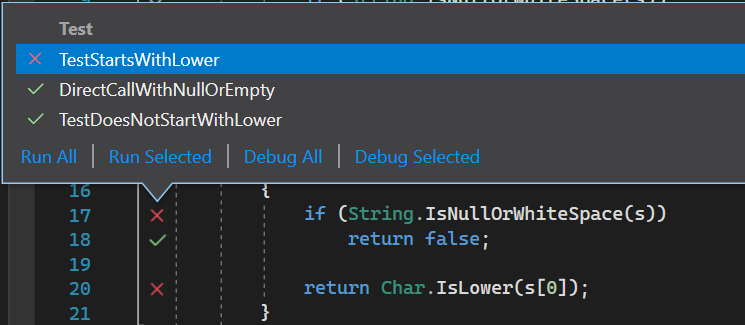
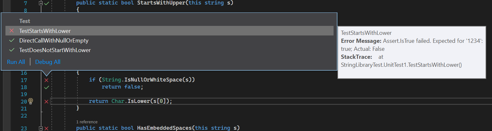
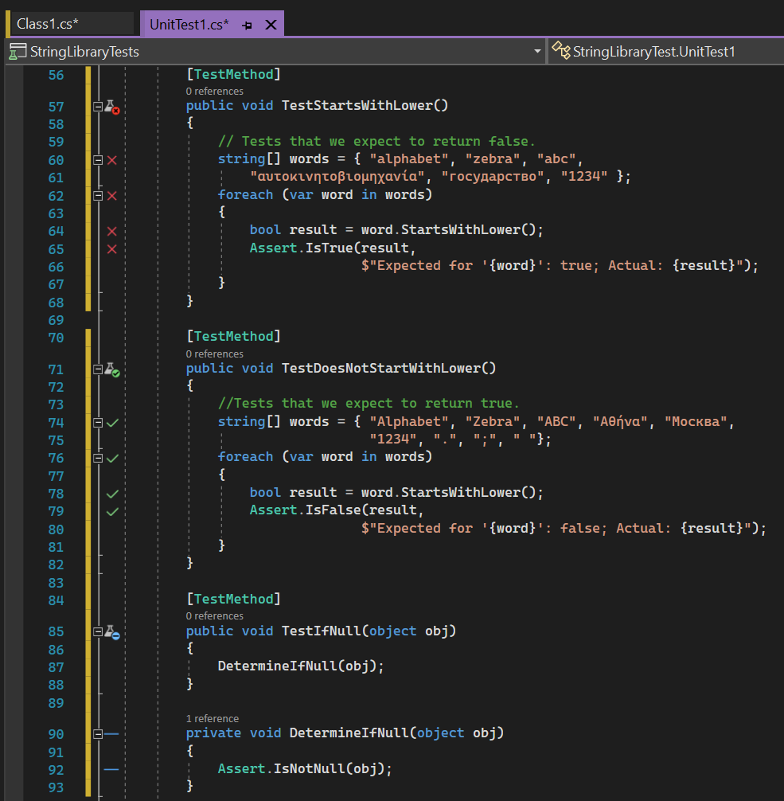
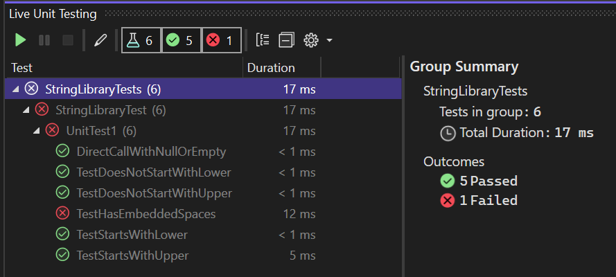

# Configure and use Live Unit Testing

While you develop an application, Live Unit Testing automatically runs any affected unit tests in the background and presents the results and code coverage in real time. When you modify your code, Live Unit Testing provides feedback on how your changes affected existing tests and whether the new code you added is covered by one or more existing tests. This feedback reminds you to write unit tests as you make bug fixes or add new features.

When you use Live Unit Testing for your tests, it persists data about the status of your tests. Using persisted data allows Live Unit Testing to offer superior performance while running your tests dynamically in response to code changes.

Live Unit Testing is available only in the Enterprise edition of Visual Studio for projects that target .NET Core or .NET Framework.

## Supported test frameworks

Live Unit Testing works with the three popular unit testing frameworks listed in the following table. The minimum supported version of their adapters and frameworks is also shown. The unit testing frameworks are all available from NuGet.org.

|Test framework  |Visual Studio adapter minimum version  |Framework minimum version  |
|---------|---------|---------|
|xUnit.net |xunit.runner.visualstudio version 2.2.0-beta3-build1187 |xunit 1.9.2 |
|NUnit |NUnit3TestAdapter version 3.5.1 |NUnit version 3.5.0 |
|MSTest |MSTest.TestAdapter 1.1.4-preview |MSTest.TestFramework 1.0.5-preview |

If you have older MSTest-based test projects that reference *Microsoft.VisualStudio.QualityTools.UnitTestFramework*, and you don't want to move to the newer MSTest NuGet packages, upgrade to Visual Studio 2019 or Visual Studio 2017.

In some cases, you might need to explicitly restore the NuGet packages referenced by a project for Live Unit Testing to work. You have two options:

- Restore by doing an explicit build of the solution. Select **Build** > **Rebuild Solution** on the top-level Visual Studio menu.
- Restore packages in the solution. Right-click the solution and select **Restore NuGet Packages**.

## Configure

The first time you start Live Unit Testing for a solution, a setup wizard lets you configure the way that Live Unit Testing should build and run tests.

When Live Unit Testing is stopped, you can also open the setup wizard by going to **Test** > **Live Unit Testing** > **Configure Live Unit Testing for solution**.

When Live Unit Testing runs, it creates a workspace, which is a copy of the original repository. Live Unit Testing then applies any unsaved changes that you made in Visual Studio to the workspace, performs a build, does a test run, and reports on the latest code coverage.

The first thing that you should configure by using the wizard is where the files should be copied from and where they should be copied to.



### Repository root
The repository root specifies the folder that will be copied to create the Live Unit Testing workspace. It should be the root folder of the repository, that is, it should contain all sources, binaries, and tools.
In cases where the solution file isn't present under the repository root, the repository root might need to be changed.

### Workspace root
The workspace root specifies the folder where Live Unit Testing keeps a clone of the repository. Watch out for exceptions indicating that the path is too long. By default, the root is created under your home folder. However, as an example, if you normally need to create your repository under drive C, the workspace root could be adjusted to something like *C:\lut\Repo*.

### Specify the excluded files
Not all the files should be copied to the Live Unit Testing workspace. Any artifacts that are generated during the build should be excluded from the copying so that the regular builds don't interfere with the Live Unit Testing builds. Also, the regular `nuget restore` command shouldn't interfere with the Live Unit Testing `nuget restore` command.

By default, Live Unit Testing excludes one of the two patterns of files:
- For Git repositories, files specified in the *gitignore* file aren't copied to the Live Unit Testing workspace.
- For non-Git repositories, a basic list of folders, such as *bin/* and *obj/*, aren't copied to the Live Unit Testing workspace.

For more complex repositories, you might need to specify your own ignore file. Select the "&lt;Custom&gt;" option from the wizard. After you select **Next**, the content of a custom ignore file that Live Unit Testing creates after you finish the wizard appears. It's the *lutignore* file.

> [!NOTE]
> A custom *lutignore* file is needed for some Git repositories because it's possible to check files into the Git repository that are also ignored by the *gitignore* file. Without a custom *lutignore* file, Live Unit Testing won't copy these files, which might lead to build failures.

#### Lutignore file structure

The *lutignore* file uses the same format as a *gitignore* file. It should contain rules that match the folders or files generated during the build so that they're not copied into the workspace. For most of the default project templates, the following ignore file is sufficient:

```
[Bb]in
[Oo]bj
# WILL NOT COPY ANY BIN AND OBJ FOLDERS TO THE LIVE UNIT TESTING WORKSPACE
```

If your repository has a single build folder, the ignore file should list that folder instead:

```
[Aa]rtifacts/
# WILL NOT COPY THE ARTIFACTS FOLDER TO THE LIVE UNIT TESTING WORKSPACE
```

If your repository includes some other tools in the build folder, these tools should be excluded in the set of matching patterns:

```
[Aa]rtifacts/
![Aa]rtifacts/tools/
# WILL NOT COPY THE ARTIFACTS FOLDER TO THE LIVE UNIT TESTING WORKSPACE
# HOWEVER IT WILL COPY THE TOOLS SUBFOLDER THAT MIGHT CONTAIN TOOLS AND UTILITIES
```

### Build options

The second part of the wizard configuration page is where you configure build options:

- **Generate PDBs**: To speed up the build, Live Unit Testing doesn't generate PDBs during builds. These symbol files allow you to go to the stack traces when test failures occur.
- **Build by using multiple CPU cores**: By default, Live Unit Testing performs builds by using multiple CPU cores, which improves build times. If your machine slows down or if your solution fails to be built by using multiple processors, don't select this option.

### Test run options

The last part of the wizard configuration page is where you set up the test run options:

- **Test case timeout**: Some of the tests might take a long time to run. Setting this field automatically aborts runs if any of the tests exceeds a specific time duration. The tests can be automatically canceled.
- **Use multiple processors**: By default, Live Unit Testing tries to use multiple processors to speed up the run performance. If your machine slows down or if your solution can't run tests in parallel, don't select this option. For example, these scenarios could happen if multiple tests try to write/read from the same file paths.

### More configuration

Configure Live Unit Testing by selecting **Tools** > **Options** on the top-level Visual Studio menu bar. On the left pane of the **Options** dialog, select **Live Unit Testing**.

After Live Unit Testing is enabled (see [Start, pause, and stop Live Unit Testing](#start-pause-and-stop)), you can also open the **Options** dialog by selecting **Test** > **Live Unit Testing** > **Options**.

The following image shows the Live Unit Testing configuration options available in the dialog.



The configurable options include:

- Whether Live Unit Testing pauses when a solution is built and debugged.
- Whether Live Unit Testing pauses when a system's battery power falls below a specified threshold.
- The ability to delete all persisted data. This capability is useful when Live Unit Testing is behaving in an unpredictable or unexpected way, which suggests that the persisted data is corrupt.
- The maximum amount of memory that Live Unit Testing processes can consume.
- The level of information written to the Live Unit Testing **Output** window.

   Options include no logging (**None**), error messages only (**Error**), error and informational messages (**Info**, the default), or all detail (**Verbose**).

   You can also display verbose output in the Live Unit Testing **Output** window by assigning a value of **1** to a user-level environment variable named `VS_UTE_DIAGNOSTICS`. Then restart Visual Studio.

   To capture detailed MSBuild log messages from Live Unit Testing in a file, set the `LiveUnitTesting_BuildLog` user-level environment variable to the name of the file to contain the log.

## Customize your build for Live Unit Testing

For more complex solutions, it might be necessary to further customize the build. For example, it might not be necessary to build translation files during test runs. To speed up your builds, you can disable the translation file build with Live Unit Testing. You can do that by manipulating the project files.

### Add Live Unit Testing overrides

If your solution requires custom steps to build for instrumentation (Live Unit Testing) that aren't required for the "regular" noninstrumented build, you can add code to your project or *.targets* files that checks for the `BuildingForLiveUnitTesting` property and performs custom pre/post build steps.

For example, you can write the following sample to add another target only executed for Live Unit Testing:

```xml
<Target Name="GenerateNuGetPackages" BeforeTargets="AfterBuild" Condition="'$(BuildingForLiveUnitTesting)' == 'true'">
    <Exec Command='"$(MSBuildThisFileDirectory)..\tools\GenPac" '/>
</Target>
```

You can use the `BuildingForLiveUnitTesting` property to disable some tasks that shouldn't be executed for test builds. For example, Live Unit Testing sets `<RunAnalyzers>false</RunAnalyzers>` to disable analyzers for tests.

### Live Unit Testing test dependencies

It's possible that not all the files were copied that are required for the tests to run. Live Unit Testing creates a separate folder where it runs tests. That arrangement allows builds to occur while the tests are running, but not all files from the build folder are copied to the test folder.

Typically, you add the test dependencies for one of two reasons:

- Your tests depend on files under the source tree. For example, the tests examine the contents of the *resx* files or maybe read some config files.
- Your tests depend on some libraries they reference. For example, a test runs an executable that's built as a dependency.

> [!Note]
> Test dependencies must exist within the directory specified as **Repository Root** in the setup wizard.

In both cases, Live Unit Testing by default won't copy these files for the purpose of minimizing the number of files that have to be copied to run a test. You need to explicitly specify these files by using the `LiveUnitTestingTestDependency` property if they're needed for a test run. For example, let's say that we have the following layout:

```
SRC/
  CONSOLE_UTILITY/
  TEST_PROJECT/
ARTIFACTS/
  CONSOLE_UTILITY/NET472/DEBUG/
  TEST_PROJECT/NET472/DEBUG/
```

By default, when you build these projects with Live Unit Testing, it only copies `Artifacts/Test_Project` to the test folder. To add sources or the console_utility to the test folder, add the following sample to `test_project.csproj`:

```
<LiveUnitTestingTestDependency Include=”$(RepoRoot)/Src/ConsoleUtility” />
<LiveUnitTestingTestDependency Include=”$(RepoRoot)/Artifacts/ConsoleUtility/net472/$(Configuration)/</LiveUnitTestingTestDependency” />
```

## Start, pause, and stop

To enable Live Unit Testing, select **Test** > **Live Unit Testing** > **Start** on the top-level Visual Studio menu. When Live Unit Testing is enabled, the options available on the **Live Unit Testing** menu change from a single item, **Start**, to **Pause** and **Stop**:

- **Pause** temporarily suspends Live Unit Testing.

  When Live Unit Testing is paused, coverage visualization doesn't appear in the editor, but all the data that was collected is preserved. To resume Live Unit Testing, select **Continue** on the **Live Unit Testing** menu. Live Unit Testing does the necessary work to catch up with all the edits that were made while it was paused and updates the glyphs appropriately.

- **Stop** completely stops Live Unit Testing. Live Unit Testing discards all data that it collected.

If you start Live Unit Testing in a solution that doesn't include a unit test project, the **Pause** and **Stop** options appear on the **Live Unit Testing** menu, but Live Unit Testing doesn't start. The **Output** window displays a message that begins, "No supported test adapters are referenced by this solution...".

At any time, you can temporarily pause or completely stop Live Unit Testing. You might want to take these actions, for example, if you're in the middle of refactoring and know that your tests will be broken for a while.

## Include and exclude test projects and test methods

When you start Live Unit Testing, the Live Unit Testing tool window appears and prompts you to select the set of tests that you want tested by Live Unit Testing.



For smaller solutions where the unit tests take very little time to run, select **Include all tests**, which makes Live Unit Testing run all tests.

For larger solutions with many test projects, you can control which projects and individual methods in a project participate in Live Unit Testing by editing the playlist. For example, if you have a solution with hundreds of test projects, you can select a targeted set of test projects to participate in Live Unit Testing.

You choose what Live Unit Testing should run by editing a Live Unit Testing playlist, a feature that works just like playlists in the **Test Explorer**.

There are multiple ways to edit the Live Unit Testing playlist:

- Live Unit Testing tool window
- The code editor window
- Solution Explorer
- Programmatically in test code

Live Unit Testing saves the include/exclude state as a user setting and remembers it when a solution is closed and reopened.

### Live Unit Testing tool window

You can use the playlist editor for the Live Unit Testing tab to include or exclude projects, namespaces, or classes from execution. Select **Edit playlist** in the tool window.

You can select or clear the tree view elements to include or exclude tests. For example, if you check a single test, Live Unit Testing runs it on changes. If you select a class, all tests in that class run and any new tests added to that class also run.



### The code editor window

You can use the code editor window to include or exclude individual test methods. Right-click the signature or body of the test method in the code editor window and select one of the following options:

- **Live Unit Testing** > **Include \<selected method>**
- **Live Unit Testing** > **Exclude \<selected method>**
- **Live Unit Testing** > **Exclude All But \<selected method>**

### Solution Explorer

To select the individual projects in unit tests, follow these steps after Live Unit Testing is started:

1. Right-click the solution in **Solution Explorer** and select **Live Unit Testing** > **Exclude** to exclude the entire solution.
1. Right-click each test project that you want to include in the tests and select **Live Unit Testing** > **Include**.

### Programmatically in test code

You can apply the <xref:System.Diagnostics.CodeAnalysis.ExcludeFromCodeCoverageAttribute> attribute to programmatically exclude methods, classes, or structures from reporting their coverage in Live Unit Testing.

Use the following attributes to exclude individual methods from Live Unit Testing:

- **xUnit**: `[Trait("Category", "SkipWhenLiveUnitTesting")]`
- **NUnit**: `[Category("SkipWhenLiveUnitTesting")]`
- **MSTest**: `[TestCategory("SkipWhenLiveUnitTesting")]`

Use the following attributes to exclude an entire assembly of tests from Live Unit Testing:

- **xUnit**: `[assembly: AssemblyTrait("Category", "SkipWhenLiveUnitTesting")]`
- **NUnit**: `[assembly: Category("SkipWhenLiveUnitTesting")]`
- **MSTest**: `[assembly: TestCategory("SkipWhenLiveUnitTesting")]`

## View coverage visualization

After Live Unit Testing is enabled, it updates each line of code in the Visual Studio editor to show you whether the code you're writing is covered by unit tests and whether the tests that cover it are passing.

The following image shows lines of code with passing and failing tests, and lines of code that aren't covered by tests. Lines with a green "✓" are covered only by passing tests. Lines with a red "x" are covered by one or more failing tests. Lines with a blue "➖" aren't covered by any test.



Live Unit Testing coverage visualization is updated immediately when you modify code in the code editor. While processing the edits, visualization changes to indicate that the data isn't up to date by adding a round timer image underneath the passed, failed, and not covered symbols, as the following image shows.



## Get information about test status

By hovering over the passed or failed symbol in the code window, you can see how many tests are hitting that line. To see the status of the individual tests, select the symbol.



In addition to providing the names and result of tests, the tooltip lets you rerun or debug the set of tests. If you select one or more of the tests in the tooltip, you can also run or debug only those tests. This action allows you to debug your tests without having to leave the code window.

When you're debugging, in addition to observing any breakpoints you might have already set, program execution pauses when the debugger executes an <xref:Microsoft.VisualStudio.TestTools.UnitTesting.Assert> method that returns an unexpected result.

When you hover over a failed test in the tooltip, it expands to provide more information about the failure, as shown in the following image. To go directly to a failed test, double-click it in the tooltip.



When you go to the failed test, Live Unit Testing visually indicates in the method signature the tests that have:

- **Passed** (indicated by a half-full beaker along with a green "✓").
- **Failed** (indicated by a half-full beaker along with a red "🞩").
- **Aren't involved in Live Unit Testing** (indicated by a half-full beaker along with a blue "➖").

Nontest methods aren't identified with a symbol. The following image illustrates all four types of methods.



## Diagnose and correct test failures

From the failed test, you can easily debug the product code, make edits, and continue developing your application. Because Live Unit Testing runs in the background, you don't have to stop and restart Live Unit Testing during the debug, edit, and continue cycle.

For example, the test failure shown in the previous image was caused by an incorrect assumption in the test method that nonalphabetic characters return `true` when passed to the <xref:System.Char.IsLower%2A?displayProperty=fullName> method. After you correct the test method, all the tests should pass. You don't have to pause or stop Live Unit Testing.

## Live Unit Testing window

**Live Unit Testing**, similar to **Test Explorer**, provides an interface that lets you run and debug tests and analyze test results. When Live Unit Testing is enabled, the status of unit tests in **Test Explorer** is updated immediately. You don't need to explicitly run the unit tests.

When Live Unit Testing isn't enabled or is stopped, **Live Unit Testing** displays the status of unit tests the last time a test was run. After you restart Live Unit Testing, a source code change is required to rerun the tests.

You can start Live Unit Testing by selecting **Test** > **Live Unit Testing** > **Start** on the top-level Visual Studio menu. You can also open the **Live Unit Testing** window by using **View** > **Other Windows** > **Live Unit Testing Window**.

You might notice in the **Live Unit Testing** window that some tests are faded out. For example, when you stop and restart Live Unit Testing, the **Live Unit Testing** window fades out all the tests, as the following image shows.

Faded-out test results indicate that the test wasn't a part of the latest Live Unit Test run. Tests only run when a change to the test or the test's dependencies is detected. If there's no change, it avoids unnecessarily running the test. In this case, the grayed-out test result is still "up to date," although it wasn't a part of the latest run.



You can rerun any tests that appear faded by making a code change.

There are some differences between Live Unit Testing automatically running and updating test results and explicitly running tests from **Test Explorer**. These differences include:

- Running or debugging tests from the **Test Explorer** window runs regular binaries. Live Unit Testing runs instrumented binaries.
- Live Unit Testing doesn't create a new application domain to run tests. Instead, it runs tests from the default domain. Tests run from the **Test Explorer** window do create a new application domain.
- Live Unit Testing runs tests in each test assembly sequentially. In the **Test Explorer** window, you can choose to run multiple tests in parallel.

## Cancel Live Unit Testing test runs

Live Unit Testing keeps running tests whenever you make any code changes. If a run is in progress and you make more code changes, Live Unit Testing queues another run while it waits for the first run to complete.

Whenever you save files, Live Unit Testing cancels the first run and immediately schedules the queued run instead. This process helps with scenarios where the first run would have taken a long time to complete.

## See also

- [Code testing tools](https://visualstudio.microsoft.com/vs/testing-tools/)
- [Live Unit Testing blog](https://devblogs.microsoft.com/visualstudio/live-unit-testing-in-visual-studio-2017-enterprise/)
- [Live Unit Testing FAQ](live-unit-testing-faq.yml)
