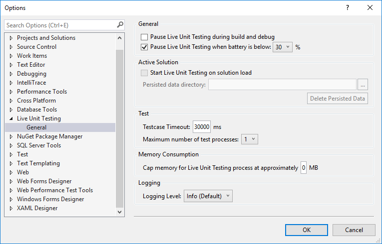
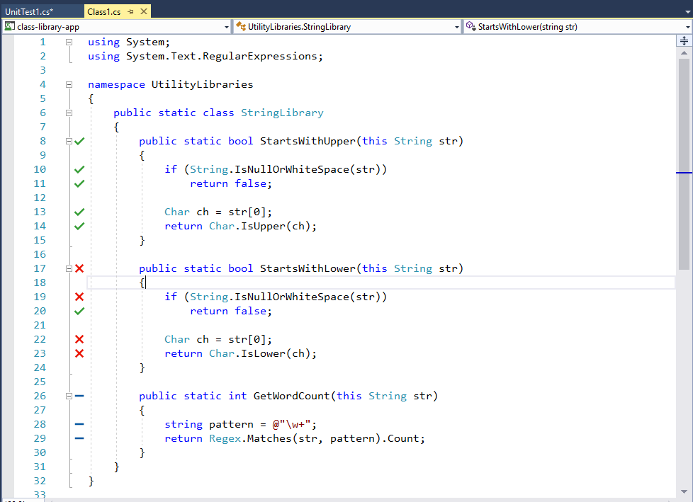
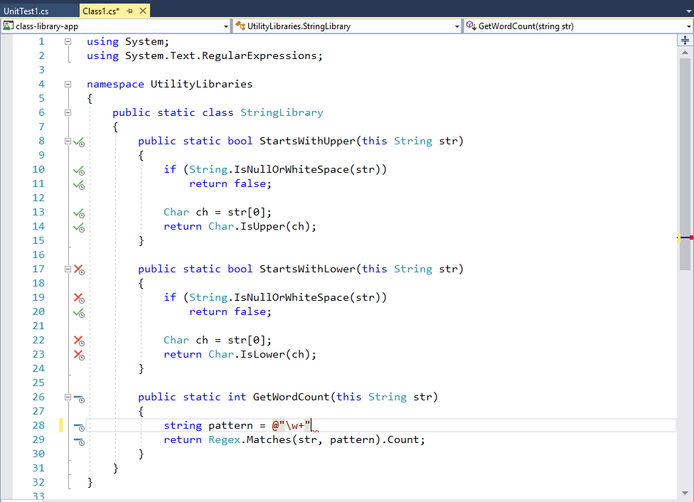
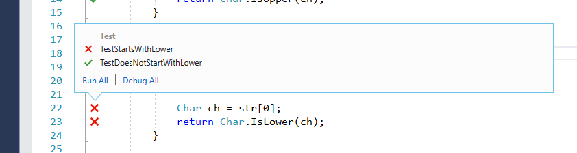
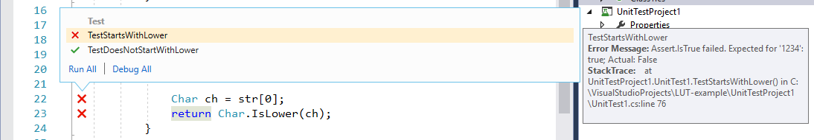
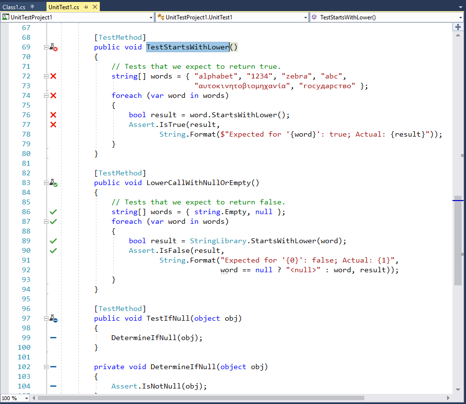
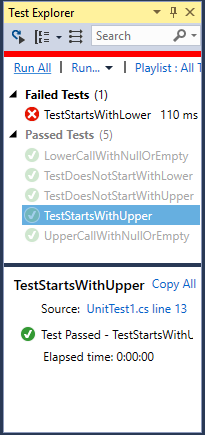
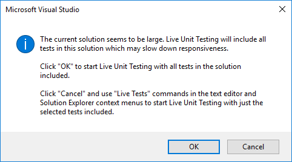

# Live Unit Testing with Visual Studio

As you are developing an application, Live Unit Testing automatically runs any impacted unit tests in the background and presents the results and code coverage live in the Visual Studio IDE in real time. As you modify your code, Live Unit Testing provides feedback on how your changes impacted existing tests and whether the new code you've added is covered by one or more existing tests. This will gently remind you to write unit tests as you are making bug fixes or adding new features.

> [!NOTE]
> Live Unit Testing is available for C# and Visual Basic projects that target the .NET Core or .NET Framework in the Enterprise Edition of Visual Studio.

When you use Live Unit Testing for your tests, Live Unit Testing persists data about the status of your tests. Its ability to use persisted data allows Live Unit Testing to offer superior performance while running your tests dynamically in response to code changes.

## Supported test frameworks
Live Unit Testing works with the three popular unit testing frameworks listed in the following table. The minimum supported version of their adapters and frameworks is also listed in the table. The unit testing frameworks are all available from NuGet.org.

|Test Framework  |Visual Studio Adapter minimum version  |Framework minimum version  |
|---------|---------|---------|
|xUnit.net |xunit.runner.visualstudio version 2.2.0-beta3-build1187 |xunit 1.9.2 |
|NUnit |NUnit3TestAdapter version 3.5.1 |NUnit version 3.5.0 |
|MSTest |MSTest.TestAdapter 1.1.4-preview |MSTest.TestFramework 1.0.5-preview |

If you have older MSTest based test projects that are referencing `Microsoft.VisualStudio.QualityTools.UnitTestFramework` and you don’t wish to move to the newer MSTest NuGet packages, upgrade to Visual Studio 2017 version 15.4 or later.

In some cases, you may need to explicitly restore the NuGet packages referenced by the projects in the solution in order for Live Unit Testing to work. You can do this either by doing an explicit build of the solution (select **Build** > **Rebuild Solution** from the top-level Visual Studio menu) or by restoring packages in the solution (right-click on the solution and select **Restore NuGet Packages**) before enabling Living Unit Testing.

## Configure Live Unit Testing

You can configure Live Unit Testing by selecting **Tools** > **Options** from the top-level Visual Studio menu bar, and then selecting **Live Unit Testing** in the left pane of the **Options** dialog.

> [!TIP]
> Once Live Unit Testing is enabled (see the next section, [Start, pause, and stop Live Unit Testing](#start-pause-and-stop-live-unit-testing)), you can also open the **Options** dialog by selecting **Test** > **Live Unit Testing** > **Options**.

The following figure shows the Live Unit Testing configuration options available in the dialog:

  

The configurable options include:

- Whether Live Unit Testing pauses when a solution is built and debugged.

- Whether Live Unit Testing pauses when a system's battery power falls below a specified threshold.

- Whether Live Unit Testing runs automatically when a solution is opened.

- Whether to enable debug symbol and XML documentation comment generation.

- The directory in which to store persisted data.

- The ability to delete all persisted data. This is useful when Live Unit Testing is behaving in unpredictable or unexpected ways, which suggests that the persisted data has become corrupted.

- The interval after which a test case times out; the default is 30 seconds.

- The maximum number of test processes that Live Unit Testing creates.

- The maximum amount of memory that Live Unit Testing processes can consume.

- The level of information written to the Live Unit Testing **Output** window.

   Options include no logging (**None**), error messages only (**Error**), error and informational messages (**Info**, the default), or all detail (**Verbose**).

   You can also display verbose output in the Live Unit Testing **Output** window by assigning a value of "1" to a user-level environment variable named `VS_UTE_DIAGNOSTICS`, and then restarting Visual Studio.

   To capture detailed MSBuild log messages from Live Unit Testing in a file, set the `LiveUnitTesting_BuildLog` user-level environment variable to the name of the file to contain the log.

## Start, pause, and stop Live Unit Testing

You enable Live Unit Testing by selecting **Test** > **Live Unit Testing** > **Start** from the top-level Visual Studio menu. When Live Unit Testing is enabled, the options available on the **Live Unit Testing** menu change from a single item, **Start**, to **Pause**, **Stop**, and **Reset Clean**.

> [!NOTE]
> If you start Live Unit Testing in a solution that does not include a unit test project, the **Pause**, **Stop**, and **Reset Clean** options appear on the **Live Unit Testing** menu, but Live Unit Testing does not start. The **Output** window displays a message that begins, "No supported test adapters are referenced by this solution..."

At any time, you can temporarily pause or completely stop Live Unit Testing. You may want to do this, for example, if you are in the middle of a refactoring and know that your tests will be broken for a while. The three menu options are:

- **Pause**, which temporarily suspends Live Unit Testing.

    When Live Unit Testing is paused, your coverage visualization does not appear in the editor, but all the data that was collected is preserved. To resume Live Unit Testing, select **Continue** from the Live Unit Testing menu. Live Unit Testing does the necessary work to catch up with all the edits that have been made while it was paused, and updates the glyphs appropriately.

- **Stop**, to completely stop Live Unit Testing. Live Unit Testing discards all data that it has collected.

- **Reset Clean**, which stops Live Unit Testing, deletes persisted data, and restarts Live Unit Testing.

- **Options**, which opens the **Options** dialog described in the [Configure Live Unit Testing](#configure-live-unit-testing) section.

## View coverage visualization in the editor as you type

Once enabled, Live Unit Testing updates each line of code in the Visual Studio editor to show you whether the code you're writing is covered by unit tests and whether the tests that cover it are passing.  The following figure shows lines of code with both passing and failing tests, as well as lines of code that are not covered by tests. Lines decorated with a green "✓" are covered only by passing tests, lines decorated with a red "x" are covered by one or more failing tests, and lines decorated by a blue  "➖" are not covered by any test.

  

Live Unit Testing coverage visualization is updated immediately as you modify code in the code editor. While processing the edits, visualization changes to indicate that the data is not up-to-date by adding a round timer image below the passing, failing, and not covered symbols, as the following figure shows.

  

## Get information on successful or failed tests

By hovering over the succeeded or failed symbol in the code window, you can see how many tests are hitting that line. If you click on the symbol, you can see the status of the individual tests, as the following figure shows:

  

In addition to providing the names and result of tests, the tooltip lets you re-run the set of tests, as well as run the set of tests using the debugger. If you select one or more of the tests in the tooltip, you can also run or debug just those tests. This allows you to debug your tests without having to leave the code window. When debugging, in addition to observing any breakpoints you may have already set, program execution pauses when the debugger executes an [`Assert`](/dotnet/api/microsoft.visualstudio.testtools.unittesting.assert) method that returns an unexpected result.

When you hover over a failed test in the tooltip, it expands to provide additional info about the failure, as shown in the following image. If you double-click on the failed test in the tooltip, you can navigate directly to it.

  

When you navigate to the failed test, Live Unit Testing also visually indicates in the method signature the tests that have passed (indicated by a half-full beaker along with a green "✓"), failed (a half-full beaker along with a red  "🞩"), or are not involved in Live Unit Testing (a half-full beaker along with a blue  "➖"). Non-test methods are not decorated with a symbol. The following figure illustrates all four types of methods.

  

## Diagnose and correct test failures

From the failed test, you can easily debug to the product code, make edits, and continue developing your application. Because Live Unit Testing runs in the background, you do not have to stop and restart Live Unit Testing during the debug, edit, and continue cycle.

For example, the test failure shown in the previous figure was caused by an incorrect assumption in the test method that non-alphabetic characters return `true` when passed to the <xref:System.Char.IsLower%2A?displayProperty=fullName> method. Once we correct the test method, we find that all tests pass. While we are doing this, we do not have to pause or stop Live Unit Testing.

## Live Unit Testing and Test Explorer

Ordinarily, **Test Explorer** provides the interface that lets you run, debug, and analyze your test results. Live Unit Testing integrates with **Test Explorer**. When Live Unit Testing is not enabled or is stopped, **Test Explorer** displays the status of unit tests the last time a test was run. Source code changes require that you rerun the tests. In contrast, when Live Unit Testing is enabled, the status of unit tests in **Test Explorer** is updated immediately. You no longer need to explicitly run your unit tests.

> [!NOTE]
> You can open **Test Explorer** by selecting **Test** > **Windows** > **Test Explorer** from the top-level Visual Studio menu.

You may notice in the **Test Explorer** window that some tests are faded out.
For example, when you enable Live Unit Testing after opening a previously saved project, the **Test Explorer** window had faded out all but the failed test, as the following figure shows. In this case, Live Unit Testing has rerun the failed test, but it has not rerun the successful tests, since Live Unit Testing's persisted data indicates that there were no changes since the tests were last run successfully.

  

You can rerun any tests that appear faded by selecting the **Run All** or **Run** options from the **Test Explorer** menu, or by selecting one or more tests in the  **Test Explorer** menu, right-clicking, and selecting **Run Selected Tests** or **Debug Selected Tests** from the popup menu. As tests are run, they bubble up the top.

There are some differences between Live Unit Testing automatically running and updating test results and explicitly running tests from **Test Explorer**. These differences include:

- Running or debugging tests from the Test Explorer window runs regular binaries, whereas Live Unit Testing runs instrumented binaries.
- Live Unit Testing does not create a new application domain to run tests, but rather runs tests from the default domain. Tests run from the **Test Explorer** window do create a new application domain.
- Live Unit Testing runs tests in each test assembly sequentially. If you run multiple tests from the **Test Explorer** window and the **Run Tests in Parallel** button is selected, tests run in parallel.

## Live Unit Testing and large solutions

If your solution has 10 or more projects, when you start Live Unit Testing and there is no persisted data, or when you select the **Test** > **Live Unit Testing** > **Reset Clean** option from the top-level Visual Studio menu, Visual Studio displays the following dialog to warn you that dynamic execution of large numbers of tests in large projects can severely impact performance. If you select **OK**, Live Unit Testing executes all tests in the solution. If you select **Cancel**, you can select the tests to execute. For information on how to do this, see the following section, [Include and exclude test projects and test methods](#include-and-exclude-test-projects-and-test-methods).

 

## Include and exclude test projects and test methods

For solutions with many test projects, you can control what projects and what individual methods in a project participate in Live Unit Testing. For example, if you have a solution with hundreds of test projects, you can select a targeted set of test projects to participate in Live Unit Testing. There are a number of ways to do this, depending on whether you want to exclude all the tests in the project or solution, whether you want to include or exclude most tests, or whether you want to exclude tests individually. Live Unit Testing saves include/exclude state as a user setting and remembers it when a solution is closed and reopened.

**Excluding all tests in a project or solution**

To select the individual projects in unit tests, do the following after Live Unit Testing is started:

1. Right-click the solution in **Solution Explorer** and choose **Live Tests** > **Exclude** to exclude the entire solution.
1. Right-click each test project that you'd like to include in the tests and choose **Live Tests** > **Include**.

**Excluding individual tests from the code editor window**

You can use the code editor window to include or exclude individual test methods. Right-click on the signature of the test method in the code editor window, and select **Live Tests** > **Include [the selected method]**, **Live Tests** > **Exclude [the selected method]**, or **Live Tests** > **Exclude All But [the selected method]**, where "the selected method" is the name of the method you've selected in the code window.

**Excluding tests programmatically**

You can apply the <xref:System.Diagnostics.CodeAnalysis.ExcludeFromCodeCoverageAttribute> attribute to programmatically exclude methods, classes, or structures from reporting their coverage in Live Unit Testing.

You can also use the following attributes to exclude individual methods from Live Unit Testing:

- For xUnit: `[Trait("Category", "SkipWhenLiveUnitTesting")]`
- For NUnit: `[Category("SkipWhenLiveUnitTesting")]`
- For MSTest: `[TestCategory("SkipWhenLiveUnitTesting")]`

## See also

- [Code testing tools](https://visualstudio.microsoft.com/vs/testing-tools/)
- [Live Unit Testing blog](https://go.microsoft.com/fwlink/?linkid=842514)
- [Live Unit Testing FAQ](live-unit-testing-faq.md)
- [Channel 9 video: Live Unit Testing in Visual Studio](https://channel9.msdn.com/Events/Visual-Studio/Visual-Studio-2017-Launch/T105)
