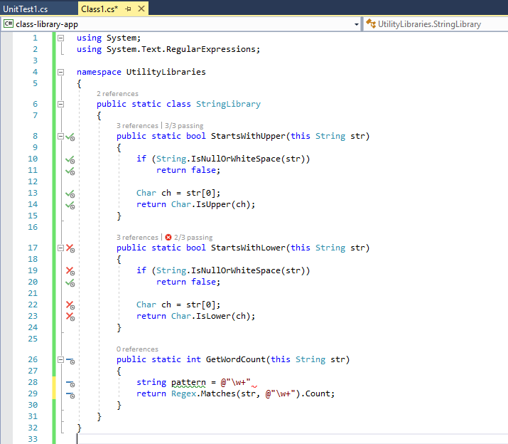
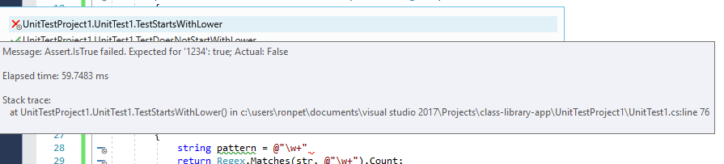

# How to configure and use Live Unit Testing

 [!INCLUDE [Visual Studio](~/includes/applies-to-version/vs-windows-only.md)]

As you're developing an application, Live Unit Testing automatically runs any impacted unit tests in the background and presents the results and code coverage in real time. As you modify your code, Live Unit Testing provides feedback on how your changes impacted existing tests and whether the new code you've added is covered by one or more existing tests. This gently reminds you to write unit tests as you're making bug fixes or adding new features.

> [!NOTE]
> Live Unit Testing is available for C# and Visual Basic projects that target .NET Core or .NET Framework in the Enterprise edition of Visual Studio.

When you use Live Unit Testing for your tests, it persists data about the status of your tests. Using persisted data allows Live Unit Testing to offer superior performance while running your tests dynamically in response to code changes.

## Supported test frameworks

Live Unit Testing works with the three popular unit testing frameworks listed in the following table. The minimum supported version of their adapters and frameworks is also shown. The unit testing frameworks are all available from NuGet.org.

|Test Framework  |Visual Studio Adapter minimum version  |Framework minimum version  |
|---------|---------|---------|
|xUnit.net |xunit.runner.visualstudio version 2.2.0-beta3-build1187 |xunit 1.9.2 |
|NUnit |NUnit3TestAdapter version 3.5.1 |NUnit version 3.5.0 |
|MSTest |MSTest.TestAdapter 1.1.4-preview |MSTest.TestFramework 1.0.5-preview |

If you have older MSTest-based test projects that reference Microsoft.VisualStudio.QualityTools.UnitTestFramework, and you don’t wish to move to the newer MSTest NuGet packages, upgrade to Visual Studio 2019 or Visual Studio 2017.

In some cases, you may need to explicitly restore the NuGet packages referenced by a project in order for Live Unit Testing to work. You can do this either by doing an explicit build of the solution (select **Build** > **Rebuild Solution** from the top-level Visual Studio menu) or by restoring packages in the solution (right-click on the solution and select **Restore NuGet Packages**).

## Configure

Configure Live Unit Testing by selecting **Tools** > **Options** from the top-level Visual Studio menu bar, and then selecting **Live Unit Testing** in the left pane of the **Options** dialog.

> [!TIP]
> After Live Unit Testing is enabled (see the next section, [Start, pause, and stop Live Unit Testing](#start-pause-and-stop)), you can also open the **Options** dialog by selecting **Test** > **Live Unit Testing** > **Options**.

The following image shows the Live Unit Testing configuration options available in the dialog:

The configurable options include:

- Whether Live Unit Testing pauses when a solution is built and debugged.

- Whether Live Unit Testing pauses when a system's battery power falls below a specified threshold.

- Whether Live Unit Testing runs automatically when a solution is opened.

- Whether to enable debug symbol and XML documentation comment generation.

- The directory in which to store persisted data.

- The ability to delete all persisted data. This is useful when Live Unit Testing is behaving in an unpredictable or unexpected way, which suggests that the persisted data has become corrupted.

- The interval after which a test case times out. The default is 30 seconds.

- The maximum number of test processes that Live Unit Testing creates.

- The maximum amount of memory that Live Unit Testing processes can consume.

- The level of information written to the Live Unit Testing **Output** window.

   Options include no logging (**None**), error messages only (**Error**), error and informational messages (**Info**, the default), or all detail (**Verbose**).

   You can also display verbose output in the Live Unit Testing **Output** window by assigning a value of "1" to a user-level environment variable named `VS_UTE_DIAGNOSTICS`, and then restarting Visual Studio.

   To capture detailed MSBuild log messages from Live Unit Testing in a file, set the `LiveUnitTesting_BuildLog` user-level environment variable to the name of the file to contain the log.

## Start, pause, and stop

To enable Live Unit Testing, select **Test** > **Live Unit Testing** > **Start** from the top-level Visual Studio menu. When Live Unit Testing is enabled, the options available on the **Live Unit Testing** menu change from a single item, **Start**, to **Pause** and **Stop**:

- **Pause** temporarily suspends Live Unit Testing.

  When Live Unit Testing is paused, coverage visualization does not appear in the editor, but all the data that was collected is preserved. To resume Live Unit Testing, select **Continue** from the Live Unit Testing menu. Live Unit Testing does the necessary work to catch up with all the edits that have been made while it was paused and updates the glyphs appropriately.

- **Stop** completely stops Live Unit Testing. Live Unit Testing discards all data that it has collected.

> [!NOTE]
> If you start Live Unit Testing in a solution that does not include a unit test project, the **Pause** and **Stop** options appear on the **Live Unit Testing** menu, but Live Unit Testing does not start. The **Output** window displays a message that begins, "No supported test adapters are referenced by this solution...".

At any time, you can temporarily pause or completely stop Live Unit Testing. You may want to do this, for example, if you're in the middle of a refactoring and know that your tests will be broken for a while.

## View coverage visualization

After it's enabled, Live Unit Testing updates each line of code in the Visual Studio editor to show you whether the code you're writing is covered by unit tests and whether the tests that cover it are passing. The following image shows lines of code with both passing and failing tests, as well as lines of code that are not covered by tests. Lines decorated with a green "✓" are covered only by passing tests, lines decorated with a red "x" are covered by one or more failing tests, and lines decorated by a blue  "➖" are not covered by any test.

::: moniker range="<=vs-2019"

::: moniker-end
::: moniker range=">=vs-2022"

::: moniker-end

Live Unit Testing coverage visualization is updated immediately when you modify code in the code editor. While processing the edits, visualization changes to indicate that the data is not up-to-date by adding a round timer image below the passing, failing, and not covered symbols, as the following image shows.

::: moniker range="<=vs-2019"

::: moniker-end
::: moniker range=">=vs-2022"

::: moniker-end

## Get information about test status

By hovering over the succeeded or failed symbol in the code window, you can see how many tests are hitting that line. To see the status of the individual tests, select the symbol:

::: moniker range="<=vs-2019"

::: moniker-end
::: moniker range=">=vs-2022"

::: moniker-end

In addition to providing the names and result of tests, the tooltip lets you rerun or debug the set of tests. If you select one or more of the tests in the tooltip, you can also run or debug just those tests. This allows you to debug your tests without having to leave the code window. When debugging, in addition to observing any breakpoints you may have already set, program execution pauses when the debugger executes an <xref:Microsoft.VisualStudio.TestTools.UnitTesting.Assert> method that returns an unexpected result.

When you hover over a failed test in the tooltip, it expands to provide additional info about the failure, as shown in the following image. To navigate directly to a failed test, double-click it in the tooltip.

::: moniker range="<=vs-2019"

::: moniker-end
::: moniker range=">=vs-2022"

::: moniker-end

When you navigate to the failed test, Live Unit Testing visually indicates in the method signature the tests that have:

- passed (indicated by a half-full beaker along with a green "✓")
- failed (a half-full beaker along with a red  "🞩")
- are not involved in Live Unit Testing (a half-full beaker along with a blue  "➖")

Non-test methods are not decorated with a symbol. The following image illustrates all four types of methods.

::: moniker range="<=vs-2019"

::: moniker-end
::: moniker range=">=vs-2022"

::: moniker-end

## Diagnose and correct test failures

From the failed test, you can easily debug the product code, make edits, and continue developing your application. Because Live Unit Testing runs in the background, you don't have to stop and restart Live Unit Testing during the debug, edit, and continue cycle.

For example, the test failure shown in the previous image was caused by an incorrect assumption in the test method that non-alphabetic characters return `true` when passed to the <xref:System.Char.IsLower%2A?displayProperty=fullName> method. After you correct the test method, all the tests should pass. You don't have to pause or stop Live Unit Testing.

## Live Unit Testing window

**Live Unit Testing**, similar to **Test Explorer**, provides an interface that lets you run and debug tests and analyze test results. When Live Unit Testing is enabled, the status of unit tests in **Test Explorer** is updated immediately. You don't need to explicitly run the unit tests. When Live Unit Testing is not enabled or is stopped, **Live Unit Testing** displays the status of unit tests the last time a test was run. After you restart Live Unit Testing, a source code change is required to rerun the tests.

> [!TIP]
> Start Live Unit Testing by selecting **Test** > **Live Unit Testing** > **Start** from the top-level Visual Studio menu. You can also open the **Live Unit Testing** window using **View** > **Other Windows** > **Live Unit Testing Window**.

You may notice in the **Live Unit Testing** window that some tests are faded out. For example, when you stop and restart Live Unit Testing, the **Live Unit Testing** window fades out all the tests, as the following image shows. Faded-out test results indicate that the test was not a part of the latest Live Unit Test run. Tests only run when a change to the test or the test's dependencies is detected. If there is no change, it avoids unnecessarily running the test. In this case, the grayed out test result is still "up-to-date" though it was not a part of the latest run.

::: moniker range="vs-2019"

::: moniker-end
::: moniker range=">=vs-2022"

::: moniker-end

You can rerun any tests that appear faded by making a code change.

There are some differences between Live Unit Testing automatically running and updating test results and explicitly running tests from **Test Explorer**. These differences include:

- Running or debugging tests from the Test Explorer window runs regular binaries, whereas Live Unit Testing runs instrumented binaries.
- Live Unit Testing does not create a new application domain to run tests, but rather runs tests from the default domain. Tests run from the **Test Explorer** window do create a new application domain.
- Live Unit Testing runs tests in each test assembly sequentially. In the **Test Explorer** window, you can choose to run multiple tests in parallel.

## Large solutions

If your solution has 10 or more projects, Visual Studio displays the following dialog when you:

- start Live Unit Testing and there is no persisted data
- select **Tools** > **Options** > **Live Unit Testing** > **Delete Persisted Data**

The dialog warns you that dynamic execution of large numbers of tests in large projects can severely impact performance. If you select **OK**, Live Unit Testing executes all tests in the solution. If you select **Cancel**, you can select the tests to execute. The following section explains how to do this.

## Include and exclude test projects and test methods

For solutions with many test projects, you can control which projects and individual methods in a project participate in Live Unit Testing. For example, if you have a solution with hundreds of test projects, you can select a targeted set of test projects to participate in Live Unit Testing. There are a number of ways to do this, depending on whether you want to exclude all the tests in the project or solution, include or exclude most tests, or exclude individual tests. Live Unit Testing saves include/exclude state as a user setting and remembers it when a solution is closed and reopened.

### Exclude all tests in a project or solution

To select the individual projects in unit tests, do the following after Live Unit Testing is started:

1. Right-click the solution in **Solution Explorer** and choose **Live Unit Testing** > **Exclude** to exclude the entire solution.
1. Right-click each test project that you'd like to include in the tests and choose **Live Unit Testing** > **Include**.

### Exclude individual tests from the code editor window

You can use the code editor window to include or exclude individual test methods. Right-click on the signature of the test method in the code editor window, and then select one of the following options:

- **Live Unit Testing** > **Include \<selected method>**
- **Live Unit Testing** > **Exclude \<selected method>**
- **Live Unit Testing** > **Exclude All But \<selected method>**

### Exclude tests programmatically

You can apply the <xref:System.Diagnostics.CodeAnalysis.ExcludeFromCodeCoverageAttribute> attribute to programmatically exclude methods, classes, or structures from reporting their coverage in Live Unit Testing.

Use the following attributes to exclude individual methods from Live Unit Testing:

- For xUnit: `[Trait("Category", "SkipWhenLiveUnitTesting")]`
- For NUnit: `[Category("SkipWhenLiveUnitTesting")]`
- For MSTest: `[TestCategory("SkipWhenLiveUnitTesting")]`

Use the following attributes to exclude an entire assembly of tests from Live Unit Testing:

- For xUnit: `[assembly: AssemblyTrait("Category", "SkipWhenLiveUnitTesting")]`
- For NUnit: `[assembly: Category("SkipWhenLiveUnitTesting")]`
- For MSTest: `[assembly: TestCategory("SkipWhenLiveUnitTesting")]`

## See also

- [Code testing tools](https://visualstudio.microsoft.com/vs/testing-tools/)
- [Live Unit Testing blog](https://devblogs.microsoft.com/visualstudio/live-unit-testing-in-visual-studio-2017-enterprise/)
- [Live Unit Testing FAQ](live-unit-testing-faq.yml)

