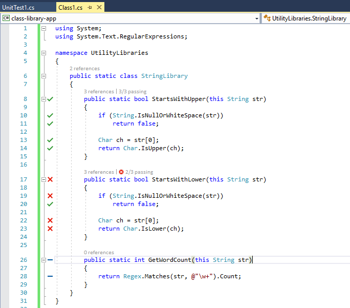
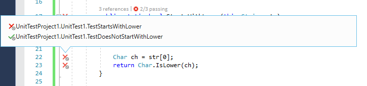

# Live Unit Testing with Visual Studio 2017

As you are developing an application, Live Unit Testing automatically runs any impacted unit tests in the background and presents the results and code coverage live in the Visual Studio IDE in real-time. As you modify your code, Live Unit Testing provides feedback on how your changes impacted existing tests and whether the new code you've added is covered by one or more existing tests. This will gently remind you to write unit tests as you are making bug fixes or adding new features.

> [!NOTE]
> Live Unit Testing is available in the for C# and Visual Basic projects that target the .NET Framework in the Enterprise Edition of Visual Studio 2017. Currently, it is not available with .NET Core.

## Supported test frameworks

Live Unit Testing works with the three popular unit testing frameworks listed in the following table. The minimum supported version of their adapters and frameworks is also listed in the table. The unit testing frameworks are all available from NuGet.org.
 
<table> 
<tr>
   <th>Test Framework</th>
   <th>Visual Studio Adapter minimum version</th>
   <th>Framework minimum version</th>
</tr>
<tr>
   <td>xUnit.net</td>
   <td> xunit.runner.visualstudio version 2.2.0-beta3-build1187</td>
   <td>xunit 2.0</td> 
</tr>
<tr>
   <td>NUnit</td>
   <td>NUnit3TestAdapter version 3.5.1</td>  
   <td>NUnit version 3.5.0</td>
</tr>
<tr>
   <td>MSTest</td>
   <td>MSTest.TestAdapter 1.1.4-preview</td>
   <td>MSTest.TestFramework 1.0.5-preview</td>
</tr>
</table>

If you have older adapter and test framework references from your existing projects, be sure to remove them. (Make sure you remove the reference to `Microsoft.VisualStudio.QualityTools.UnitTestFramework`, if you are using MSTest.) Add the new ones if Live Unit Testing is not working for you. 

In some cases, you may need to explicitly restore the NuGet packages referenced by the projects in the solution in order for Live Unit Testing to work. You can do this either by doing an explicit build of the solution (select **Build**, **Rebuild Solution** from the top-level Visual Studio menu) or by restoring packages in the solution (right-click on the solution and select **Restore NuGet Packages**) before enabling Living Unit Testing. 

#	Configuring Live Unit Testing

You can configure Live Unit Testing by selecting **Tools**, **Options** from the top-level Visual Studio menu, and then selecting **Live Unit Testing** in the left pane of the **Options** dialog. The following figure shows the Live Unit Testing configuration options available in the dialog.

  

The configurable options include:

- Whether Live Unit Testing runs automatically when a solution is opened.
- Whether Live Unit Testing pauses when a solution is built and debugged, or when a system's battery power falls below a specified threshold.
- The interval after which a test case times out; the default is 30 seconds. 
- The number of test processes that Live Unit Testing creates. 
- The level of information written to the Live Unit Testing **Output** window. Options include no logging (None), error messages only (Error), error and informational messages (Info, the default), or all detail (Verbose).

You can also display verbose output in the Live Unit Testing **Output** window by assigning a value of "1" to a user-level environment variable named `VS_UTE_DIAGNOSTICS` and restarting Visual Studio. 

To capture detailed MSBuild log messages from Live Unit Testing to a file, set the `LiveUnitTesting_BuildLog` user-level environment variable to the name of the file to contain the log.

## Starting, pausing, and stopping Live Unit Testing

You enable Live Unit Testing by selecting **Test**, **Live Unit Testing**, **Start** from the top-level Visual Studio menu. When Live Unit Testing is enabled, the options available on the **Live Unit Testing** menu change from a single item, **Start**, to **Pause**, **Stop**, and **Restart**.

At any time, you can temporarily pause or completely stop Live Unit Testing. You may want to do this, for example, if you are in the middle of a refactoring and know that your tests will be broken for a while. The three menu options are:

- **Pause**, which temporarily suspends Live Unit Testing. 
    When Live Unit Testing is paused, you coverage visualization does not appear in the editor, but all the data that was collected is preserved. To resume Live Unit Testing, select "Continue" from the Live Unit Testing menu. Live Unit Testing will do the necessary work to catch up with all the edits that have been made while it was paused, and will update the glyphs appropriately. 
- **Stop**, to completely stop Live Unit Testing. Live Unit Testing discards all data that it has collected
- **Restart**, which is equivalent to selecting **Stop** followed by **Start** from the **Live Unit Testing** menu.

##	Viewing coverage visualization in the editor as you type

Once enabled, Live Unit Testing updates each line of code in the Visual Studio editor to show you whether the code you’re writing is covered by unit tests and whether the tests that cover it are passing.  The following figure shows lines of code with both passing and failing tests, as well as lines of code that are not covered by tests. Lines decorated with a green “✓” are covered only by passing tests, lines decorated with a red  “🞩” are covered by one or more failing tests, and lines decorated by a blue  “➖” are not covered by any test.

  

Live Unit Testing coverage visualization is updated immediately as you modify code in the code editor. While processing the edits, visualization changes to indicate that the data is not up-to-date by adding a round timer image below the passing, failing, and not covered symbols, as the following figure shows.

  
 
## Getting information on successful or failed tests

By hovering over the succeeded or failed symbol in the code window, you can see how many tests are hitting that line. If you click on the symbol, you can see the status of the individual tests, as the following figure shows.
 
   

When you hover over the failed test in the tool tip, it expands to provide additional info about the failure, as shown in the image below. If you click on the failed test in the tool tip, you can navigate directly to it.

   

## Diagnosing and correcting test failures

From the failed test, you can easily debug to the product code, make edits, and continue developing your application. Because Live Unit Testing runs in the background, you do not have to stop stop and restart Live Unit Testing during the debug, edit, and continue cycle.

For example, the test failure shown in the previous figure was caused by an incorrect assumption in the test method that non-alphabetic characters return `true` when passed to the [Char.IsLower](xref:System.Char.IsLower(System.Char)) method. Once we the correct the test method, we find that all tests pass. While we are doing this, we do not have to pause or stop Live Unit Testing.

## Live Unit Testing and Test Explorer

Ordinarily, **Test Explorer** provides the interface that lets you run, debug, and analyze your test results. Live Unit Testing integrates with **Test Explorer**. When Live Unit Testing is not enabled or is stopped, **Test Explorer** displays the status of unit tests the last time a test was run. Source code changes require that you rerun the tests. In contrast, when Live Unit Testing is enabled, the status of unit tests in **Test Explorer** is updated immediately. You no longer need to explicitly run your unit tests. 

However, there are some differences between Live Unit Testing automatically running and updating test results and explicitly running tests from **Test Explorer**. These include:

- Running or debugging tests from the Test Explorer window runs regular binaries, whereas Live Unit Testing runs instrumented binaries. 
- Live Unit Testing does not create a new application domain to run tests, but rather runs tests from the the default domain. Tests run from the **Test Explorer** window do create a new application domain.
- Live Unit Testing runs tests in each test assembly sequentially. If you run multiple tests from the **Test Explorer** window and the **Run Tests in Parallel** button is selected, tests will run in parallel.

## Including and excluding test projects and test methods

For solutions with many test projects, you can control what projects and what individual methods in a project participate in Live Unit Testing. 

For example, if you have a solution with hundreds of test projects, and you can select a targeted set of test projects to participate in Live Unit Testing. To select the individual projects in unit tests, do the following after Live Unit Testing is started:

1.	Right click the solution in Solution Explorer and choose **Live Tests**, **Exclude** to exclude the entire solution.
2.	Right click each test project that you'd like to include in the tests and choose **Live Tests**, **Include**.
 
You use the code editor window to include or exclude individual test methods. Right-click on the signature of the test method in the code editor window, and select **Live Tests**, **Include** or **Live Tests**, **Exclude**. 

Alternatively, you can also apply the [<ExcludeFromCodeCoverage>](https://msdn.microsoft.com/library/system.diagnostics.codeanalysis.excludefromcodecoverageattribute.aspx) attribute to programmatically exclude methods, classes, or structures from reporting their coverage in Live Unit Testing.

Live Unit Testing saves include/exclude state as a user setting and remembers it when a solution is closed and reopened. 

## See also

[Live Unit Testing Blog](https://go.microsoft.com/fwlink/?linkid=842514)   
[Live Unit Testing FAQ](live-unit-testing-faq.md) 
[Channel 9 Video: Live Unit Testing in Visual Studio 2017](https://channel9.msdn.com/Events/Visual-Studio/Visual-Studio-2017-Launch/T105)

