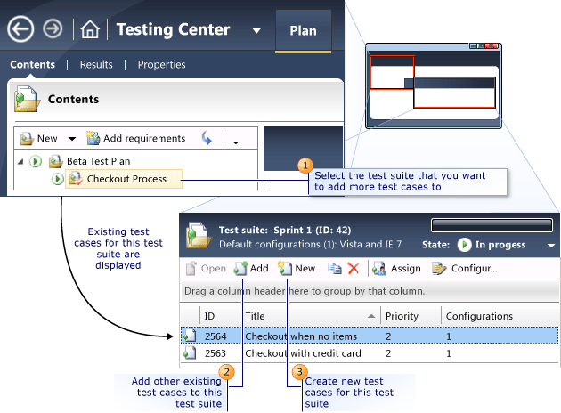
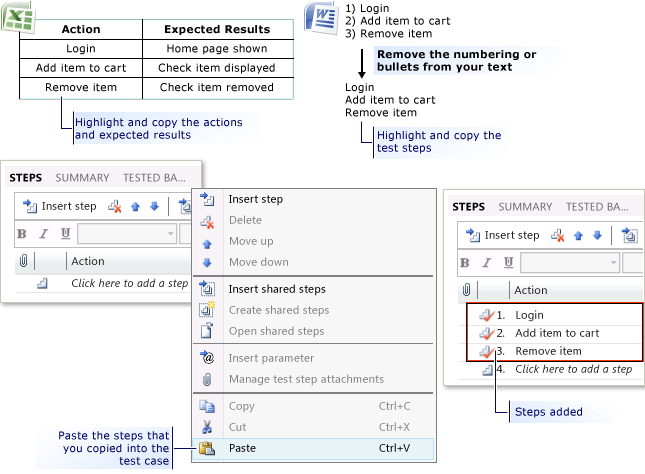

# Plan application tests from a Microsoft Excel or Microsoft Word document
**Requirements**  
  
-   Visual Studio Enterprise, [!INCLUDE[vstsTestEssLong](../test/includes/vststestesslong_md.md)]  
  
 You can create manual test cases that have both action and validation test steps by using [!INCLUDE[TCMext](../codequality/includes/tcmext_md.md)]. You can test steps from an [!INCLUDE[ofprexcel](../codequality/includes/ofprexcel_md.md)] or [!INCLUDE[ofprword](../test/includes/ofprword_md.md)] document. For example, if you already have test steps in one of these types of documents, you can import the steps into a manual test case using [!INCLUDE[TCMext](../codequality/includes/tcmext_md.md)].  
  
 You can also share a set of common test steps between multiple test cases using *shared steps*. This simplifies maintenance of test steps if your application being tested changes.  
  
 Any test case that you create is associated with your team project and can be added to multiple test suites in the same or different test plans. When you run these test cases, you can mark which test steps pass and which steps fail. You can create a bug from a test case that fails. This bug automatically includes the test steps and other information that was collected.  
  
 You can create a manual test case from within a test plan by selecting a suite as shown in the following illustration.  
  
   
  
> [!NOTE]
>  If you created the test suite by adding a requirement to the test plan, any existing test cases or new test cases that you add to the test suite will automatically be linked to the requirement.  
  
 You can then add the details for your test case, as shown in the following illustration.  
  
   
  
 To add test steps by copying and pasting from [!INCLUDE[ofprexcel](../codequality/includes/ofprexcel_md.md)], [!INCLUDE[ofprword](../test/includes/ofprword_md.md)], or a text document, select the steps from your document. The formats for the documents that make it easy to copy the steps are shown in the following illustration.  
  
   
  
> [!NOTE]
>  If you copy both actions and expected results from [!INCLUDE[ofprword](../test/includes/ofprword_md.md)] or a text document, then the lists of each pairing of an action with an expected result must be tab-delimited.  
  
 Use the following procedures to create and modify manual test cases:  
  
-   [Create a manual test case](#CreateTestCase)  
  
-   [Add action and validation test steps from Microsoft Excel or Word](#AddSteps)  
  
##   Create a manual test case  
  
1.  Open [!INCLUDE[TCMext](../codequality/includes/tcmext_md.md)]. (Go to Start, All Programs, Microsoft Visual Studio, Microsoft Test Manager.)  
  
2.  From the **Testing Center**, choose **Plan** and then choose **Contents**.  
  
     The **Contents** pane is displayed.  
  
3.  Select the test suite in the test suite hierarchy pane that you want to add test cases to, and then choose **New**.  
  
     The **New Test Case** dialog box is displayed.  
  
4.  To name the test case, type the name in **Title**.  
  
     You use this title to identify the test case and search for it if you have to.  
  
5.  Choose **Assigned To** to select the appropriate owner for the test case.  
  
6.  (Optional) To change the state of a test case, you must first save the test case. After you save the test case, you can select a state from a list, based on the following table:  
  
    |State|When to use it|  
    |-----------|--------------------|  
    |Design|The test case is being designed and has not yet been reviewed and approved.|  
    |Ready|The test case has been reviewed and approved and is ready to be run.|  
    |Closed|The test case is no longer required for future iterations of this team project.|  
  
     These states are based on the process template that was used to create your team project. For more information about how to customize process templates, see [Customize a process](../Topic/Customize%20a%20process.md).  
  
    > [!NOTE]
    >  By default, **State** is set to **Design**. A test case that is in the **Design** state can still be run.  
  
7.  Choose **Priority** to select the importance of the test case.  
  
8.  (Optional) A manual test case can be converted into an automated test. To set the status of a test case for automation, choose **Automation Status** and select a state from a list, based on the following table:  
  
    |State|When to use it|  
    |-----------|--------------------|  
    |Not Automated|This is a manual test case only.|  
    |Planned|The plan is to add automation for this test case in the future.|  
    |Automated|This value is automatically set if an automated test is added to this test case.|  
  
    > [!NOTE]
    >  By default, **Automation Status** is set to **Not Automated**. For more information about how to convert a manual test case into an automated test case, see [Automate a test case](../test/automate-a-test-case-in-microsoft-test-manager.md).  
  
9. Choose **Area** to select the appropriate area in the team project for the test case.  
  
    > [!NOTE]
    >  The areas are set up by your [!INCLUDE[esprtfs](../codequality/includes/esprtfs_md.md)] administrator for the team project. You can use the area field to query for manual test cases.  
  
10. Choose **Iteration** to select the iteration in your team project for this test case.  
  
11. (Optional) To link the test case to other work items that this test case tests, choose **Tested Work Items**, and then choose **Add**. Next, type the items in **Work item IDs**, or browse for the items and choose **OK**.  
  
     The work items are listed in **Tests**.  
  
12. To save the test case, choose **Save** in the toolbar.  
  
    > [!NOTE]
    >  After the test case has been saved, the test case identifier is shown in the title of the editing pane.  
  
##   Add action and validation test steps from Microsoft Excel or Word  
 You can copy and paste actions and expected results from [!INCLUDE[ofprexcel](../codequality/includes/ofprexcel_md.md)], [!INCLUDE[ofprword](../test/includes/ofprword_md.md)], or a text document. If you copy both actions and expected results from [!INCLUDE[ofprword](../test/includes/ofprword_md.md)] or a text document, then the lists of each pairing of an action with an expected result must be tab-delimited.  
  
 You can also attach a file that provides more details, or a screen shot, to provide more information to the tester. You can edit your test steps after pasting the steps into the test case.  
  
#### To add action and validation test steps from Microsoft Excel or Word  
  
1.  Open [!INCLUDE[TCMext](../codequality/includes/tcmext_md.md)]. (Go to Start, All Programs, Microsoft Visual Studio, Microsoft Test Manager.)  
  
2.  From the **Testing Center**, choose **Plan** and then choose **Contents**.  
  
     The **Contents** pane is displayed.  
  
3.  Select the test suite in the test suite hierarchy pane that contains your test case.  
  
4.  To open the test case to add steps to it, double-click the test case that is listed in the Test Suite Details pane.  
  
5.  Choose **Steps**.  
  
6.  To copy the text from your document, select the text from your spreadsheet, and choose either a table or a set of lines of text. Right-click your selection and then point to **Copy**.  
  
    > [!NOTE]
    >  If you have steps as a numbered list in your [!INCLUDE[ofprword](../test/includes/ofprword_md.md)] document, you have to remove the numbers before you copy and paste. Otherwise, the numbers are pasted into **Action** and the text is pasted into **Expected Result**. If you are only copying one column from a table or spreadsheet, then the data is pasted into **Action**.  
  
7.  Right-click **\<Choose here to add a step>**, and then point to **Paste**.  
  
     The text that you copied from your document is pasted into the test steps.  
  
    > [!NOTE]
    >  If you add expected results to a test step, it automatically becomes a validation test step shown by the red check mark on the step icon. By default, each test step is an action test step and does not require validation when you run this step. When you run the test case, you must individually mark a validation test step as either passed, or failed. If you do not, the test will automatically be assigned a status of fail.  
  
    > [!NOTE]
    >  Microsoft Test Manager includes a toolbar that you can use to format the text of your steps. You can use various formatting options, such as bold, underline, or color highlighting to emphasis key points in your comments.  
  
     (Optional) Press and hold the **Alt** key and then press **Enter** to add a subordinate test step and expected results. You can add as many multiple subordinate test steps as you require for the test step.  
  
     For example, as shown in the previous illustration you can create a test step called “Login to application” and then add the following subordinate test steps:  
  
    -   “Choose the Sign In link in the upper-right corner.”  
  
    -   “In the user field, type your username.”  
  
    -   “In the password field, type your password.”  
  
    -   “Choose the Sign In button.”  
  
8.  To add another test step, choose **\<Choose here to add a step>**. You can add as many test steps as you require for your test.  
  
9. (Optional) To add a file as an attachment to a test step, choose the test step and then choose **Add Attachment** in the toolbar. To enter the location of the attachment, choose **Add,** type the location of the file, and then choose **OK**.  
  
10. (Optional) To insert a test step, select a step and choose **Insert step** on the toolbar.  
  
     A test step is inserted above the selected step.  
  
11. (Optional) To move test steps in the list, select one or many steps and then choose **Move up** or **Move down** on the toolbar.  
  
     The selected steps will move up or down one step.  
  
12. (Optional) To add shared steps to the test case, right-click a step and point to **Insert shared steps**. Select the shared steps from the list and then choose **Insert**.  
  
     The shared steps are inserted above the selected step.  
  
    > [!NOTE]
    >  You can also create shared steps from within a test case. For more information, see [Share steps between test cases](../test/share-steps-between-test-cases.md).  
  
13. To save the test case, choose **Save and Close** on the toolbar.  
  
     You can now run the test case either [with the web portal](../test/running-manual-tests-using-the-web-portal.md) or [Microsoft Test Manager](../test/run-manual-tests-with-microsoft-test-manager.md).