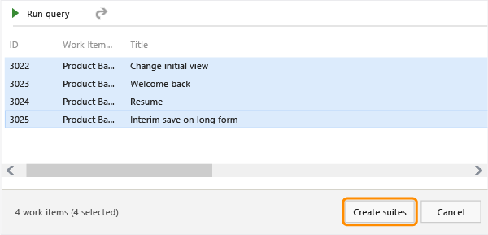
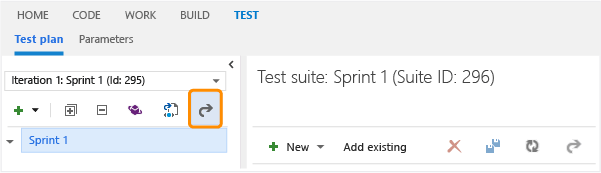

# Planning manual tests using the web portal
Create test plans to track manual testing for sprints or milestones. That way you can see when the testing for a specific sprint or milestone is complete.  
  
 With Team Foundation Server, you can [customize test plans and suites](http://msdn.microsoft.com/library/62c0168a-23b8-4a92-9ecf-b67926f7756f). For example, add an extra field to identify the reviewer for a test plan, or change the default values for the state field to fit your process better.  
  
 To use these features, you'll need Advanced level access. Learn more about [access levels here](https://msdn.microsoft.com/library/vs/alm/work/connect/change-access-levels).  
  
 For changes introduced with this version, review the [Q & A section](#QandALink).  
  
## Plan your tests  
  
1.  If you haven't already, [create your team project](assetId:///2fee2b45-55f1-4b7c-ab10-8be80eb283f1) and [create your backlog](assetId:///70a01e94-2dc9-4090-823c-71ee8e156e74).  
  
2.  [Connect to your team project](../Topic/Connect%20to%20team%20projects%20in%20Team%20Foundation%20Server.md#te) and then open [the web portal](../Topic/Work%20in%20the%20TFS%20web%20portal.md) from Team Explorer.  
  
       
  
     Or simply open [the web portal](../Topic/Work%20in%20the%20TFS%20web%20portal.md) directly from your browser. For example, to connect to the server named FabrikamPrime use: http://FabrikamPrime:8080/tfs/, then you can select your team project.  
  
3.  Go to the Test hub.  
  
       
  
     If you don’t see the Test hub, you need to get [full access from your TFS administrator](http://msdn.microsoft.com/library/8bf4a761-7938-417e-a86a-704ae211cc5d).  
  
4.  Create a test plan for your current sprint.  
  
       
  
5.  Name the test plan. Check the area path and iteration.  
  
       
  
6.  Now add test suites for the backlog items that need manual tests. (These backlog items could be user stories, requirements or another work item based on the setup of your team project.)  
  
       
  
     You use requirement-based suites to group your test cases together so you can track the testing status of a backlog item. Each test case that you add to a requirement-based test suite is automatically linked to the backlog item.  
  
7.  Add a clause to filter by the iteration path for the sprint. Run the query to display the backlog items.  
  
       
  
8.  Choose the backlog items that you want to test this sprint.  
  
       
  
     Now you've created a requirement-based test suite for each backlog item.  
  
##   Q & A  
  
### Q: Why did my test plan and test suite IDs change?  
 With TFS 2013 Update 3, [test plans and test suites were converted to work items](http://msdn.microsoft.com/library/edbe689d-7863-4273-916f-b7e93b7f00b3). This changes the IDs. Any bookmarks that you had to take you directly to a test plan or a test suite will no longer work because the IDs have changed. You still access test plans and suites using either the web portal or Microsoft Test Manager. But make sure that you set up access based on [permissions for the area path](http://msdn.microsoft.com/library/ms181692.aspx).  
  
### Q: Can I edit the properties of test plans and test suites?  
 **A:** Yes, you can edit the properties of test plans and test suites from the web portal or Microsoft Test Manager (MTM).  
  
 From the Test hub in the web portal, select a test plan or test suite and then open it.  
  
   
  
 In the work item form, you can view and change any custom fields, status, summary, details, attachments, and links for your test plan or your test suite.  
  
 In MTM, open a test plan to edit the fields. The Properties tab now displays the work item form. Run settings have been moved into a new tab.  
  
   
  
 For test suites, open the test suite from the context menu to view and change fields for the work item.  
  
###   Q: Can I get an audit trail for test plans and test suites?  
 **A:** Yes, work item history tracks changes to test plans and test suites. For example, adding tests to a test suite or changing configurations are tracked. In the work item form, under **History**, choose **ALL CHANGES** to view the audit trail.  
  
   
  
### Q: What is a static test suite?  
 **A:** A static test suite can contain a combination of test cases and test suites as children. Add a static test suite from the Test Plan tab with the context menu or the plus icon on the toolbar. Simply choose the test cases that you want to add to this static test suite, or add another test suite.  
  
### Q: Can I group my requirement-based test suites together?  
 **A:** Yes, you can create a static test suite to do this. Drag test suites to group them in a static test plan.  
  
   
  
### Q: What are query-based test suites?  
 **A:** Use a query to group together test cases that have a particular characteristic - for example, all the tests that have Priority=1. The suite will automatically include every test case that is returned by the query that you define.  
  
### Q: Can I create an offline version of the test plan for easy review?  
 **A:** Yes, you can export test plans, test suites and test cases using the web portal. You can select the detail that you want in the report. You can then email or print this report for review.  
  
   
  
 Change the test case fields in the report by adding or removing columns from the list view of the test suite.  
  
### Q: When I export data from a test plan, can I simply view the data or copy it into a Word document?  
 **A:** Yes. Choose the Print option from the Export dialog box, then choose Cancel from the Print dialog box. The data for the report is displayed. Select all the text, then you can copy and paste it into a Microsoft Word document if you want. All the formatting in the report is retained.  
  
###   Q: When I export data from a test plan, can I customize the report for all users?  
 **A:** Yes. For example, you can edit the XSLT file to add a company logo or change the format of the data. Make a backup copy of this file before you edit it. These changes will apply when any user exports data from a test plan. The XSLT file is on the TFS server in this location:  
  
 **C:\Program Files\Microsoft Team Foundation Server 14.0\Application Tier\Web Services\\_tfs_resources\TestManagement\v1.0\Transforms\1033\TestSuite.xsl**  
  
 Keep a copy of any changes you make to this file, because this file could be overwritten if you install a Team Foundation Server update.  
  
 This location might be different, based on the installation path for TFS and the locale: **\<installation path>\Application Tier\Web Services\\_tfs_resources\TestManagement\v1.0\Transforms\\<locale\>\TestSuite.xsl**.  
  
### Q: Can MTM connect to a TFS earlier than version 2013.3?  
 **A:** You can connect and use MTM. But the test plans and test suites have not been upgraded to be work items, so you cannot access the work item properties.  
  
###   Q: How can I customize the test plans or test suites?  
 **A:** You can add fields, change the workflow, and customize them like any other WIT. See [Modify or add a custom work item type](../Topic/Modify%20or%20add%20a%20custom%20work%20item%20type%20\(WIT\).md).  
  
###   Q: Why doesn’t the test suite state stop me from running tests now?  
 **A:** In this version, you can customize test suite states, so we’ve removed the restriction to only let you run tests if the test suite state is “In Progress”. Some users might have their own custom states that they want to use for tests that can be run, so this change allows more flexibility.  
  
###   Q: Why do I get an error when I try to change the state of my test plan or test suite?  
 **A:** Prior to TFS 2013 Update 3, test plans could only have "Active" and "Inactive" states and test suites could only have “In Planning”, “In Progress”, and “Completed” states.  
  
 In this version, a test plan can be customized to have different workflow states. If you use an MTM client with a version of Visual Studio prior to Visual Studio 2013 Update 3, you might get an error when you try to update the state because this version of the client was not designed for custom states. Upgrade your MTM client to Visual Studio 2013 Update 3 or Visual Studio 2015, and you will be able to change the states. Or you can open the test plan or test suite work item directly from MTM (type Ctrl+G, then enter the id of the work item).  
  
###   Q: Why are test plans with an inactive state now displayed?  
 **A:** In this version, you can add custom states to test plans based on your workflow. Some users might choose to use a different state to represent an active or inactive state. Now we need to show all test plans whatever the value of the state.  
  
###   Q: How do I change the state of test suites?  
 **A:** Open the test suite and change the state in the work item form.  
  
### Q: When I connect to TFS 2015 from an MTM client using Visual Studio 2013.2 (or earlier versions) I get an error. How do I fix it?  
   
  
 **A:** You need to update the process configuration for the team project. See [Import and export process configuration](../Topic/Import%20and%20export%20process%20configuration.md).  
  
### Q: Where can I get more information about the web portal?  
 **A:** Go [here](../Topic/Work%20in%20the%20TFS%20web%20portal.md).  
  
### Q: Where can I get more information about MTM ?  
 **A:** Get started using MTM [here](../test/testing-your-application-using-microsoft-test-manager.md).  
  
## Try this next:  
 Now create your [manual test cases](../test/creating-manual-tests-using-the-web-portal.md).  
  
### Or, dig deeper:  
 [Explore your app](../test/exploratory-testing-using-microsoft-test-manager.md) without planning in advance.