# Tutorial: Test-driven development using Test Explorer

Create unit tests to help keep your code working correctly through incremental code changes. There are several frameworks that you can use to write unit tests, including some developed by third parties. Some test frameworks are specialized for testing in different languages or platforms. Test Explorer provides a single interface for unit tests in any of these frameworks. For more information about **Test Explorer**, see [Run unit tests with Test Explorer](run-unit-tests-with-test-explorer.md) and [Test Explorer FAQ](test-explorer-faq.md).

This article demonstrates how to develop a tested method in C# using Microsoft Test Framework (MSTest). You can easily adapt it for other languages or other test frameworks, such as NUnit. For more information, see [Install third-party unit test frameworks](install-third-party-unit-test-frameworks.md).

## Create a test and generate code

1. Create a C# **Class Library** project for .NET or .NET Standard. This project will contain the code that we want to test. Name the project **MyMath**.

2. In the same solution, add a new **MSTest** test project for .NET.

   In Visual Studio 2019 version 16.9, the MSTest project template name is **Unit Test Project**.

   Name the test project **MathTests**.

   ::: moniker range=">=vs-2022"
   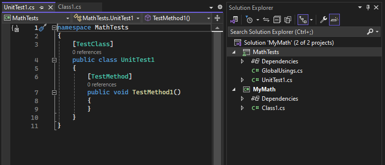
   ::: moniker-end
   ::: moniker range="vs-2019"
   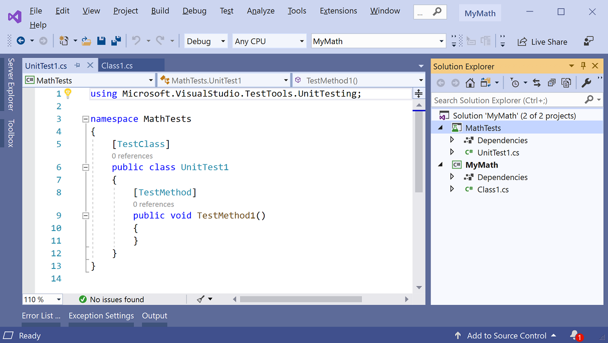
   ::: moniker-end

3. In the test project, write a simple test method that verifies the result obtained for a specific input. Add the following code to the `Test1` or `UnitTest1` class:

   ```csharp
   [TestMethod]
   public void BasicRooterTest()
   {
     // Create an instance to test:
     Rooter rooter = new Rooter();
     // Define a test input and output value:
     double expectedResult = 2.0;
     double input = expectedResult * expectedResult;
     // Run the method under test:
     double actualResult = rooter.SquareRoot(input);
     // Verify the result:
     Assert.AreEqual(expectedResult, actualResult, delta: expectedResult / 100);
   }
   ```

4. Generate a type from the test code.

   1. Place the cursor on `Rooter`, and then open the light bulb menu.

      ::: moniker range=">=vs-2022"
      Choose **Generate new type**.

      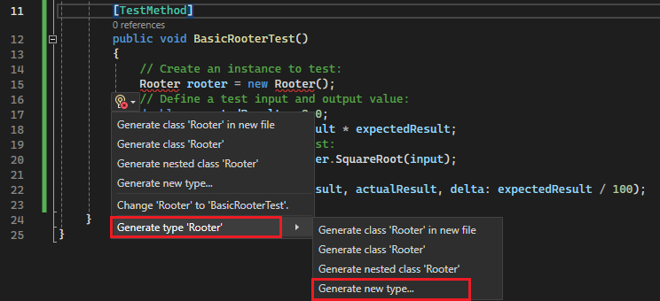
      ::: moniker-end
      ::: moniker range="vs-2019"
      Choose **Generate type 'Rooter'** > **Generate new type**.

      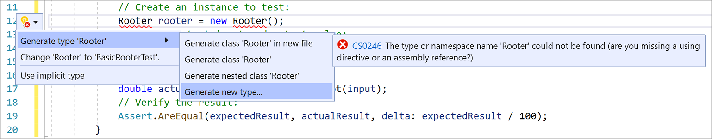
      ::: moniker-end

   2. In the **Generate Type** dialog box, set **Project** to **MyMath**, the class library project, and then choose **OK**.

      ::: moniker range=">=vs-2022"
      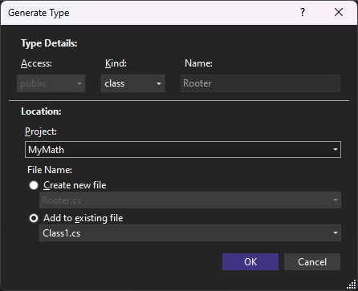
      ::: moniker-end
      ::: moniker range="vs-2019"
      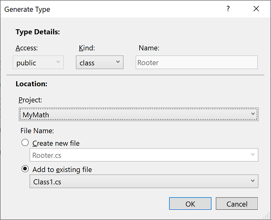
      ::: moniker-end

5. Generate a method from the test code. Place the cursor on `SquareRoot`, and then from the light bulb menu, choose **Generate method 'SquareRoot'** or **Generate method 'Rooter.SquareRoot'**.

6. Run the unit test.

   1. Open **Test Explorer**.

      ::: moniker range=">=vs-2022"
      To open Test Explorer from the **Test** menu, choose **Test Explorer**.
      ::: moniker-end
      ::: moniker range="vs-2019"
      To open Test Explorer from the **Test** menu, choose **Windows** > **Test Explorer**.
      ::: moniker-end

   2. In **Test Explorer**, choose the **Run All** button to run the test.

   The solution builds, and the test runs and fails.

7. Select the name of the test.

   The details of the test appear in the **Test Detail Summary** pane.

   ::: moniker range=">=vs-2022"
   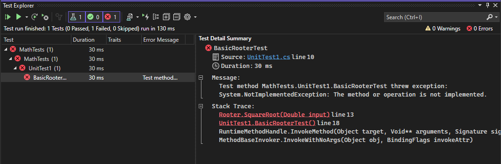
   ::: moniker-end
   ::: moniker range="vs-2019"
   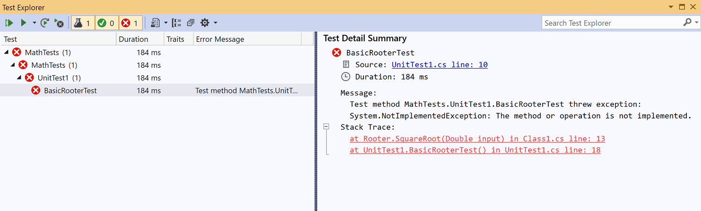
   ::: moniker-end

8. Select the top link under **Stack Trace** to jump to the location where the test failed.

At this point, you've created a test and a stub that you can modify so that the test passes.

## Verify a code change

1. In the *Class1.cs* file, improve the code of `SquareRoot`:

    ```csharp
    public double SquareRoot(double input)
    {
        return input / 2;
    }
    ```

2. In **Test Explorer**, choose **Run All**.

   The solution builds, and the test runs and passes.

   ::: moniker range=">=vs-2022"
   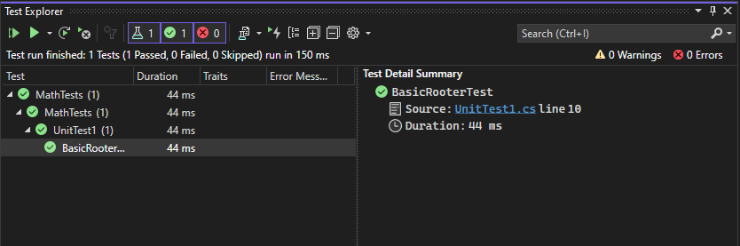
   ::: moniker-end
   ::: moniker range="vs-2019"
   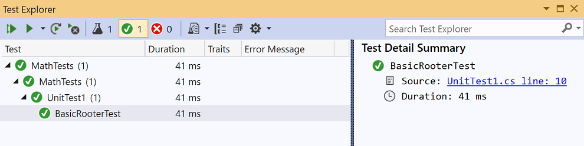
   ::: moniker-end

## Extend the range of inputs

To improve our confidence that the code works in all cases, add tests that try a broader range of input values.

> [!TIP]
> Avoid altering existing tests that pass. Instead, add new tests. Change existing tests only when the user requirements change. This policy helps to make sure that you don't lose existing functionality as you work to extend the code.

1. In the test class, add the following test, which tries a range of input values:

    ```csharp
    [TestMethod]
    public void RooterValueRange()
    {
        // Create an instance to test.
        Rooter rooter = new Rooter();

        // Try a range of values.
        for (double expected = 1e-8; expected < 1e+8; expected *= 3.2)
        {
            RooterOneValue(rooter, expected);
        }
    }

    private void RooterOneValue(Rooter rooter, double expectedResult)
    {
        double input = expectedResult * expectedResult;
        double actualResult = rooter.SquareRoot(input);
        Assert.AreEqual(expectedResult, actualResult, delta: expectedResult / 1000);
    }
    ```

2. In **Test Explorer**, choose **Run All**.

   The new test fails (although the first test still passes). To find the point of failure, select the failing test, and then look at the details in the **Test Detail Summary** pane.

3. Inspect the method under test to see what might be wrong. Alter the `SquareRoot` code as follows:

    ```csharp
    public double SquareRoot(double input)
    {
      double result = input;
      double previousResult = -input;
      while (Math.Abs(previousResult - result) > result / 1000)
      {
        previousResult = result;
        result = result - (result * result - input) / (2 * result);
      }
      return result;
    }
    ```

4. In **Test Explorer**, choose **Run All**.

   Both tests now pass.

## Add tests for exceptional cases

1. Add a new test for negative inputs:

    ```csharp
    [TestMethod]
    public void RooterTestNegativeInput()
    {
        Rooter rooter = new Rooter();
        Assert.ThrowsException<ArgumentOutOfRangeException>(() => rooter.SquareRoot(-1));
    }
    ```

2. In **Test Explorer**, choose **Run All**.

   The new test fails.

   If the method under test loops, choose **Cancel** on the toolbar of **Test Explorer**. The test stops executing and fails.

4. Fix the `SquareRoot` code by adding the following `if` statement at the beginning of the method:

    ```csharp
    public double SquareRoot(double input)
    {
        if (input <= 0.0)
        {
            throw new ArgumentOutOfRangeException();
        }
        ...
    ```

5. In **Test Explorer**, choose **Run All**.

   All the tests pass.

## Refactor the code under test

Refactor the code, but do not change the tests.

> [!TIP]
> A *refactoring* is a change that is intended to make the code perform better or  easier to understand. It is not intended to alter the behavior of the code, and therefore the tests are not changed.
>
> We recommend that you perform refactoring steps separately from steps that extend functionality. Keeping the tests unchanged gives you confidence that you have not accidentally introduced bugs while refactoring.

1. Change the line that calculates `result` in the `SquareRoot` method as follows:

    ```csharp
    public double SquareRoot(double input)
    {
        if (input <= 0.0)
        {
            throw new ArgumentOutOfRangeException();
        }

        double result = input;
        double previousResult = -input;
        while (Math.Abs(previousResult - result) > result / 1000)
        {
            previousResult = result;
            result = (result + input / result) / 2;
            //was: result = result - (result * result - input) / (2*result);
        }
        return result;
    }
    ```

2. Choose **Run All**, and verify that all the tests still pass.

   ::: moniker range=">=vs-2022"
   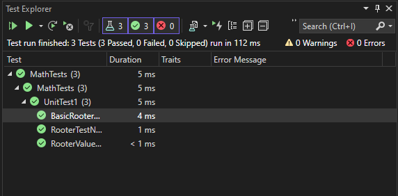
   ::: moniker-end
   ::: moniker range="vs-2019"
   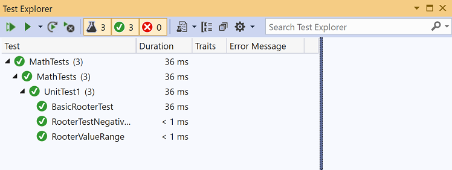
   ::: moniker-end
