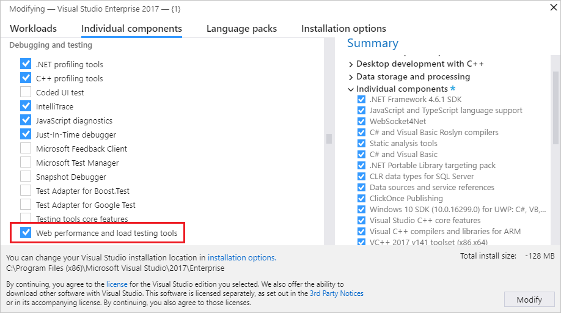
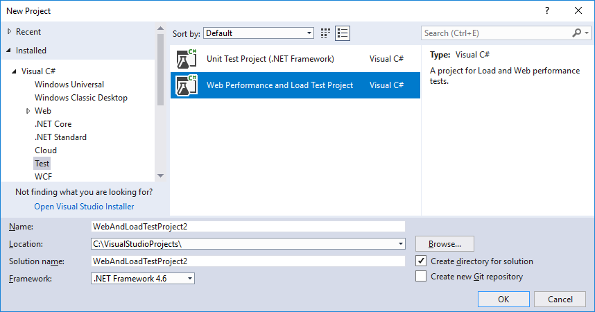
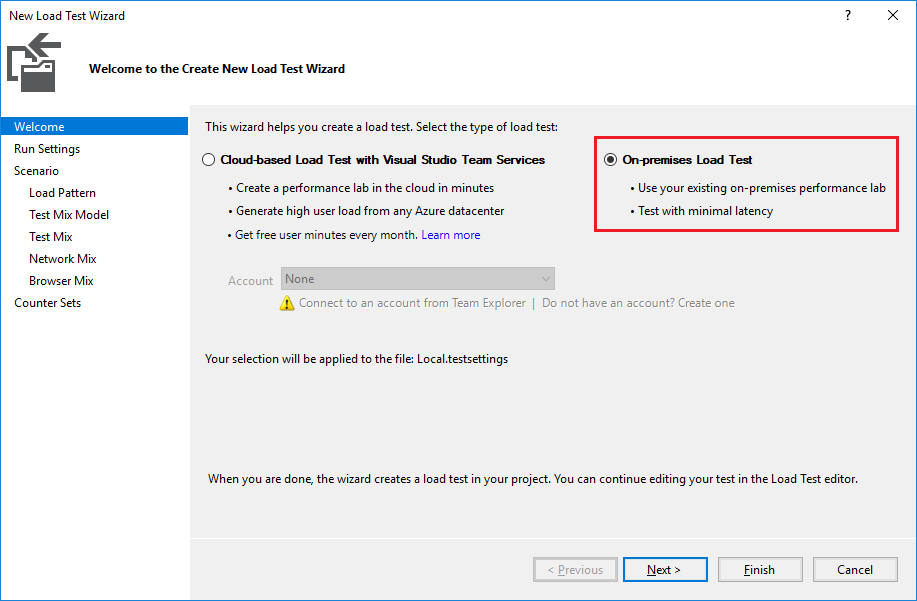
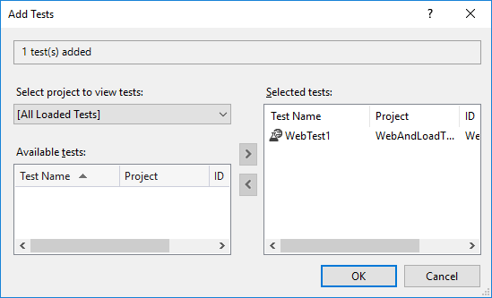
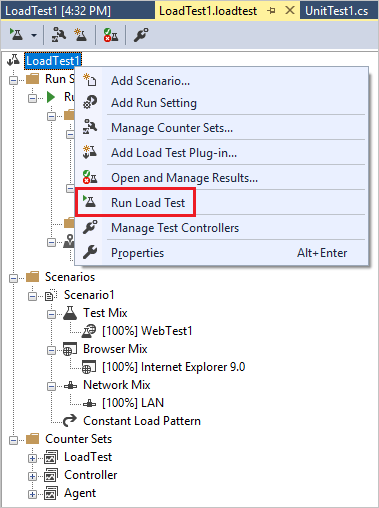
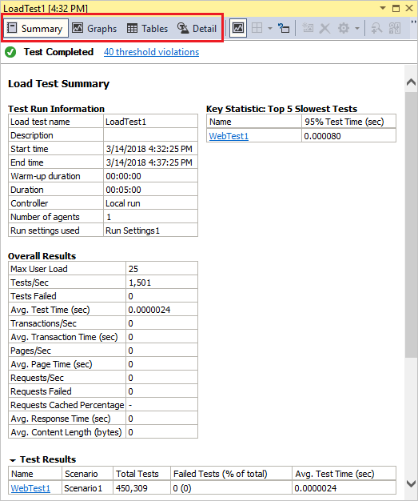

# Quickstart: Create a load test project

In this 10-minute quickstart, you'll learn how to create and run a web performance and load test project in Visual Studio. Load tests execute web performance or unit tests to simulate many users accessing a server at the same time.

[!INCLUDE [web-load-test-deprecated](includes/web-load-test-deprecated.md)]

## Software requirements

Web performance and load test projects are only available in the **Enterprise edition** of Visual Studio.

## Install the load testing component

If you don't already have the web performance and load testing tools component installed, you'll need to install it through the Visual Studio Installer.

1. Open **Visual Studio Installer** from the **Start** menu of Windows. You can also access it in Visual Studio from the new project dialog box or by choosing **Tools** > **Get Tools and Features** from the menu bar.

1. In **Visual Studio Installer**, choose the **Individual components** tab, and scroll down to the **Debugging and testing** section. Select **Web performance and load testing tools**.

   

1. Choose the **Modify** button.

   The web performance and load testing tools component is installed.

## Create a load test project

In this section, we'll create a C# load test project. You can also create a Visual Basic load test project, if you prefer.

::: moniker range="vs-2017"

1. Open Visual Studio.

2. Choose **File** > **New** > **Project** from the menu bar.

   The **New Project** dialog box opens.

3. In the **New Project** dialog box, expand **Installed** and **Visual C#**, and then select the **Test** category. Choose the **Web Performance and Load Test Project** template.

   

4. Enter a name for the project if you don't want to use the default name, and then choose **OK**.

::: moniker-end

::: moniker range=">=vs-2019"

1. Open Visual Studio.

2. On the start window, choose **Create a new project**.

3. On the **Create a new project** page, type **web test** into the search box, and then select the **Web Performance and Load Test Project \[Deprecated]** template for C#. Choose **Next**.

4. Enter a name for the project if you don't want to use the default name, and then choose **Create**.

::: moniker-end

   Visual Studio creates the project and displays the files in **Solution Explorer**. The project initially contains one web test file named *WebTest1.webtest*.

## Add a load test to the project

1. From the right-click menu, or context menu, of the project node in **Solution Explorer**, choose **Add** > **Load Test**.

   The **New Load Test Wizard** opens.

1. Select the **On-premises Load Test** option, and then choose **Next**. You can learn more about cloud-based load testing [here](/azure/devops/test/load-test/get-started-simple-cloud-load-test?view=vsts&preserve-view=true).

   

1. Choose **Next** to step through the wizard until you reach the **Add tests to a load test scenario and edit the test mix** page. Choose the **Add** button.

   The **Add Tests** dialog box opens.

1. Under **Available tests**, select **WebTest1**, and then choose the right arrow to move it over to the **Selected tests** box. Choose the **OK** button.

   

1. Back in the **New Load Test Wizard**, choose the **Finish** button.

   The load test is added to the project, and the load test file opens in the editor window.

## Run the load test

We've created a load test that doesn't do very much, but let's run it anyway.

From the right-click menu, or context menu, of the load test that's open in the editor, choose **Run Load Test**.

The load test starts running. The **Test Results** window shows that the test is in progress, and the load test analyzer is displayed in the editor window. After the test completes, which should be five minutes if you accepted the defaults, a summary is shown in the editor. You can choose **Graphs**, **Tables**, or **Detail** to get different information about the results of the load test.

## Next steps

Now that you've created a simple load test project, the next step is to configure scenarios, counter sets, and run settings.

> [!div class="nextstepaction"]
> [Edit test settings](edit-load-tests.md)
