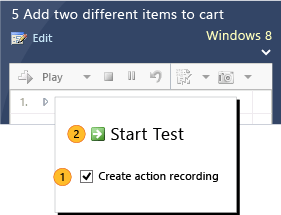
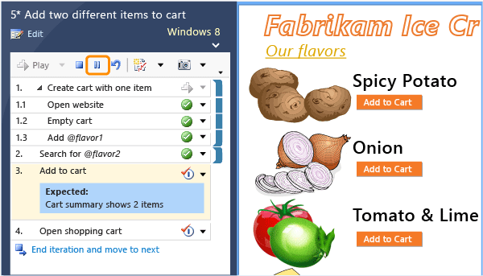
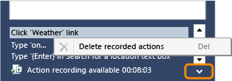
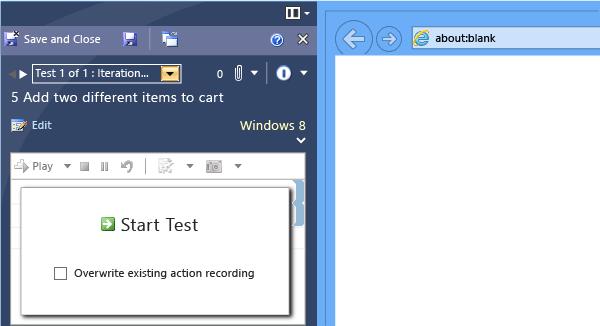

# Record and play back manual tests
Let [Microsoft Test Manager](../test/testing-your-application-using-microsoft-test-manager.md) record your keystrokes and gestures while you are testing an application. The next time you run the test, you can play back your actions quickly and accurately.  
  
 Playback is very useful for reproducing bugs. You can retrace the exact actions that the tester performed to the point where the fault was discovered.  
  
 Playback can also help when you want to run a test with [different data](../test/repeat-a-test-with-different-data.md), on [multiple configurations](../test/test-configurations--specifying-test-platforms.md), or where there are [shared steps](../test/share-steps-between-test-cases.md) that are the same in many test cases. It also speeds up regression testing—that is, tests that you run from one sprint to the next to make sure that everything is still working correctly.  
  
 You can record and play back tests in a wide range of desktop applications, and also web applications that you access through a supported browser. For a detailed list, see [Supported Configurations and Platforms for Coded UI Tests and Action Recordings](../codequality/supported-configurations-and-platforms-for-coded-ui-tests-and-action-recordings.md).  
  
## Run Microsoft Test Manager on your client machine  
 To record and play back actions, you have to install Microsoft Test Manager on the machine on which you will run your tests. If you are testing a desktop application, install the latest version of the application and Microsoft Test Manager on the same machine. If you are testing a web-based application, install the application on a test server, and run Microsoft Test Manager on the machine where you will run your web browser.  
  
 To get Microsoft Test Manager, install Visual Studio Test Professional or Visual Studio Enterprise.  
  
#### Run a test case  
  
1.  [Connect Microsoft Test Manager](../test/connect-microsoft-test-manager-to-your-team-project-and-test-plan.md) to your team project, and select your current test plan.  
  
2.  [Select a test case and run it](../test/run-manual-tests-with-microsoft-test-manager.md).  
  
       
  
## Recording your actions during a test run  
 In the **Start Test** window, select **Create action recording**.  
  
   
  
 Make sure you mark each step **Pass** or **Fail** as soon as you have completed it, and choose **End Test** when you’ve completed the last step. This makes sure the recording assigns your actions to the correct steps.  
  
> [!WARNING]
>  Passwords, emails, instant messenger conversations and other sensitive data might be included in the recording. All your keystrokes and gestures may be recorded.  
>   
>  Choose **Pause** if you want to interrupt your test, for example to reply to an email.  
  
   
  
### If you make a mistake  
 Open the editing panel at the bottom of test runner. You can delete actions there:  
  
   
  
 Alternatively, you can run the test again and choose **Overwrite action recording**.  
  
### If the test includes shared steps  
 If you come to a sequence of shared steps, you might already have recorded them as part of an earlier test case. You can either keep an earlier recording or record them now:  
  
   
  
 You have to indicate when you finish recording the shared steps:  
  
   
  
### If the steps include parameters  
 If the parameter specifies text that you have to type as a step in the test, then it will be recognized and bound into the recording. When the recording is played back with another set of parameter values, the new value will be entered instead.  
  
   
  
 But the parameter won’t be bound if it is not directly entered as text– for example, if it’s the name of something you select. When the recording is played back, you’ll have to perform that step manually.  
  
## Playing back an action recording  
 [Select your test and run it](../test/run-manual-tests-with-microsoft-test-manager.md). Don’t check the overwrite option in the **Start Test** dialog.  
  
   
  
 You can play the whole test, or play individual steps. Test Runner will replay the keystrokes and gestures that you recorded.  
  
 You have to verify the result of each step. The recording doesn’t verify the outputs.  
  
   
  
## Q and A  
 **Q: Can I record a test in one test plan and play it back in another?**  
 **A:** Yes, this is a great way to do regression tests quickly and accurately. If you want to repeat some tests you did in a previous sprint, just add those test cases to the test plan for the current sprint.  
  
 The recording is linked to the test case, not to its appearance in any particular test plan or suite.  
  
 **Q: Can I record a test in one test configuration and play it back in a different configuration? The tests for different configurations show up as separate tests in the Run page.**  
 **A:**  Yes. The recording is linked to the test case, so you can play it back from any instance of that test case, even in different [test configurations](../test/test-configurations--specifying-test-platforms.md), test suites or test plans.  
  
 **Q: Some or all of my actions aren’t recorded, or the playback doesn’t work properly. Why?**  
 **A:**  Action recording works best for applications in which each user interface field has a unique ID, and for basic gestures such as keystrokes clicks or touches and menu choices. It might not work as well for gestures such as drawing, and doesn’t work for some applications and web browsers.  
  
 See [Supported Configurations and Platforms for Coded UI Tests and Action Recordings](../codequality/supported-configurations-and-platforms-for-coded-ui-tests-and-action-recordings.md).  
  
 To learn how to develop your application so that it’s easier to record tests, see [Enable Coded UI Testing of Your Controls](../codequality/enable-coded-ui-testing-of-your-controls.md).  
  
 **Record/playback is cool. But can I completely automate a test, including verifying the results?**  
 Yes. [Automate system tests](../test/automate-system-tests.md)