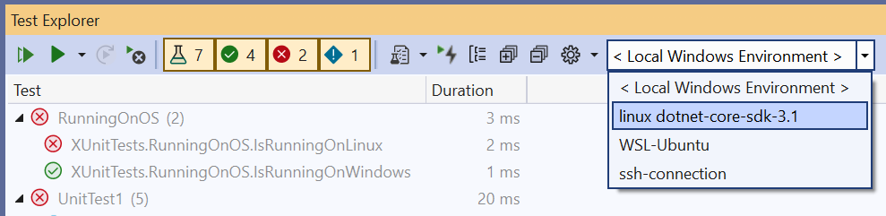
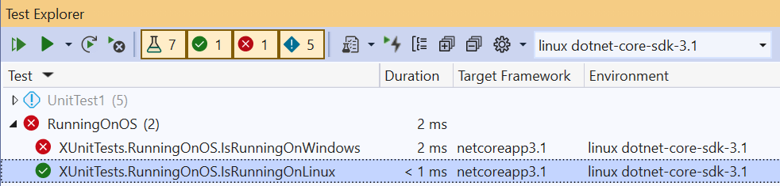

# Remote Testing (experimental preview)

Remote testing enables developers to connect Visual Studio 2022 to remote environments for running and debugging tests. This functionality is useful for cross-platform developers who deploy code to multiple different target environments such as different Windows or Linux operating systems. For example, normally a developer would have to push changes to a CI pipeline to get feedback from a test running on Linux. With this feature, you can run Linux tests right from Visual Studio by connecting the Test Explorer to a remote environment.

Requirements for using this experimental version of remote testing:
* Visual Studio 2022 Update 17.0 Preview 3 or later
* Only available for .NET tests.
  * If you're interested in remote testing support for other languages, please [file a suggestion](/visualstudio/ide/suggest-a-feature) or upvote an existing suggestion. [Supporting C++ remote testing](https://developercommunity.visualstudio.com/t/run-c-unit-tests-on-linux-with-visual-studio/1403357).
* Currently we only support Windows, Ubuntu and Debian images on the remote environment. 
* Currently, the bulk of the provisioning of the environment is left to the user’s specification. The user must install the necessary dependencies in your target environment. For example, if your tests target .NET 6.0, you need to make sure the container has .NET 6.0 installed via your Dockerfile. There may be a prompt to install .NET Core on the remote environment, which is needed to run and discover tests remotely. 
* Plan to monitor your connection status to the remote environment using the Output > Tests pane. For example, if the container was stopped a message will appear in Output > Tests pane. We may not detect all scenarios, so plan to check your output if it looks like the connection was lost. In particular, if the Output pane isn't set to "Test", you may not immediately see the message. If the connection is lost, you can use the environment drop-down in the Test Explorer to set the connection back to your local environment and then select the remote environment again to reinitiate the connection.

## Set up the remote testing environment

Environments are specified using `testenvironments.json` in the root of your solution. The json file structure follows the schema described here:
```json
{
    "version": "1", // value must be 1
    "environments": [
        { "name": "<unique name>", ... },
        ...
    ]
}
```

### Local container connections

To connect to a container running locally, you must have [Docker Desktop](https://www.docker.com/products/docker-desktop) on your local machine. Optionally, [enable WSL2 integration](/windows/wsl/install-win10) for better performance.

For a Dockerfile, the environment can be specified in `testEnvironments.json` in the root of your solution. It uses the properties described here.
```json
    {
    "name": "<name>",
    "localRoot": "<path to local environment>", // optional
    "type": "docker",
    "dockerImage": "<docker image tag>",
    }
```

The following example shows `testenvironments.json` for a local container image named \<mcr.microsoft.com/dotnet/core/sdk\>.
```json
{
"version": "1",
"environments": [
    {
    "name": "linux dotnet-core-sdk-3.1",
    "type": "docker",
    "dockerImage": "mcr.microsoft.com/dotnet/core/sdk"
    }
]
}
```

The following example shows a Dockerfile for running tests targeting .NET 5.0. The second line makes sure the debugger can connect and run in your container.
```
FROM mcr.microsoft.com/dotnet/core/sdk:5.0

RUN wget https://aka.ms/getvsdbgsh && \
    sh getvsdbgsh -v latest  -l /vsdbg
```

The container must have a built image on your local machine. You can build a container using the following command (including the "." at the end): `docker build -t <docker image name> -f <path to Dockerfile> .`

### Local WSL2 connections
To remotely run tests on WSL2, you must [enable WSL2 integration](/windows/wsl/install-win10) on your local machine.

The environment can be specified in `testEnvironments.json` in the root of your solution using the following schema and replacing \<Ubuntu\> with whatever WSL2 Distribution you've installed.
```json
{
"version": "1",
"environments": [
    {
    "name": "WSL-Ubuntu",
    "type": "wsl",
    "wslDistribution": "Ubuntu"
    }
]
}
```

### SSH connections
 You can add or remove SSH connections in **Tools > Options > Cross Platform > Connection Manager**. Selecting "Add" will allow you to enter the host name, port, and any credentials you need.

The environment can be specified in `testEnvironments.json` in the root of your solution using the following schema and replacing the `\<ssh://user@hostname:22\>` with your SSH remoteUri.
```json
{
"version": "1",
"environments": [
    {
    "name": "ssh-remote",
    "type": "ssh",
    "remoteUri": "ssh://user@hostname:22"
    }
]
}
```

#### Prerequisites for a remote Windows environment
1. Ensure [Windows Projected File System](/windows/win32/projfs/enabling-windows-projected-file-system) is enabled. You can run the following from an admin PowerShell window to enable it:

   ```powershell
    Enable-WindowsOptionalFeature -Online -FeatureName Client-ProjFS -NoRestart
   ```

   Please restart the environment if required.
2. Ensure SSH is setup. You can review the steps at [Install OpenSSH](/windows-server/administration/openssh/openssh_install_firstuse#install-openssh-using-powershell). Start up the SSH server by running the following command from an admin PowerShell window:
   ```powershell
   Start-Service sshd
   ```

3. Ensure that the appropriate .NET runtime required by your tests is installed. Downloads can be found [here](https://dotnet.microsoft.com/download).
4. For debugging of tests:
   1. Please install the [Remote tools SKU](/visualstudio/debugger/remote-debugging?view=vs-2022&preserve-view=true) on the remote environment. 
   2. Start up the remote debugger as an admin and ensure that the VS user has permissions to connect.

#### Prerequisites for a remote linux environment
1. Ensure ssh is configured and running.
2. Install `fuse3` using a package manager.
3. Ensure that the appropriate .NET runtime required by your tests is installed on the remote environment.

## Use the Test Explorer to run and debug remote tests
* The active environment is selected via a drop-down in the Test Explorer tool bar. Currently, only one test environment can be active at a time.

  

* Once an environment is selected, tests are discovered and run in the new environment.

  

* You can now run your tests inside the remote and debug your tests in environments!

  

* Test Explorer may prompt you to install some missing environment prerequisites and attempt to install missing dependencies. However, the bulk of the provisioning of the remote environment is up to the user’s specification.

## See also

- [Debug unit tests with Test Explorer](../test/debug-unit-tests-with-test-explorer.md)
- [Run a unit test as a 64-bit process](../test/run-a-unit-test-as-a-64-bit-process.md)
- [Test Explorer FAQ](test-explorer-faq.md)
