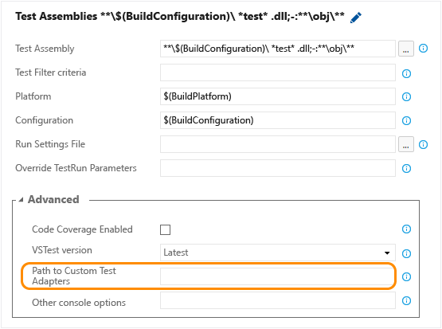

# Run tests with your builds
Make sure your app still works after every check-in and build using Visual Studio Online (VSO) or Team Foundation Server (TFS). Find problems earlier by running tests automatically with each build. When your build is done, review your test results to start resolving the problems that you find.  
  
 Before you start:  
  
1.  [Check in your solution](https://msdn.microsoft.com/Library/vs/alm/code/overview) to VSO or TFS version control. Include your test projects.  
  
2.  [Create a build definition](https://msdn.microsoft.com/en-us/Library/vs/alm/Build/overview) that builds your solution after each check-in, using continuous integration.  
  
 This overview shows how to get started by running unit tests with your build. When you're ready to [run other automated tests](#RunOtherTests), like system tests, under more realistic conditions, create environments from physical or virtual machines that you've already set up. Then set up your build to run your app and tests in the environments that you created.  
  
## Get started: Run unit tests with your builds  
 Your build definition includes a test task that runs unit tests. For example, if you're building a Visual Studio solution in VSO, your build definition includes a **Visual Studio Test** task. After your build starts, this task automatically runs all the unit tests in your solution - on the same build machine. To customize your test run, edit this task in your build definition.  
  
   
  
   
  
 You can add filter criteria to run specific tests, enable code coverage, run tests from [other unit test frameworks](#OtherUTFrameworks), and so on.  
  
   
  
 When you're done, save your build definition. Then start your build to check your test run:  
  
   
  
 After your build finishes, [review your test results](../test/review-continuous-test-results-after-a-build.md). You can check the build summary or find the test run using the Runs tab in the Test hub:  
  
   
  
 Find specific tests to dig deeper into the results:  
  
   
  
##   Next: Run other automated tests with your builds  
 When you're ready to test your app more extensively under more realistic conditions, on different platforms and configurations:  
  
1.  [Create environments](../test/set-up-environments-for-continuous-testing-with-builds.md) from physical or virtual machines that you've already set up.  
  
2.  [Set up your build to run your app and tests](../test/set-up-continuous-testing-for-builds.md) in the environments that you created.  
  
3.  After your build finishes, [review your test results](../test/review-continuous-test-results-after-a-build.md) to start resolving problems that you found.  
  
## Q & A  
  
### Q: Where can I learn more about integrating tests with my build?  
 **A:** Try these blog posts and videos:  
  
-   [Configuring Continuous Integration and Continuous Testing with Visual Studio 2015](http://blogs.msdn.com/b/visualstudioalm/archive/2015/07/17/video-configuring-continuous-integration-and-continuous-testing-with-visual-studio-2015.aspx)  
  
-   [Testing in Continuous Integration and Continuous Deployment Workflows](http://blogs.msdn.com/b/visualstudioalm/archive/2015/05/29/testing-in-continuous-integration-and-continuous-deployment-workflows.aspx)  
  
-   [Integrating Testing Efforts into the DevOps Process with Build vNext and Visual Studio Release Management](https://channel9.msdn.com/Series/ConnectOn-Demand/234)  
  
###   Q: How do I run tests from different unit test frameworks with my build?  
 **A:** First, set up your test frameworks in your development tool. For example, in Visual Studio:  
  
1.  [Set up the plug-in for your test framework](https://www.visualstudio.com/get-started/code/create-and-run-unit-tests-vs#frameworks), if you haven't already.  
  
2.  Create a folder that has the custom binaries for your plug-in. (The plug-in package for your framework is a .vsix file. Change the extension to .zip so that you can unzip it.)  
  
3.  Add these assemblies to version control and [let the build controller know where to get them](https://www.visualstudio.com/get-started/build/hosted-build-controller-vs).  
  
4.  In your build definition, provide the path to the test framework:  
  
       
  
## See Also  
 [Test apps early and often](../test/test-apps-early-and-often.md)