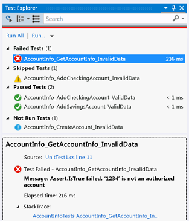

# Run unit tests with Test Explorer

Use Test Explorer to run unit tests from Visual Studio or third-party unit test projects. You can also use Test Explorer to group tests into categories, filter the test list, and create, save, and run playlists of tests. You can debug tests and analyze test performance and code coverage.

Visual Studio includes the Microsoft unit testing frameworks for both managed and native code. However, Test Explorer can also run any unit test framework that has implemented a Test Explorer adapter. For more information about installing third-party unit test frameworks, see [Install third-party unit test frameworks](../test/install-third-party-unit-test-frameworks.md)

**Test Explorer** can run tests from multiple test projects in a solution and from test classes that are part of the production code projects. Test projects can use different unit test frameworks. When the code under test is written for .NET, the test project can be written in any language that also targets .NET, regardless of the language of the target code. Native C/C++ code projects must be tested by using a C++ unit test framework. For more information, see [Write unit tests for C/C++](writing-unit-tests-for-c-cpp.md).

## Run tests in Test Explorer


When you build the test project, the tests appear in Test Explorer. If Test Explorer is not visible, choose **Test** on the Visual Studio menu, choose **Windows**, and then choose **Test Explorer**.


::: moniker range="vs-2017"

::: moniker-end
::: moniker range=">=vs-2019"

::: moniker-end

::: moniker range="vs-2017"
As you run, write, and rerun your tests, Test Explorer displays the results in default groups of **Failed Tests**, **Passed Tests**, **Skipped Tests** and **Not Run Tests**. You can change the way Test Explorer groups your tests.
::: moniker-end
::: moniker range=">=vs-2019"
As you run, write, and rerun your tests, the Test Explorer displays the results in a default grouping of **Project**, **Namespace**, and **Class**. You can change the way the Test Explorer groups your tests.
::: moniker-end

You can perform much of the work of finding, organizing and running tests from the **Test Explorer** toolbar.

::: moniker range="vs-2017"

::: moniker-end
::: moniker range=">=vs-2019"

::: moniker-end

### Run tests

::: moniker range="vs-2017"
You can run all the tests in the solution, all the tests in a group, or a set of tests that you select. Do one of the following:

- To run all the tests in a solution, choose **Run All**.

- To run all the tests in a default group, choose **Run** and then choose the group on the menu.

- Select the individual tests that you want to run, open the right-click menu for a selected test and then choose **Run Selected Tests**.

- If individual tests have no dependencies that prevent them from being run in any order, turn on parallel test execution with the  toggle button on the toolbar. This can noticeably reduce the time taken to run all the tests.

The **pass/fail bar** at the top of the **Test Explorer** window is animated as the tests run. At the conclusion of the test run, the **pass/fail bar** turns green if all tests passed or turns red if any test failed.
::: moniker-end
::: moniker range=">=vs-2019"
You can run all the tests in the solution, all the tests in a group, or a set of tests that you select. Do one of the following:

- To run all the tests in a solution, choose the **Run All** icon.

- To run all the tests in a default group, choose the **Run** icon and then choose the group on the menu.

- Select the individual tests that you want to run, open the right-click menu for a selected test and then choose **Run Selected Tests**.

- If individual tests have no dependencies that prevent them from being run in any order, turn on parallel test execution in the settings menu of the toolbar. This can noticeably reduce the time taken to run all the tests.
::: moniker-end

### Run tests after every build
::: moniker range="vs-2017"
|Button|Description|
|-|-|
||To run your unit tests after each local build, choose **Test** on the standard menu, and then choose **Run Tests After Build** on the **Test Explorer** toolbar.|

> [!NOTE]
> Running unit tests after each build requires Visual Studio 2017 Enterprise or Visual Studio 2019. In Visual Studio 2019 it is included in Community and Professional as well as Enterprise.
::: moniker-end
::: moniker range=">=vs-2019"
To run your unit tests after each local build, open the settings icon in the Test Explorer toolbar and select **Run Tests After Build**.
::: moniker-end

## View test results

As you run, write, and rerun your tests, Test Explorer displays the results in groups of **Failed Tests**, **Passed Tests**, **Skipped Tests** and **Not Run Tests**. The details pane at the bottom or side of the Test Explorer displays a summary of the test run.

### View test details

To view the details of an individual test, select the test.

::: moniker range="vs-2017"

::: moniker-end
::: moniker range=">=vs-2019"

::: moniker-end

The test details pane displays the following information:

- The source file name and the line number of the test method.

- The status of the test.

- The elapsed time that the test method took to run.

If the test fails, the details pane also displays:

- The message returned by the unit test framework for the test.

- The stack trace at the time the test failed.

### View the source code of a test method

To display the source code for a test method in the Visual Studio editor, select the test and then choose **Open Test** on the right-click menu (Keyboard: **F12**).

## Group and filter the test list

Test Explorer lets you group your tests into predefined categories. Most unit test frameworks that run in Test Explorer let you define your own categories and category/value pairs to group your tests. You can also filter the list of tests by matching strings against test properties.

### Group tests in the test list

::: moniker range="vs-2017"
To change the way that tests are organized, choose the down arrow next to the **Group By** button  and select a new grouping criteria.


::: moniker-end
::: moniker range=">=vs-2019"
Test Explorer lets you group your tests into a hierarchy. The default hierarchy grouping is **Project**, **Namespace**, and then **Class**. To change the way that tests are organized, choose the **Group By** button  and select a new grouping criteria.


You can define your own levels of the hierarchy and group by **State** and then **Class** for example by selecting Group By options in your preferred order.


::: moniker-end

### Test Explorer groups

::: moniker range="vs-2017"
|Group|Description|
|-|-----------------|
|**Duration**|Groups test by execution time: **Fast**, **Medium**, and **Slow**.|
|**Outcome**|Groups tests by execution results: **Failed Tests**, **Skipped Tests**, **Passed Tests**.|
|**Traits**|Groups test by category/value pairs that you define. The syntax to specify trait categories and values is defined by the unit test framework.|
|**Project**|Groups test by the name of the projects.|
::: moniker-end
::: moniker range=">=vs-2019"
|Group|Description|
|-|-----------------|
|**Duration**|Groups tests by execution time: **Fast**, **Medium**, and **Slow**.|
|**State**|Groups tests by execution results: **Failed Tests**, **Skipped Tests**, **Passed Tests**, **Not Run**|
|**Target Framework** | Groups tests by the framework their projects target |
|**Namespace**|Groups tests by the containing namespace.|
|**Project**|Groups tests by the containing project.|
|**Class**|Groups tests by the containing class.|
::: moniker-end

### Traits

A trait is usually a category name/value pair, but it can also be a single category. Traits can be assigned to methods that are identified as a test method by the unit test framework. A unit test framework can define trait categories. You can add values to the trait categories to define your own category name/value pairs. The syntax to specify trait categories and values is defined by the unit test framework.

**Traits in the Microsoft Unit Testing Framework for Managed Code**

In the Microsoft unit test framework for managed apps, you define a trait name/ value pair in a  <xref:Microsoft.VisualStudio.TestTools.UnitTesting.TestPropertyAttribute> attribute. The test framework also contains these predefined traits:

|Trait|Description|
|-|-----------------|
|<xref:Microsoft.VisualStudio.TestTools.UnitTesting.OwnerAttribute>|The Owner category is defined by the unit test framework and requires you to provide a string value of the owner.|
|<xref:Microsoft.VisualStudio.TestTools.UnitTesting.PriorityAttribute>|The Priority category is defined by the unit test framework and requires you to provide an integer value of the priority.|
|<xref:Microsoft.VisualStudio.TestTools.UnitTesting.TestCategoryAttribute>|The TestCategory attribute enables you to provide a category without a value.|
|<xref:Microsoft.VisualStudio.TestTools.UnitTesting.TestPropertyAttribute>|The TestProperty attribute enables you to define trait category/value pair.|


**Traits in the Microsoft Unit Testing Framework for C++**

See [How to use the Microsoft Unit Testing Framework for C++](how-to-use-microsoft-test-framework-for-cpp.md).

## Create custom playlists

::: moniker range="vs-2017"
You can create and save a list of tests that you want to run or view as a group. When you select a playlist, the tests in the list are displayed in Test Explorer. You can add a test to more than one playlist, and all tests in your project are available when you choose the default **All Tests** playlist.


**To create a playlist**, choose one or more tests in Test Explorer. On the right-click menu, choose **Add to Playlist** > **NewPlaylist**. Save the file with the name and location that you specify in the **Create New Playlist** dialog box.

**To add tests to a playlist**, choose one or more tests in Test Explorer. On the right-click menu, choose **Add to Playlist**, and then choose the playlist that you want to add the tests to.

**To open a playlist**, choose **Test** > **Playlist** from the Visual Studio menu, and either choose from the list of recently used playlists, or choose **Open Playlist** to specify the name and location of the playlist.

If individual tests have no dependencies that prevent them from being run in any order, turn on parallel test execution with the  toggle button on the toolbar. This can noticeably reduce the time taken to run all the tests.
::: moniker-end
::: moniker range=">=vs-2019"
You can create and save a list of tests that you want to run or view as a group. When you select a playlist, the tests in the list are displayed in a new Test Explorer tab. You can add a test to more than one playlist.

**To create a playlist**, choose one or more tests in Test Explorer. On the right-click menu, choose **Add to Playlist** > **New Playlist**.


The playlist opens in a new Test Explorer tab. You can use this playlist once and then discard it, or you can click the **Save** button in the playlist window's toolbar, and then select a name and location to save the playlist.


**To create a playlist**, choose one or more tests in Test Explorer. Right-click and choose **Add to Playlist** > **New playlist**.

**To open a playlist**, choose the playlist icon in the Visual Studio toolbar and select a previously saved playlist file from the menu.
::: moniker-end

::: moniker range=">=vs-2019"
### Test Explorer columns

The [groups](#test-explorer-groups) are also available as columns in Test Explorer, along with Trait, Stack Trace, Error Message, and Fully Qualified Name. Most columns are not visible by default, and you can customize which columns you see and the order in which they appear.


### Filter, sort, and rearrange test columns

Columns can be filtered, sorted, and rearranged.
* To filter to specific traits, click the filter icon at the top of the Traits column.

  

* To change the order of the columns, click on a column header and drag it left or right.

* To sort a column, click on the column header. Not all columns can be sorted. You can also sort by a secondary column by holding the **Shift** key and clicking on an additional column header.

  
::: moniker-end

## Search and filter the test list

You can also use Test Explorer search filters to limit the test methods in your projects that you view and run.

When you type a string in the **Test Explorer** search box and choose **Enter**, the test list is filtered to display only those tests whose fully qualified names contain the string.

To filter by a different criteria:

1. Open the drop-down list to the right of the search box.

2. Choose a new criteria.

3. Enter the filter value between the quotation marks. If you want to search for an exact match on the string instead of a containing match use an equals sign (=) instead of the colon (:).

::: moniker range="vs-2017"

::: moniker-end
::: moniker range=">=vs-2019"

::: moniker-end

> [!NOTE]
> Searches are case insensitive and match the specified string to any part of the criteria value.

::: moniker range="vs-2017"
|Qualifier|Description|
|-|-----------------|
|**Trait**|Searches both trait category and value for matches. The syntax to specify trait categories and values are defined by the unit test framework.|
|**Project**|Searches the test project names for matches.|
|**Error Message**|Searches the user-defined error messages returned by failed asserts for matches.|
|**File Path**|Searches the fully qualified file name of test source files for matches.|
|**Fully Qualified Name**|Searches the fully qualified name of test namespaces, classes, and methods for matches.|
|**Output**|Searches the user-defined error messages that are written to standard output (stdout) or standard error (stderr). The syntax to specify output messages are defined by the unit test framework.|
|**Outcome**|Searches the Test Explorer category names for matches: **Failed Tests**, **Skipped Tests**, **Passed Tests**.|
::: moniker-end
::: moniker range=">=vs-2019"
|Qualifier|Description|
|-|-----------------|
|**State**|Searches the Test Explorer category names for matches: **Failed Tests**, **Skipped Tests**, **Passed Tests**.|
|**Traits**|Searches both trait category and value for matches. The syntax to specify trait categories and values are defined by the unit test framework.|
|**Fully Qualified Name**|Searches the fully qualified name of test namespaces, classes, and methods for matches.|
|**Project**|Searches the test project names for matches.|
|**Target Framework**|Searches the Test Explorer category names for matches: **Failed Tests**, **Skipped Tests**, **Passed Tests**.|
|**Namespace**|Searches the test namespaces for matches.|
|**Class**|Searches the test classes names for matches.|
::: moniker-end

To exclude a subset of the results of a filter, use the following syntax:

```
FilterName:"Criteria" -FilterName:"SubsetCriteria"
```

For example, `FullName:"MyClass" - FullName:"PerfTest"` returns all tests that include "MyClass" in their name, except tests that also include "PerfTest" in their name.

## Debug and analyze unit tests

You can use Test Explorer to start a debugging session for your tests. Stepping through your code with the Visual Studio debugger seamlessly takes you back and forth between the unit tests and the project under test. To start debugging:

1. In the Visual Studio editor, set a breakpoint in one or more test methods that you want to debug.

    > [!NOTE]
    > Because test methods can run in any order, set breakpoints in all the test methods that you want to debug.

2. In Test Explorer, select the test methods and then choose **Debug Selected Tests** on the right-click menu.

   For more information, about the debugger, see [Debug in Visual Studio](../debugger/debugger-feature-tour.md).

### Diagnose test method performance issues

To diagnose why a test method is taking too much time, select the method in Test Explorer and then choose **Profile Selected Test** on the right-click menu. See [Performance Explorer](../profiling/performance-explorer.md).

### Analyze unit test code coverage

You can determine the amount of product code that is actually being tested by your unit tests by using the Visual Studio code coverage tool that's available in Visual Studio Enterprise edition. You can run code coverage on selected tests or on all tests in a solution.

To run code coverage for test methods in a solution:

::: moniker range="vs-2017"

1. Choose **Test** on the top menu bar and then choose **Analyze code coverage**.

2. Choose one of the following commands from the sub-menu:

    - **Selected tests** runs the test methods that you have selected in Test Explorer.

    - **All tests** runs all the test methods in the solution.

::: moniker-end

::: moniker range=">=vs-2019"

* Right-click in Test Explorer and select **Analyze Code Coverage for Selected tests**

::: moniker-end

The **Code Coverage Results** window displays the percentage of the blocks of product code that were exercised by line, function, class, namespace and module.

For more information, see [Use code coverage to determine how much code is being tested](../test/using-code-coverage-to-determine-how-much-code-is-being-tested.md).

## Test shortcuts

Tests can be run from Test Explorer by right-clicking in the code editor on a test and selecting **Run test** or by using the default [Test Explorer shortcuts](../ide/default-keyboard-shortcuts-in-visual-studio.md#bkmk_testexplorerGLOBAL) in Visual Studio. Some of the shortcuts are context-based. This means that they run or debug tests based on where your cursor is in the code editor. If your cursor is inside a test method, then that test method runs. If your cursor is at the class level, then all the tests in that class run. This is the same for the namespace level as well.

|Frequent Commands| Keyboard Shortcuts|
|-|------------------------|
|TestExplorer.DebugAllTestsInContext|**Ctrl**+**R**, **Ctrl**+**T**|
|TestExplorer.RunAllTestsInContext|**Ctrl**+**R**, **T**|
|TestExplorer.RunAllTests|**Ctrl**+**R**, **A**|
|TestExplorer.RepeatLastRun|**Ctrl**+**R**, **L**|

> [!NOTE]
> You can't run a test in an abstract class, because tests are only defined in abstract classes and not instantiated. To run tests in abstract classes, create a class that derives from the abstract class.

## See also

- [Unit test your code](../test/unit-test-your-code.md)
- [Run a unit test as a 64-bit process](../test/run-a-unit-test-as-a-64-bit-process.md)
- [Test Explorer FAQ](test-explorer-faq.md)
