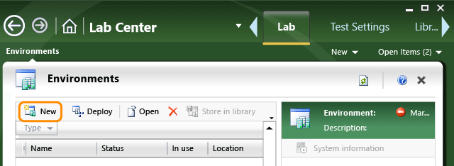

# SCVMM (virtual) environments
An *SCVMM lab environment* is a collection of virtual machines on which you can run tests. You create and manage them with [Microsoft Test Manager](../test/testing-your-application-using-microsoft-test-manager.md).  
  
 Typically, you use lab environments when you’re testing an application that runs on servers, such as a web application. You run the server components on lab machines, and run your web browser or client app on your own local machine.  
  
 By using SCVMM environments, you can:  
  
-   [Collect diagnostic data](../test/collect-more-diagnostic-data-in-manual-tests.md) while you perform your tests.  
  
-   Revert all the machines in an environment to a fresh state. You avoid the risk of using data or saved state from previous tests.  
  
-   Take a snapshot of the machines in the environment if you find a bug. This helps with diagnosis.  
  
-   Create a new environment of test machines whenever you want.  
  
-   Create a library of environment templates, which you can use to create pre-configured test labs.  
  
     For example, you could set up a template that contains Internet Information Services (IIS) in one machine, and SQL Server in another. After you create an instance from this template, you only have to install your own server software.  
  
-   Create network-isolated environments that can be replicated without causing domain name clashes.  
  
 **Don’t have SCVMM in your team project collection yet?** You’ll need to [set up SCVMM](../test/configure-lab-management-for-scvmm-environments.md) and then [create a library of virtual machines](../test/create-virtual-machines-for-manual-testing.md).  
  
 As an alternative, you might want to consider using [standard environments](../test/standard-lab-environments.md). A standard environment can be created from any hardware or virtual machine. Standard environments take less upfront work to set up. They let you reserve machines for tests and collect diagnostic data, but you can’t save or reset their machine states.  
  
## Is there already an environment you could use?  
 [Open Microsoft Test Manager](../test/connect-microsoft-test-manager-to-your-team-project-and-test-plan.md) to find out if there is a lab environment that is ready and not in use.  Select an environment to see if it has the number and types of machines that you want.  
  
   
  
 If you find a suitable environment, [mark it in use and install your software on it](#use). After you’ve finished testing, don’t forget to unmark it.  
  
## Is there an environment template you could deploy?  
 SCVMM environments can be saved as templates. You can use a template to create a new environment. Find out whether there’s a suitable template in your project’s library.  
  
1.  Open the lab center, go to the **Library** page and look at the environments.  
  
2.  Select each item in the list and look at the number of machines and descriptions.  
  
3.  If you find a suitable environment template, deploy it. The environment will be copied and started.  
  
4.  On the lab environments page, wait until your new environment is ready.  
  
## Create an SCVMM environment  
 If you didn’t find a suitable environment or template, you can create one from your project’s collection of virtual machines.  
  
> [!TIP]
>  After you create your environment, consider saving it to the environment library. Do this after you configure any platform software such as a DBMS, but before you install the application you’re testing.  
  
 Start the new environment wizard.  
  
   
  
###   New environment: Type and Name  
   
  
 **Name**: The name of the environment, which must be unique within your team project.  
  
 **Description**: Optional.  
  
 **Type**: **SCVMM** This option is disabled? Then you need to [set up SCVMM](../test/configure-lab-management-for-scvmm-environments.md).  
  
 **Tags**: Tags are optional name-value pairs that you can set according to your project’s conventions. For example, your environments could use tags that indicate the purpose of the environment and the date after which it can be deleted.  
  
###   New environment: Machines  
 On the machines page, choose virtual machines or virtual machine templates to add to your environment.  
  
   
  
|||  
|-|-|  
|**Virtual machines available**:|This is the list of virtual machines and templates that are stored in your team project’s library. Typically, it includes machines in which different combinations of operating system, client applications, and server software have been installed.   For example, you could choose a web client and a web server.   If you can’t find an item with the features that you want, you can [set up a new virtual machine](../test/create-virtual-machines-for-manual-testing.md).|  
|Running|A running VM is a virtual machine that is in the running state. When you add a machine to your environment, you are effectively reserving it for your use, because it can’t be added to more than one environment at a time. When you delete your environment, a running VM will be returned to the pool of available machines.   If you compose your environment only of running VMs, it is usually ready to use immediately.|  
|Virtual Machine Template|When you add a virtual machine template to an environment, a new virtual machine is created. Copying takes a few minutes.   A new name and port ids are automatically generated. Your software and tests have to be able to deal with the changed server name.|  
|Stored Virtual Machine|When you add a virtual machine, an exact copy of it is made in your lab environment.   If you want to create more than one running copy of a stored VM, you will have to change the machine name. Typically, a stored virtual machine is part of a workgroup.   If you want to run tests on more than one set of machines without changing their domain names, consider setting up a [Network-Isolated Environment](../test/creating-and-using-a-network-isolated-environment.md).|  
|**Selected machines**:|You can set the following properties for each machine that you add to your environment.   Notice that you can add the same virtual machine or virtual machine template more than once. You must give the machines different names.|  
|Name|This name identifies the virtual machine within this environment. It is not the same as the computer name.   Don’t use commas in the name.|  
|Role|A role identifies the function of the machine in the environment. It can be used by [!INCLUDE[TCMshort](../test/includes/tcmshort_md.md)] to determine what components to install for testing purposes, and what testing data to collect. You can either select a role from the menu, or type any role name that you choose.   **NOTE:** The role is just an indication of the intended use of the machine. Lab Management does not automatically verify that the virtual machines or the templates have the necessary software. It doesn’t automatically install the software to fulfill these roles, either.|  
  
###   New Environment: Machine Properties  
   
  
|Tab|Machine Properties|  
|---------|------------------------|  
|**Hardware profile**|The amount of memory to assign to the virtual machine.|  
|**OS profile (templates only)**|Operating system type, computer name, administrator password, product key, domain, and workgroup for virtual machines deployed from the template.   **NOTE:**When you import a template from SCVMM, the secured administrator password and product key in the template are removed. You must re-enter this information.   **Operating system**: The value must match the operating system that is installed on the template because the customization that occurs when the template is converted to a virtual machine depends on the type and version of the operating system.   **Identity information**: Specifies how the computer name is created when a virtual machine is created from the template :   To have [!INCLUDE[vstsLabShort](../test/includes/vstslabshort_md.md)] generate a unique name, set **Computer name** to **\***.   To be prompted for a computer name when the template is deployed, clear the **Computer name** text box.   **Admin password**: The password to be used for the Administrator account. You can use this to log on to the machine when it is running.   **Product key**: Specifies the Window product key that is used to authenticate the operating system of the template. Make sure that the product key that you enter is valid for the version of the operating system on the virtual machine.   **Time zone**: Specifies the time zone used by virtual machines that are created from the template.   **Domain / Workgroup**: Specifies whether a virtual machine created from the template is joined to a Workgroup or to an Active Directory domain.   To specify a workgroup machine, choose workgroup and enter a name for the workgroup.   To specify a domain, choose **Domain (FQDN)** and then enter the fully qualified name of the domain. Then enter the account name and password of a user who has the permissions to join to the domain.   **[GUIRunOnce] Commands**: Specifies the scripts that are executed on a virtual machine that are created from the template when a user logs on to that virtual machine for the first time.|  
|**Machine tags**|User-defined custom properties. You can use them to indicate information such as:   Updates and applications installed in the virtual machine.   Language or locale of the operating system.   Features of the virtual machine such as network adapters and disks.|  
  
###   New Environment: Advanced  
 Advanced properties are used only for [automated system tests](../test/automate-system-tests.md).  
  
###   New Environment: Verification  
 Verify the environment to make sure that the properties you have set are valid.  
  
 If verification fails, you must fix the problem before you can finish.  
  
 If verification succeeds, you’re finished.  
  
   
  
 The new environment wizard closes, and your environment appears in the environments list under Type:SCVMM.  
  
 Creating the environment can take some time. You can see the progress of the process in the environments list. To see the progress of individual virtual machines, select the environment.  
  
 After a virtual machine has been created, you can log on to it if you want. Select the environment, and then connect to it from the context menu of the machine’s icon.  
  
##   Using an SCVMM environment  
  
1.  Mark the environment as in use to assign it to yourself.  
  
2.  Connect to the environment.  
  
       
  
     Log into its machines and configure any platform software you need, such as a database management system.  
  
       
  
3.  Might you want to create another environment like this, another time? Consider saving it to the environment library. You have to pause the environment first.  
  
4.  In the test plan properties, set the test environment to the environment you chose. This allows you to [collect event logs and other data](../test/collect-more-diagnostic-data-in-manual-tests.md) from the machines in the environment.  
  
       
  
5.  Install the latest build of your software.  
  
     [Perform your tests](../test/run-manual-tests-with-microsoft-test-manager.md).  
  
     Diagnostic information from the lab machines will be included in the test results, and will also be attached to any bug that you create.  
  
6.  When you’ve finished with the environment, choose unmark in use.  
  
     Alternatively, you could delete the environment, to remove its template machines, or to allow running virtual machines to be added to other environments.  
  
## Q & A  
 **Q: Which versions of SCVMM are supported?**  
 ||SCVMM 2008 R2|SCVMM 2012|SCVMM 2012 SP1|SCVMM 2012 R2|  
|-|-------------------|----------------|--------------------|-------------------|  
|Team Foundation Server 2010 SP1|||||  
|Team Foundation Server 2012 RTM|||||  
|Team Foundation Server 2012.4|||||  
|Team Foundation Server (2013 and later)|||||  
  
 **Q: Which versions of Hyper-V hosts are supported?**  
 ||Hyper-V 2008 R2|Hyper-V 2012|2012 SP1|Hyper-V 2012 R2|Guest OS (supported by SCVMM templates)|  
|-|----------------------|-------------------|--------------|----------------------|-----------------------------------------------|  
|SCVMM 2008 R2|||||Windows XP SP3 32/64, Windows Vista 32/64, Windows 7 32/64   Windows Server 2003 SP3 32/64, Windows Server 2008 32/64, Windows Server 2008 R2 64|  
|SCVMM 2012||||||  
|SCVMM 2012 SP1|||||Windows XP SP3 32/64, Windows Vista 32/64, Windows 7 32/64, Windows 8   Windows Server 2003 SP3 32/64, Windows Server 2008 32/64, Windows Server 2008 R2 64, Windows Server 2012 SP1|  
|SCVMM 2012 R2|||||Windows XP SP3 32/64, Windows Vista 32/64, Windows 7 32/64, Windows 8, Windows 8.1   Windows Server 2003 SP3 32/64, Windows Server 2008 32/64, Windows Server 2008 R2 64, Windows Server 2012 SP1, Windows Server 2012 R2|  
  
 You might want to look at [Upgrade SCVMM 2008 R2 to SCVMM 2012](../test/upgrade-scvmm-2008-r2-to-scvmm-2012.md).  
  
 **Q: The SCVMM option is disabled. What’s wrong?**  
 You need to [set up SCVMM](../test/configure-lab-management-for-scvmm-environments.md) for your Team Foundation project collection.  
  
 As an alternative, you might want to [create a standard lab environment](../test/standard-lab-environments.md) with existing physical or virtual machines. Standard environments take less work to set up, but you can’t save or reset their state.  
  
 **Q: There isn’t a virtual machine with the characteristics I want. How do I create a new one?**  
 **A:** See [Create virtual machines for SCVMM lab environments](../test/create-virtual-machines-for-manual-testing.md).  
  
 **Q: The status of my environment is Not Ready. What should I do?**  
 **A:** In the context menu of the environment in the environment list, choose **Repair**.  
  
 **Not Ready** means that a test agent is not properly configured on one of the environment’s machines. **Repair** attempts to install and reconfigure it. If it doesn’t work, make sure all the machines can communicate with the test controller. You can log in to a machine even though it is not ready. To find out where the test controller is running, open **Lab Center**, **Controllers**. The test controller is usually installed on the same computer as Team Foundation Server.  
  
 If a machine is running Windows XP, manually re-install and configure the test agent on that machine. The test agent installer comes with the Visual Studio installer.