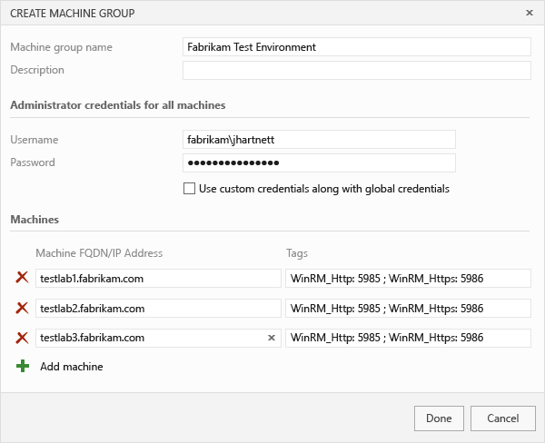

# Set up environments for continuous testing with builds
To test your app using different platforms and configurations, set up separate environments to run your app and tests with your build in Visual Studio Online or Team Foundation Server.  
  
## Set up machines to run your app and tests  
 You'll need to set up physical or virtual machines to run your app and tests, for example:  
  
-   Windows Server 2012 R2 with IIS to run your app  
  
-   Machines with the necessary browsers to run your tests  
  
 With Visual Studio Online, you can define environments that have physical and virtual machines, like Azure VMs and Azure resource groups. With Team Foundation Server, you can define environments using only physical machines.  
  
 If you want to use a PowerShell script to deploy your app, make sure to:  
  
-   Include that script in your solution or project.  
  
-   Enable PowerShell Remote on all your machines.  
  
## Define environments to run your app and tests  
 After your machines are set up, define environments where your app and tests will run with your build.  
  
1.  In Visual Studio Online or Team Foundation Server, go to your team project.  
  
2.  Add a machine group to define the environment for running your app.  
  
       
  
3.  Provide the environment's details.  
  
       
  
4.  Add another machine group to define the environment for running your tests.  
  
       
  
5.  Now [set up automated tests for your builds](../test/set-up-continuous-testing-for-builds.md).  
  
## See Also  
 [Run tests with your builds](../test/run-tests-with-your-builds.md)