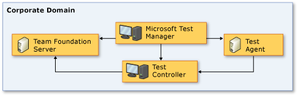
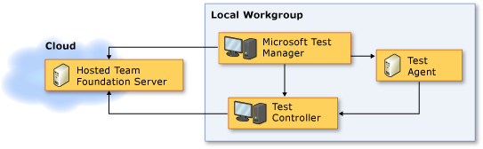
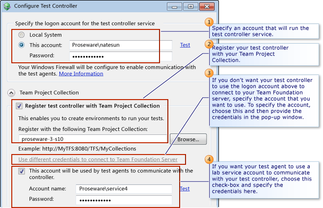

# Setting Up Test Controllers in Lab Environments
This topic describes how to install and configure a test controller, and how to configure test agents so that you can run tests in a lab environment using Microsoft Test Manager. You have to install and configure at least one test controller for your team project collection, before you create a lab environment in that team project collection. When you configure a test controller for a lab environment, you have to register it with your team project collection. You also have to configure the security of your test controller based on your topology.  
  
> [!NOTE]
>  Use this topic to set up a test controller when you configure a lab environment in Microsoft Test Manger. If you want use Visual Studio, instead of Microsoft Test Manager, to set up test controllers and test agents to manage tests, see [Setting Up Test Controllers and Test Agents to Manage Tests with Visual Studio](../test/setting-up-test-controllers-and-test-agents-to-manage-tests-with-visual-studio.md). For information about lab environments, see [Using a Lab Environment for Your Application Lifecycle](../test/using-a-lab-environment-for-your-application-lifecycle.md).  
  
   
  
 In most cases, when you create lab environments, you shouldn’t manually install test agents on the machines in your environments. Lab Management automatically installs and configures test agents in your lab environments when it creates them. These are the exceptions:  
  
-   If you are creating a network isolated environment, before you store the environment in your team project library, install test agents in the environment by running the "Microsoft Visual Studio Agents" CD or the downloaded ISO image.. However, you should not configure those test agents. For information about setting up a network isolated environment, see [Creating and using a network isolated environment](../test/creating-and-using-a-network-isolated-environment.md).  
  
-   If you’re creating a lab environment that contains any Windows XP machines, you must manually install test agents on the Windows XP machines, and then perform some extra steps. See [Configuring Lab Environments that Contain Windows XP or Windows Server 2003 Machines](../test/configuring-lab-environments-that-contain-windows-xp-or-windows-server-2003-machines.md).  
  
 Use these sections to install and configure a test controller to use with a lab environment.  
  
-   [Security for test controllers and test agents](#SettingUpTestControllersSecurity)  
  
-   [Installing and configuring a test controller](#SettingUpTestControllers)  
  
-   [Troubleshooting](#SettingUpTestControllersTroubleshooting)  
  
##   Security for test controllers and test agents  
 When you set up a test controller to use in a lab environment, there are multiple ways to configure security between your test controller, test agents, and Team Foundation Server. These ways use a combination of local machine accounts, domain accounts, and local and domain user groups. These configurations are more complicated when your lab environment is in a cross-domain or workgroup topology.  
  
 For example, if your test agents are in a different domain than your test controller, you can configure the test controller service by creating a local user account with the same user name and password on your test controller machine and on each test agent machine. However, you can simplify this process by configuring a lab service account on your test controller and then using it to run your test agents.  
  
### Using the lab service account  
 Local machine and domain accounts often don’t work well with certain network topologies. To address this problem, you can configure the lab service account on your test controller.  
  
 The lab service account allows test agents to connect to a test controller with a single user account, so you can avoid manually setting up user accounts on multiple machines. If the lab service account is already configured on the test controller, then when you create a lab environment, Microsoft Test Manager automatically retrieves the credentials of the account and uses them to configure the test agents. The lab service account also ensures that your test agents run and communicate with your test controllers using minimal permissions.  
  
 **Connecting to Team Foundation Server with alternate credentials**  
  
 When you configure the lab service account on your test controller, you can also specify alternate credentials that your test controller can use to connect to your Team Foundation Server or Team Foundation Service. This simplifies the configuration of test controllers in complex network topologies.  
  
 For example, if you want to register a test controller that is in a workgroup or in a domain that doesn't have a two-way trust with the domain for your Team Foundation Server, one solution is to create a local user account with the same user name and password on both the Team Foundation Server machine and the test controller machine. The better approach is to configure a lab service account on your test controller, and use an alternate domain account to connect to your Team Foundation Server. This approach allows you to use a local machine account as the logon account to run the test controller service without adding machine accounts to your Team Foundation server. Any user with administrator privileges on a test controller machine can configure the lab service account for that test controller and specify alternate credentials for connecting to Team Foundation Server or Team Foundation Service.  
  
 We recommend that you configure the lab service account with alternate credentials on your test controller for the following topologies:  
  
-   **Workgroup topology:**  
  
       
  
-   **Cross-domain topology (no trust and one-way trust):**  
  
       
  
       
  
-   **Team Foundation Service topology:**  
  
       
  
 **Using a Microsoft Account on Windows 8**  
  
 If you run test agents or test controllers on a Windows 8 machine, some additional scenarios require that you configure the lab service account on your test controller. In particular, if you configure a test controller on a Windows 8 machine, and you log onto the machine using a Microsoft account, you must configure the lab service account on that test controller and specify a set of alternate credentials that can connect to your Team Foundation Server. Otherwise, your test controller will not be able to connect to your Team Foundation Server. Similarly, when you configure a test agent on a Windows 8 machine, you can’t use a Microsoft account to log on to your test controller. Instead, you can use the lab service account.  
  
### User groups on test controller machines  
 When you configure a test controller, it creates user groups and services that help provide security for your environment. Use these groups to manage the security for user accounts on your test controller:  
  
|User Group|Created When You Install|Tasks that members can perform|  
|----------------|------------------------------|------------------------------------|  
|TeamTestControllerUsers|Test Controller|-   Start test runs -   View results|  
|TeamTestControllerAdmins|Test Controller|-   The same tasks as TeamTestControllerUsers -   Delete, pause, or postpone any test run -   Add, remove, or change the status of test agents -   Create environments|  
|TeamTestAgentService|Test Controller|-   Connect to a test controller from a test agent|  
  
 When a test agent connects to a test controller, the test controller checks that the user for the test agent service is a member of one of these groups. If the user doesn’t belong to any of these groups, the connection is rejected.  
  
 **Administering a Test Controller that is registered with an on-premise Team Foundation Server**  
  
 If your test controller is registered with a team project collection from and on-premise Team Foundation Server, you don’t have to add the user account for the test controller to these user groups to administer the test controller. If you are a member of the Project Collection Test Service Accounts or Project Collection Administrators group for your [!INCLUDE[esprtfs](../codequality/includes/esprtfs_md.md)], you can administer the test controller.  
  
 **Administering a test controller that is registered with Foundation Service**  
  
 If your test controller is registered with a team project collection from Team Foundation Service, access to the controller is limited to members of the TeamTestControllerUsers and TeamTestControllerAdmins groups. You must add appropriate users and groups to these groups to enable them to access the test controller.  
  
##   Installing and configuring a test controller  
 Here’s how to install a test controller.  
  
> [!CAUTION]
>  You must not install and run a test controller on a computer that is also a domain controller.  
  
   
  
### Required permissions  
 To install a test controller, you must be a member of the Administrators security group on the computer.  
  
##### To install and configure a test controller  
  
1.  Load the "Microsoft Visual Studio Agents" CD or downloaded ISO image, then launch the setup.exe file, which is located in the root folder.  
  
     The **Visual Studio Agents Setup** page is displayed. Follow the instructions in the installer.  
  
2.  To configure the test controller that you have installed, select **Configure test controller now**. Then choose **Configure** to start the Test Controller Configuration tool.  
  
     The **Configure Test Controller** dialog box is displayed.  
  
    > [!NOTE]
    >  You can run this tool to reconfigure your test controller at any time. Choose **Microsoft Visual Studio Test Controller Configuration Tool** from the **All Programs** menu.  
  
3.  Enter the username and password of the logon account of your test controller service. If you don't specify a different account to connect to your Team Foundation Server, your test controller will use this account to connect to your Team Foundation Server.  
  
    > [!NOTE]
    >  Null passwords aren’t supported for user accounts.  
  
4.  Register the test controller with the team project collection for the team project that contains your environments:  
  
    1.  Select **Register with Team Project Collection**.  
  
    2.  To find your team project collection, choose **Browse**, and then choose **Add** to add the server.  
  
         Optionally, you can type the name in **Register the test controller with the following Team Project Collection**. In this case, enter the full path. For example, http://\<server name>:8080/tfs/DefaultCollection.  
  
5.  (Optional) To configure your test controller for load testing, select **Configure for load testing**.  
  
     For more information about load testing, see [Web performance and load tests in Visual Studio](../test_notintoc/web-performance-and-load-tests-in-visual-studio.md) and [Using Test Controllers and Test Agents with Load Tests](../test/using-test-controllers-and-test-agents-with-load-tests.md).  
  
    1.  Type your [!INCLUDE[ssNoVersion](../datatools/includes/ssnoversion_md.md)] instance in **Create load test results database in the following SQL Server instance**.  
  
        > [!NOTE]
        >  If you don’t have SQL Server installed, you can use SQL Express. For more information about how to download and install SQL Express, visit the following [Microsoft Web site](http://go.microsoft.com/fwlink/?LinkId=178451). For more information about sizing considerations, see [Using Test Controllers and Test Agents with Load Tests](../test/using-test-controllers-and-test-agents-with-load-tests.md).  
  
6.  (Optional) If you want your test agents to use a lab service account on your test controller, choose **Use a lab service account to communicate with the test controller**, and then specify the credentials for the service account under **This account will be used by test agents to communicate with the controller**.  
  
7.  (Optional) If you want your test controller to use a different account to connect to your Team Foundation Server, choose **Use different credentials to connect to Team Foundation Server**, and then specify the credentials in the pop-up window.  
  
8.  To apply your changes, choose **Apply Settings**.  
  
     A **Configuration summary** dialog box is displayed. It shows the status of each step that is required to configure your test controller.  
  
9. To close the **Configuration summary** dialog box, choose **Close**. Then choose **Close** again to close the Test Controller Configuration Tool.  
  
     The **Visual Studio Agents Setup** dialog box is displayed. From here, you can install any other components that you require on this computer.  
  
     The test controller runs as a Windows Service named **Visual Studio Test Controller**. You can start and stop the service and view its properties in the **Services** tool in **Administrative Tools**.  
  
     You can configure and monitor your test controller and any registered test agents using the **Test Controller Manager** in the **Lab Center** for [!INCLUDE[TCMext](../codequality/includes/tcmext_md.md)].  
  
> [!NOTE]
>  When you install a test controller on a computer, the registry entry HKEY_LOCAL_MACHINE\SYSTEM\CurrentControlSet\Control on that computer is set. This value silently changes the Service Control Manager time-out from 30 seconds to 10 minutes to provide more time for the test controller to start to communicate with [!INCLUDE[esprtfs](../codequality/includes/esprtfs_md.md)] services. For more information, see [A service does not start, and events 7000 and 7011 are logged in Windows Server 2003](http://go.microsoft.com/fwlink/?LinkId=167904).  
  
 If you install the test controller on a computer that runs an operating system with user account control (UAC) the registry key HKLM\SOFTWARE\Microsoft\Windows\CurrentVersion\Policies\system\ LocalAccountTokenFilterPolicy is set to a value of 1. This disables remote restrictions of UAC to allow remote authentication if a test agent is configured to use a local account. See [Description of User Account Control and Remote Restrictions](http://go.microsoft.com/fwlink/?LinkId=181060).  
  
##   Troubleshooting  
 To configure and monitor the test controller and any registered agents, use the Test Controller Manager in the Lab Center of Microsoft Test Manager.  
  
 Test agents should be in the ready state. If a test agent isn’t in the list of test agents, or the test agent is in the disconnected state, you can run the Test Agent Configuration Tool on the computer where the agent is installed and the Test Controller Configuration Tool on the computer where the controller is installed.  
  
> [!NOTE]
>  To run the configuration tools, choose **All Programs**, **Microsoft Visual Studio**, Microsoft **Visual Studio Test Agent Configuration Tool** or **Microsoft Visual Studio Test Controller Configuration Tool** as required.  
  
 Verify the following criteria for the test controller:  
  
-   The user for the test controller is a member of the TeamTestControllerAdmins group or the user for the test controller is a member of the Administrators group.  
  
-   Make sure that the test controller is configured for the correct team project collection.  
  
    > [!NOTE]
    >  You might want to run with elevated permissions, or restart your computer, if the test controller is running on the same machine as Visual Studio and you have added the user to the TeamTestControllerAdmins group when this user is the active user.  
  
-   The account that you use for the test controller is a member of the Project Collection Test Service Accounts group for the Team Project Collection, or the account that you use to run the test controller configuration tool is a member of the Project Collection Administrator group.  
  
 Verify the following settings for the test agent:  
  
-   The user for the test agent is a member of the TeamTestAgentService group on the computer where the test agent in installed and on the computer where the test controller is installed.  
  
    > [!NOTE]
    >  If this user is the current user, when you add this user to the test controller machine, you must log off or restart this computer.  
  
-   The correct test controller name and port have been entered.  
  
 You can also examine the %LOCALAPPDATA%\Temp\TestControllerConfigUI.log and TestAgentConfigUI.log files for errors and more details. You can open these files from the link on the **Configuration Summary** page when you use the **Test Agent** or **Test Controller configuration** tools.  
  
 If you are running Windows Firewall, the test controller setup adds the following exceptions to your firewall. Make sure that this exception has been added.  
  
|Exception|Reason|  
|---------------|------------|  
|QTController.exe|Enable communication with the test controller.|  
  
## See Also  
 [Install and configure test agents](../test/install-and-configure-test-agents.md)   
 [Test on a lab environment](../test/test-on-a-lab-environment.md)