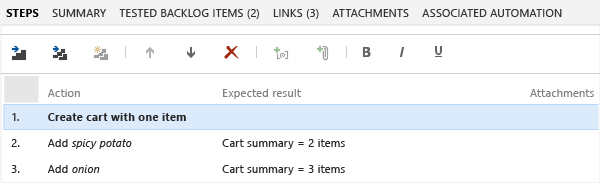
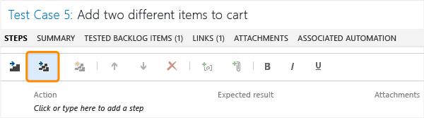

# Share steps between test cases
When you [plan manual tests](../test/planning-manual-tests-using-the-web-portal.md) there are some sequences of steps, such as logging in, that occur in many test cases. To avoid having to enter these sequences again and again, create *shared steps*.  
  
## Create shared steps  
 While you’re editing a test case, select a sequence of steps that you want to share:  
  
-     
  
 The steps you selected are replaced with a link to the new shared steps work item:  
  
-     
  
## Use shared steps  
 Now you can use the shared steps in another test case:  
  
-     
  
 A TFS query opens. Run it to find the steps you want to insert:  
  
-     
  
## When you run a test with shared steps  
 When you [run a test](../test/running-manual-tests-using-the-web-portal.md), you can either mark the whole shared sequence as passed or failed, or mark each step separately:  
  
-     
  
## Q & A  
 **Q: How do I use shared steps in Microsoft Test Manager?**  
 It’s almost exactly the same in [Microsoft Test Manager](../test/testing-your-application-using-microsoft-test-manager.md) as in the web portal. The buttons look slightly different.  
  
 **Q: Can I find all my shared steps, and all the test cases where they are used?**  
 Yes. [Open Microsoft Test Manager](../test/connect-microsoft-test-manager-to-your-team-project-and-test-plan.md) and look under **Organize**, **Shared Steps Manager**.  
  
 Shared steps and test cases are stored as work items in Team Foundation Server.  
  
 **Q: Can I share steps between test plans and team projects?**  
 Yes. But don’t forget that if you edit shared steps, the changes appear in every place you use them.  
  
 **Q: Can I use parameters in shared steps?**  
 Yes. You provide values for the [parameters](../test/repeat-a-test-with-different-data.md) in the test cases where the shared steps are used.  
  
 You don’t have to provide values in the shared steps definition. However, you can provide one default row of values, which is used when you create an action recording of a standalone shared step.