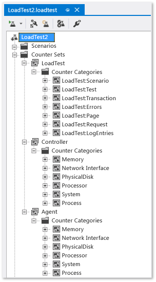

# Specify counter sets and threshold rules for computers in a load test

Load tests provide named counter sets that are useful when you analyze performance counter data. The counter sets are organized by technology and include Application, ASP.NET, .NET Application, IIS, and SQL. When you create a load test by using the **New Load Test Wizard**, you add an initial set of counters. These offer you a set of predefined and important counter sets for your load test. You manage your counters in the **Load Test Editor**.

[!INCLUDE [web-load-test-deprecated](includes/web-load-test-deprecated.md)]

> [!NOTE]
> If your load tests are distributed across remote machines, controller and agent counters are mapped to the controller and agent counter sets. For more information about how to use remote machines in your load test, see [Test controllers and test agents](configure-test-agents-and-controllers-for-load-tests.md).

Counter sets are gathered on computers that you specify. The association between a counter set and a computer that is used during a load test is a *counter set map*. For example, the web server that you are testing might have ASP.NET, IIS, and .NET application counter set mappings.

By default, performance counters are collected on the controller and agents. For more information, see [Test controllers and test agents](configure-test-agents-and-controllers-for-load-tests.md).

It is important that you add the servers under test to the list of computers on which to collect counters. Then, any important system data is collected and monitored during the load test.

## Tasks

|Tasks|Associated Topics|
|-|-----------------------|
|**Manage counter sets for your load test:** After you create your load test, you can edit the Counter Set in the Load Test Editor. Managing counter sets involves choosing the set of computers from which you want to collect performance data and assigning a set of counter sets to collect from each individual computer. You manage your counters in the Load Test Editor.|-   [How to: Manage counter sets](../test/how-to-manage-counter-sets-using-the-load-test-editor.md)|
|**Add counter sets to your load test:** When you create a load test with the **New Load Test Wizard**, you add an initial set of counters. These offer you a set of predefined counter sets for your load test. After you create a load test, you can add new counters to existing counter sets using the Load Test Editor.|-   [How to: Add counters to counter sets](../test/how-to-add-counters-to-counter-sets-using-the-load-test-editor.md) -   [How to: Add custom counter sets](../test/how-to-add-custom-counter-sets-using-the-load-test-editor.md)|
|**Specify a threshold rule using counters for your load test:** A threshold rule is a rule that is set on an individual performance counter to monitor system resource usage during a load test. Counter set definitions contain predefined threshold rules for many key performance counters. Threshold rules in load tests compare a performance counter value with either a constant value or another performance counter value.|-   [How to: Add a threshold rule](../test/how-to-add-a-threshold-rule-using-the-load-test-editor.md)|
|**Assign friendly names to the computers to which counter sets are mapped:** You can add computer tags that enable you to apply an easily recognized name to a computer. The tags are displayed in the **Counter Set Mappings** node for the tree in the Load Test Editor. More important, the tags are displayed in Excel reports that help stakeholders identify what role the computer has in the load test, for example, "Web Server1 in lab2" or "SQL Server2 in Phoenix office".   For more information, see [Report load tests results for test comparisons or trend analysis](../test/compare-load-test-results.md).||

## Use counter sets

The load test tools collect and graph performance data by using counters over time. Counter data is collected at user-specified intervals during a load test run. For more information, see [How to: Specify the sample rate](../test/how-to-specify-the-sample-rate-for-a-load-test.md). You can view the counters at run time or you can view them after a load test run by using the *Load Test Analyzer*.

Counter data is gathered on the server and on any computer where a test is run. If you have set up a set of agent computers on which to run your tests, counters are gathered on those computers also.

There are three counter categories: percentages, counts, and averages. Some examples are % CPU usage, SQL Server lock counts, and IIS requests per second.

Performance data for individual HTTP requests is reported by the computer that runs a test. such as an agent computer. For requests, you might monitor data such as Average Time to First Byte, Response Time, and Requests per Second.

To ease collection of performance data on a web server, Visual Studio Enterprise also provides predefined, named counter sets, based on technology for use in load tests. These sets are useful when you are analyzing a server that is running IIS, ASP.NET, or SQL Server. Counters not provided in the default set of counter can be added by using the Load Test Editor. It is important that you add the computers or servers under test to your load test to make sure that you can monitor resource use on these computers. For more information, see [How to: Manage counter sets](../test/how-to-manage-counter-sets-using-the-load-test-editor.md).

Results analysis of load runs frequently requires domain-specific knowledge of a particular area in order to know what data to gather, where to set threshold rules, and how to tell when a measurement reflects a specific problem in the application. For more information, see [About threshold rules](#about-threshold-rules).

### Performance counter sampling interval considerations

Select an appropriate value for the **Sample Rate** property in the load test run settings based on the length of your load test. A smaller sample rate, such as the default value of five seconds, requires more space in the load test results database. For longer load tests, increasing the sample rate reduces the amount of data collected. For more information, see [How to: Specify the sample rate](../test/how-to-specify-the-sample-rate-for-a-load-test.md).

The following are some guidelines for sample rates.

|Load test duration|Recommended sample rate|
|-|-----------------------------|
|\< 1 Hour|5 seconds|
|1−8 Hours|15 seconds|
|8−24 Hours|30 seconds|
|> 24 Hours|60 seconds|

## Store performance data

During a load test run, the performance counter data is collected and stored in the *Load Test Results Repository*. For more information, see [Manage load test results in the load test results repository](../test/manage-load-test-results-in-the-load-test-results-repository.md).

## About threshold rules

A *threshold rule* is a rule that is set on an individual performance counter to monitor system resource usage during a load test. Counter set definitions contain predefined threshold rules for many key performance counters. For more information, see [Use counter sets to help analyze performance counter data in load tests](../test/specify-counter-sets-and-threshold-rules-for-load-testing.md).

## Threshold rules and levels

When you create threshold rules in your load tests, you choose between two types of rules:

Compare Constant&mdash;Compare a performance counter value with a constant value.

Compare Counters&mdash;Compare a performance counter value with another performance counter value.

When you create threshold rules, you also set the levels for the rule. The levels are the warning threshold and the critical threshold. When you view a load test run, warning level threshold violations are indicated by a yellow symbol, and critical level threshold violations are indicated by a red symbol.

## The Alert If Over property

Set the **Alert If Over** property to **True** to indicate that exceeding a threshold is a problem. For example, if the threshold rule is set on **% Processor Time**, and you want to be alerted if the value is greater than 90, use the **Compare Constant** rule type, set the **Critical Threshold Value** to 90, and set **Alert If Over** to **True**.

Set the **Alert If Over** property to **False** to indicate that falling below a threshold is a problem. For example, if the threshold rule is set on **Requests/Sec**, and you want to be alerted if the value is below 50, use the **Compare Constant** rule type, set the **Critical Threshold Value** to 50, and set **Alert If Over** to **False**.

## See also

- [How to: Add a threshold rule](../test/how-to-add-a-threshold-rule-using-the-load-test-editor.md)
- [Analyze threshold rule violations](../test/analyze-threshold-rule-violations-in-load-tests.md)
