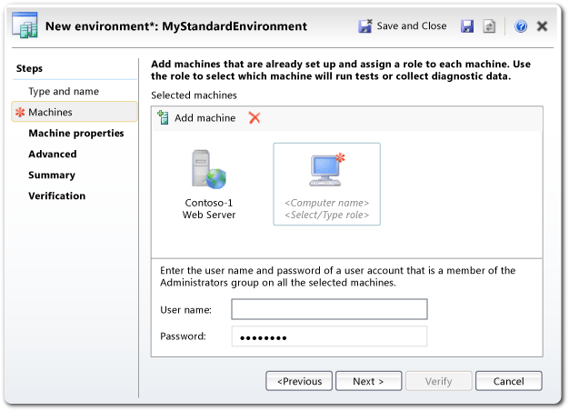

# Standard lab environments
A standard lab environment is a collection of computers that can be managed as a group, as part of your tests. The computers can be physical or virtual Windows machines.  
  
 Typically, you use lab environments when you’re [testing an application](../test/test-apps-early-and-often.md) that runs on servers, such as a web application. You run the server components in lab machines, and run your web browser or client app on your own local machine.  
  
 Lab environments let you [collect diagnostic data](../test/collect-more-diagnostic-data-in-manual-tests.md) from the server machines while you perform your tests from your client machine. For example, you can collect event logs or Intellitrace data. If you log a bug during your test, this data will be attached to the bug report, making the fault easier to diagnose.  
  
 Lab environments also provide a convenient way to assign computers to testers. A computer can only be in one lab at a time, and you can mark a lab as in use by you for a particular purpose.  
  
   
  
 As an alternative to standard lab environments, you might want to consider [SCVMM environments](../test/scvmm--virtual--environments.md). An SCVMM environment is made of virtual machines. It lets you reset the machines to a fresh state before you start testing; and you can take snapshots of the machine states to help diagnose bugs.  
  
## Is there already an environment that you could use?  
 Open Lab Center in Microsoft Test Manager to find out if there is a lab environment that is ready and not in use.  Select an environment to see if it has the number and types of machines that you want.  
  
   
  
 If you find a suitable environment, [mark it in use and install your software on it](#use). After you’ve finished testing, don’t forget to unmark it.  
  
 If you don’t find a suitable environment, you’ll have to create one.  
  
##   Create a standard environment  
 Both physical computers and virtual machines can be added to a standard environment. If you have virtual machines that are managed by SCVMM, it’s better to [add them to an SCVMM environment instead](../test/scvmm--virtual--environments.md).  
  
 Each machine has to be running one of these operating systems: Windows XP SP3, Windows Vista SP2, Windows 7 SP1, Windows 8, Windows Server 2008, or Windows Server 2012.  
  
1.  On each machine:  
  
    -   Configure a user account and a password that has administrative privileges. All the machines must have the same username and password. It doesn’t matter whether the acoount is a domain or a local account.  
  
    -   Make sure that file sharing is enabled.  
  
2.  Open Microsoft Test Manager and [connect to your team project and test plan](../test/connect-microsoft-test-manager-to-your-team-project-and-test-plan.md).  
  
3.  Start the new environment wizard.  
  
       
  
     If this step doesn’t work, you might need to [install a test controller on your Team Foundation Server](../test/setting-up-test-controllers-in-lab-environments.md). You can install it from the Visual Studio installation disc. Link the test controller to your team project collection.  
  
4.  Choose standard environment.  
  
       
  
5.  Define the environment by adding the computers. Enter the fully-qualified domain name of each computer.  
  
     Set the role of each machine, for example to Web Server or Database Server. You can either choose a role from the drop-down list, or invent your own role name. In manual testing, the role names help you remember how you intend to set up each machine.  
  
       
  
     You don’t need to enter anything in the machine properties or advanced pages. (These are used for automated tests.)  
  
6.  Choose verify to complete and then close the wizard. The environment appears in the environments list.  
  
       
  
     The environment might remain in the preparing state for several minutes.  
  
 When the environment’s status is ready, this means that test agents have been installed on each machine, and that they are communicating with your team project’s test controller. The test agents let you [collect diagnostic data](../test/collect-more-diagnostic-data-in-manual-tests.md) from its machines while you run your test.  
  
 At this stage, you can:  
  
-   Choose connect to log into the environment’s machines.  
  
-   Reserve the environment and its machines for yourself by marking it as in use.  
  
##   Using a standard environment  
  
1.  Mark the environment as in use to assign it to yourself.  
  
2.  Connect to the environment.  
  
       
  
     Log into its machines and install the latest build of your software.  
  
       
  
3.  In testing Center, plan, properties, set the test environment to the environment you chose. This allows you to [collect event logs and other data](../test/collect-more-diagnostic-data-in-manual-tests.md) from the machines in the environment.  
  
       
  
4.  [Perform your tests](../test/run-manual-tests-with-microsoft-test-manager.md).  
  
     Diagnostic information from the lab machines will be included in the test results, and will also be attached to any bug that you create.  
  
5.  When you’ve finished with the environment, choose unmark in use.  
  
     Alternatively, you could delete the environment, to allow the machines to be added to other environments.  
  
##   Q & A  
 **Q:** The status of my lab environment is Not Ready. What should I do?  
 **A:** On the context menu of the environment, choose **Repair**. The repair will take a few minutes.  
  
 This status means that the test agent is not installed and correctly configured on one of the machines in the environment. The repair operation logs into the machines and installs and configures the agent.  
  
 If the repair doesn’t work, make sure the test machine and test controller machine are able to talk. Open Lab Center, Test Controllers to find out where the test controller is installed – typically, it is on the same machine as TFS. You can connect to the environment and log into its machines even if it is Not Ready.  
  
 **Q:** What machines can I include in a standard lab environment?  
 **A:** Any physical or virtual machine that is running Windows 7, Windows 8, Windows Server 2008, or Windows Server 2012.  
  
 If you have a virtual machine that is running on SCVMM, it’s better to add it to an SCVMM environment.  
  
 **Q:** Can I include a Windows XP machine in a lab environment?  
 **A:** Yes, but you have to manually install and configure the test agent on that machine. The installer for the test agent comes with Visual Studio installer. After installing it, run the test agent configuration app and enter the location of the test controller.