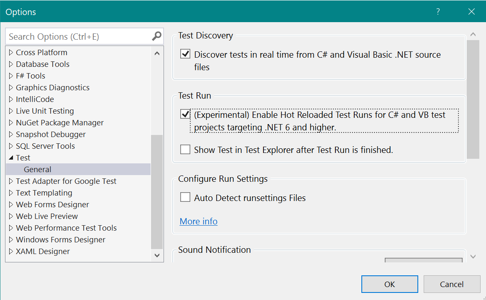

# Test Execution with Hot Reload

Test runs in Visual Studio involve building the project to update the binaries on disk before using [Test Platform](https://github.com/microsoft/vstest/) to execute your tests. The build time inside Visual Studio can vary depending on the [kind of changes](https://github.com/dotnet/roslyn/blob/296e0fada42f241d338b169c3c6c6189101ef0b7/docs/wiki/EnC-Supported-Edits.md) made to the code. For larger solutions, builds can be the most expensive part of the test run. 
In Visual Studio 2022 and later, test execution with hot reload can be enabled to speed up test execution by skipping builds for supported scenarios.

## What is supported?
- C# and VB projects targeting .NET 6.0 and higher
- Test projects built for the DEBUG configuration
- Visual Studio 2022 and higher

## Enable Test Execution with Hot Reload
Enable this feature by choosing **Test** > **Options** > **"(Experimental) Enable Hot Reloaded Test Runs for C# and VB test projects targeting .NET 6 and higher"**.

## Why is it Experimental?
This is a new way of test execution where we change a widely used path of validating code. We also expect the user experience around this feature to change as we receive more feedback from users. For these two reasons, we have currently labeled this feature as "experimental".

## How it works
Once the option is enabled, Test Explorer will automatically use test execution with hot reload when possible. If a hot reload is not possible, it will fall back to the regular behavior of building and running tests. As a user running tests, you do not need to make any changes to your workflow (that is, continue to edit code and run tests).

Under the hood, we are using the same [Edit and Continue](/visualstudio/debugger/how-to-enable-and-disable-edit-and-continue) infrastructure that exists in the newly released [Hot Reload experience for editing C#/VB code at runtime](https://devblogs.microsoft.com/dotnet/introducing-net-hot-reload/) to determine the changes made. For this reason, we hot reload only when there are no "rude edits", in which case we fall back to building your tests before executing them. For more details on supported edits, read the [Edit and Continue documentation](https://github.com/dotnet/roslyn/blob/296e0fada42f241d338b169c3c6c6189101ef0b7/docs/wiki/EnC-Supported-Edits.md)

## How much faster will the test execution be?
There are many variables that come into play when estimating how much time this feature will save you. For example:
- How long the project build takes.
- What kind of edit was made.
- How large the file is where the edit was made.
- Where the edit was made (if it was a leaf project or not).

Ultimately, the speed improvements will be directly related to the build time that would have occurred in that specific test run.

### Notes
- The first test run after enabling the option or opening Visual Studio will incur a project build.
- Files in the editor may not be saved when tests are run. To resolve these and before you check in, make sure you do a full build (Ctrl+Shift+B).
- The binaries on disk are not updated when hot reloaded test execution occurs.
- Hot reloaded test execution does not work with "**Test** > **Run All Tests**", "**Run All Tests in View**" in Test Explorer, nor does it work with **Run All Tests** from the solution node in Solution Explorer. The feature does not work with these commands because they currently guarantee building the entire solution.
- When tests with unsupported target frameworks (lower than .NET 6.0) run, a project build occurs.
- If you see any inconsistencies between what's on disk and what Test Explorer shows, please consider a solution/project build  using **Ctrl+Shift+B** and then run tests. Any explicit build replaces the hot reload test results with the regular full-build test results.

## Known issues
- Test execution with hot reload does not occur in the following scenarios:
  - Code Coverage
  - Live Unit Testing
  - Profiling
  - Debugging
- Stack traces may not be readable with the presence of unreadable tokens. This issue is being tracked [here](https://github.com/dotnet/runtime/issues/56335) and is planned for a fix in .NET 7.0
  - The recommended workaround in this case is to build your project and re-run the test.

## Your feedback matters
As noted before, for this experimental feature to be complete we require your feedback. If you have a suggestion for how the experience should be, or encounter any problems, please take a moment to report issues to us. Only with your feedback can we ensure that critical problems are resolved, and future decisions are prioritized based on your input.

To reach us please use the [Visual Studio feedback mechanism](https://developercommunity.visualstudio.com/home).
