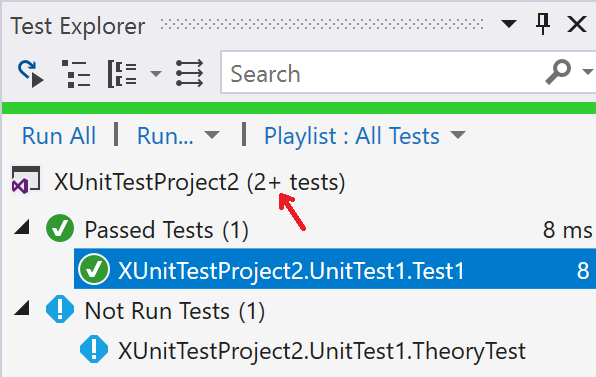
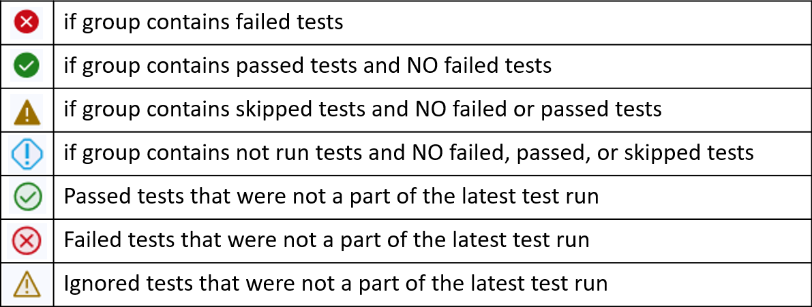

# Visual Studio Test Explorer FAQ

## Dynamic test discovery

**Test Explorer is not discovering my tests that are dynamically defined (for example, theories, custom adapters, custom traits, and #ifdef statements). How can I make sure it discovers these tests?**

Build your project to run assembly-based discovery.

[Real-time test discovery](https://devblogs.microsoft.com/dotnet/real-time-test-discovery/) is source-based test discovery. It can't discover tests that use theories, custom adapters, custom traits, `#ifdef` statements, and more because they're defined at runtime. A build is required for those tests to be accurately found.

In Visual Studio 2017 version 15.6 and later, assembly-based discovery (the traditional discoverer) runs only after builds. This setting means real-time test discovery finds as many tests as it can while you're editing. Assembly-based discovery allows dynamically defined tests to appear after a build.

Real-time test discovery improves responsiveness, but it still allows you to get complete and precise results after a build.

## Test Explorer plus (+) symbol

**What does the plus symbol that appears in the top line of Test Explorer mean?**

The plus (+) symbol indicates that more tests might be discovered after a build when assembly-based discovery runs. This symbol appears if dynamically defined tests are detected in your project.



## Real-time test discovery

**Tests now appear in Test Explorer while I type, without requiring me to build my project. What changed?**

This feature is called [real-time test discovery](https://devblogs.microsoft.com/dotnet/real-time-test-discovery/). It uses a Roslyn analyzer to find tests and populate Test Explorer in real time, without requiring you to build your project. For more information about test discovery behavior for dynamically defined tests such as theories or custom traits, see [Dynamic test discovery](#dynamic-test-discovery) earlier in this article.

## Compatibility for real-time test discovery

**What languages and test frameworks can use real-time test discovery?**

[Real-time test discovery](https://devblogs.microsoft.com/dotnet/real-time-test-discovery/) works only for the managed languages (C# and Visual Basic), because it's built via the Roslyn compiler. For now, real-time test discovery works only for the xUnit, NUnit, and MSTest frameworks.

## Test Explorer logs

**How can I turn on logs for Test Explorer?**

Go to **Tools** > **Options** > **Test** and find the **Logging** section there.

## UWP test discovery

**Why are my tests in UWP projects not discovered until I deploy my app?**

Universal Windows Platform (UWP) tests target a different runtime when the app is deployed. To find tests accurately for UWP projects, you need to not only build your project but also deploy it.

## Test Explorer sorting

**How does sorting test results work in the hierarchy view?**

The hierarchy view sorts tests alphabetically, not by outcome. Previous group-by settings sorted test results by outcome and then alphabetically. You can still enable sorting by outcome by right-clicking the column header in Test Explorer, enabling the **State** column, and then selecting the **State** column header to apply sorting on that column. You can provide feedback about the design in [this GitHub issue](https://github.com/Microsoft/vstest/issues/1425).

## Test Explorer hierarchy view

**In the hierarchy view, there are passed, failed, skipped, and not-run icons next to parent-node groupings. What do these icons mean?**

The icons next to the **Project**, **Namespace**, and **Class** groupings show the state of the tests within each grouping. See the following table.



## Searches by file path

**Why is there is no longer a file path filter in the Test Explorer search box?**

The file path filter in the Test Explorer search box was removed in Visual Studio 2017 version 15.7. This feature had low usage, and Test Explorer can retrieve test methods faster by leaving it out. If this change interrupts your development flow, let us know by submitting feedback on [Developer Community](https://aka.ms/feedback/suggest?space=8).

## Removal of undocumented interfaces

**Some test-related APIs are no longer present in Visual Studio 2019. What changed?**

In Visual Studio 2019, some test window APIs that were previously marked public but were never officially documented will be removed. They were marked as deprecated in Visual Studio 2017 to give extension maintainers an early warning. To our knowledge, very few extensions found these APIs and took a dependency on them. They include `IGroupByProvider`, `IGroupByProvider<T>`, `KeyComparer`, `ISearchFilter`, `ISearchFilterToken`, `ISearchToken`, and `SearchFilterTokenType`.

If this change affects your extension, let us know by filing a bug on [Developer Community](https://aka.ms/feedback/suggest?space=8).

## Test adapter NuGet reference

**Why don't my tests run in Visual Studio 2017 version 15.8, even though they're discovered?**

All test projects must include their .NET test adapter NuGet reference in their .csproj file. If they don't, the following test output appears on the project if discovery by a test adapter extension starts after a build, or if you try to run the selected tests:

> **Test project {} does not reference any .NET NuGet adapter. Test discovery or execution might not work for this project. It is recommended to reference NuGet test adapters in each .NET test project in the solution.**

Instead of using test adapter extensions, projects are required to use test adapter NuGet packages. This requirement greatly improves performance and causes fewer problems with continuous integration. Read more about the deprecation of .NET test adapter extensions in the [release notes](/visualstudio/releasenotes/vs2017-relnotes-v15.8#testadapterextension).

## UWP TestContainer not found

**Why are my UWP tests no longer running in Visual Studio 2017 version 15.7 and later?**

Recent UWP test projects specify a build property that allows better performance for identifying test apps. If you have a UWP test project that was initialized before Visual Studio version 15.7, you might see this error in **Output** > **Tests**:

> **System.AggregateException: One or more errors occurred. ---> System.InvalidOperationException: The following TestContainer was not found {} at Microsoft.VisualStudio.TestWindow.Controller.TestContainerProvider \<GetTestContainerAsync>d__61.MoveNext()**

To fix this error:

- Update the build property for your test projects by using the following code:

  ```XML
  <UnitTestPlatformVersion Condition="'$(UnitTestPlatformVersion)' == ''">$(VisualStudioVersion)</UnitTestPlatformVersion>
  ```

- Update the TestPlatform SDK version by using the following code:

  ```XML
  <SDKReference Include="TestPlatform.Universal, Version=$(UnitTestPlatformVersion)" />
  ```

## Preview features

**How can I use preview features in Visual Studio 2019?**

In Visual Studio 2019, you can opt in to preview features in **Tools** > **Options** > **Environment** > **Preview Features**.

## Related content

- <xref:Microsoft.VisualStudio.TestTools.UnitTesting?displayProperty=fullName>
- [Create and run unit tests for existing code](/previous-versions/dd293546(v=vs.110))
- [Unit test your code](unit-test-your-code.md)
- [FAQ for live unit testing](live-unit-testing-faq.yml)
