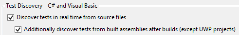

# Visual Studio Test Explorer FAQ
::: moniker range=">=vs-2019"

## Where is group by Traits in Visual Studio 2019?
This Trait grouping was moved to be a column. With the multi-tiered and customizable hierarchy in Visual Studio 2019 version 16.2, we thought including traits as a grouping created unneeded visual complexity. We are definitely listening to feedback on this design! https://developercommunity.visualstudio.com/content/problem/588029/no-longer-able-to-group-by-trait-in-test-explorer.html

For now, you can right click on the column in the Test Explorer and select Columns. Check the Trait column and it will appear in the Test Explorer. You can now filter this column by what traits you are interested in.


::: moniker-end

## Dynamic test discovery

**Test Explorer is not discovering my tests that are dynamically defined. (For example, theories, custom adapters, custom traits, #ifdefs, etc.) How can I discover these tests?**

::: moniker range=">=vs-2019"
Build your project to run assembly-based discovery.
::: moniker-end
::: moniker range="vs-2017"
Build your project and make sure assembly-based discovery is turned on in **Tools** > **Options** > **Test**.
::: moniker-end
[Real-time test discovery](https://go.microsoft.com/fwlink/?linkid=862824) is source-based test discovery. It can’t discover tests that use theories, custom adapters, custom traits, `#ifdef` statements, and more because they're defined at run time. A build is required for those tests to be accurately found. In Visual Studio 2017 version 15.6 and later, assembly-based discovery (the traditional discoverer) runs only after builds. This setting means real-time test discovery finds as many tests as it can while you're editing, and assembly-based discovery allows dynamically defined tests to appear after a build. Real-time test discovery improves responsiveness, but still allows you to get complete and precise results after a build.

## Test Explorer '+' (plus) symbol

**What does the '+' (plus) symbol that appears in the top line of Test Explorer mean?**

The '+' (plus) symbol indicates that more tests may be discovered after a build when assembly-based discovery runs. This symbol appears if dynamically defined tests are detected in your project.


::: moniker range="vs-2017"
## Assembly-based discovery

**Assembly-based discovery is no longer working for my project. How do I turn it back on?**

Go to **Tools** > **Options** > **Test** and check the box for **Additionally discover tests from built assemblies after builds.**


::: moniker-end

## Real-time test discovery

**Tests now appear in Test Explorer while I type, without having to build my project. What changed?**

This feature is called [Real-time test discovery](https://go.microsoft.com/fwlink/?linkid=862824). It uses a Roslyn analyzer to find tests and populate Test Explorer in real time, without requiring you to build your project. For more information about test discovery behavior for dynamically defined tests such as theories or custom traits, see [Dynamic test discovery](#dynamic-test-discovery).

## Real-time test discovery compatibility

**What languages and test frameworks can use Real Time Test Discovery?**

[Real-time test discovery](https://go.microsoft.com/fwlink/?linkid=862824) only works for the managed languages (C# and Visual Basic), since it's built using the Roslyn compiler. For now, real-time test discovery only works for the xUnit, NUnit, and MSTest frameworks.

## Test Explorer logs

**How can I turn on logs for the Test Explorer?**

Navigate to **Tools** > **Options** > **Test** and find the Logging section there.

## UWP test discovery

**Why are my tests in UWP projects not discovered until I deploy my app?**

UWP tests target a different runtime when the app is deployed. This means that to find tests accurately for UWP projects you not only need to build your project, but also deploy.

## Test Explorer sorting

**How does sorting test results work in the hierarchy view?**

The hierarchy view sorts tests alphabetically as opposed to by outcome. The other group by settings normally sort test results by outcome and then alphabetically. See the different group by options in the following image for comparison. You can provide feedback about the design [in this GitHub issue](https://github.com/Microsoft/vstest/issues/1425).


## Test Explorer hierarchy view

**In the hierarchy view, there are passed, failed, skipped, and not run icons next to parent-node groupings. What do these icons mean?**

The icons next to the Project, Namespace, and Class groupings show the state of the tests within that grouping. See the following table.


## Search by file path

**There is no longer a "File Path" filter in the Test Explorer search box.**

The file path filter in the **Test Explorer** search box was removed in Visual Studio 2017 version 15.7. This feature had low usage, and Test Explorer can retrieve test methods faster by leaving out this feature. If this change interrupts your development flow, let us know by submitting feedback on [Developer Community](https://developercommunity.visualstudio.com/).

## Remove undocumented interfaces

**Some test-related APIs are no longer present in Visual Studio 2019. What changed?**

In Visual Studio 2019, some test window APIs that were previously marked public but were never officially documented will be removed. They were marked as "deprecated" in Visual Studio 2017 to give extension maintainers an early warning. To our knowledge, very few extensions had found these APIs and taken a dependency on them. These include `IGroupByProvider`, `IGroupByProvider<T>`, `KeyComparer`, `ISearchFilter`, `ISearchFilterToken`, `ISearchToken`, and `SearchFilterTokenType`. If this change affects your extension, let us know by filing a bug on [Developer Community](https://developercommunity.visualstudio.com).

## Test adapter NuGet reference

**In Visual Studio 2017 version 15.8 my tests are discovered, but don't execute.**

All test projects must include their .NET test adapter NuGet reference in their .csproj file. If they don't, the following test output appears on the project if discovery by a test adapter extension is kicked off after a build, or if the user tries to run the selected tests:

**Test project {} does not reference any .NET NuGet adapter. Test discovery or execution might not work for this project. It is recommended to reference NuGet test adapters in each .NET test project in the solution.**

Instead of using test adapter extensions, projects are required to use test adapter NuGet packages. This requirement greatly improves performance and causes fewer issues with continuous integration. Read more about .NET Test Adapter Extension deprecation in the [release notes](/visualstudio/releasenotes/vs2017-relnotes-v15.8#testadapterextension).

::: moniker range="vs-2017"
> [!NOTE]
> If you are using the NUnit 2 Test Adapter and are unable to migrate to the NUnit 3 test adapter, you can turn off this new discovery behavior in Visual Studio version 15.8 in **Tools** > **Options** > **Test**.


::: moniker-end

## UWP TestContainer was not found

**My UWP tests are no longer being executed in Visual Studio 2017 version 15.7 and later.**

Recent UWP test projects specify a test platform build property that allows better performance for identifying test apps. If you have a UWP test project that was initialized before Visual Studio version 15.7, you may see this error in **Output** > **Tests**:

**System.AggregateException: One or more errors occurred. ---> System.InvalidOperationException: The following TestContainer was not found {} at Microsoft.VisualStudio.TestWindow.Controller.TestContainerProvider \<GetTestContainerAsync>d__61.MoveNext()**

To fix this error:

- Update your test project build property using the following code:

```XML
<UnitTestPlatformVersion Condition="'$(UnitTestPlatformVersion)' == ''">$(VisualStudioVersion)</UnitTestPlatformVersion>
```

- Update the TestPlatform SDK version using the following code:

```XML
<SDKReference Include="TestPlatform.Universal, Version=$(UnitTestPlatformVersion)" />
```

## Using feature flags

**How can I turn on feature flags to try out new testing features?**

Feature flags are used to ship experimental or unfinished parts of the product to avid users who would like to give feedback before the features ship officially. They may destabilize your IDE experience. Use them only in safe development environments, such as virtual machines. Feature flags are always use-at-your-own-risk settings. You can turn on experimental features with the [feature flags extension](https://marketplace.visualstudio.com/items?itemName=PaulHarrington.FeatureFlagsExtension), or through the developer command prompt.


To turn on a feature flag through the Visual Studio developer command prompt, use the following command. Change the path to where Visual Studio is installed on your machine, and change the registry key to the feature flag that you want.

```shell
vsregedit set “C:\Program Files (x86)\Microsoft Visual Studio\Preview\Enterprise" HKLM FeatureFlags\TestingTools\UnitTesting\HierarchyView Value dword 1
```

> [!NOTE]
> You can turn off the flag with the same command, by using a value of 0 instead of 1 after dword.

## See also

- <xref:Microsoft.VisualStudio.TestTools.UnitTesting?displayProperty=fullName>
- [Create and run unit tests for existing code](https://msdn.microsoft.com/e8370b93-085b-41c9-8dec-655bd886f173)
- [Unit test your code](unit-test-your-code.md)
- [Live unit testing FAQ](live-unit-testing-faq.md)
