# Create a coded UI test to test a UWP app

This article explains how to create a coded UI test for a Universal Windows Platform (UWP) app.

[!INCLUDE [coded-ui-test-deprecation](includes/coded-ui-test-deprecation.md)]

## Create a UWP app to test

The first step is to create a simple UWP app to run the test against.

1. In Visual Studio, create a new project using the **Blank App (Universal Windows)** template for Visual C# or Visual Basic.

   ::: moniker range="vs-2017"

   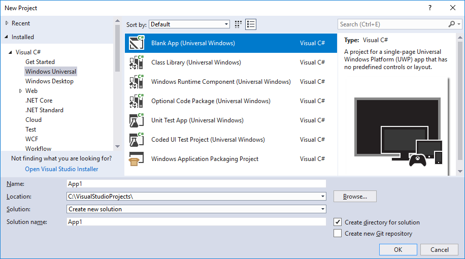

   ::: moniker-end

1. In the **New Universal Windows Platform Project** dialog, select **OK** to accept the default platform versions.

1. From **Solution Explorer**, open *MainPage.xaml*.

   The file opens in the **XAML Designer**.

1. Drag a button control and a textbox control from **Toolbox** to the design surface.

     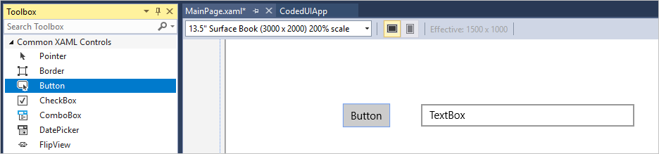

1. Give names to the controls. Select the textbox control, and then in the **Properties** window, enter **textBox** in the **Name** field. Select the button control, and then in the **Properties** window, enter **button** in the **Name** field.

1. Double-click the button control and add the following code to the body of the `Button_Click` method. This code simply sets the text in the textbox to the name of the button control, just to give us something to verify with the coded UI test we'll create later.

   ```csharp
   this.textBox.Text = this.button.Name;
   ```

   ```vb
   Me.textBox.Text = Me.button.Name
   ```

1. Press **Ctrl**+**F5** to run the app. You should see something like the following:

   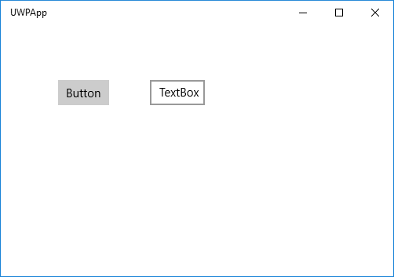

## Create a coded UI test

1. To add a test project to the solution, right-click on the solution in **Solution Explorer** and choose **Add** > **New Project**.

1. Search for and select the **Coded UI Test Project (Universal Windows)** template.

   ::: moniker range="vs-2017"

   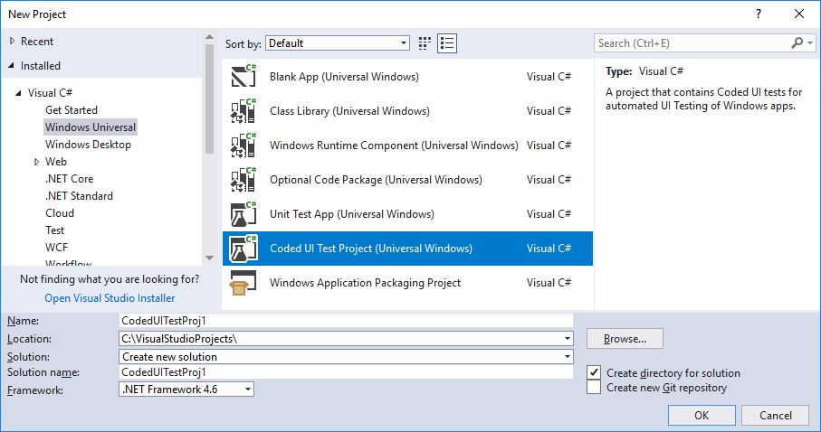

   ::: moniker-end

   > [!NOTE]
   > If you don't see the **Coded UI Test Project (Universal Windows)** template, you need to [install the coded UI test component](../test/use-ui-automation-to-test-your-code.md#install-the-coded-ui-test-component).

1. In the **Generate Code for Coded UI Test** dialog, select **Manually edit the test**.

   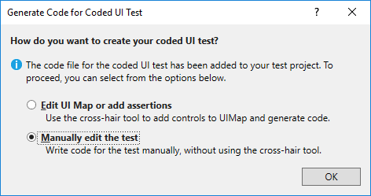

1. If your UWP app is not already running, start it by pressing **Ctrl**+**F5**.

1. Open the **Coded UI Test Builder** dialog by placing the cursor in the `CodedUITestMethod1` method and then choosing **Test** > **Generate Code for Coded UI Test** > **Use Coded UI Test Builder**.

1. Add the controls to the UI control map. Use the **Coded UI Test Builder** cross-hair tool to select the button control in the UWP app. In the **Add Assertions** dialog, expand the **UI Control Map** pane if necessary, and then select **Add control to UI Control Map**.

     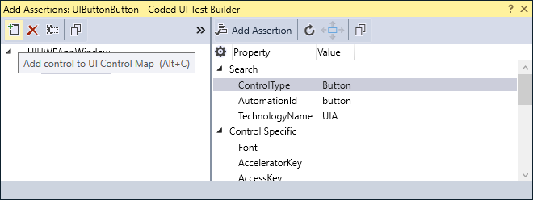

1. Repeat the previous step to add the textbox control to the UI control map.

1. In the **Coded UI Test Builder** dialog, select **Generate Code** or press **Ctrl**+**G**. Then select **Generate** to create code for changes to the UI control map.

     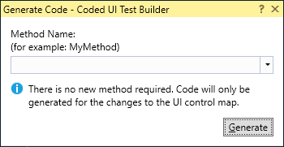

1. To verify that the text in the textbox changes to **button** when the button is clicked, click the button.

     

1. Add an assertion to verify the text in the textbox control. Use the cross-hair tool to select the textbox control, and then select the **Text** property in the **Add Assertions** dialog. Then, select **Add Assertion** or press **Alt**+**A**. In the **Message on Assertion Failure** box, enter **Textbox value is unexpected.** and then select **OK**.

     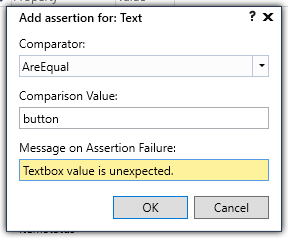

1. Generate test code for the assertion. In the **Coded UI Test Builder** dialog, select **Generate Code**. In the **Generate Code** dialog, select **Add and Generate**.

     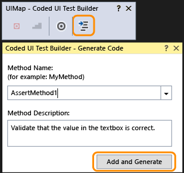

   In **Solution Explorer**, open *UIMap.Designer.cs* to view the added code for the assert method and the controls.

   > [!TIP]
   > If you're using Visual Basic,open *CodedUITest1.vb*. Then, in the `CodedUITestMethod1()` test method code, right-click on the call to the assert method `Me.UIMap.AssertMethod1()` and choose **Go To Definition**. *UIMap.Designer.vb* opens in the code editor, and you can view the added code for the assert method and the controls.

    > [!WARNING]
    > Do not modify the *UIMap.designer.cs* or *UIMap.Designer.vb* files directly. If you do, your changes will be overwritten when the test is generated.

    The assert method looks like this:

    ```csharp
    public void AssertMethod1()
    {
        #region Variable Declarations
        XamlEdit uITextBoxEdit = this.UIUWPAppWindow.UITextBoxEdit;
        #endregion

        // Verify that the 'Text' property of 'textBox' text box equals 'button'
        Assert.AreEqual(this.AssertMethod1ExpectedValues.UITextBoxEditText, uITextBoxEdit.Text, "Textbox value is unexpected.");
    }
    ```

    ```vb
    Public Sub AssertMethod1()
        Dim uITextBoxEdit As XamlEdit = Me.UIApp2Window.UITextBoxEdit

        'Verify that the 'Text' property of 'textBox' text box equals 'button'
        Assert.AreEqual(Me.AssertMethod1ExpectedValues.UITextBoxEditText, uITextBoxEdit.Text, "Textbox value is unexpected.")
    End Sub
    ```

1. Next, we need to obtain the **AutomationId** of the UWP [app](#create-a-uwp-app-to-test) that we want to test. Open the Windows **Start** menu to see the tile for the app. Then, drag the cross-hair tool  from the **Coded UI Test Builder** dialog to the tile for your app. When a blue box surrounds the tile, release your mouse.

   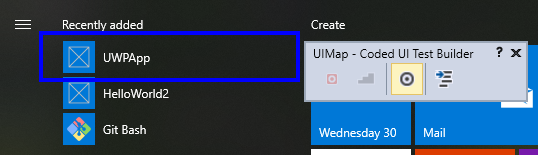

   The **Add Assertions** dialog box opens and displays the **AutomationId** for your app. Right-click **AutomationId** and choose **Copy Value to Clipboard**.

   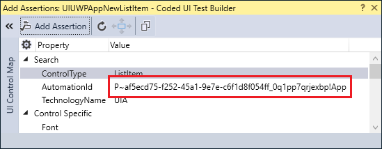

1. Add code to the test method to launch the UWP app. In **Solution Explorer**, open *CodedUITest1.cs* or *CodedUITest1.vb*. Above the call to `AssertMethod1`, add code to launch the UWP app:

   ```csharp
   XamlWindow.Launch("af5ecd75-f252-45a1-9e7e-c6f1d8f054ff_0q1pp7qrjexbp!App")
   ```

   ```vb
   XamlWindow myAppWindow = XamlWindow.Launch("af5ecd75-f252-45a1-9e7e-c6f1d8f054ff_0q1pp7qrjexbp!App");
   ```

   Replace the automation ID in the example code with the value you copied to the clipboard in the previous step.

   > [!IMPORTANT]
   > Trim the beginning of the automation ID to remove characters such as **P~**. If you don't trim these characters, the test throws a `Microsoft.VisualStudio.TestTools.UITest.Extension.PlaybackFailureException` when it tries to launch the app.

1. Next, add code to the test method to click the button. On the line after `XamlWindow.Launch`, add a gesture to tap the button control:

   ```csharp
   Gesture.Tap(this.UIMap.UIUWPAppWindow.UIButtonButton);
   ```

   ```vb
   Gesture.Tap(Me.UIMap.UIUWPAppWindow.UIButtonButton)
   ```

   After adding the code, the complete `CodedUITestMethod1` test method should appear as follows:

   ```csharp
   [TestMethod]
   public void CodedUITestMethod1()
   {
       XamlWindow.Launch("af5ecd75-f252-45a1-9e7e-c6f1d8f054ff_0q1pp7qrjexbp!App");

       Gesture.Tap(this.UIMap.UIUWPAppWindow.UIButtonButton);

       // To generate code for this test, select "Generate Code for Coded UI Test" from the shortcut menu and select one of the menu items.
       this.UIMap.AssertMethod1();
   }
   ```

   ```vb
   <CodedUITest(CodedUITestType.WindowsStore)>
   Public Class CodedUITest1

       <TestMethod()>
       Public Sub CodedUITestMethod1()

           ' Launch the app.
           XamlWindow.Launch("af5ecd75-f252-45a1-9e7e-c6f1d8f054ff_0q1pp7qrjexbp!App")

           '// Tap the button.
           Gesture.Tap(Me.UIMap.UIUWPAppWindow.UIButtonButton)

           Me.UIMap.AssertMethod1()
       End Sub
   ```

1. Build the test project, and then open **Test Explorer** by selecting **Test** > **Windows** > **Test Explorer**.

1. Select **Run All** to run the test.

   The app opens, the button is tapped, and the textbox's **Text** property is populated. The assert method validates the textbox's **Text** property.

   After the test completes, **Test Explorer** displays that the test passed.

   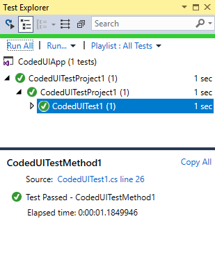

## Q & A

### Q: Why don't I see the option to record my coded UI test in the Generate Code for a Coded UI Test dialog?

**A**: The option to record is not supported for UWP apps.

### Q: Can I create a coded UI test for my UWP apps based on WinJS?

**A**: No, only XAML-based apps are supported.

### Q: Why can't I modify the code in the UIMap.Designer file?

**A**: Any code changes you make in the *UIMapDesigner.cs* file are overwritten every time you generate code using the **Coded UI Test Builder**. If you have to modify a recorded method, copy it to the *UIMap.cs* file and rename it. The *UIMap.cs* file can be used to override methods and properties in the *UIMapDesigner.cs* file. Remove the reference to the original method in the *CodedUITest.cs* file and replace it with the renamed method name.

## See also

- [Use UI automation to test your code](../test/use-ui-automation-to-test-your-code.md)
- [Set unique automation properties for UWP controls](../test/set-a-unique-automation-property-for-windows-store-controls-for-testing.md)