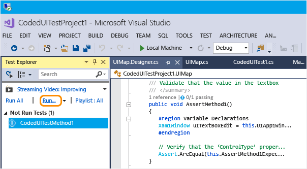

# Test UWP apps with Coded UI tests

Use this walkthrough for creating UI tests for UWP apps and XAML-based 8.1 apps.

## Create a simple Universal Windows app

1. Create a new project using the **Blank App (Universal Windows)** template for Visual C# or Visual Basic template.

     

1. In the **New Universal Windows Platform Project** dialog, select **OK** to keep the default versions.

1. In **Solution Explorer**, open *MainPage.xaml*.

1. Drag a button control and a textbox control from **Toolbox** to the design surface.

     

1. Give names to the controls. Select the textbox control and in the **Properties** window, enter **textBox** in the **Name** field. Then, select the button control and in the **Properties** window, enter **button** in the **Name** field.

1. Double-click the button control and add the following code to the body of the `Button_Click` method:

   ```csharp
   this.textBox.Text = this.button.Name;
   ```

   ```vb
   Me.textBox.Text = Me.button.Name
   ```

1. Press **Ctrl**+**F5** to run the app.

## Create and run a coded UI test for the UWP app

1. Create a new test project using the **Coded UI Test Project (Universal Windows)** template. To find this template in the **New Project** dialog, choose the  **Windows Universal** category under **Visual C#** or **Visual Basic**.

     

2. Choose to edit the UI map using the cross-hair tool.

     

3. Use the cross-hair tool in the Coded UI Test Builder to select the app tile, right-click **AutomationId** and choose **Copy Value to Clipboard**. The value in the clipboard will be used later to launch the app for testing.

     

4. In the running UWP app, use the cross-hair tool to select the button control and the textbox control. After adding each control, choose the **Add control to UI control map** button in the Coded UI Test Builder toolbar.

     

5. Choose the **Generate Code** button in the Coded UI Test Builder toolbar and then choose **Generate** to create code for changes to the UI control map.

     

6. Choose the button to set a value in the textbox.

     

7. Use the cross-hair tool to select the textbox control, and then select the **Text** property.

     

8. Add an assertion. It will be used in the test to verify that the value is correct.

     

9. Add and generate code for the assertion.

     

10. **Visual C#**

     In **Solution Explorer**, open the *UIMap.Designer.cs* file to view the added code for the assert method and the controls.

     **Visual Basic**

     In **Solution Explorer**, open the *CodedUITest1.vb* file and then in the `CodedUITestMethod1()` test method code, right-click the call to the assertion method that was automatically added `Me.UIMap.AssertMethod1()` and choose **Go To Definition**. The *UIMap.Designer.vb* file opens in the code editor so you can view the added code for the assert method and the controls.

    > [!WARNING]
    > Do not modify the *UIMap.designer.cs* or *UIMap.Designer.vb* files directly. If you do this, the changes to the file will be overwritten each time the test is generated.

    **Assert method**

    ```csharp
    public void AssertMethod1()
    {
        #region Variable Declarations
        XamlEdit uITextBoxEdit = this.UIApp1Window.UITextBoxEdit;
        #endregion

        // Verify that the 'Text' property of 'textBox' text box equals 'button'
        Assert.AreEqual(this.AssertMethod3ExpectedValues.UITextBoxEditText, uITextBoxEdit.Text);
    }
    ```

    ```vb
    Public Sub AssertMethod1()
        Dim uITextBoxEdit As XamlEdit = Me.UIApp2Window.UITextBoxEdit

        'Verify that the 'Text' property of 'textBox' text box equals 'button'
        Assert.AreEqual(Me.AssertMethod1ExpectedValues.UITextBoxEditText, uITextBoxEdit.Text)
    End Sub
    ```

    **Controls**

    ```csharp
    #region Properties
    public XamlButton UIButtonButton
    {
        get
        {
            if ((this.mUIButtonButton == null))
            {
                this.mUIButtonButton = new XamlButton(this);
                #region Search Criteria
                this.mUIButtonButton.SearchProperties[XamlButton.PropertyNames.AutomationId] = "button";
                this.mUIButtonButton.WindowTitles.Add("App1");
                #endregion
            }
            return this.mUIButtonButton;
        }
    }

    public XamlEdit UITextBoxEdit
    {
        get
        {
            if ((this.mUITextBoxEdit == null))
            {
                this.mUITextBoxEdit = new XamlEdit(this);
                #region Search Criteria
                this.mUITextBoxEdit.SearchProperties[XamlEdit.PropertyNames.AutomationId] = "textBox";
                this.mUITextBoxEdit.WindowTitles.Add("App1");
                #endregion
            }
            return this.mUITextBoxEdit;
        }
    }
    #endregion

    #region Fields
    private XamlButton mUIButtonButton;

    private XamlEdit mUITextBoxEdit;
    #endregion
    ```

    ```vb
    #Region "Properties"
    Public ReadOnly Property UIButtonButton() As XamlButton
        Get
            If (Me.mUIButtonButton Is Nothing) Then
                Me.mUIButtonButton = New XamlButton(Me)
                Me.mUIButtonButton.SearchProperties(XamlButton.PropertyNames.AutomationId) = "button"
                Me.mUIButtonButton.WindowTitles.Add("App2")
            End If
            Return Me.mUIButtonButton
        End Get
    End Property

    Public ReadOnly Property UITextBoxEdit() As XamlEdit
        Get
            If (Me.mUITextBoxEdit Is Nothing) Then
                Me.mUITextBoxEdit = New XamlEdit(Me)
                Me.mUITextBoxEdit.SearchProperties(XamlEdit.PropertyNames.AutomationId) = "textBox"
                Me.mUITextBoxEdit.WindowTitles.Add("App2")
            End If
            Return Me.mUITextBoxEdit
        End Get
    End Property
    #End Region

    #Region "Fields"
    Private mUIButtonButton As XamlButton

    Private mUITextBoxEdit As XamlEdit
    #End Region
    ```

11. In **Solution Explorer**, open the *CodedUITest1.cs* or *CodedUITest1.vb* file. Add code to the `CodedUTTestMethod1` method for the actions needed to run the test using the controls that were added to the UIMap.

    1. Launch the UWP app using the automation ID property you copied to the clipboard previously:

        ```csharp
        XamlWindow.Launch("8ebca7c4-effe-4c86-9998-068daccee452_cyrqexqw8cc7c!App")
        ```

        ```vb
        XamlWindow myAppWindow = XamlWindow.Launch("7254db3e-20a7-424e-8e05-7c4dabf4f28d_cyrqexqw8cc7c!App");
        ```

    2. Add a gesture to tap the button control:

        ```csharp
        Gesture.Tap(this.UIMap.UIApp1Window. UIButtonButton);
        ```

        ```vb
        Gesture.Tap(Me.UIMap.UIApp2Window. UIButtonButton)
        ```

    3. Verify that the call to the assert method that was automatically generated comes after launching the app and tap gesture on the button:

        ```csharp
        this.UIMap.AssertMethod1();
        ```

        ```vb
        Me.UIMap.AssertMethod1()
        ```

    After adding the code, the `CodedUITestMethod1` test method should appear as follows:

    ```csharp
    [TestMethod]
    public void CodedUITestMethod1()
    {
        // To generate code for this test, select "Generate Code for Coded UI Test" from the shortcut menu and select one of the menu items.

        // Launch the app.
        XamlWindow myAppWindow = XamlWindow.Launch("7254db3e-20a7-424e-8e05-7c4dabf4f28d_cyrqexqw8cc7c!App");

        // Tap the button.
        Gesture.Tap(this.UIMap.UIApp1Window.UIButtonButton);

        this.UIMap.AssertMethod1();
    }
    ```

    ```vb
    <CodedUITest(CodedUITestType.WindowsStore)>
    Public Class CodedUITest1

        <TestMethod()>
        Public Sub CodedUITestMethod1()
            '
            ' To generate code for this test, select "Generate Code for Coded UI Test" from the shortcut menu and select one of the menu items.
            '

            ' Launch the app.
            XamlWindow.Launch("8ebca7c4-effe-4c86-9998-068daccee452_cyrqexqw8cc7c!App")

            '// Tap the button.
            Gesture.Tap(Me.UIMap.UIApp2Window.UIButtonButton)

            Me.UIMap.AssertMethod1()
        End Sub
    ```

12. Build your test and then run the test using **Test Explorer**.

   

   The app launches, the action to tap the button is completed, and the textbox's **Text** property is populated and validated using the assert method.

   

   After the test completes, **Test Explorer** displays that the test passed.

   

## Q & A

### Q: Why don't I see the option to record my coded UI test in the Generate Code for a Coded UI Test dialog?

**A**: The option to record is not supported for UWP apps.

### Q: Can I create a coded UI test for my UWP apps based on WinJS?

**A**: No, only XAML-based apps are supported.

### Q: Can I create coded UI tests for my UWP apps on a system that is not running Windows 8.1 or Windows 10?

**A**: No, the Coded UI Test Project templates are only available on Windows 8.1 and Windows 10. To create automation for Universal Windows Platform (UWP) apps, you'll need Windows 10.

### Q: Why can't I modify the code in the UIMap.Designer file?

**A**: Any code changes you make in the *UIMapDesigner.cs* file will be overwritten every time you generate code using the UIMap - Coded UI Test Builder. If you have to modify a recorded method, you must copy it to the *UIMap.cs* file and rename it. The *UIMap.cs* file can be used to override methods and properties in the *UIMapDesigner.cs* file. Remove the reference to the original method in the *CodedUITest.cs* file and replace it with the renamed method name.

## See also

- [Use UI Automation To Test Your Code](../test/use-ui-automation-to-test-your-code.md)
- [Set a Unique Automation Property for UWP Controls for Testing](../test/set-a-unique-automation-property-for-windows-store-controls-for-testing.md)
