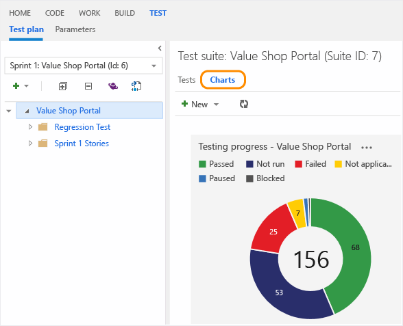
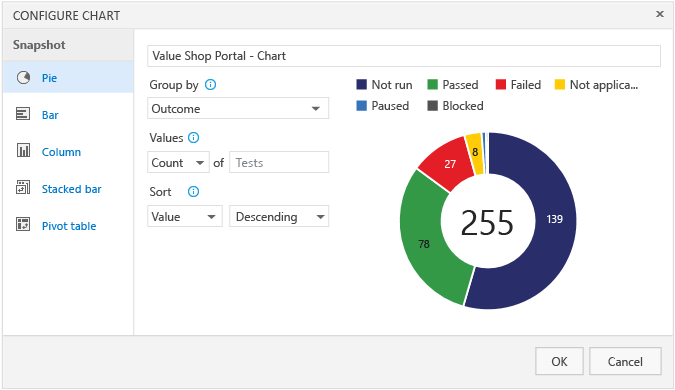
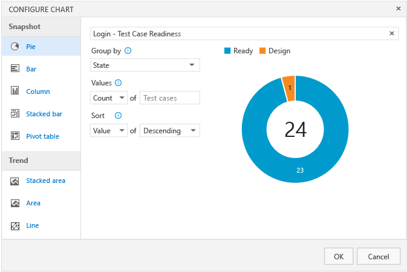
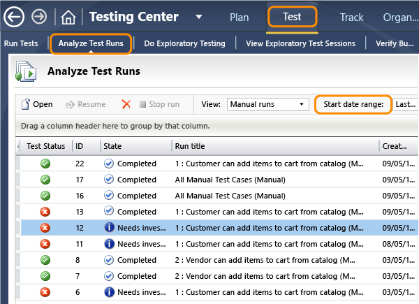

# Track your test results
As you create and run tests, you want to be able to track your status. For example, how many of your tests are ready to run, or the pass/fail rate for tests, or how many tests have been run so far.  
  
 **What reporting options are there?**  
  
-   Lightweight charts (Visual Studio Team Services or TFS web portal)  
  
-   Work item queries (Visual Studio Team Services or TFS web portal)  
  
-   Pre-existing reports on warehouse data (on-premises TFS only)  
  
-   Create your own reports from warehouse data (on-premises TFS only)  
  
 Use lightweight charts to easily view the answers to many of your test status questions. You can pin these charts to your home page, then all the team can see the progress at a glance. (You must have TFS 2013 Update 4 or greater to use lightweight charts with the web portal.)  
  
   
  
 Create and run work item queries to generate reports from the work hub. From a flat-list work item query, you can also generate a chart for that query too. For example, create a query to show the active bugs and their priority and then generate a chart to quickly group these active bugs by priority.  
  
 But if lightweight charts don’t give you the reports that you need, you can drill deeper into the data if you are using on-premises TFS. You can get access to existing reports on the warehouse data, or you can create your own with Excel.  
  
## Test status with lightweight charts  
 You can create these charts from the Test hub in the web portal.  
  
### Track testing progress  
 Use test results charts to track how your testing is going. Choose from a fixed set of pre-populated fields related to results. By default, a pie chart is created for each test plan. This chart is grouped by the outcome field to show the latest results for all the tests in the test plan.  
  
 View this default chart from the Charts tab.  
  
   
  
 Add your own charts for test results to visualize what's important for your team. If you already know how to add a chart, jump to the [examples](#TestResultsExamples) below of charts that you can create.  
  
1.  Select the test plan or test suite for your chart in the Test plan tab. Then create a new chart.  
  
       
  
2.  Select the chart type. Based on the chart, configure the fields that you want to use to group by, or for rows and columns.  
  
       
  
     All charts roll up the information for any child test suites of the test plan or test suite that you selected.  
  
3.  Save the chart. Now it will be displayed in the charts tab for the test plan or test suite that you selected.  
  
###   Test results examples  
 **What's the test status for a specific test suite?**  
  
 Select the test suite from the Test plan tab and add a test results pie chart. Group by outcome.  
  
   
  
 **What's the test status for user stories that my team's testing this sprint?**  
  
 If you have created requirement-based test suites in your test plan for your user stories, you can create a chart for this.  
  
1.  Group these requirement-based test suites together in a static test suite.  
  
2.  Select this static test suite in the Test plan tab.  
  
3.  Add a test results stacked bar chart. Choose Suite as the rows pivot and Outcome as the columns pivot.  
  
       
  
 **How many tests has each tester left to run?**  
  
 Select your test plan from the Test plan tab and add a test results pivot table chart. Choose Tester as the rows pivot and Outcome as the columns pivot.  
  
   
  
 **How can I check quality based on the configuration?**  
  
 Use either a stacked bar chart or a pivot table chart. Choose Configuration as the rows pivot and Outcome as the columns pivot.  
  
 **How can I track why tests are failing for my team?**  
  
 For failure analysis, use either a stacked bar chart or a pivot table chart. Choose Tester for the rows and Failure type for the columns. (Failure type for test results can only be set using Microsoft Test Manager.)  
  
 **How can I track the resolution for failing tests for my team?**  
  
 For resolution analysis, use either a stacked bar chart or a pivot table chart. Choose Tester for the rows and Resolution for the columns. (Resolution type for test results can only be set using Microsoft Test Manager.)  
  
### Track test case status  
 Use test case charts to find out the progress of your test case authoring. The charts for test cases give you the flexibility to report on columns that you add to the Tests tab. By default, test case fields are not added to the view in the Tests tab.  
  
 If you already know how to add a chart, jump to the [examples](#TestCaseExamples) below of charts that you can create for test cases.  
  
1.  Add any fields you want to use for your test case chart from the Tests tab with Column options. Then the fields will appear as choices in the drop-down lists for grouping for your test case charts.  
  
2.  Select the test plan or test suite for your chart in the Test plan tab. Then add a test case chart.  
  
       
  
     All charts roll up the information for any child test suites of the test plan or test suite that you selected.  
  
3.  Select the chart type. Based on the chart, configure the fields that you want to use to group by, for rows and columns, or the range (trend charts only).  
  
       
  
     You cannot group by test suite for the test case charts.  
  
4.  Save the chart. Now it will be displayed in the charts tab for the test plan or test suite that you selected.  
  
###   Test case examples  
 **How can I track burndown for test case creation?**  
  
 Use a stacked area trend chart to view the burndown for how many test cases are ready to be run. Choose State for the stack by field and Ascending for the sort field.  
  
   
  
 **How can I track burndown for automation status?**  
  
 Use a stacked area trend chart to view the burndown for how many test cases have been automated. Choose Automation status for the stack by field and Ascending for the sort field.  
  
 **If multiple teams own test cases in my test plan, can I see how many each team owns and the priorities of the tests?**  
  
 If your teams are organized by area path, then your can use a test case pie chart. Choose Area path for the group by field.  
  
 If you want to know the priorities of these tests, then create a stacked bar chart. Choose Area path for rows and priority for the columns.  
  
 **How can I track test creation status by team members?**  
  
 Test case owners are tracked by the Assigned to field. Use a stacked bar chart or a pivot table chart. Choose Assigned to for rows and status for the columns.  
  
### Q&A  
 **Q: Can I view the recent test results for an individual test case?**  
  
 **A:** Yes. Select the test case within a test suite and then choose to view the test details pane.  
  
   
  
 View the recent test results for this test case.  
  
   
  
 **Q: How is data shown in the charts for test cases that are in multiple test suites?**  
  
 **A:** For test case charts, if a test case has been added to multiple test suites in a plan then it’s only counted once. For test result charts, each instance of a test that is run is counted for each of the test suites separately.  
  
 **Q: Who can create charts?**  
  
 **A:** You must have at least a Basic license to create charts.  
  
 **Q: How can I share the team's test status with all my stakeholders?**  
  
 **A:** Pin a chart to your team's home page for all the team to view. Use the chart's context menu.  
  
   
  
 You must be a team administrator to do this. Even team members with stakeholder licenses can view the test charts on the home page. Learn more about the home page [here](http://msdn.microsoft.com/library/jj920199.aspx). Or learn more about [team administration](http://msdn.microsoft.com/library/hh409274.aspx).  
  
 **Q: How can I edit or delete a chart?**  
  
 **A:** Select the option you want from the chart's context menu.  
  
## Track bugs with lightweight charts  
 It’s also important to know what bugs are being found and fixed to understand the quality of your app. What’s the priority of any active bugs? What do the bug trends look like? You can generate lightweight charts for any flat-list query that you create in the Work hub on the Queries page. Learn how to do this with the web portal [here](http://www.visualstudio.com/get-started/visualize-progress-vs).  
  
### Q&A  
 **Q: Can you track the bugs that were specifically created from test cases?**  
  
 **A:** When you create a bug from the test runner, it is automatically linked to the test case that you were running. To look up all the bugs that were created from your test cases, open Microsoft Test Manager and go to the **Test** tab, and then choose **Verify Bugs**. To re-run the test of a bug that has been fixed, choose **Verify**.  
  
##   Track automated test results with Microsoft Test Manager  
 To see charts of recent test runs, use Microsoft Test Manager. You can open it on any machine on which Visual Studio Test Professional or Visual Studio Enterprise has been installed. Connect it to your team project and test plan, and choose **Testing Center**.  
  
 To get a list of recent test runs, choose **Test**, **Analyze Test Runs**. Each item on the list is a test run:  
  
   
  
 Microsoft Test Manager supports a process in which you review the test results after the tests are concluded. Any run that includes failed tests is flagged **Needs investigation**. If you open the test run details, you can add remarks, assign a reason for failure, create bugs or other work items, and change the flag to **Completed**:  
  
   
  
 You can [change the reason for failure types](http://msdn.microsoft.com/library/ff398070.aspx), if required by your testing process.  
  
## Track build quality  
 If you have on-premises TFS, you can use [this report](http://msdn.microsoft.com/library/dd380683.aspx) to show you the pass/fail rates for automated tests that are run as part of your build process. It can show you what the pass rates are for these tests for each of your builds. You can see if it's improving or not.  
  
 You also need SQL Services Reporting Services installed for TFS for this report.  
  
## Track release readiness  
 If you have on-premises TFS, you can also see the history of which tests are passing and failing. Look at the trends of your pass rate to determine when you think you will be ready to release with [this report](http://msdn.microsoft.com/library/dd380702.aspx). See if the quality of your app is improving as you run your tests.  
  
 You also need SQL Services Reporting Services installed for TFS for this report.  
  
## Custom reports for on-premises TFS only  
 You need SQL Services Reporting Services installed for TFS for custom reports.  
  
 If you have on-premises TFS, test plans and test suites are work items with TFS 2013 Update 3 or greater. You can create your own Excel reports from a query based on your needs for test plans, test suites, test cases, user stories, requirements and bugs. Learn how to create an Excel report for a flat list query [here](http://msdn.microsoft.com/library/dd433251.aspx).  
  
 You can customize further if your team project portal is configured with SharePoint Server Enterprise Edition. In that case, you can use Excel reports to [create a dashboard](http://msdn.microsoft.com/library/dd997876.aspx).  
  
 If you still don’t have the report you need, there are more options to view the data directly. Find out the other ways that you can create reports using the Online analytical processing (OLAP) data cube (TFS_Analysis), which is optimized for reporting, or you can use the relational warehouse database (TFS_Warehouse) to create reports. Learn how to do this [here](http://msdn.microsoft.com/library/bb649557.aspx).  
  
## Q&A  
 **Q: Are there reports that I can use if I don’t have TFS 2013 Update 4 for the lightweight charts?**  
  
 **A:** If your on-premises TFS installation includes report services, you can view the [Test Plan Progress chart](../Topic/Test%20Plan%20Progress%20Report.md), which shows how many of this sprint’s tests have passed or failed. Open http://*\<your Team Foundation Server>*/Reports and navigate to **TfsReports > DefaultCollection >***your project***> Tests**. Alternatively, in Visual Studio, in Team Explorer, open **Reports**.  
  
 **Q: Can I view a summary of the latest test results from MTM?**  
  
 **A:** Yes. From MTM, go to the **Plan** tab, and then choose **Results**. You can see the results by suite to see whether each user story has passed its tests.