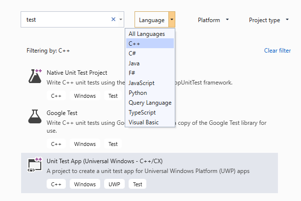

# How to test a C++ DLL

This topic describes one way to create unit tests for a C++ DLL for Universal Windows Platform (UWP) apps with the Microsoft Test Framework for C++. The RooterLib DLL demonstrates vague memories of limit theory from the calculus by implementing a function that calculates an estimate of the square root of a given number. The DLL might then be included in a UWP app that shows a user the fun things that can be done with math.

This topic shows you how to use unit testing as the first step in development. In this approach, you first write a test method that verifies a specific behavior in the system that you are testing and then you write the code that passes the test. By making changes in the order of the following procedures, you can reverse this strategy to first write the code that you want to test and then write the unit tests.

This topic also creates a single Visual Studio solution and separate projects for the unit tests and the DLL that you want to test. You can also include the unit tests directly in the DLL project, or you can create separate solutions for the unit tests and the .DLL. See [Adding unit tests to existing C++ applications](../test/how-to-use-microsoft-test-framework-for-cpp.md) for tips on which structure to use.

## <a name="Create_the_solution_and_the_unit_test_project"></a> Create the solution and the unit test project

::: moniker range=">=vs-2019"

Start by creating a new test project. On the **File** menu, choose **New** > **Project**. In the **Create a New Project** dialog, type "test" into the search box and then set **Language** to C++. Then choose **Unit Test App (Universal Windows)** from the list of project templates.

   

::: moniker-end

::: moniker range="vs-2017"

Start by creating a new test project. On the **File** menu, choose **New** > **Project**. In the **New Project** dialog, expand **Installed** > **Visual C++** and choose **Windows Universal**. Then choose **Unit Test App (Universal Windows)** from the list of project templates.

::: moniker-end

1. In the New Project dialog, expand **Installed** > **Visual C++** and choose **Windows Universal**. Then choose **Unit Test App (Universal Windows)** from the list of project templates.

2. Name the project `RooterLibTests`; specify the location; name the solution `RooterLib`; and make sure **Create directory for solution** is checked.

     

3. In the new project, open **unittest1.cpp**.

     

     Note that:

    - Each test is defined by using `TEST_METHOD(YourTestName){...}`.

         You do not have to write a conventional function signature. The signature is created by the macro TEST_METHOD. The macro generates an instance function that returns void. It also generates a static function that returns information about the test method. This information allows the test explorer to find the method.

    - Test methods are grouped into classes by using `TEST_CLASS(YourClassName){...}`.

         When the tests are run, an instance of each test class is created. The test methods are called in an unspecified order. You can define special methods that are invoked before and after each module, class, or method. For more information, see [Using Microsoft.VisualStudio.TestTools.CppUnitTestFramework](how-to-use-microsoft-test-framework-for-cpp.md).

## <a name="Verify_that_the_tests_run_in_Test_Explorer"></a> Verify that the tests run in Test Explorer

1. Insert some test code:

    ```cpp
    TEST_METHOD(TestMethod1)
    {
        Assert::AreEqual(1,1);
    }
    ```

     Notice that the `Assert` class provides several static methods that you can use to verify results in test methods.

2. On the **Test** menu, choose **Run** and then choose **Run All**.

     The test project builds and runs. The **Test Explorer** window appears, and the test is listed under **Passed Tests**. The **Summary** pane at the bottom of the window provides additional details about the selected test.

     

## <a name="Add_the_DLL_project_to_the_solution"></a> Add the DLL project to the solution

::: moniker range=">=vs-2019"

In **Solution Explorer**, choose the solution name. From the shortcut menu, choose **Add**, and then **New Project**. In the **Add a New Project** dialog, set **Language** to C++ and type "DLL" into the search box. From the results list, choose **Unit Test App (Universal Windows - C++/CX)**.


::: moniker-end

::: moniker range="vs-2017"
In **Solution Explorer**, choose the solution name. From the shortcut menu, choose **Add**, and then **New Project**.


::: moniker-end

1. In the **Add New Project** dialog box, choose **DLL (UWP apps)**.

2. Add the following code to the *RooterLib.h* file:

    ```cpp
    // The following ifdef block is the standard way of creating macros which make exporting
    // from a DLL simpler. All files within this DLL are compiled with the ROOTERLIB_EXPORTS
    // symbol defined on the command line. This symbol should not be defined on any project
    // that uses this DLL. This way any other project whose source files include this file see
    // ROOTERLIB_API functions as being imported from a DLL, whereas this DLL sees symbols
    // defined with this macro as being exported.
    #ifdef ROOTERLIB_EXPORTS
    #define ROOTERLIB_API  __declspec(dllexport)
    #else
    #define ROOTERLIB_API __declspec(dllimport)
    #endif //ROOTERLIB_EXPORTS

    class ROOTERLIB_API CRooterLib {
    public:
        CRooterLib(void);
        double SquareRoot(double v);
    };
    ```

     The comments explain the ifdef block not only to the developer of the dll, but to anyone who references the DLL in their project. You can add the ROOTERLIB_EXPORTS symbol to the command line by using the project properties of the DLL.

     The `CRooterLib` class declares a constructor and the `SqareRoot` estimator method.

3. Add the ROOTERLIB_EXPORTS symbol to the command line.

    1. In **Solution Explorer**, choose the **RooterLib** project, and then choose **Properties** from the shortcut menu.

         

    2. In the **RooterLib Property Page** dialog box, expand **Configuration Properties**, expand **C++** and choose **Preprocessor**.

    3. Choose **\<Edit...>** from the **Preprocessor Definitions** list, and then add `ROOTERLIB_EXPORTS` in the **Preprocessor Definitions** dialog box.

4. Add minimal implementations of the declared functions. Open *RooterLib.cpp* and add the following code:

    ```cpp
    // constructor
    CRooterLib::CRooterLib()
    {
    }

    // Find the square root of a number.
    double CRooterLib::SquareRoot(double v)
    {
        return 0.0;
    }

    ```

## <a name="make_the_dll_functions_visible_to_the_test_code"></a> Make the dll functions visible to the test code

1. Add RooterLib to the RooterLibTests project.

   1. In **Solution Explorer**, choose the **RooterLibTests** project and then choose **Add** > **Reference** on the shortcut menu.

   1. In the **Add Reference** dialog box, choose **Projects**. Then select the **RouterLib** item.

2. Include the RooterLib header file in *unittest1.cpp*.

   1. Open *unittest1.cpp*.

   2. Add this code to below the `#include "CppUnitTest.h"` line:

       ```cpp
       #include "..\RooterLib\RooterLib.h"
       ```

3. Add a test that uses the imported function. Add the following code to *unittest1.cpp*:

   ```cpp
   TEST_METHOD(BasicTest)
   {
       CRooterLib rooter;
       Assert::AreEqual(
           // Expected value:
           0.0,
           // Actual value:
           rooter.SquareRoot(0.0),
           // Tolerance:
           0.01,
           // Message:
           L"Basic test failed",
           // Line number - used if there is no PDB file:
           LINE_INFO());
   }
   ```

4. Build the solution.

    The new test appears in **Test Explorer** in the **Not Run Tests** node.

5. In **Test Explorer**, choose **Run All**.

    

   You have set up the test and the code projects, and verified that you can run tests that run functions in the code project. Now you can begin to write real tests and code.

## <a name="Iteratively_augment_the_tests_and_make_them_pass"></a> Iteratively augment the tests and make them pass

1. Add a new test:

    ```cpp
    TEST_METHOD(RangeTest)
    {
        CRooterLib rooter;
        for (double v = 1e-6; v < 1e6; v = v * 3.2)
        {
            double expected = v;
            double actual = rooter.SquareRoot(v*v);
            double tolerance = expected/1000;
            Assert::AreEqual(expected, actual, tolerance);
        }
    };
    ```

    > [!TIP]
    > We recommend that you do not change tests that have passed. Instead, add a new test, update the code so that the test passes, and then add another test, and so on.
    >
    > When your users change their requirements, disable the tests that are no longer correct. Write new tests and make them work one at a time, in the same incremental manner.

2. In **Test Explorer**, choose **Run All**.

3. The test fails.

     

    > [!TIP]
    > Verify that each test fails immediately after you have written it. This helps you avoid the easy mistake of writing a test that never fails.

4. Enhance the code under test so that the new test passes. Add the following to *RooterLib.cpp*:

    ```cpp
    #include <math.h>
    ...
    // Find the square root of a number.
    double CRooterLib::SquareRoot(double v)
    {
        double result = v;
        double diff = v;
        while (diff > result/1000)
        {
            double oldResult = result;
            result = result - (result*result - v)/(2*result);
            diff = abs (oldResult - result);
        }
        return result;
    }

    ```

5. Build the solution and then in **Test Explorer**, choose **Run All**.

     Both tests pass.

> [!TIP]
> Develop code by adding tests one at a time. Make sure that all the tests pass after each iteration.

## <a name="Debug_a_failing_test"></a> Debug a failing test

1. Add another test to *unittest1.cpp*:

   ```cpp
   // Verify that negative inputs throw an exception.
    TEST_METHOD(NegativeRangeTest)
    {
      wchar_t message[200];
      CRooterLib rooter;
      for (double v = -0.1; v > -3.0; v = v - 0.5)
      {
        try
        {
          // Should raise an exception:
          double result = rooter.SquareRoot(v);

          swprintf_s(message, L"No exception for input %g", v);
          Assert::Fail(message, LINE_INFO());
        }
        catch (std::out_of_range ex)
        {
          continue; // Correct exception.
        }
        catch (...)
        {
          swprintf_s(message, L"Incorrect exception for %g", v);
          Assert::Fail(message, LINE_INFO());
        }
      }
   };
   ```

2. In **Test Explorer**, choose **Run All**.

    The test fails. Choose the test name in **Test Explorer**. The failed assertion is highlighted. The failure message is visible in the detail pane of **Test Explorer**.

    

3. To see why the test fails, step through the function:

   1. Set a breakpoint at the start of the `SquareRoot` function.

   2. On the shortcut menu of the failed test, choose **Debug Selected Tests**.

        When the run stops at the breakpoint, step through the code.

   3. Add code to *RooterLib.cpp* to catch the exception:

       ```cpp
       #include <stdexcept>
       ...
       double CRooterLib::SquareRoot(double v)
       {
           //Validate the input parameter:
           if (v < 0.0)
           {
             throw std::out_of_range("Can't do square roots of negatives");
           }
       ...

       ```

   1. In **Test Explorer**, choose **Run All** to test the corrected method and make sure that you haven't introduced a regression.

   All tests now pass.

   

## <a name="Refactor_the_code_without_changing_tests"></a> Refactor the code without changing tests

1. Simplify the central calculation in the `SquareRoot` function:

    ```csharp
    // old code
    //result = result - (result*result - v)/(2*result);
    // new code
    result = (result + v/result) / 2.0;
    ```

2. Choose **Run All** to test the refactored method and make sure that you haven't introduced a regression.

    > [!TIP]
    > A stable set of good unit tests gives confidence that you have not introduced bugs when you change the code.
    >
    > Keep refactoring separate from other changes.
