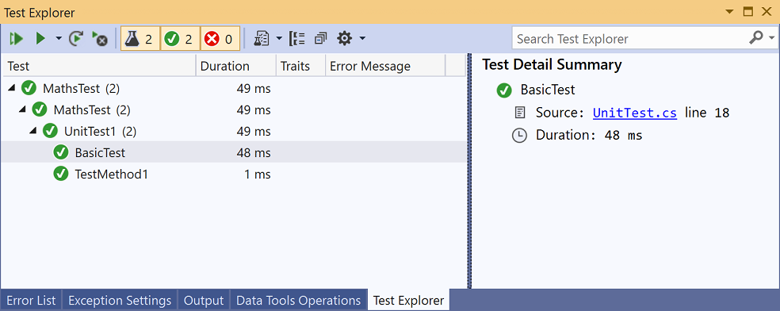

# Unit test C# code

This article describes one way to create unit tests for a C# class in a UWP app.

The **Rooter** class, which is the class under test, implements a function that calculates an estimate of the square root of a given number.

This article demonstrates *test-driven development*. In this approach, you first write a test that verifies a specific behavior in the system that you're testing, and then you write the code that passes the test.

## Create the solution and the unit test project

1. On the **File** menu, choose **New** > **Project**.

2. Search for and select the **Blank App (Universal Windows)** project template.

3. Name the project **Maths**.

4. In **Solution Explorer**, right-click on the solution and choose **Add** > **New Project**.

5. Search for and select the **Unit Test App (Universal Windows)** project template.

6. Name the test project **RooterTests**.

## Verify that the tests run in Test Explorer

1. Insert some test code into **TestMethod1** in the *UnitTest.cs* file:

   ```csharp
   [TestMethod]
   public void TestMethod1()
   {
       Assert.AreEqual(0, 0);
   }
   ```

   The <xref:Microsoft.VisualStudio.TestTools.UnitTesting.Assert> class provides several static methods that you can use to verify results in test methods.

::: moniker range="vs-2017"

2. On the **Test** menu, choose **Run** > **All Tests**.

::: moniker-end

::: moniker range=">=vs-2019"

2. On the **Test** menu, choose **Run All Tests**.

::: moniker-end

   The test project builds and runs. Be patient because it may take a little while. The **Test Explorer** window appears, and the test is listed under **Passed Tests**. The **Summary** pane at the bottom of the window provides additional details about the selected test.

## Add the Rooter class to the Maths project

1. In **Solution Explorer**, right-click on the **Maths** project, and then choose **Add** > **Class**.

2. Name the class file *Rooter.cs*.

3. Add the following code to the **Rooter** class *Rooter.cs* file:

   ```csharp
   public Rooter()
   {
   }

   // estimate the square root of a number
   public double SquareRoot(double x)
   {
       return 0.0;
   }
   ```

   The **Rooter** class declares a constructor and the **SquareRoot** estimator method. The **SquareRoot** method is only a minimal implementation, just enough to test the basic structure of the testing setup.

4. Add the `public` keyword to the **Rooter** class declaration, so the test code can access it.

   ```csharp
   public class Rooter
   ```

## Add a project reference

1. Add a reference from the RooterTests project to the Maths app.

    1. In **Solution Explorer**, right-click on the **RooterTests** project, and then choose **Add** > **Reference**.

    2. In the **Add Reference - RooterTests** dialog box, expand **Solution** and choose **Projects**. Select the **Maths** project.

        

2. Add a `using` statement to the *UnitTest.cs* file:

    1. Open *UnitTest.cs*.

    2. Add this code below the `using Microsoft.VisualStudio.TestTools.UnitTesting;` line:

       ```csharp
       using Maths;
       ```

3. Add a test that uses the **Rooter** function. Add the following code to *UnitTest.cs*:

   ```csharp
   [TestMethod]
   public void BasicTest()
   {
       Maths.Rooter rooter = new Rooter();
       double expected = 0.0;
       double actual = rooter.SquareRoot(expected * expected);
       double tolerance = .001;
       Assert.AreEqual(expected, actual, tolerance);
   }
   ```

   The new test appears in **Test Explorer** in the **Not Run Tests** node.

4. To avoid a "Payload contains two or more files with the same destination path" error, in **Solution Explorer**, expand the **Properties** node under the **Maths** project, and then delete the *Default.rd.xml* file.

::: moniker range="vs-2017"

6. In **Test Explorer**, choose **Run All**.

   The solution builds and the tests run and pass.

   

::: moniker-end

::: moniker range=">=vs-2019"

6. In **Test Explorer**, choose **Run All Tests**.

   The solution builds and the tests run and pass.

   

::: moniker-end

You've set up the test and app projects and verified that you can run tests that call functions in the app project. Now you can begin to write real tests and code.

## Iteratively augment the tests and make them pass

1. Add a new test called **RangeTest**:

   ```csharp
   [TestMethod]
   public void RangeTest()
   {
       Rooter rooter = new Rooter();
       for (double v = 1e-6; v < 1e6; v = v * 3.2)
       {
           double expected = v;
           double actual = rooter.SquareRoot(v*v);
           double tolerance = expected/1000;
           Assert.AreEqual(expected, actual, tolerance);
       }
   }
   ```

   > [!TIP]
   > We recommend that you do not change tests that have passed. Add a new test instead.

2. Run the **RangeTest** test and verify that it fails.

   

   > [!TIP]
   > Immediately after you write a test, run it to verify that it fails. This helps you avoid the easy mistake of writing a test that never fails.

3. Enhance the code under test so that the new test passes. Change the **SquareRoot** function in *Rooter.cs* to this:

   ```csharp
   public double SquareRoot(double x)
   {
       double estimate = x;
       double diff = x;
       while (diff > estimate / 1000)
       {
           double previousEstimate = estimate;
           estimate = estimate - (estimate * estimate - x) / (2 * estimate);
           diff = Math.Abs(previousEstimate - estimate);
       }
       return estimate;
   }
   ```

::: moniker range="vs-2017"

4. In **Test Explorer**, choose **Run All**.

::: moniker-end

::: moniker range=">=vs-2019"

4. In **Test Explorer**, choose **Run All Tests**.

::: moniker-end

   All three tests now pass.

> [!TIP]
> Develop code by adding tests one at a time. Make sure that all the tests pass after each iteration.

## Refactor the code

In this section, you refactor both app and test code, then rerun tests to make sure they still pass.

### Simplify the square root estimation

1. Simplify the central calculation in the **SquareRoot** function by changing one line of code, as follows:

    ```csharp
    // Old code
    //estimate = estimate - (estimate * estimate - x) / (2 * estimate);

    // New code
    estimate = (estimate + x/estimate) / 2.0;
    ```

2. Run all tests to make sure that you haven't introduced a regression. They should all pass.

> [!TIP]
> A stable set of good unit tests gives confidence that you have not introduced bugs when you change the code.

### Eliminate duplicated code

The **RangeTest** method hard codes the denominator of the *tolerance* variable that's passed to the <xref:Microsoft.VisualStudio.TestTools.UnitTesting.Assert> method. If you plan to add additional tests that use the same tolerance calculation, the use of a hard-coded value in multiple locations makes the code harder to maintain.

1. Add a private helper method to the **UnitTest1** class to calculate the tolerance value, and then call that method from **RangeTest**.

    ```csharp
    private double ToleranceHelper(double expected)
    {
        return expected / 1000;
    }

    ...

    [TestMethod]
    public void RangeTest()
    {
        ...
        // Old code
        // double tolerance = expected/1000;

        // New code
        double tolerance = ToleranceHelper(expected);
    }
    ...
    ```

2. Run **RangeTest** to make sure that it still passes.

> [!TIP]
> If you add a helper method to a test class, and you don't want it to appear in **Test Explorer**, don't add the <xref:Microsoft.VisualStudio.TestTools.UnitTesting.TestMethodAttribute> attribute to the method.

## See also

- [Walkthrough: Test-driven development using Test Explorer](quick-start-test-driven-development-with-test-explorer.md)
